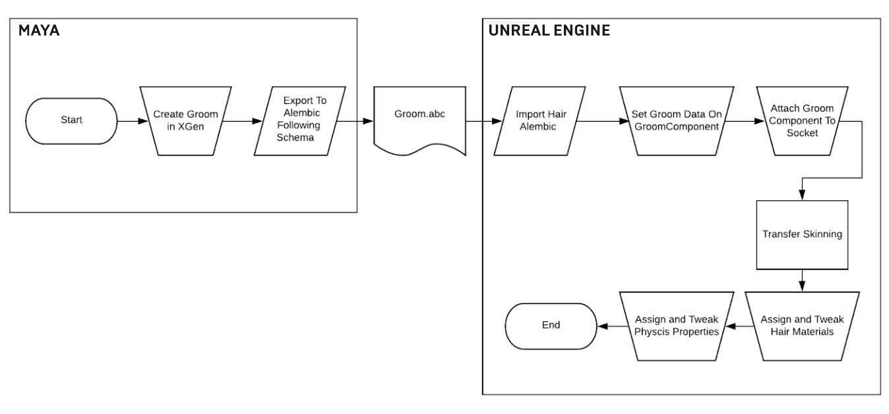
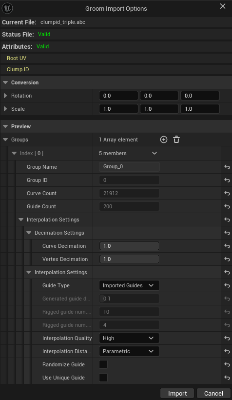
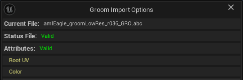
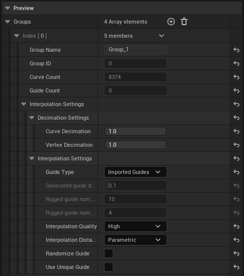

# 导入Groom

> 路径：虚幻引擎5.7文档 / 管理内容 / 毛发渲染与模拟 / 导入Groom

> 原始页面：https://dev.epicgames.com/documentation/unreal-engine/importing-grooms-into-unreal-engine

在本页面中，你将了解Groom导入流程，以及导入包含Groom的Alembic (*.abc)文件时的可用选项。

## 先决条件

要想导入Alembic文件并在虚幻引擎中渲染其Groom，需要在 **插件** 浏览器中启用以下插件：

- Alembic Groom导入器
- Groom

> [!WARNING]
> 启用插件需要重启编辑器。如需详细了解如何设置项目以使用Groom，请参阅[设置项目以使用Groom](../setting-up-a-project-for-grooms/index.md)。

## Groom导入流程

以下流程图描述了将包含Groom的Alembic文件导入虚幻引擎并将其附着到动画骨骼网格体角色的大致流程。

流程如下所示：

1. 在你偏好的数字内容创建（DCC）应用程序（例如Autodesk Maya）中创建你的Groom。
2. 将Groom导出为Alembic (*.abc)文件。
3. 将包含Groom的Alembic文件导入到虚幻引擎中。
4. （可选）在内容浏览器中创建

   Groom绑定

   资产，并将资产绑定到你的骨骼网格体。
5. 将Groom资产置于关卡中。

   - 这可以作为Actor单独完成，也可以作为使用Groom组件的蓝图的一部分来完成。
6. 将Groom组件附加到具有传输蒙皮的骨骼网格体插槽。
7. 设置使用毛发域的材质，并将材质指定到Groom资产。 完成这些步骤后，你将拥有一个交互式Groom，可以在其所附着的任何动画骨骼网格体上使用。

> [!NOTE]
> 如需更完整地了解此流程，请参阅[Groom快速入门指南](../hair-simulation-and-rendering-quick-start-guide/index.md)。
>
> 如需更详细地了解如何设置Groom以从DCC应用程序导出并导入到虚幻引擎中，请参阅[Groom的Alembic规范](../using-alembic-for-grooms/index.md)。其中介绍了使虚幻引擎能够直接导入Groom的模式。

## Groom导入选项

当你导入包含Groom的Alembic文件时，将打开 **Groom导入选项（Groom Import Options）** 窗口。

Groom导入选项对话框的顶部描述了已导入Groom文件的 **有效性** 。其中还包括将与该Groom一起导入的所有 **毛发属性** 的列表。虚幻支持多种属性类型，例如根部UV、每控制点颜色等等。

**转换（Conversion）** 分段中有在导入前旋转和缩放Groom资产的选项。这允许对每个曲线/控制点应用全局变换。

| 属性 | 说明 |
| --- | --- |
| **旋转（Rotation）** | 设置以欧拉角（度）表示的旋转，固定向上或向前的轴。 |
| **缩放（Scale）** | 缩放该值以将文件单位转换为厘米。 |

**预览（Preview）** 分段中有所有导入的Groom组。你可以直观地看到每个组中渲染曲线和导线的数量，并配置其消减和插值设置。导入后，这两个设置都可以在稍后通过[Groom资产编辑器](../groom-asset-editor-user-guide/index.md)进行编辑。

| 属性 | 说明 |
| --- | --- |
| 组（Groups）：索引[n]（Index[n]） |  |
| **组名（Group Name）** | 赋予此组的名称。 |
| **组ID（Group ID）** | 赋予此组中发束的ID。 |
| **曲线数量（Curve Count）** | 该Groom组内的发束数量。 |
| **导线数量（Guide Count）** | 此Groom组内的模拟导线数量。 |
| 插值（Interpolation）：削减设置（Decimation Settings） |  |
| **曲线消减（Curve Decimation）** | 均匀地减少发束数量。 |
| **顶点消减（Vertex Decimation）** | 均匀地减少每股发束的顶点数量。 |
| 插值（Interpolation）：插值设置（Interpolation Settings） |  |
| **导线类型（Guide Type）** | 选择用于Groom模拟的导线类型： **导入型导线（Imported Guides）** ：此选项将使用从Groom资产导入的导线数据（如存在）。 **生成型导线（Generated Guides）** ：此选项根据导入的渲染曲线生成导线。设定的 **导线密度（Guide density）** 值定义了被用作导线的曲线的比例。 **绑定型导线（Rigged Guides）** ：此选项会将导线转换为骨骼，从而可以使用动画系统和工具。建议仅在导线数量较少的情况下使用此选项，例如马尾辫、脏辫或类似的发型。 |
| **已生成导线密度（Generated guide density）** | 没有提供导线时，用于将毛发转换为导线曲线的密度因子。该值应介于0和1之间，可以被视为是被用作导线的发束的比例/百分比。 |
| **已绑定导线曲线数量（Rigged guide num. curves）** | 在Groom和骨骼网格体上生成的导线数量。 |
| **已绑定导线点数量（Rigged guide num. points）** | 每已生成导线的点/骨骼数量。 |
| **插值质量（Interpolation Quality）** | 定义在将导线运动插值到发束上时的插值质量。可用的选项有： **高（High）** ：使用曲线形状匹配搜索编译插值数据。这会产生高质量的插值数据，但编译速度相对较慢，可能需要几十分钟才能完成。 **中（Medium）** ：使用曲线形状匹配搜索在有限的空间范围内编译插值数据。这是在质量高低和编译时间长短之间进行取舍。这可能需要几十分钟才能完成。 **低（Low）** ：根据最近邻搜索编译插值数据。插值数据质量低，但编译速度快，只需几分钟即可完成。 |
| **插值距离（Interpolation Distance）** | 定义用于将导线和发束配对的指标。可用的选项有： **参数化（Parametric）** ：根据曲线参数距离编译插值数据。 **根部（Root）** ：根据导线根部和发束根部之间的距离编译插值数据。 **索引（Index）** ：根据导线和发束顶点索引编译插值数据。 **距离（Distance）** ：根据曲线欧几里得距离编译插值数据。 |
| **随机化导线（Randomize Guide）** | 启用后，用于插值的导线会略微随机化，以拆分可能出现的发簇。 |
| **使用唯一导线（Use Unique Guide）** | 启用后，将使用单根导线进行运动插值。 |
