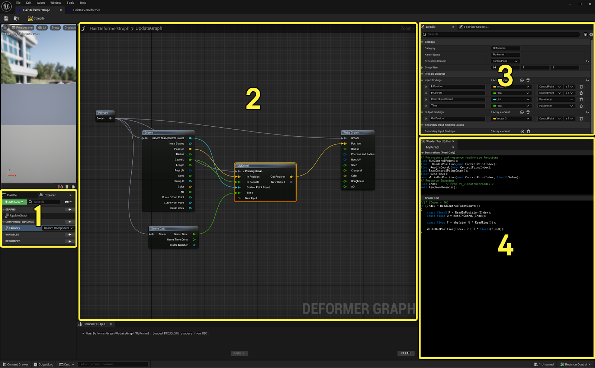
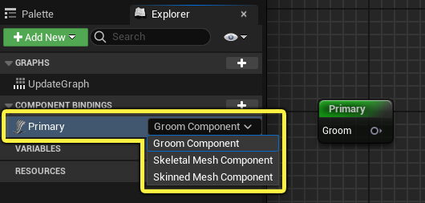
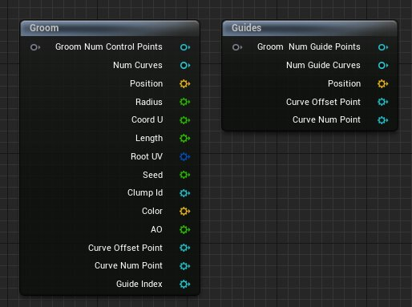
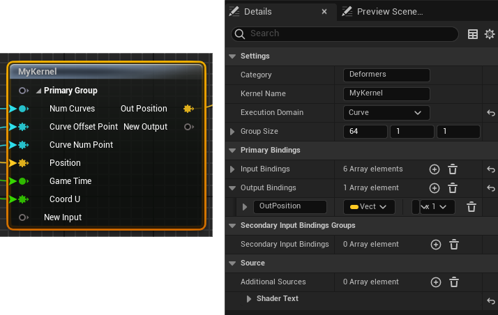
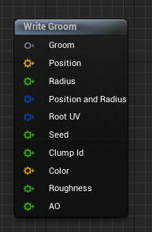
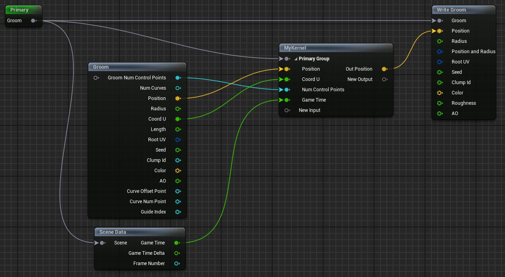
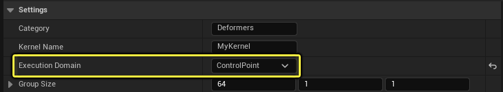
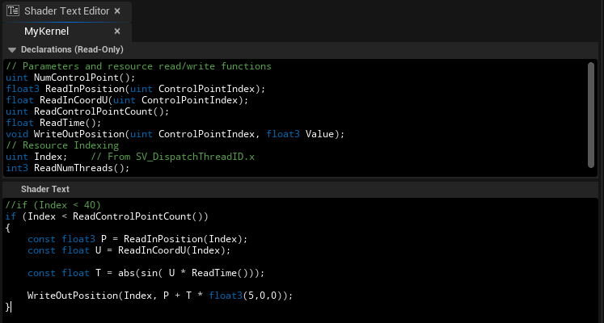

# 设置Groom变形器图表

> 路径：虚幻引擎5.7文档 / 管理内容 / 毛发渲染与模拟 / 设置Groom变形器图表

> 原始页面：https://dev.epicgames.com/documentation/unreal-engine/setting-up-a-groom-deformer-graph-in-unreal-engine

[变形器图表](../../../animating-characters-and-objects/skeletal-mesh-animation-system/animation-assets-and-features/deformer-graph/index.md)是一个插件，你可以用该插件创建和编辑 **变形器图表（Deformer Graph）** 资产，这些资产可以为虚幻引擎中的任何蒙皮网格体执行和自定义网格体变形。你可以使用变形器图表创建和修改逻辑以调整网格体的几何形状，从而微调变形行为，或者在引擎内创建全新的变形。变形器图表通常用于微调角色的皮肤、织物和Groom在运动中的行为，或者用于一次性动画，因为使用变形逻辑比手工制作动画更容易创建这类动画。

下面是使用变形器（左）和不使用变形器"拉直"每条曲线的Groom示例。

| 使用变形器的Groom | 不使用变形器的Groom |
| --- | --- |
| 不使用变形器的Groom。 | 使用变形器"拉直"每条曲线的Groom。 |

## Groom变形器图表

变形器图表将应用的变形表达为一个图表，其中Custom Compute Kernel节点包含处理变形的代码。变形的输入可以来自各种来源，例如场景数据、Groom和导线。图表输出将写出Groom的值，例如位置和属性。

有关如何使用变形器图表以及熟悉其编辑器的更多深入概述，请参阅[变形器图表](../../../animating-characters-and-objects/skeletal-mesh-animation-system/animation-assets-and-features/deformer-graph/index.md)。

变形器图表有几个需要注意的关键区域：



1. 源和参数面板
2. 变形器图表
3. 细节面板
4. 着色器文本编辑器面板

构成变形器图表的关键元素如下：

- **Primary** 节点，提供与其所提供数据类型的绑定。此项应设置为 **Groom组件（Groom Component）** 。

  
- **Groom** 和 **导线（Guides）** 输入节点。它们分别提供对Groom和导线数据的访问。

  
- **Custom Compute Kernel (MyKernel)** 节点定义应用于Groom和导线的变形。

  
- **Write Groom** 输出节点将写出修改后的Groom数据。

  
- 此节点有一些限制：

  - 使用

    位置（Position）

    或

    半径（Radius）

    输出来写出Groom的位置和半径。使用

    位置和半径（Position and Radius）

    输出来写出位置和半径。
  - 只能写出Groom中的现有属性。例如，如果Groom资产具有粗糙度属性但没有颜色属性，则你只能写出粗糙度而不能写出颜色。
- 在

  着色器文本编辑器（Shader Text Editor）

  中，你可以看到来自Custom Compute Kernel节点的声明（只读），并添加自定义HLSL代码来定义Groom的变形。

### 设置Groom变形器图表

> [!WARNING]
> 使用此功能需要首先在 **插件** 浏览器中启用 **变形器图表（Deformer Graph）** 插件，然后重新启动引擎以使更改生效。

要使用变形器图表设置Groom，请执行以下操作：

1. 在

   内容浏览器（Content Browser）

   中创建

   变形器图表（Deformer Graph）

   资产。
2. 在

   源（Source）

   面板中，将

   Primary

   节点下拉菜单设置为

   Groom组件（Groom Component）

   ，并将节点拖入图表中。
3. 右键点击图表并添加以下节点：

   - Groom

     数据接口节点，使你可以访问主Groom的所有属性。
   - Write Groom

     输出数据接口节点，使你可以访问主Groom的所有可写属性。
   - Custom Compute Kernel

     节点，定义此Groom的变形逻辑。
4. 按下图所示，将图表中的节点连接起来：

   

   - 将输出线拖放到

     Custom Compute Kernel

     节点的

     新输入（New Input）

     引脚上，使用类型和频率自动配置节点的用户界面。你也可以在此节点的细节面板中手动设置这些。
5. 选择 **Custom Compute Kernel** 节点。在 **细节（Details）** 面板的 **设置（Settings）** 下，将 **执行域（Execution Domain）** 设置为以下选项之一：

   

   - 曲线（Curve）

     ，每条曲线使用一个GPU线程。
   - 控制点（Control Points）

     ，每个控制点使用一个GPU线程。
6. 使用 **着色器文本编辑器（Shader Text Editor）** 输入此Groom变形逻辑的自定义HLSL代码。

   
7. 编译（Compile）

   并

   保存（Save）

   变形器图表。

设置好变形器图表后，你就可以将Groom变形器应用于添加到骨骼网格体的 **Groom** 组件。使用 **网格体变形器（Mesh Deformers）** 选择框来应用你创建的Groom变形器。

> 图片已省略：Groom变形器图表

设置Groom变形器时，还需要考虑一些其他事项：

- 你可以使用蓝图逻辑访问场景数据或输入参数等附加数据。
- 计算内核将定义变形逻辑。这会消耗输入并计算输出。每个输入都有特定的

  类型

  （浮点、整型、浮点3等）和

  频率

  （控制点或曲线）。你可以将输入线从Groom接口拖出并连接到Custom Compute Kernel，让用户界面自动配置类型和频率，或者在细节面板中手动设置。
- Groom上的所有

  时间

  和

  游戏

  相关效果仅在编辑器

  播放（Playing）

  或

  模拟（Simulating）

  时可见。

### Groom变形器图表着色器代码示例

下面的示例演示了如何将Groom变形器应用于包含四股垂直发束的Groom。变形器只会随着时间的推移改变Groom的位置以产生"波浪"效果。左边的Groom没有使用变形器，而右边的使用了变形器。

> 图片已省略：使用和不使用变形器的Groom

左边的Groom没有变形。右边的Groom使用了变形器。

为了使用变形器图表实现这种效果，需要沿着每股发束读取Groom上的 **静止位置（Rest Position）** 和 **U坐标（U Coordinate）** ，以计算基于时间的动态偏移。

实现这种变形的内核代码如下所示：

```
if (Index < ReadControlPointCount()){const float3 P = ReadInPosition(Index);const float U = ReadInCoordU(Index);const float T = abs(sin( U * ReadTime()));WriteOutPosition(Index, P + T * float3(5,0,0));}
```

内核有一个隐式的 `索引` 变量，定义全局GPU线程索引。这用于使用输入读取函数读取正确的控制点：

```
ReadInPosition(Index)ReadInCoordU(Index)
```

你只需要确保不会访问无效数据，因为内核是按x个线程一组进行调度的（默认为64个线程）。为此需添加以下条件：

```
if (Index < ReadControlPOintCount())
```

使用输出接口函数 `WriteOutPosition` 写出输出，如下所示：

```
WriteOutPosition(Index, MyTransformedPosition)
```

## 着色器文本编辑器

你可以在 **着色器文本编辑器（Shader Text Editor）** 中使用高级着色器语言（HLSL）修改 **Custom Compute Kernel** 节点编程，以控制特定的网格体变形行为。

该面板位于变形器图表的右下角。包括两个部分：**声明（Declarations）** 和 **着色器文本（Shader Text）** 。声明分段显示内核输入和输出函数并且是只读的。你需要将自定义HLSL代码输入到着色器文本分段。

> 图片已省略：Groom变形器图表着色器文本编辑器

着色器文本编辑器（Shader Text Editor）面板显示声明和一些自定义变形代码。

当你编译变形器图表时，可使用图表下方的 **编译器输出（Compiler Output）** 面板检查是否有错误。编译期间发现的所有错误都会在这里显示。

> 图片已省略：Groom变形器图表编译器输出

有关如何使用变形器图表着色器文本编辑器的更多信息和示例，请参阅：

- 变形器图表
- 关于如何创建变形器图表的指南
- Microsoft的高级着色器语言参考文档和编程指南
