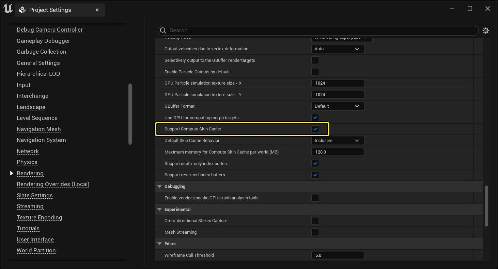
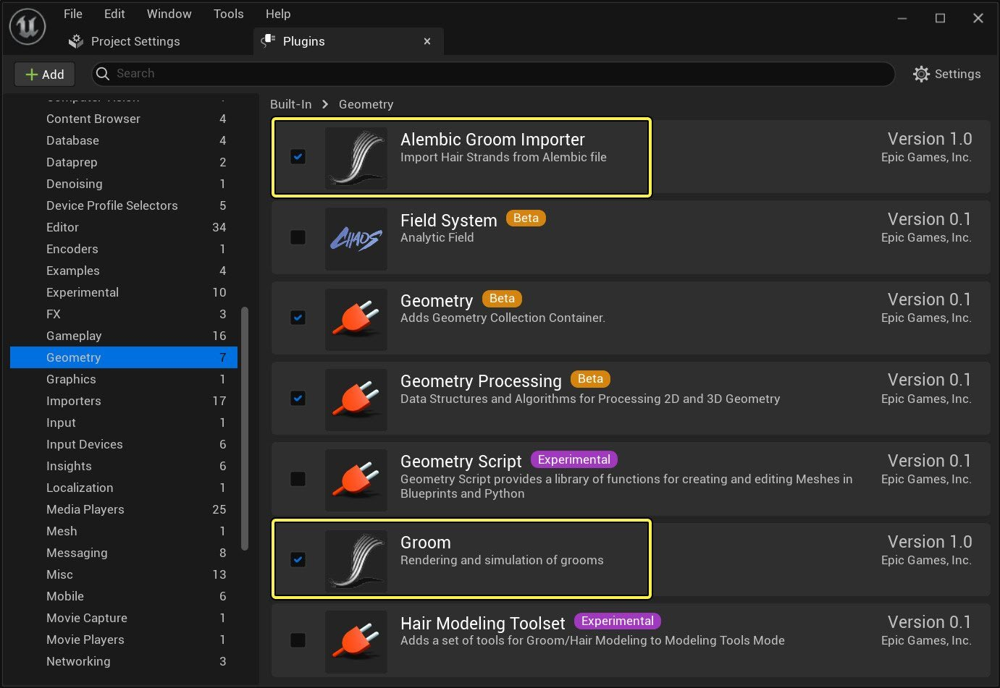

# 设置项目以使用Groom

> 路径：虚幻引擎5.7文档 / 管理内容 / 毛发渲染与模拟 / 设置项目以使用Groom

> 原始页面：https://dev.epicgames.com/documentation/unreal-engine/setting-up-a-project-for-grooms-in-unreal-engine

开始在虚幻引擎项目中使用Groom之前，你需要先启用一些项目设置和插件，以帮助你导入和渲染Groom。

## 项目设置

当你为项目启用Groom时，会嵌入一个基本的蒙皮系统，用于将皮肤变形转发到Groom系统。不过，该系统仅支持基于骨骼的变形。要使用更高级的皮肤变形功能，例如变形目标和变形器，你需要启用[皮肤缓存](../../../designing-visuals-rendering-and-graphics/general-features-of-rendering/skeletal-mesh-rendering-paths/index.md)系统。

在 **项目设置（Project Settings）** 中的 **渲染（Rendering） > 优化（Optimizations）** 下，你可以选中 **支持计算皮肤缓存（Support Compute Skin Cache）** 复选框，启用皮肤缓存系统。

> [!WARNING]
> 此设置需要重启编辑器。

## Groom插件

**插件** 浏览器包含必要和可选插件，用来支持在虚幻引擎项目中使用Groom。你可以从主菜单下的 **编辑（Edit）** 菜单打开。

以下Groom插件可用：

> [!WARNING]
> 启用这些插件需要重启编辑器。

| 插件名称 | 说明 | 默认状态 |
| --- | --- | --- |
| 几何体 |  |  |
| **Alembic Groom导入器（Alembic Groom Importer）** | 使你能够将包含Groom数据集的Alembic (*.abc)文件导入到虚幻引擎中。 | 禁用 |
| **Groom** | 允许对导入的Groom进行渲染和模拟。 | 禁用 |
| [可选] **毛发发片生成器（Hair Card Generator）** | 允许根据Groom中的发束生成发片。你可以配置参数来确定如何根据你的Groom生成发片，这也可以用于生成不同的细节级别。如需详细了解如何生成Groom发片，请参阅[Groom发片和网格体](../setting-up-cards-and-meshes-for-grooms/index.md) | 禁用 |
| 动画 |  |  |
| [可选] **变形器图表（Deformer Graph）** | 启用变形器图表，你可以使用它来执行和自定义任何蒙皮网格体的网格体变形。如需详细了解如何将其用于Groom，请参阅[Groom变形器](../setting-up-a-groom-deformer-graph/index.md)。 | 启用 |
