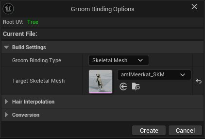
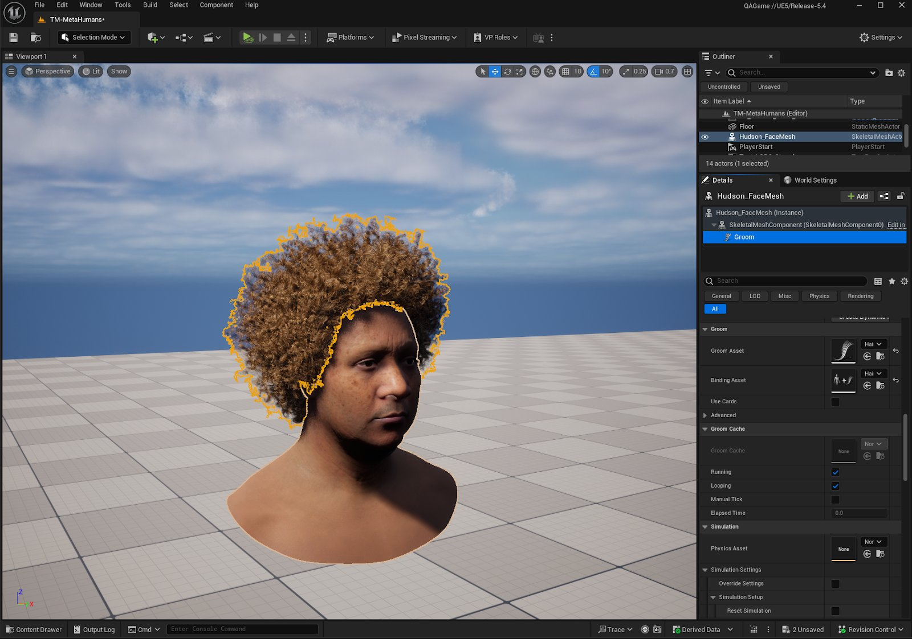
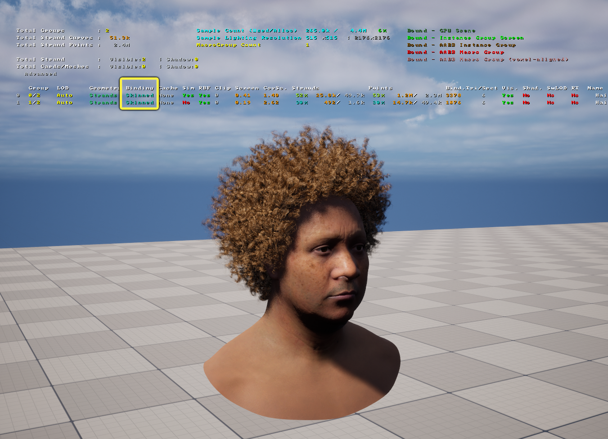
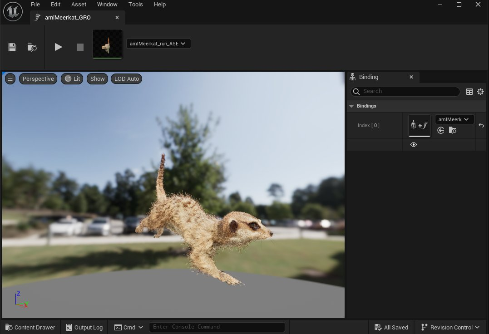
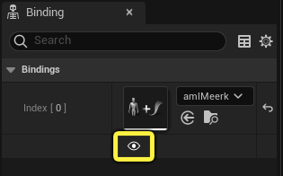
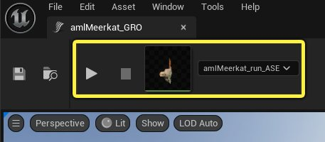
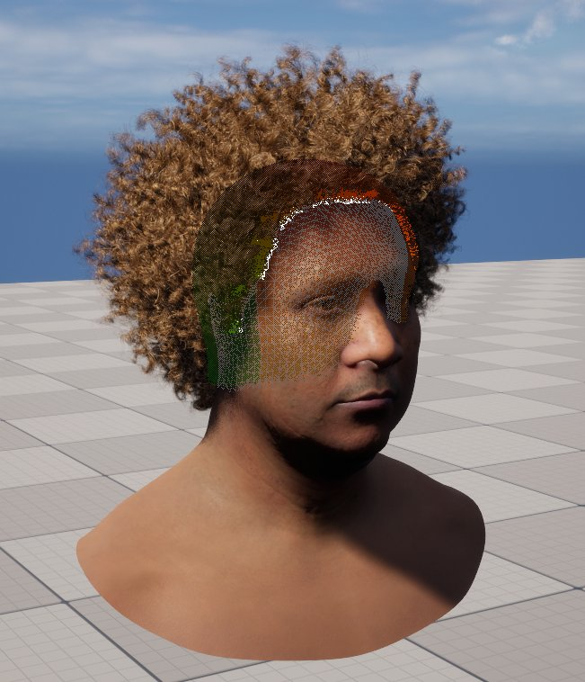

# 为Groom设置绑定

> 路径：虚幻引擎5.7文档 / 管理内容 / 毛发渲染与模拟 / 为Groom设置绑定

> 原始页面：https://dev.epicgames.com/documentation/unreal-engine/setting-up-bindings-for-grooms-in-unreal-engine

**Groom绑定** 资产用于将Groom组件附着并蒙皮到骨骼网格体组件。如果Groom资产仅需"刚性地"附着到骨骼网格体，则无需绑定。

## 创建绑定资产

如需创建绑定资产，请执行以下操作:

1. 在

   内容浏览器（Content Browser）

   中找到

   Groom

   资产。
2. 右键点击Groom，并在快捷菜单中选择

   创建绑定（Create Binding）

   。
3. 在 **Groom绑定选项（Groom Binding Options）** 对话窗口中，进行以下设置：

   

   - 将

     Groom绑定类型（Groom Binding Type）

     设置为

     骨骼网格体（Skeletal Mesh）

     或

     几何体缓存（Geometry Cache）

     以向其绑定Groom。

   > [!WARNING]
   > 选择 **几何体缓存（Geometry Cache）** 作为Groom绑定类型，这需要启用 **几何体缓存（Geometry Cache）** 插件。

   - 设置

     目标骨骼网格体（Target Skeletal Mesh）/目标几何体缓存（Target Geometry Cache）

     ，以选择应将此Groom绑定到哪个骨骼网格体或几何体缓存资产。你必须选择骨骼网格体或几何体缓存才能创建绑定资产。

### 用于创建绑定资产的高级选项

Groom绑定选项（Groom Binding Options）对话框包含一些高级选项，可在创建绑定资产时使用：

- 使用

  插值点数（Num Interpolation Points）

  定义用于毛发全局插值的样本数量，这可以在Groom资产编辑器的

  插值（Interpolation）

  面板中，通过

  毛发插值（Hair Interpolation）

  分段下的

  RBF插值（RBF Interpolation）

  设置，选择性启用该功能。全局插值可在较大的骨骼网格体变形下保留原始的Groom形状。样本用得越多，变形就越准确，但开销也会越大。一般来说，100个样本就够了，再少一点也行。
- 源骨骼网格体（Source Skeletal Mesh）

  可选择性地定义在其上编辑Groom的网格体。该网格体可能与指定的目标骨骼网格体不同，拓扑也可能不同。系统假定源网格体和目标网格体共享相同的UV映射来传输毛发曲线和位置。

  匹配分段（Matching Section）

  限制传输仅使用特定的网格体分段。

## 设置

要使用Groom绑定资产将Groom绑定到蒙皮网格体，请执行以下操作：

1. 创建 **Groom** 组件并使其成为骨骼网格体的子组件。你可以直接在关卡或蓝图中的骨骼网格体上执行此操作。

   | 关卡Actor上的Groom组件 | 蓝图中的Groom组件 |
   | --- | --- |
   | 关卡Actor上的Groom组件。 | 蓝图中的Groom组件。 |
2. 选择 **Groom** 组件后，在 **细节（Details）** 面板中执行以下操作：

   - 将Groom资产指定到

     Groom资产

     指定插槽。
   - 将Groom绑定资产指定到

     绑定资产

     指定插槽。

Groom附着应类似于下图：

> [!NOTE]
> 只有在当前细节级别（LOD） **绑定类型（Binding Type）** 被设置为 **蒙皮（Skinning）** 时，才会使用绑定数据。可以在[Groom资产编辑器](../groom-asset-editor-user-guide/index.md)中的 **LOD** 面板设置下，为每个LOD进行单独设置。在视口菜单中选择 **光照（Lit） > 实例（Instances）** ，直观显示每个LOD的绑定类型，从而验证关卡中当前激活的绑定类型。
>
> 
>
> 点击查看大图

## 在Groom资产编辑器中预览Groom绑定

在Groom资产编辑器中的 **绑定（Binding）** 面板中，你可以管理指定给此Groom的绑定资产。其中列出了所有与当前Groom资产兼容的Groom绑定资产。

你可以使用绑定资产指定插槽下方的 **眼睛** 图标，在预览窗口内预览绑定资产。

你可以使用预览窗口上方的动画指定插槽，选择可用动画来预览当前Groom的毛发变形。使用播放和停止按钮，在预览窗口中开始和停止动画。

选择 **光照（Lit） > Groom > 根部绑定（Root Bindings）** ，可以在关卡中直观地显示Groom的 **根部（Root）** 数据。每根渲染发束的根部绑定数据都通过毛发根部的带颜色白线以及绑定根部的相应三角形展示。

## Groom绑定属性

### Groom绑定选项属性

创建Groom绑定资产时，可以在Groom绑定选项对话框中找到以下属性：

| 属性 | 说明 |
| --- | --- |
| 构建设置（Build Settings） |  |
| **Groom绑定类型（Groom Binding Type）** | 选择要为其创建Groom绑定的网格体类型：**骨骼网格体（Skeletal Mesh）** 或 **几何体缓存（Geometry Cache）** 。 |
| **目标骨骼网格体（Target Skeletal Mesh）/目标几何体缓存（Target Geometry Cache）** | 选择此Groom所附着的骨骼网格体/几何体缓存资产。 |
| 毛发插值点（Hair Interpolation Points） |  |
| **插值点数（Num Interpolation Points）** | 用于RBF插值的点数。 |
| 转换（Conversion） |  |
| **源骨骼网格体（Source Skeletal Mesh）/源几何体缓存（Source Geometry Cache）** | 要在其上编辑Groom的骨骼网格体/几何体缓存。此为可选项，仅当毛发未绑定在进行编辑的网格体上时才使用。例如，仅当曲线的根和表面几何体不对齐且需要封装/变换时。 |
| **匹配分段（Matching Section）** | 选择以转换位置的分段。 |

### Groom绑定资产编辑器属性

打开Groom资产时，可以在Groom资产编辑器中找到以下属性：

| 属性 | 说明 |
| --- | --- |
| 构建设置（Build Settings） |  |
| **Groom绑定类型（Groom Binding Type）** | 选择要为其创建Groom绑定的网格体类型：**骨骼网格体（Skeletal Mesh）** 或 **几何体缓存（Geometry Cache）** 。 |
| **Groom** | 此绑定资产使用的Groom。 |
| **源骨骼网格体（Source Skeletal Mesh）/源几何体缓存（Source Geometry Cache）** | 在其上编辑Groom的骨骼网格体/几何体缓存。此为可选项，仅当毛发未绑定在进行编辑的网格体上时才使用。例如，仅当曲线的根和表面几何体不对齐且需要封装/变换时。 |
| **目标骨骼网格体（Target Skeletal Mesh）/目标几何体缓存（Target Geometry Cache）** | 选择此Groom所附着的骨骼网格体/几何体缓存资产。 |
| **插值点数（Num Interpolation Points）** | 用于径向偏差函数（RBF）插值的点数。 |
| **匹配分段（Matching Section）** | 选择以转换位置的分段。 |
| 毛发组（Hair Groups） |  |
| **曲线数（Curve Count）** | 该毛发组具有的曲线数量。 |
| **曲线LOD（Curve LOD）** | 该毛发组具有的曲线LOD数量。 |
| **导线数（Guide Count）** | 该毛发组具有的导线数量。 |
| **导线LOD（Guide LOD）** | 该毛发组具有的导线LOD数量。 |

### Groom资产编辑器绑定属性

在 **Groom资产编辑器（Groom Asset Editor）** 的 **LOD** 面板下可以找到以下属性：

> 图片已省略：Groom资产编辑器绑定属性

| 属性 | 说明 |
| --- | --- |
| Groom |  |
| **绑定类型（Binding Type）** | 设置Groom模拟模式以表示此细节级别。每个细节级别组都可以在以下绑定类型之间进行选择： **刚体（Rigid）** ：毛发遵循所提供的骨骼网格体的附着名称。 **蒙皮（Skinning）** ：毛发遵循骨骼网格体的蒙皮表面。 |
