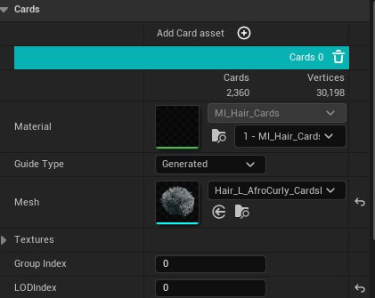
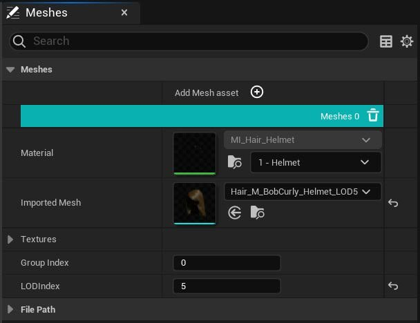

# 为Groom设置发片和网格体

> 路径：虚幻引擎5.7文档 / 管理内容 / 毛发渲染与模拟 / 为Groom设置发片和网格体

> 原始页面：https://dev.epicgames.com/documentation/unreal-engine/setting-up-cards-and-meshes-for-grooms-in-unreal-engine

Groom可以具有多个细节级别（LOD），并且每个级别都可以使用发束、发片或网格体来表示。Groom的LOD数量在[Groom资产编辑器](../groom-asset-editor-user-guide/index.md)的 **LOD** 面板中设置。发片和网格体几何体在各自的 **发片（Cards）** 和 **网格体（Meshes）** 面板中管理。在每个面板中，你可以添加新条目并配置网格体几何体及其材质。

## 发片面板

你可以在 **发片（Cards）** 面板中设置发片网格体、纹理以及到特定毛发组和LOD的映射。每个发片网格体的统计信息会显示在每个条目的顶部，列明其所包含的发片和顶点数量。

导入用作发片几何体的网格体时，必须为每个发片网格体选择 **导线类型（Guide Type）** ：

- 生成型（Generated）

  导线根据网格体本身生成变形导线。这些导线从每个毛发发片几何体的中间穿过。
- 通过为每个发片顶点选择最近的导线，

  基于导线型（Guide-Based）

  将使用Groom的导线来为每个发片几何体蒙皮。

**纹理（Textures）** 分段会配置用于发片几何体的输入纹理。有两种不同的发片布局可供选择：**默认（Default）** 和 **紧凑（Compact）** 。这些布局定义了如何打包这些纹理的属性。通过对发束进行体素化并将平均值传输到每个发片顶点，可以自动生成 **GroupID** 和 **每点颜色（Per-Point Color）** 等属性。

| Groom纹理默认布局 | Groom纹理紧凑布局 |
| --- | --- |
| Groom纹理默认布局 | Groom纹理紧凑布局 |

> [!NOTE]
> 当使用 **毛发属性（Hair Attributes）** 表达式时，列表中的纹理会自动绑定并在材质中采样。如需详细了解材质表达式及其用法，请参阅[Groom材质](../groom-materials/index.md)。

**发片（Cards）** 面板中有以下属性：

| 属性 | 说明 |
| --- | --- |
| **材质（Material）** | 用于发片呈现LOD的指定材质。此材质是从Groom资产编辑器的材质面板中显示的列表中选取的。 |
| **导线类型（Guide Type）** | 选择用于发片的导线类型： **生成型（Generated）** ：基于网格体生成变形导线。这些导线从每个毛发发片几何体的中间穿过。假定输入几何体由三角带组成。 **基于导线型（Guide-Based）** ：通过为每个发片顶点选择最近的导线，使用Groom导线为每个发片几何体"蒙皮"。 |
| **网格体（Mesh）** | 发片几何体所引用的网格体。 |
| 纹理（Textures） |  |
| **布局（Layout）** | 此设置决定Groom的属性如何打包到纹理中。你可以在发片或网格体的 **默认** 和 **紧凑** 选项之间进行选择。默认选项回将属性单独打包到有意义的纹理中。紧凑选项会将更多的属性分组到更少的纹理中。 |
| **深度（Depth）** | 用于发片资产的深度纹理。此纹理可选，但设置后，该值将被转发到[材质编辑器](../../../designing-visuals-rendering-and-graphics/unreal-engine-materials/unreal-engine-material-editor-user-guide/index.md)中的 **Hair Attributes** 节点。 |
| **覆盖（Coverage）** | 此纹理用于发片资产。此纹理可选，但设置后，该值将被转发到[材质编辑器](../../../designing-visuals-rendering-and-graphics/unreal-engine-materials/unreal-engine-material-editor-user-guide/index.md)中的 **Hair Attributes** 节点。 |
| **切线（Tangent）** | 此纹理用于发片资产。此纹理可选，但设置后，该值将被转发到[材质编辑器](../../../designing-visuals-rendering-and-graphics/unreal-engine-materials/unreal-engine-material-editor-user-guide/index.md)中的 **Hair Attributes** 节点。 |
| **属性（Attributes）：RootUV / CoordU / 种子（RootUV / CoordU / Seed）** | 此纹理用于发片资产。此纹理可选，但设置后，该值将被转发到材质编辑器中的 **Hair Attributes** 节点。 |
| **材质（Material）：颜色/粗糙度（Color / Roughness）** | 此纹理用于网格体资产。此纹理使用Groom资产上的毛发纹理选项生成。 |
| **辅助（Auxiliary）** | 此纹理使得用户数据可以为发片资产进行传输。这是可选纹理。设置此值后，其将被转发到材质编辑器中的 **Hair Attributes** 节点。 |
| 组设置（Group Settings） |  |
| **组索引（Group Index）** | 此发片几何体所映射到的组索引。 |
| **LOD索引（LOD Index）** | 应使用此发片资产的LOD索引。 |

### 毛发发片生成器插件

> [!WARNING]
> 此功能为试验性功能。输出结果可能因Groom的复杂程度而异。

创建这些发片是非常困难且耗时的工作，尤其是在试图匹配某个基于发束的Groom对应物的体积和形状时。**毛发发片生成器（Hair Card Generator）** 插件可简化此过程，方法是在[Groom资产编辑器](../groom-asset-editor-user-guide/index.md)中将基于发束的Groom转换成基于发片的表示。

| 基于发束的Groom | 生成的基于发片的Groom |
| --- | --- |
| 原始的基于发束的Groom | 生成的基于发片的Groom |

关于此插件的更多详情及设置方法，请参阅[发片生成器](../hair-card-generator-for-grooms/index.md)一文。

## 网格体面板

你可以在 **网格体（Meshes）** 面板中设置网格体、纹理以及到特定毛发组和LOD的映射。该面板列出了所有几何体，但并非所有几何体都要使用。

网格体面板中有以下属性：

| 属性 | 说明 |
| --- | --- |
| **材质（Material）** | 用于网格体呈现LOD的指定材质。此材质是从Groom资产编辑器的材质面板中显示的列表中选取的。 |
| **网格体（Mesh）** | 该网格体所引用的几何体。 |
| 纹理（Textures） |  |
| **深度（Depth）** | 用于网格体资产的深度纹理。此纹理可选，但设置后，该值将被转发到材质编辑器中的 **Hair Attributes** 节点。 |
| **覆盖（Coverage）** | 此纹理用于网格体资产。此纹理可选，但设置后，该值将被转发到材质编辑器中的 **Hair Attributes** 节点。 |
| **切线（Tangent）** | 此纹理用于网格体资产。此纹理可选，但设置后，该值将被转发到材质编辑器中的 **Hair Attributes** 节点。 |
| **属性（Attributes）：RootUV / CoordU / 种子（RootUV / CoordU / Seed）** | 此纹理用于网格体资产。此纹理可选，但设置后，该值将被转发到材质编辑器中的 **Hair Attributes** 节点。 |
| **材质（Material）：颜色/粗糙度（Color / Roughness）** | 此纹理用于网格体资产。此纹理通过Groom资产上的毛发纹理选项生成。 |
| **辅助（Auxiliary）** | 此纹理使得用户数据可以为发片资产进行传输。这是可选纹理。设置此值后，其将被转发到材质编辑器中的 **Hair Attributes** 节点。 |
| 组设置（Group Settings） |  |
| **组索引（Group Index）** | 此网格体几何体所映射到的组索引。 |
| **LOD索引（LOD Index）** | 应使用此网格体资产的LOD索引。 |
| LOD |  |
| **LOD最小值（Minimum LOD）** | 指定为所有平台烘焙的最低细节级别，或者通过使用 **添加（+）** 图标将其添加到数组来为各个平台指定最小值。 |
