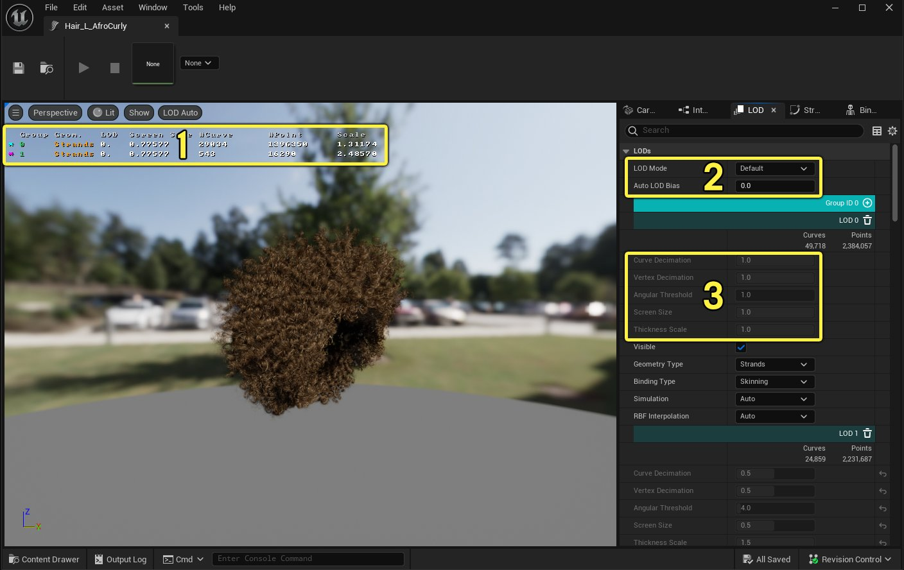
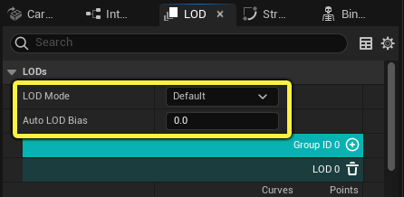
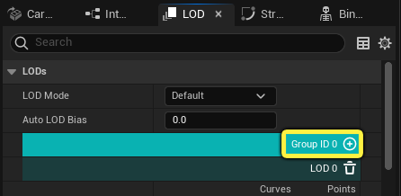
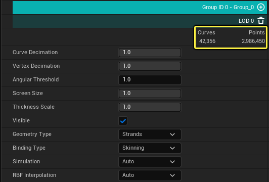
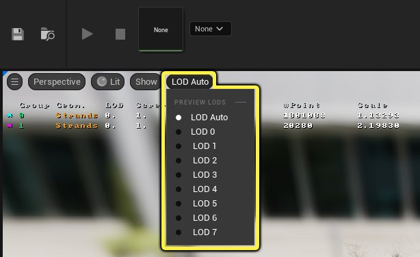
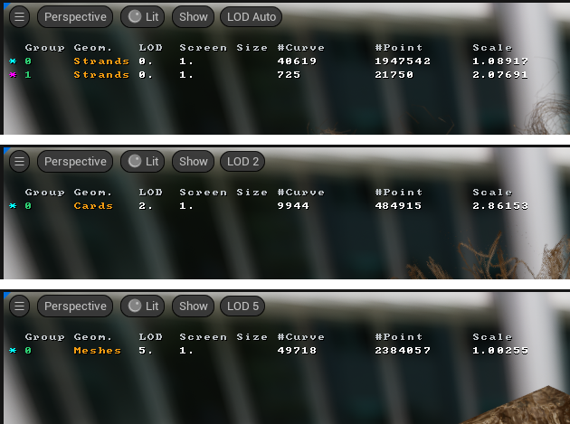

# 为Groom设置细节级别

> 路径：虚幻引擎5.7文档 / 管理内容 / 毛发渲染与模拟 / 为Groom设置细节级别

> 原始页面：https://dev.epicgames.com/documentation/unreal-engine/setting-up-level-of-detail-for-grooms-in-unreal-engine

与虚幻引擎中的许多其他类型的几何体一样，为Groom设置细节级别（LOD）也很重要。简化你的Groom，它们距离摄像机越远，就越能降低渲染开销，同时提升性能。

你可以在[Groom资产编辑器](../groom-asset-editor-user-guide/index.md)的 **LOD** 面板中为Groom设置和管理LOD。你可以在此处定义各个毛发组如何根据其屏幕覆盖范围呈现。

1. 当前LOD可视化统计数据
2. LOD模式
3. 手动消减和屏幕尺寸属性

## 设置细节级别

在 **LOD** 面板的顶部，你可以选择要用于此Groom的 **LOD模式（LOD Mode）** 。此模式会影响发束几何体如何处理细节级别之间的切换。

可用的选项有：

- 默认值（Default）

  ：使用项目设置中定义的LOD模式。
- 自动（Auto）

  ：根据Groom的屏幕尺寸自动调整发束的曲线数量，这意味着无需创建手动LOD条目。这将重载默认的LOD模式。
- 手动（Manual）

  ：根据LOD条目中的信息调整发束几何体的曲线和点数量。这将重载默认的LOD模式。

> [!TIP]
> 你可以使用 **自动LOD偏差（Auto LOD Bias）** 来增加Groom开始减少曲线数量时的距离。当自动曲线减少太明显时，此项会很有用。

对于每个彩色的毛发组，你最多可以创建8个LOD条目。每个LOD条目主要定义其变为激活时的屏幕尺寸、使用的几何体类型、要使用的绑定类型等。单击LOD面板中第一个组旁边的 **添加（+）** ，可向每个组添加其他LOD。

对于每个毛发组，你可以决定要使用的几何体类型：

- 发束（Strands）

  ：使用发束几何体并支持蒙皮、RBF和模拟。
- 发片（Cards）

  ：使用发片（或薄片）几何体并支持蒙皮、RBF和模拟。
- 网格体（Meshes）

  ：使用网格体几何体，例如毛发头盔。仅支持RBF。

> [!NOTE]
> 如需详细了解如何设置发片和网格体几何体，请参阅[为Groom设置发片和网格体](../setting-up-cards-and-meshes-for-grooms/index.md)。

这些是在[MetaHuman Creator](https://www.unrealengine.com/zh-CN/metahuman)中创建的MetaHuman角色上的每种几何体类型的示例。

| 发束几何体 | 发片几何体 | 毛发头盔网格体 |
| --- | --- | --- |
| 发束 | 发片 | 网格体 |

指定几何体类型时，设置会发生变化以反映所选类型。发束包含其自身的消减设置，而发片和网格体仅使用屏幕尺寸。

| 发束LOD设置 | 发片和网格体LOD设置 |
| --- | --- |
| 发束LOD设置 | 发片和网格体LOD设置 |

当你将 **LOD模式（LOD Mode）** 设置为 **手动（Manual）** 时，对于三种Groom几何体类型中的任一种，用于消减和屏幕尺寸的毛发组设置都会变为可编辑。面板最顶部，彩色毛发组ID下方，显示的是此LOD组具有的 **曲线（Curves）** 和 **点（Points）** 的数量。

## 直观显示Groom LOD

在Groom资产编辑器预览窗口中，你可以自动可视化细节级别，或者在使用 **LOD** 选项菜单时指定特定级别。

设置为 **LOD自动（LOD Auto）** 时，LOD会根据屏幕尺寸在级别之间自动切换。或者，无论屏幕尺寸如何，你可以使用下拉菜单查看可用的细节级别。

每种LOD类型的统计数据如下：

- 几何体类型
- LOD索引
- 屏幕尺寸
- 曲线数
- 点数
- 毛发厚度比例

发束、发片和网格体几何体的LOD统计数据示例。

## Groom资产编辑器LOD属性

**LOD** 面板中有以下属性：

| 属性 | 说明 |
| --- | --- |
| **LOD模式（LOD Mode）** | 定义LOD如何为发束几何体调整曲线和点。**自动（Auto）** 根据屏幕覆盖范围调整曲线数量。**手动（Manual）** 使用为每个组创建的离散LOD。 |
| **自动LOD偏差（Auto LOD Bias）** | 当选择自动LOD时，会缩减出现曲线减少的屏幕尺寸。 |
| 毛发组（Hair Groups） |  |
| **曲线消减（Curve Decimation）** | 均匀地减少发束数量。 |
| **顶点消减（Vertex Decimation）** | 减少每股发束的点数量。 |
| **角度阈值（Angular Threshold）** | 在简化过程中移除顶点时相邻顶点之间的最大角度差，以度为单位。 |
| **屏幕尺寸（Screen Size）** | 应启用此LOD时的屏幕尺寸。 |
| **厚度比例（Thickness Scale）** | 缩放发束半径。这只能用于手动补偿曲线的减少。 |
| **可见（Visible）** | 定义该毛发组的LOD是否可见。 |
| **几何体类型（Geometry Type）** | 定义此LOD使用的几何体类型：发束、发片或网格体。 |
| **绑定类型（Binding Type）** | 定义附着类型： **刚体（Rigid）** ：当附着到骨骼网格体时，Groom会使用所提供的Groom组件上的附着名称。 **蒙皮（Skinning）** ：当附着到骨骼网格体时，Groom会通过骨骼网格体的蒙皮表面变形。 |
| **模拟（Simulation）** | 设置此Groom是否模拟物理交互。这将重载Groom资产编辑器的 **物理（Physics）** 面板中的全局 **模拟启用（Simulation Enable）** 设置。 |
| **RBF插值（RBF Interpolation）** | 设置此Groom是否使用RBF插值。这将覆盖Groom资产编辑器的 **插值（Interpolation）** 面板中的全局 **RBF插值（RBF Interpolation）** 设置。 |
