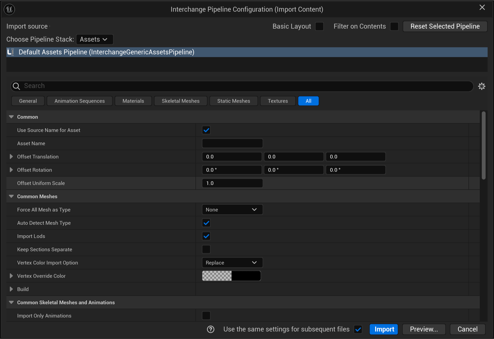
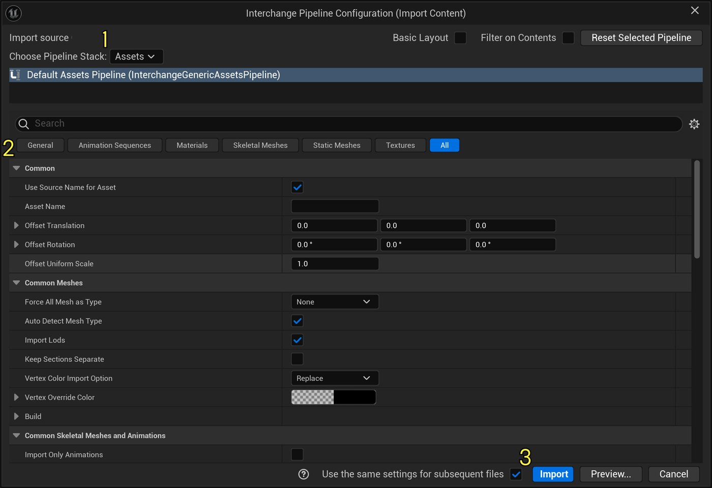
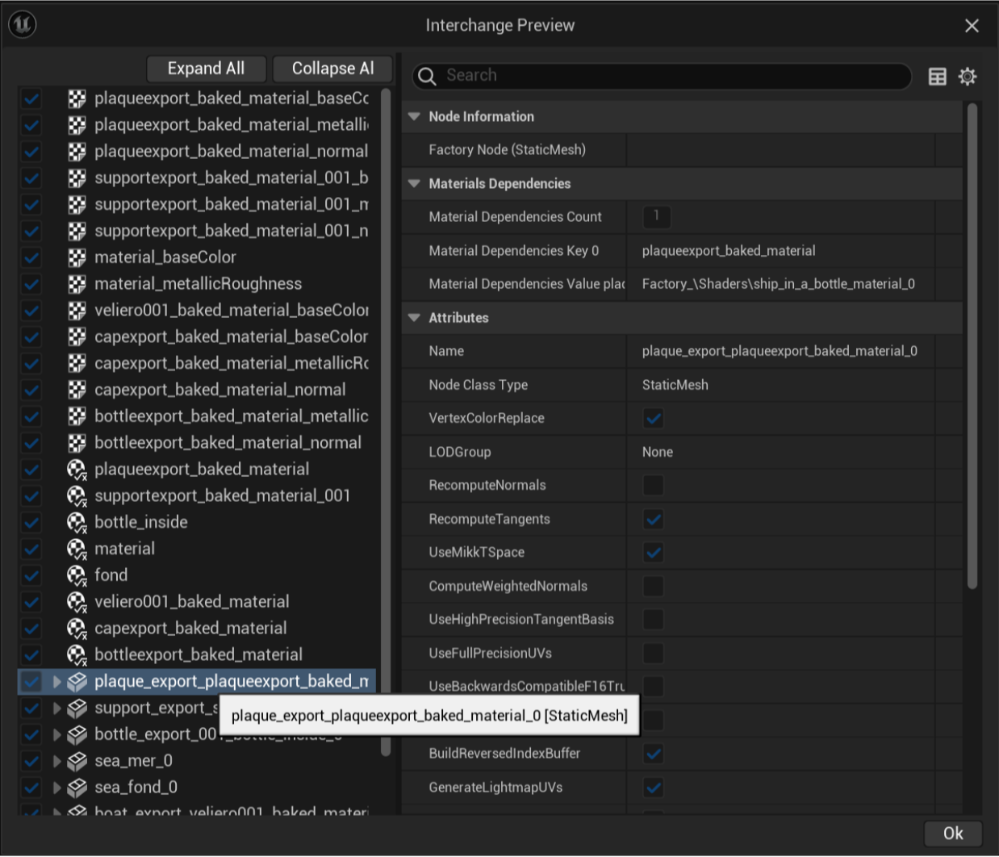
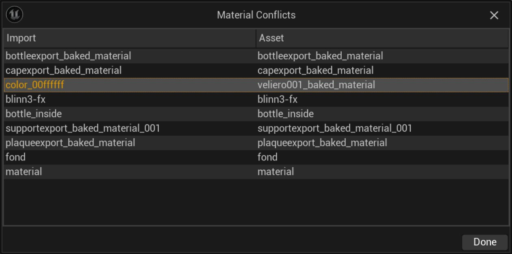
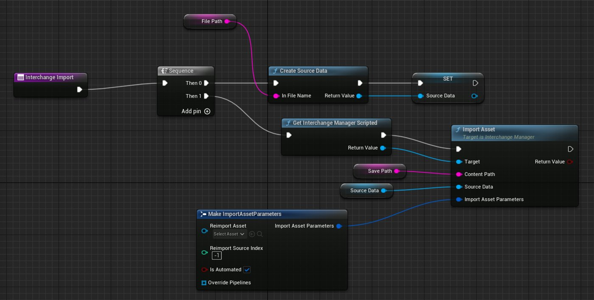
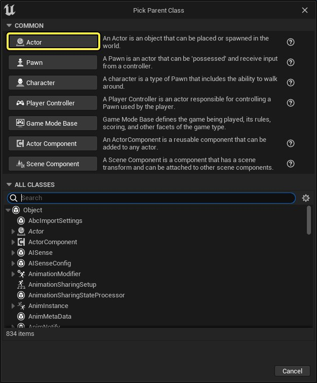
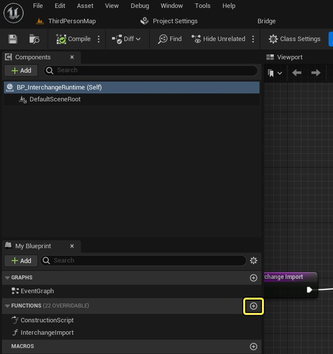
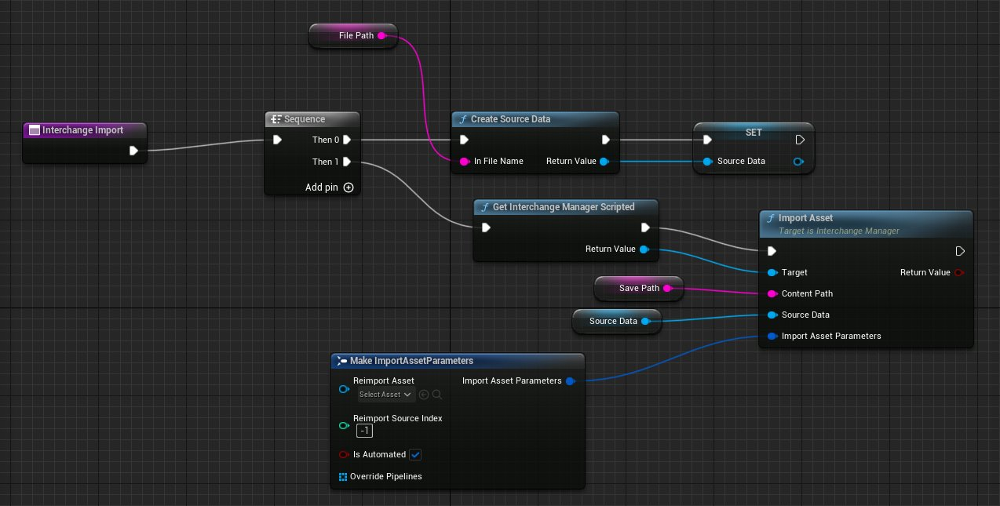

# 使用交换导入资产

> 路径：虚幻引擎5.7文档 / 管理内容 / 交换框架 / 使用交换导入资产

> 原始页面：https://dev.epicgames.com/documentation/unreal-engine/importing-assets-using-interchange-in-unreal-engine

**交换框架（Interchange Framework）**是虚幻引擎的导入和导出框架。 它与文件格式无关，异步，可自定义，可在运行时使用。



交换框架接口

交换使用可扩展的代码库，并提供可自定义的管线堆栈。 这样你就可以根据项目的需求自由地使用C++、蓝图或Python编辑导入管线。

## 重要概念和术语

使用交换时，以下概念和术语很重要：

- **管线（Pipeline）**：处理导入数据的操作集合。 管线公开用于自定义导入过程的选项。
- **管线堆栈（Pipeline Stack）**：处理导入文件的有序管线列表。 管线在堆栈中组合并分配给特定文件格式。 管线堆栈位于**项目设置（Project Settings） > 交换（Interchange）**中。
- **工厂（Factory）**：从导入的数据生成资产的操作。

## 启用交换插件

交换框架需要**交换编辑器（Interchange Editor）**和**交换框架（Interchange Framework）**插件，这些插件默认启用。 如果在你的项目中没有启用这些插件，请在项目的项目设置中启用它们。

如需详细了解如何启用插件，请参阅[使用插件](https://dev.epicgames.com/documentation/assets/understanding-the-basics/customizing-unreal-engine/working-with-plugins)。

## 导入资产

在虚幻引擎中，导入资产的方法有很多种。

你可以使用内容侧滑菜单或内容浏览器导入资产，也可以从主菜单选择**文件（File） > 导入到关卡中（Import Into Level）**来导入资产。

如需详细了解导入文件的信息，请参阅[直接导入资产](../../../understanding-the-basics/assets-and-content-packs/importing-assets-directly-into/index.md)。

> [!NOTE]
> **导入到关卡中（Import Into Level）**目前适用于[glTF](../../the-gl-transmission-format-gltf/index.md)和**MaterialX**文件格式。

## 导入过程

使用上述任一方法开始导入过程。这将打开**交换管线配置（Interchange Pipeline Configuration）**窗口：

1. 打开**选择管线堆栈（Choose Pipeline Stack）**下拉菜单，从列表中选择要使用的管线堆栈。
2. 配置你的设置。
3. 按**导入（Import）**完成该过程。



使用该接口选择你的导入设置并点击"导入（Import）"继续。

对于每次导入，引擎都会检查文件格式是否受交换框架支持。 如果支持该文件，交换会使用适合你的格式的相应导入管线堆栈。

然后交换会经历以下过程：

1. 交换会将导入的数据转化为虚幻引擎中的中间节点结构。
2. 交换会遍历管线堆栈，并按照导入说明操作。
3. 使用工厂从结果生成资产。

如果文件格式不受交换支持，虚幻引擎将使用旧版框架导入文件。

交换管线配置窗口具有以下选项：

| 选项 | 说明 |
| --- | --- |
| **基本布局（Basic Layout）** | 将导入管线选项筛选为基本管线属性。 |
| **过滤内容（Filter on Contents）** | 根据源文件中找到的数据筛选导入管线选项。 |
| **选择管线堆栈（Choose Pipeline Stack）** | 选择用于此导入的管线堆栈。 |

> [!NOTE]
> 对FBX文件格式的支持目前处于实验阶段。 要使用交换启用FBX导入，请使用以下控制台命令：
>
> | 控制台命令 | 说明 |
> | --- | --- |
> | Interchange.FeatureFlags.Import.FBX | 切换使用交换进行FBX导入的实验性支持。 |
> | Interchange.FeatureFlags.Import.FBX.ToLevel | 切换FBX导入到关卡的实验性支持。 |

### 交换预览

当你在交换管线配置窗口中点击**预览（Preview）**按钮时，将打开交换预览编辑器窗口：



交换预览窗口显示将创建的资产列表

在此窗口中，你可以看到：

- 将创建的资产列表。
- 它们的类型显示为图标或提示文本（材质、静态网格体、纹理2D）。
- 它们的属性由管线的预导入步骤设置。

### 冲突预览

如果导入过程检测到重新导入资产的材质或骨架结构发生变化，它会突出显示受影响的管线。 当你点击**显示冲突（Show Conflict）**时，冲突预览窗口将打开：



交换冲突预览窗口显示重新导入时材质或骨架结构的变化

此窗口会突出显示每个冲突，告知你重新导入资产时会发生什么变化。

> [!NOTE]
> 在以前的版本中，你可以选择保留原始材质分配或从冲突窗口中替换它。 你不能再使用交换执行此操作。 要更改资产的分配材质，你必须在源文件中进行修正或使用静态网格体编辑器。 有关使用静态网格体编辑器的更多信息，请参阅[通过静态网格体编辑器应用材质](../../static-meshes/using-materials-with-static-meshes/index.md)。

## 使用交换重新导入资产

当你重新导入之前使用交换导入的资产时，虚幻引擎会记住使用的管线堆栈和选项，并显示这些选项。

## 使用蓝图导入资产

你可以使用蓝图通过交换框架将资产导入到虚幻引擎中。



蓝图示例会创建一个在运行时使用交换导入文件的对象。

例如，你可以使用此功能，在基于虚幻引擎的应用程序中在运行时使用交换来导入文件。 上面的示例创建了一个函数，它会使用默认纹理管线堆栈将纹理文件导入指定文件位置。 这种导入方法目前不支持骨骼网格体或动画数据。

### 新建蓝图类

要重新创建示例，请执行以下步骤：

1. 在你的项目中创建新的Actor蓝图类，以包含该函数。 右键点击**内容浏览器（Content Browser）**并从上下文菜单选择**蓝图类（Blueprint Class）**。
2. 在**选择父类（Pick Parent Class）**窗口中，选择**Actor**并将新蓝图类命名为**InterchangeActor**。

   

   选择新蓝图的父类。

### 添加函数

要添加函数：

1. 双击该新蓝图，打开编辑器。
2. 在**我的蓝图（My Blueprint）**面板中，转到函数设置，点击**+**按钮，并将新函数命名为**InterchangeImport**。

   

   添加新函数

### 添加和连接节点

要添加和连接节点：

1. 添加**Sequence**节点并将其连接到函数的输出。
2. 拖移**Then 0**输出并创建**Create Source Data**节点，以引用将导入的现有文件。
3. 连接**Create Source Data**上的**In File Name**输入，并从上下文菜单选择**Promote to Variable（提升到变量）**。
4. 将新的字符串变量命名为**FilePath**。 这保存了将导入的文件的位置。
5. 在蓝图中，选择新变量，并选中**Instance Editable（实例可编辑）**复选框。
6. 将**Create Source Data**节点的输出提升到名为**SourceData**的新变量。
7. 从Sequence的**Then 1**输出拖出并创建**Get Interchange Manager Scripted**节点。 这会创建一个指针，指向下一步中使用的交换管理器。
8. 从**Get Interchange Manager Scripted**输出拖出并创建**Import Asset**节点。 将**Get Interchange Manager Scripted**的返回值连接到**Import Asset**的**Target输入**。
9. 从**Content Path**输入拖出并将其提升到名为**SavePath**的新变量。 这保存了新导入文件的位置。
10. 在蓝图中，选择新变量并选中**Instance Editable（实例可编辑）**复选框。
11. 获取**Source Data**变量的引用并将其连接到**Import Asset**的Source Data输入。
12. 从**Import Asset Parameters**输入拖出并创建**Make Input Asset Parameters**节点。

    

    点击查看大图。

### 使函数在运行时可用

要使函数在运行时可用：

1. 在**我的蓝图（My Blueprints）**中，点击**InterchangeImport**函数，并在**细节（Details）**面板中选中**Call In Editor（在编辑器中调用）**旁边的复选框。 此选项使函数在运行时在**InterchangeActor**对象的**细节（Details）**中可用。
2. **保存（Save）**并**编译（Compile）**你的蓝图。

### 使用你的新蓝图

1. 将InterchangeActor蓝图的副本拖入关卡中。
2. 点击**播放（Play）**。
3. 在**大纲视图（Outliner）**中，选择**InterchangeActor**。
4. 在**细节（Details）**面板中填写**FilePath**和**SavePath**。
5. 点击**Interchange Import**按钮导入你的文件。

> [!TIP]
> 如果你在上面的蓝图示例中使用**Import Scene**节点，资产会直接生成到场景中。

### 在烘焙的应用程序中使用交换

如果你计划在运行时在烘焙的应用程序中使用交换框架，请转到**项目设置（Project Settings） > 项目（Project） - 打包（Package） > 要烘焙的其他资产目录（Additional Asset Directories to Cook）**，并添加**Interchange**文件夹。

点击查看大图。

## 使用Python导入资产

你可以使用Python脚本通过交换框架将资产导入到虚幻引擎中。

Python

```
import unreal
 
import_path = "C:/Users/foo/Downloads/Fbx/SkeletalMesh/Animations/Equilibre.fbx"
 
import_extension = unreal.Paths.get_extension(import_path, False)
 
is_gltf = import_extension == 'glb' or import_extension == 'gltf'
is_fbx = import_extension == 'fbx'
is_usd = import_extension == 'usd'
 
```

在上面的示例中，使用Python脚本导入`Equilibre.fbx`文件。 脚本检查文件格式是否为`.glb``.gltf`、`.fbx`或`.usd`然后分配正确的管线。

## 编辑管线堆栈

交换框架的一大优势是，能够选择和自定义管线堆栈，这是一个可自定义的过程堆栈，而这些过程用于处理资产数据。 你可以将管线添加到默认管线堆栈，以添加导入过程中的行为。

虚幻引擎随附以下默认管线：

- 默认资产管线
- 默认材质管线
- 默认纹理管线
- 默认场景资产管线
- 默认场景关卡管线
- 默认图表检查器管线

每个默认管线都包含用于该类型导入的最常见选项。 你可以进一步自定义这些管线，满足项目的特定需要。

### 编辑现有管线

每个默认管线都可自定义，以满足项目和团队的需要。

下面是为项目自定义导入选项的方法：

- 在你的**项目设置（Project Settings）**中添加、删除或重新排序现有管线堆栈。
- 更改默认使用的管线。
- 修改现有默认管线。
- 创建自定义管线。

### 编辑项目设置

你可以在**项目设置（Project Settings）**中的**引擎（Engine） > 交换（Interchange）**下找到管线堆栈：

> 图片已省略：管线堆栈

项目设置中的管线堆栈。

管线堆栈包含以下各项的默认设置：

- 导入内容
- 导入到关卡
- 编辑器接口
- 泛型
- 编辑器泛型管道类

#### 导入内容

虚幻引擎会使用这些设置将内容导入到**内容侧滑菜单**或**内容浏览器**中。

> 图片已省略：交换导入内容

点击查看大图。

你可以修改所列每种内容类型的设置。 你也可以根据需要添加其他标题。 例如，默认配置包含**资产（Assets）**、**材质（Materials）**和**纹理（Textures）**。 你可以将一个额外的分段添加到动画的管线堆栈，然后能够添加一个或多个自定义管线来处理传入的动画文件。

#### 导入到关卡

在编辑器窗口中，你可以找到**文件（File） > 导入到关卡中（Import Into Level）**。 默认情况下，此函数使用两个协同工作的管线。 这些管线从文件导入Actor数据，然后在关卡中生成Actor。 导入函数使用以下设置：

点击查看大图。

- **DefaultSceneAssetPipeline**基于与DefaultAssetPipeline相同的类，专为场景导入设计。
- **DefaultSceneLevelPipeline**在数据通过DefaultSceneAssetPipeline后在世界中生成Actor。

### 修改现有默认管线

你可以修改默认交换管线的属性，以便更改以下内容：

- 默认值
- 可视性
- 只读状态

> 图片已省略：交换管线细节

交换管线细节面板。

要更改默认交换管线的设置，请执行下面的步骤：

1. 在内容侧滑菜单或内容浏览器中，找到默认管线并双击打开一个管线。 管线位于**引擎（Engine） > 插件（Plugins） > 交换框架内容（Interchange Framework Content） > 管线（Pipelines）**文件夹中。 如果你看不到引擎文件夹，请点击**内容侧滑菜单**或**内容浏览器**右上角的**设置（Settings）**，并选中**显示引擎内容（Show Engine Content）**复选框。
2. 根据需要编辑以下内容：

   1. 导入和重新导入过程中的可见性。
   2. 默认设置。
   3. 该属性在导入过程中是否为只读。
3. 保存并关闭窗口。

### 创建自定义管线

你可以使用蓝图、C++或Python创建新的交换管线，进一步自定义导入过程。

#### 使用蓝图创建自定义管线

要使用蓝图创建新的交换管线，请执行下面的步骤：

1. 在**内容侧滑菜单**或**内容浏览器**中，右键点击并选择**创建蓝图类（Create Blueprint Class）**。
2. 在**选择父类**窗口中，展开**所有类（All Classes）**类别，并选择**InterchangePipelineBase**作为其**父类（Parent Class）**。
3. 双击新蓝图，打开**蓝图编辑器（Blueprint Editor）**。

> 图片已省略：选择InterchangePipelineBase作为父类

选择InterchangePipelineBase作为父类。

使用蓝图创建的自定义管线具有以下函数，这些函数可以被重写以添加自定义行为。

> 图片已省略：交换蓝图重载函数

交换蓝图重载函数。

| 重载函数 | 说明 |
| --- | --- |
| **脚本化代码可在任何线程上执行** | 向交换管理器传达此管线可以在异步模式中执行的信息。 |
| **脚本化执行导出管线** | 在导出过程中执行（功能当前不起作用。 |
| **脚本化执行管线** | 在文件转换之后执行。 创建生成资产所需的工厂。 |
| **脚本化执行后工厂管线** | 在工厂创建资产之后但调用PostEditChange函数之前执行。 |
| **脚本化执行后导入管线** | 在资产完全导入之后并调用PostEditChange函数之后执行。 |
| **脚本集重导入源索引** | 执行并向管线表明要重新导入哪个源索引。 在重新导入可能有多个源的资产时使用此函数。 例如，将一个源文件用于几何体并将另一个用于蒙皮信息的骨骼网格体。 |

#### 使用C++创建自定义管线

要使用C++创建新的交换管线，请创建包含以下内容的头文件：

C++

```
#pragma once
​
#include "CoreMinimal.h"
​
#include "InterchangePipelineBase.h"
#include "InterchangeSourceData.h"
#include "Nodes/InterchangeBaseNodeContainer.h"
​
#include "InterchangeMyPipeline.generated.h"
​
```

接下来，创建包含以下内容的源文件：

C++

```
#include "InterchangeMyPipeline.h"​​void UInterchangeMyPipeline::ExecutePipeline(UInterchangeBaseNodeContainer* NodeContainer, const TArray<UInterchangeSourceData*>& InSourceDatas){	Super::ExecutePipeline(NodeContainer, InSourceDatas);​		// Put the logic you need on either translated nodes or factory nodes}
```

如需详细了解如何在虚幻引擎中使用C++，请参阅[使用C++编程](../../../cpp-programming/index.md)。

#### 使用Python创建自定义管线

要使用Python脚本创建新的交换管线，请创建新的Python脚本，并使用项目设置将其添加到[启动脚本](https://dev.epicgames.com/documentation/assets/setting-up-your-production-pipeline/scripting-and-automating-the-editor/Python)。 如需详细了解如何在虚幻引擎中使用Python脚本，请参阅[使用Python编写虚幻编辑器脚本](https://dev.epicgames.com/documentation/assets/setting-up-your-production-pipeline/scripting-and-automating-the-editor/Python)。

在下面的示例脚本中，Python脚本用于创建基本资产导入管线。

Python

```
import unreal
​
@unreal.uclass()
class PythonPipelineTest(unreal.InterchangePythonPipelineBase):
​
	import_static_meshes = unreal.uproperty(bool,meta=dict(Category="StaticMesh"))
	import_skeletal_meshes = unreal.uproperty(bool,meta=dict(Category="SkeletalMesh"))
​
	def cast(self, object_to_cast, object_class):
		try:
```
