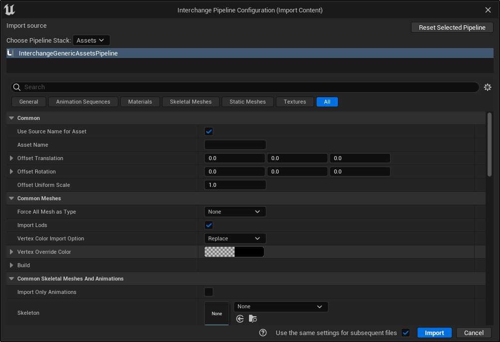

# 交换框架

> 路径：虚幻引擎5.7文档 / 管理内容 / 交换框架

> 原始页面：https://dev.epicgames.com/documentation/unreal-engine/interchange-framework-in-unreal-engine

**交换框架（Interchange Framework）** 是虚幻引擎的导入和导出框架。它与文件格式无关，异步，可自定义，可在运行时使用。

交换使用可扩展的代码库，并提供可自定义的管线堆栈。这样你就可以根据项目的需求自由地使用蓝图或Python编辑导入管线。

- [使用交换导入资产](importing-assets-using-interchange/index.md) - 交换框架及其如何用于自定义导入过程的概述。

- [交换开发指南](interchange-development-guides/index.md) - 关于使用交换导入内容的最佳实践和参考指南。
