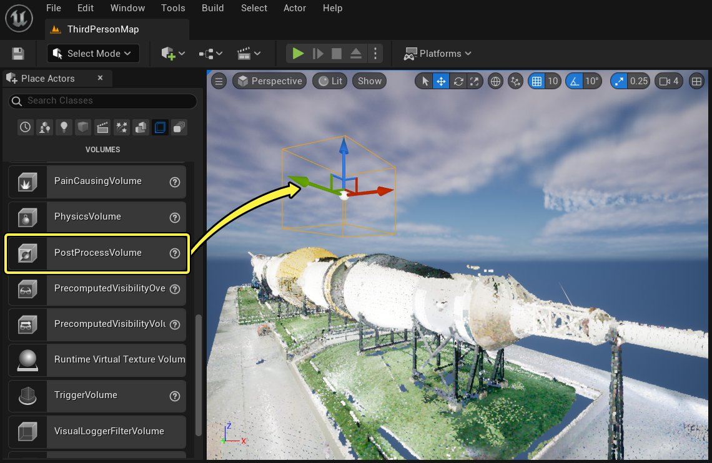
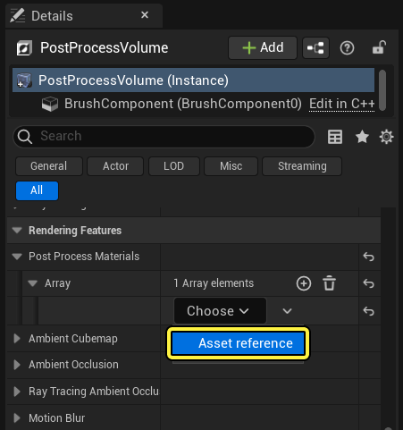
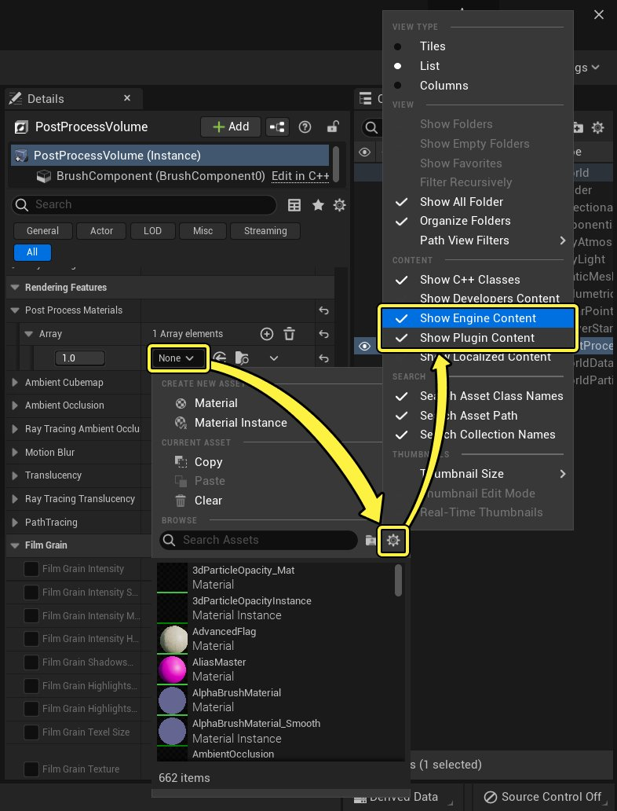
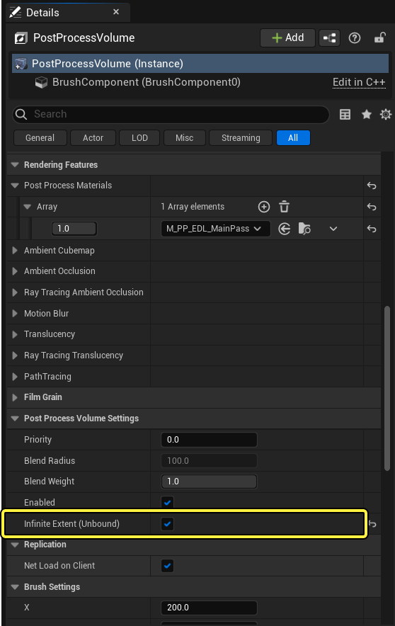
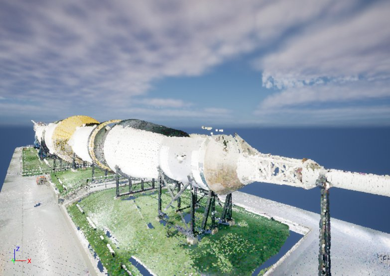
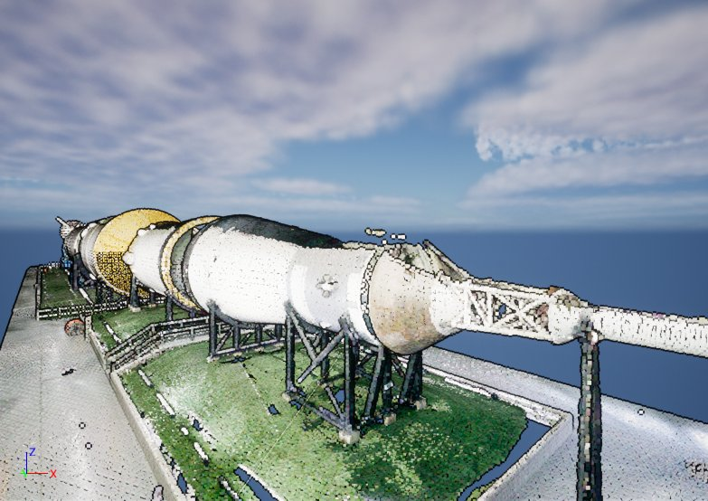

# 启用Eye-Dome光照模式

> 路径：虚幻引擎5.7文档 / 管理内容 / LiDAR点云插件 / 启用Eye-Dome光照模式

> 原始页面：https://dev.epicgames.com/documentation/unreal-engine/eye-dome-lighting-mode-for-point-clouds-in-unreal-engine

**Eye-Dome光照（EDL）** 是一种光照模型，可将紧密相连的对象分组、为轮廓着色并增强深度感，从而突出点云中对象的形状。EDL用作后期处理材质，需要后期处理体积才能使用。无需使用引擎光源，可与无光照渲染方法配合使用。

> [!NOTE]
> EDL可配合环境光遮蔽使用，但生成的图像可能色调过于偏暗。

## 步骤

1. 在你的关卡中添加一个后处理体积。在 **放置Actor** 面板中搜索 **后处理体积**，将其拖入关卡。

   

   点击查看大图
2. 选中后处理体积，在其 **细节** 面板中，滚动到 **渲染功能** 类别。
3. 展开 **后处理材质**，点击 **添加（+）** 图标，在数组中添加一个新材质。
4. 在新材质的下拉菜单中，选择 **资产引用（Asset reference）**。

   

   点击查看大图
5. 点击 **无（None）** 下拉菜单。然后启用 **引擎内容（Engine Content）** 和 **插件内容（Plugin Content）** 使其可见。

   

   点击查看大图
6. 再次点击 **无** 下拉菜单。然后，在以下两个选项中选择一个：

   - M_PP_EDL_MainPass

     - 将EDL应用到关卡中的所有对象，而不仅仅是点云。如果你只显示点云元素，推荐采用此选项。
   - M_PP_EDL_CustomPass

     - 只对使用

     自定义深度通道（Custom Depth Pass）

     的对象应用EDL。如果你想选择性地应用EDL，推荐此选项。

   > [!NOTE]
   > 启用自定义深度传递将增加性能成本。
7. 如需将EDL应用于整个关卡，请在后处理体积上启用 **无限范围（Unbound）** 选项。

   

   点击查看大图

## 结果

EDL已应用到该关卡。请注意观察关卡中对象边缘的变化，以及此操作对深度感的增强。

应用EDL前

应用EDL后
