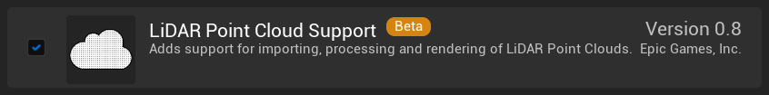
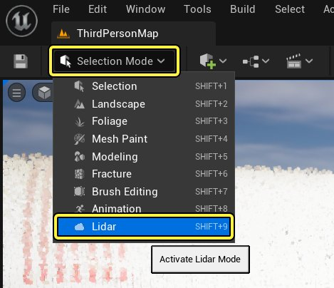
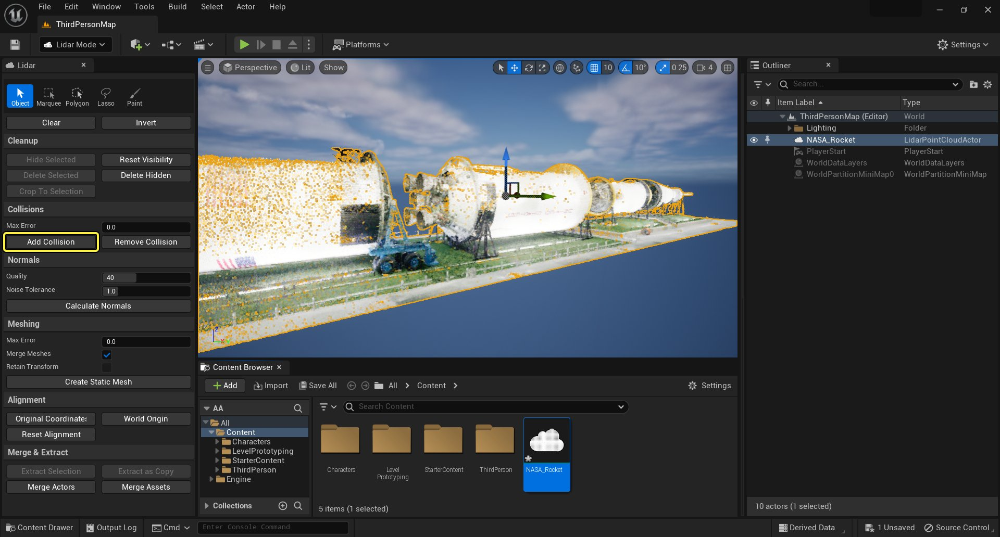
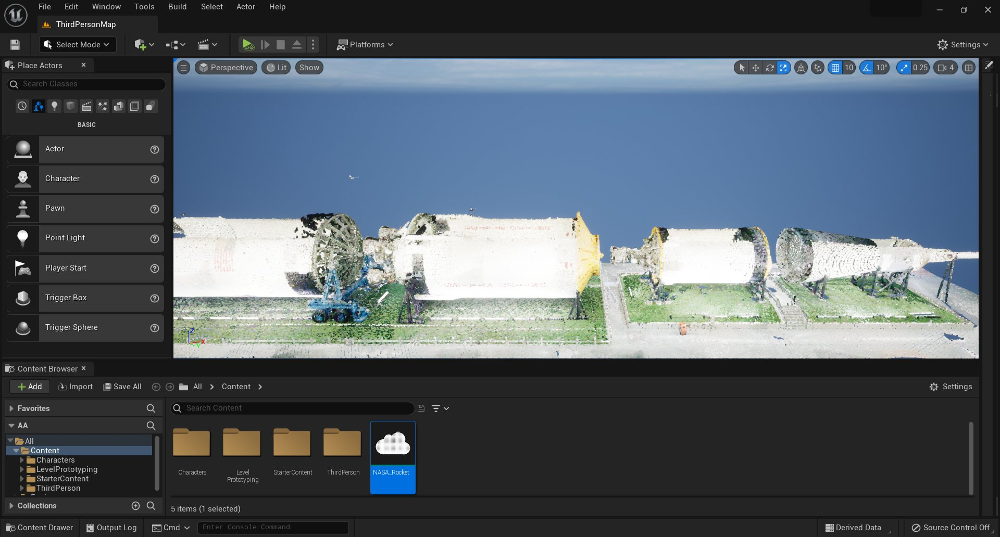
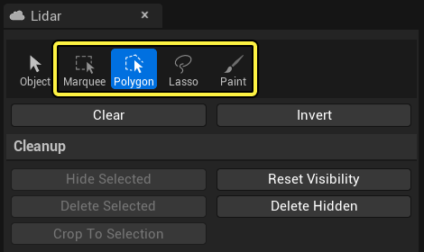
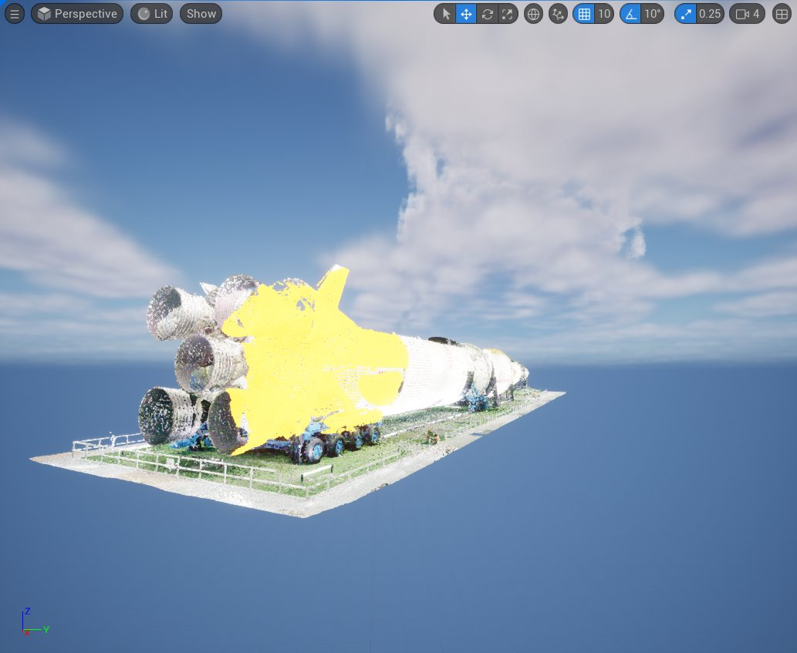

# LiDAR点云插件快速入门指南

> 路径：虚幻引擎5.7文档 / 管理内容 / LiDAR点云插件 / LiDAR点云插件快速入门指南

> 原始页面：https://dev.epicgames.com/documentation/unreal-engine/lidar-point-cloud-plugin-quick-start-guide-in-unreal-engine

本快速入门指南涵盖以下步骤：

1. 启用LiDAR点云插件。
2. 导入点云并将其放置到场景中。
3. 为点云构建碰撞，以便可以对其进行实时探索。
4. 编辑点云。

## 1. 启用插件

LiDAR点云插件随虚幻引擎一起提供，但必须先为项目启用该插件，然后才能使用它。

1. 打开 **插件（Plugins）** 窗口（主菜单：**编辑（Edit）> 插件（Plugins）**）。
2. 在 **插件（Plugins）** 窗口中，搜索 **LiDAR点云支持（LiDAR Point Cloud Support）** 插件，然后单击 **已启用（Enabled）** 选项。

   
3. 保存项目并重新启动虚幻引擎。

## 2. 导入点云

1. 新建项目。使用一个包含角色控制器的模板，例如[第三人称模板（Third Person Template）](https://dev.epicgames.com/documentation/404)。
2. 选择要导入的点云文件，并将其拖到 **内容浏览器（Content Browser）** 中。
3. 将点云从 **内容浏览器（Content Browser）** 拖到 **视口（Viewport）** 中。此时将自动创建 **LidarPointCloudActor** 的一个实例并将你指定的云指定给它。

## 3. 构建并测试碰撞

为了能够像任何其他关卡一样移动导入的点云扫描，需要先为其构建并启用碰撞。

1. 在 **主工具栏** 中，点击 **模式（Modes）** 按钮，选择 **Lidar模式（Lidar Mode）**。

   

   点击查看大图
2. 选择 **添加碰撞（Add Collision）**。

   

   点击查案大图
3. 单击 **保存（Save）** 以保存更改。
4. 返回主编辑器窗口，从 **放置Actor（Place Actors）** 面板中，搜索 **玩家出生点（Player Start）** 组件，然后将其拖到关卡中。将其置于地面上方。
5. 单击 **运行（Play）** 以启动 **在编辑器中运行（Play in Editor）** 模式，然后移动导入的扫描。

   

   点击查看大图

## 4. 编辑点云

接下来，你将对点云进行一些简单的编辑。可以使用一系列工具选择并编辑单个点和点组。

1. 要编辑点，必须先选择它们，然后从三种可用的选择方法中选择其一：

   - 框形选择（Box Selection）
   - 多边形选择（Polygonal Selection）
   - 套索选择（Lasso Selection）
   - 绘制选择（Paint Selection）

   

   点击查看大图

   选择的点将突出显示。按键盘上的 **Esc** 键可清除所进行的选择。

   

   点击查看大图
2. 可以 **隐藏（Hide）**、**删除（Delete）** 或 **裁剪（Crop）** 选择的点。

> [!NOTE]
> 编辑点云后，必须重建其碰撞。

## 独立操作!

探索LiDAR点云插件提供的其他一些功能：

- 启用[Eye-Dome Lighting](../eye-dome-lighting-mode-for-point-clouds/index.md)以增强深度感知。
- 参阅[LiDAR点云插件参考](../lidar-point-cloud-plugin-reference/index.md)以了解所有可用的选项。
