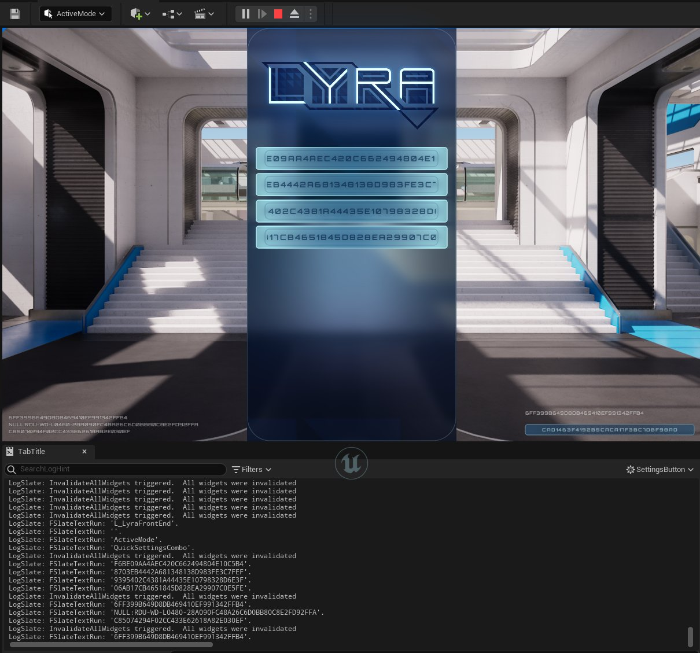

# 本地化键调试

> 路径：虚幻引擎5.7文档 / 管理内容 / 本地化 / 本地化键调试

> 原始页面：https://dev.epicgames.com/documentation/unreal-engine/debugging-localization-keys-in-unreal-engine

**本地化键调试文化（localization key debug culture）** 是一种特殊的[本地化文化](../managing-the-active-culture-at-runtime/index.md)，可帮助你调试本地化的文本。如果你将应用程序的文化设置为 `keys` 的值，则你的UI中本地化的文本都将显示其本地化键，而不是显示文本。这既包括使用[字符串表](../using-string-tables-for-text/index.md)本地化的文本，也包括在C++中通过 `LOCTEXT` 宏本地化的文本。 确定可能存在问题的本地化文本由此变得简单，尤其是对于复杂UI，因为你可以直接在所显示文本的上下文中观察键，并将它们与表进行快速匹配。

如需使用本地化键调试文化，请执行以下步骤：

1. 执行以下操作之一：

- 运行你的应用程序的 **开发** 或 **调试** 版本。更多详情请参阅[打包]小节。
- 使用 **在编辑器中运行（Play In Editor）** ，在 **虚幻编辑器** 中运行你的应用程序。

> [!TIP]
> 在虚幻编辑器的控制台中更改本地化文化，将会更改编辑器文本以及预览中的文本所使用的语言。我们建议使用开发或调试版本，而不是使用虚幻编辑器，以保持环境整洁并避免混淆。

1. 点击波浪号（ **~** ）键以调出 **控制台** 。
2. 键入以下命令并按Enter键：

   ```
        -culture=keys
   ```

你输入此命令后，你的UI中本地化的文本都将显示其键，而不是正常文本。



激活了Keys调试文化的Lyra主菜单示例。Slate.LogPaintedText 设置为true，因此日志在预览中显示所绘制文本的完整本地化键。

### 显示完整本地化键

你可以将 `Slate.LogPaintedText` 设置为1或 `true` ，以将当前在屏幕上绘制的文本记录在日志中。这样就可以看到完整的本地化键，而不会出现UI裁剪问题。
