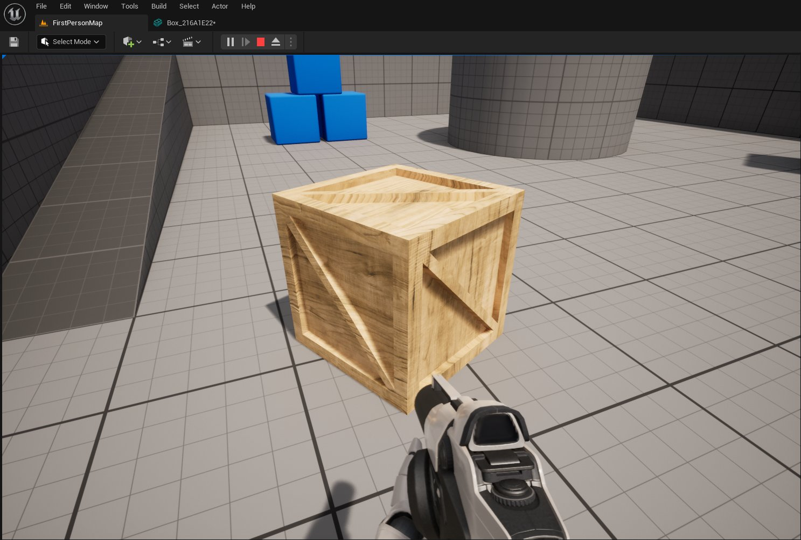
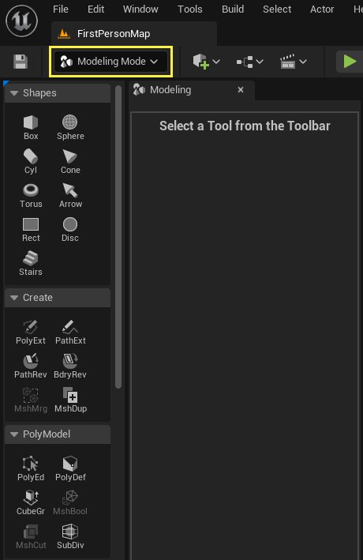
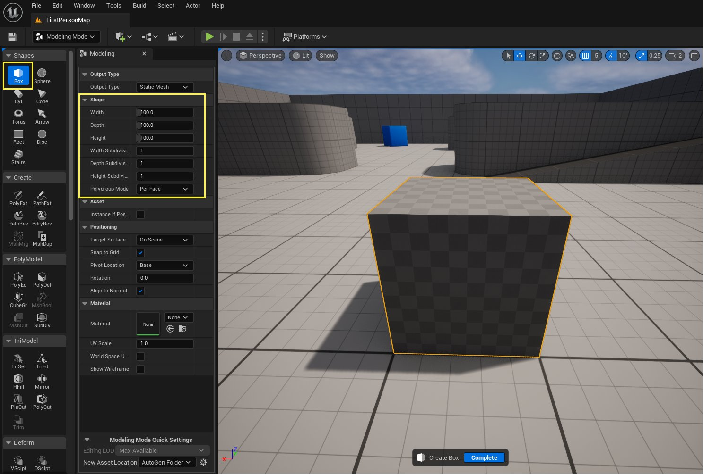
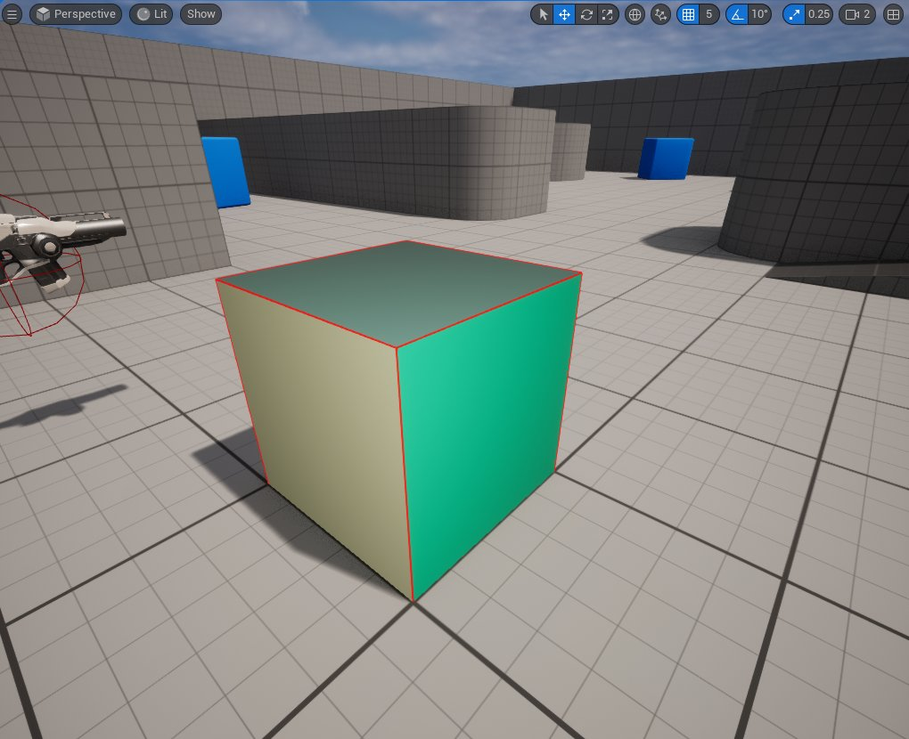
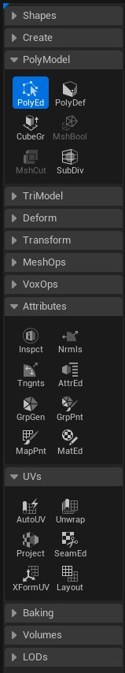
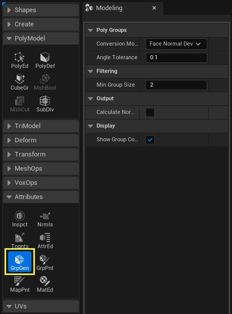
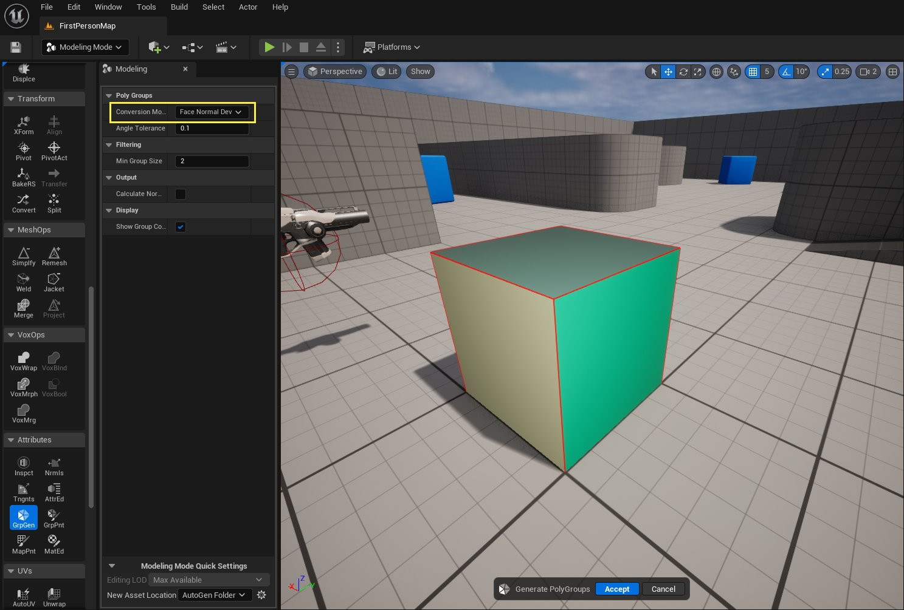
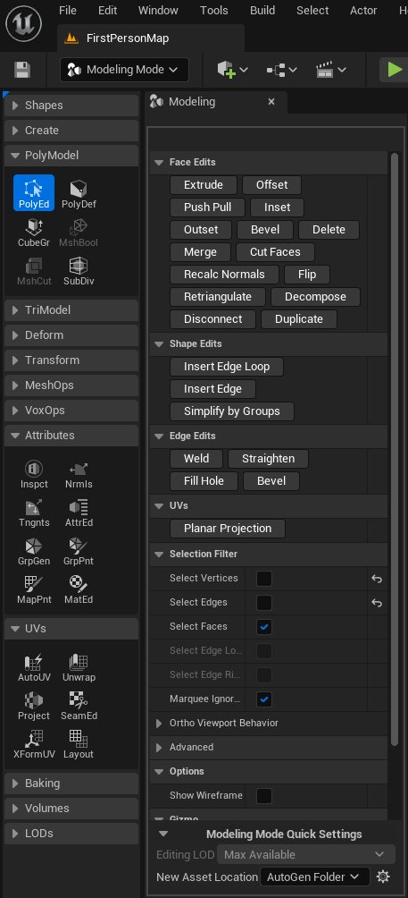

# 建模模式快速入门

> 路径：虚幻引擎5.7文档 / 管理内容 / 建模和几何体脚本编写 / 建模模式入门指南 / 建模模式快速入门

> 原始页面：https://dev.epicgames.com/documentation/unreal-engine/modeling-mode-quick-start-in-unreal-engine

虚幻引擎中的 **建模模式（Modeling Mode）** 可用于创建网格体、制作新关卡的几何体原型，以及编辑现有静态网格体资产。所有这些都可以在编辑器中完成。

在此快速入门中，你将使用建模模式创建这个松木箱。

本快速入门指南将引导你使用建模模式下的多种工具创建一个木箱。首先，创建一个新的图元形状，并使用多个 **PolyEdit** 工具添加细节。接下来，使用[UV](../../modeling-tools/uvs-category/index.md)工具为你的模型做好纹理准备。最后，添加 **材质（Material）** 并将其放入带有完整碰撞和物理模拟的 **关卡（Level）** 中。

### 必读主题

在开始本快速入门指南之前，我们建议你熟悉建模模式以及[虚幻引擎如何处理3D模型](../../../static-meshes/index.md)。

尽管建模模式中的许多工具与其他建模软件中的对应工具类似，但在建模模式编辑器如何构建网格体编辑方面存在着一些重要区别，因此你应该在开始使用之前了解这些区别。

有关更多信息，请参阅[建模模式概述](../modeling-mode/index.md)。

## 1 - 创建一个盒体图元

在开始之前，请先基于第一人称游戏（First Person Game）模板来新建项目。有关在虚幻引擎中创建新项目的更多信息，请参阅[创建新项目](../../../../understanding-the-basics/working-with-projects-and-templates/creating-a-new-project/index.md)。

1. 点击 **选择模式（Select Mode）** 下拉菜单并选择 **建模（Modeling）** ，打开 **建模模式（Modeling Mode）** 。这将打开 **模式工具栏（Mode Toolbar）** 和 **建模（Modeling）** 面板。

   

   使用"模式（Modes）"下拉菜单打开"建模模式（Modeling Mode）"。
2. 在 **模式工具栏（Mode Toolbar）** 顶部的 **形状（Shapes）** 类别中，点击 **盒体（Box）** 并将 **建模（Modeling）** 面板中的设置调整为所需大小。对于本指南，使用默认设置即可。这将创建100厘米的盒体，大约为默认角色高度的一半。

   

   使用"盒体（Box）"工具创建具有默认设置的盒体图元。
3. 在 **视口（Viewport）** 中单击以创建盒体，然后单击屏幕底部的 **完成（Complete）** 或按 **Enter** 。

## 2 - 创建外框

要将图元形状转换为详细的3D模型，首先要定义其 **多边形组（PolyGroups）** 。

定义了六个多边形组的盒体图元。

> [!TIP]
> 将 **Mode Toolbar** 中未使用的分段折叠起来会很方便。
>
> 

1. 在视口中选择盒体。在 **Mode Toolbar** 中，找到 **属性（Attributes）** 分段，然后单击 **GrpGen** 。这将为盒体生成多边形组。

   

   在"建模工具控制板（Modeling Tools Palette）"中选择GrpGen工具。
2. 默认 **转换模式（Conversion Mode）** 和设置对于本快速入门来说已经足够，因此，直接单击视口底部的 **接受（Accept）** 按钮或按 **Enter** 。

   

   使用默认设置创建多边形组。
3. 在 **模式工具栏（Mode Toolbar）** 中，找到 **PolyModel** 工具分段并点击 **PolyEd** 。这将打开 **建模（Modeling）** 面板中的 **PolyEdit** 工具。

   

   点击 PolyEd 以查看 建模（Modeling） 面板中的工具参数。
4. 在 **视口（Viewport）** 中选择其中一个面，然后单击 **插入（Inset）** 。在视口中移动鼠标，直到该面插入到下图所示的程度。

   > 图片已省略：Inset the face to create the outer frame

   插入选定的面以创建木箱的外框。

   再次单击鼠标以插入该面。
5. 选择刚创建的内面，然后单击 **挤压（Extrude）** 。向内挤压该面以创建木箱的外框。

   > 图片已省略：Extrude the inner face inward to finish creating the outer frame

   向内挤压内面以完成外框的创建。该面被挤压了5厘米。

   > [!TIP]
   > 如果在视口中启用了网格对齐功能，则面挤压距离等于在"视口（Viewport）"中设置的 **位置网格对齐（Position Grid Snap）** 值。调整此设置可以让你在编辑过程中获得更多控制权。
6. 对木箱的每一面重复此过程。不要忘记底面。

## 3 - 添加更多细节

接下来，我们在木箱的外框上添加一根斜拉条。

1. 在 **PolyEd** 工具中，选择刚刚挤压的内面，然后单击 **分解（Decompose）** 按钮。此操作会将面拆分为三角形组件，并创建一条从一个角到另一个角的边。

   > 图片已省略：Decompose the inner face of the crate

   在内面上使用"分解（Decompose）"工具将面分成两个三角形。
2. 选择刚创建的新边。然后，按住 **Shift** 并选择其他与新边相连的角边，如下图所示。

   > 图片已省略：Select the new edge and the two connected corner edges and Bevel

   选择新边和两条连接的角边。对这些边进行斜切以创建一个将用于斜拉条的新面。

   选择边后，导航到 **边编辑（Edge Edits）** 分段，然后单击 **斜切（Bevel）** 。保留默认设置，然后单击菜单顶部的 **应用（Apply）** 按钮。此操作将分割边并创建一个新面。

   > [!TIP]
   > 为了更轻松地选择各边，可在"Tools Details（工具细节）"面板的"选择过滤器（Selection Filter）"分段中禁用"选择顶点（Select Vertices）"和"选择面（Select Faces）"。
3. 选择新面并向外挤压，直到与外框齐平。

   > 图片已省略：Extrude the new face to create the cross brace

   挤压新面，直至其与外框齐平以创建斜拉条。
4. 此时将创建两个内面，一个位于挤压出的斜拉条的末端，一个位于内角。请将摄像机视图移到木箱内并选择这些内面，如下所示。

   > 图片已省略：Move the camera inside the crate and select the inner face at the end of the cross brace

   将相机移动到木箱内，然后选择斜拉条末端的内面。

   > 图片已省略：Move the camera down and to the left to select the inner face in the corner

   向下和向左移动摄像机以选择内角的内面。

   单击"删除（Delete）"或按Delete键以删除面。
5. **焊接（Weld）** 工具可在最后一条选定边的位置接合两条边。选择如下所示的两条边。

   > 图片已省略：Move the camera back outside the crate to select the two edges where the cross beam meets the corner

   将摄像机重新移到木箱外，选择斜拉条与内角相交处的两条边。

   单击 **焊接（Weld）** 。
6. 对内框的另一端重复此过程。
7. 对木箱的每一面重复此过程。

## 4 - 展开UV

要正确显示木材纹理，需要对木箱进行UV展开操作。

1. 由于已经对原始盒体形状进行了重大更改，因此请单击 **GrpGen** ，为木箱生成新的多边形组。将 **最小组大小（Min Group Size）** 更改为 `3` 以生成六个新的多边形组（每面一个），类似于下图。

   > 图片已省略：Generate six new PolyGroups

   使用GrpGen工具生成六个新的多边形组。

   单击 **接受（Accept）** 或按 **Enter** 继续。
2. 接下来，转到菜单的 **UV** 分段并选择 **展开（Unwrap）** 工具。在 **Modeling** 面板的顶部，打开 **岛状区生成（Island Generation）** 下拉菜单并选择 **多边形组（PolyGroups）** 。

   > 图片已省略：Use the Unwrap tool to create a UV map

   使用"展开（Unwrap）"工具为木箱创建UV贴图。
3. 将 **纹理分辨率（Texture Resolution）** 的值更改为2048。这会更改UV岛状区之间的偏移，以确保它们之间有足够的像素。

   > 图片已省略：Change the Texture Resolution to 2048

   将"纹理分辨率（Texture Resolution）"更改为2048以在UV岛状区之间生成足够的空间。
4. 要查看生成的UV贴图，请单击菜单的 **预览UV布局（Preview UV Layout）** 分段中的 **已启用（Enabled）** 选项复选框。你的UV贴图将类似于下图。单击 **接受（Accept）** 或按 **Enter** 以完成UV贴图。

   > 图片已省略：Enable the UV map preview window

   启用UV贴图预览窗口。
5. 最后，通过向木箱添加木质材质来检查生成的UV贴图的质量。在 **细节（Details）** 面板中，打开 **材质（Materials）** 分段，然后单击 **元素0（Element 0）** 的下拉菜单。搜索 **M_Wood_Pine** 材质，然后将该材质应用于木箱。

   > 图片已省略：Add the M_Wood_Pine Material in the Details panel

   在"细节（Details）"面板中添加M_Wood_Pine材质。

## 5 - 将木箱放入关卡中

在 **静态网格体编辑器（Static Mesh Editor）** 中添加 **简化盒体碰撞（Simplified Box Collision）** 并启用 **物理系统模拟（Physics Simulation）** ，使木箱可在关卡中使用。

1. 在 **内容浏览器（Content Browser）** 中找到木箱资产，然后在 **静态网格体编辑器（Static Mesh Editor）** 中打开该资产。要进行此操作，可以导航到 `FirstPerson/Maps/_GENERATED/User` 文件夹，然后双击你的盒体资产。

   > 图片已省略：Return to Select mode and open the crate in the Static Mesh Editor

   返回选择模式并在"静态网格体编辑器（Static Mesh Editor）"中打开木箱。

   > [!NOTE]
   > 你会注意到"静态网格体编辑器（Static Mesh Editor）"中的木箱版本没有应用M_Wood_Pine材质。如果通过"细节（Details）"面板将材质添加到静态网格体，则只会将材质应用于静态网格体的这个特定实例。在"静态网格体编辑器（Static Mesh Editor）"中应用松木材质则会将其应用到木箱的所有未来实例。
2. 单击 **碰撞（Collision）** 菜单，然后选择 **添加盒体简化碰撞（Add Box Simplified Collision）** 以向木箱添加基本碰撞盒体。

   > 图片已省略：Add a collision box to the crate using the Add Box Simplified Collision option

   打开"碰撞（Collision）"菜单并选择"添加盒体简化碰撞（Add Box Simplified Collision）"。
3. 在 **细节（Details）** 面板中找到 **碰撞复杂度（Collision Complexity）** 分段。打开下拉菜单并选择 **项目默认值（Project Default）** 。

   > 图片已省略：Change the Collision Complexity property to Project Default

   在"静态网格体编辑器（Static Mesh Editor）"的"细节（Details）"面板中将"碰撞复杂度（Collision Complexity）"属性更改为"项目默认值（Project Default）"。
4. 回到 **编辑器（Editor）** 窗口，在 **细节（Details）** 面板中启用 **模拟物理系统（Simulate Physics）** 。

   > 图片已省略：Enable Simulate Physics in the Details panel

   在"细节（Details）"面板中启用"模拟物理系统（Simulate Physics）"。

## 结果

在本快速入门课程中，你全程在虚幻编辑器中使用建模模式工具集创建了一个木箱资产。为模型添加了细节，还添加了UV贴图和木质材质。

最后，添加了适当的碰撞设置并启用了物理系统，使木箱成为可用于游戏的资产。

> 图片已省略：The final version of the pine crate inside the level

松木箱在关卡中的最终版本。
