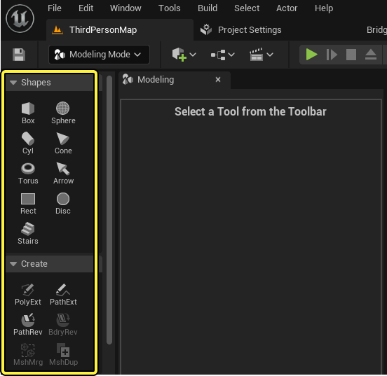
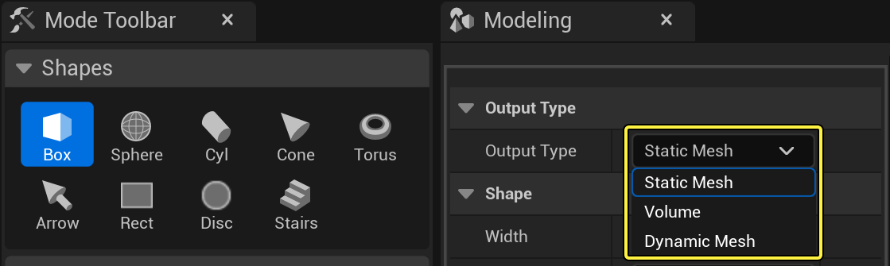
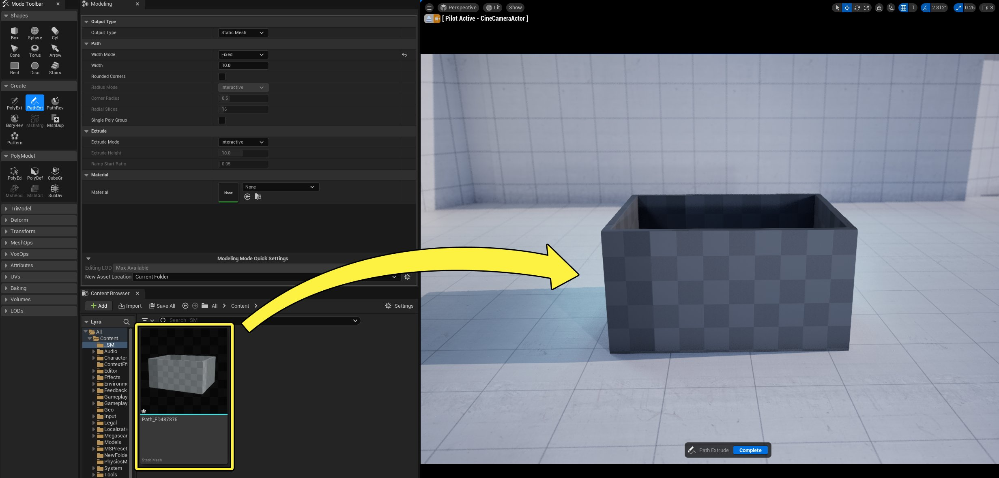
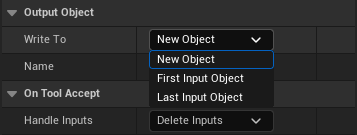
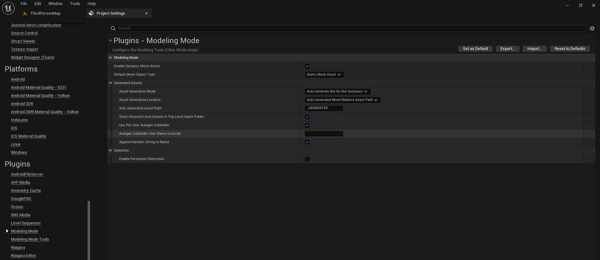
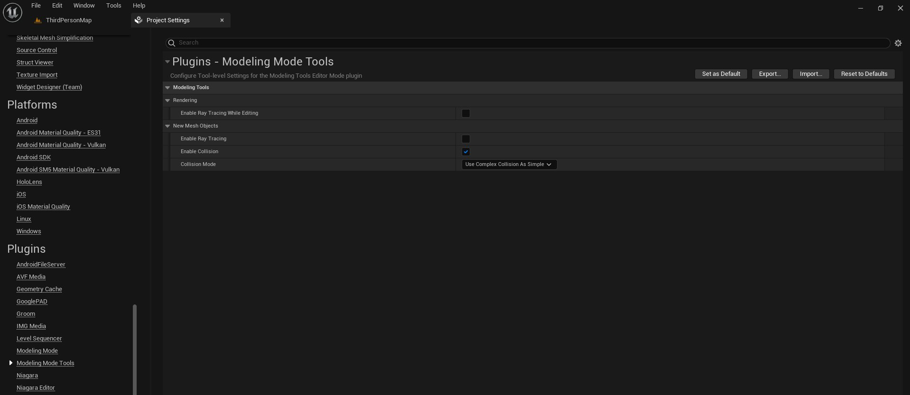
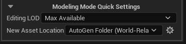

# 建模模式 - 处理资产

> 路径：虚幻引擎5.7文档 / 管理内容 / 建模和几何体脚本编写 / 建模模式入门指南 / 建模模式 - 处理资产

> 原始页面：https://dev.epicgames.com/documentation/unreal-engine/working-with-meshes-in-unreal-engine

**建模模式（Modeling Mode）** 是一种编辑器模式，为你提供在虚幻引擎中直接自行创建和塑造3D网格体资产所需的工具。 尽管建模模式（Modeling Mode）的功能与其他建模软件类似，但在建模编辑器模式创建新资产和处理编辑的方式上存在若干关键区别，在你开始处理之前，应当加以了解。

#### 先决条件和准备工作主题

为了更充分地理解和运用本页面的内容，请阅读[建模模式概述](../modeling-mode/index.md)文档，熟悉一下建模模式（Modeling Mode）。

## 输出类型

你可以使用建模工具（Modeling Tools）控制板中 **形状（Shapes）** 或 **创建（Create）** 类别内提供的工具创建新的网格体资产：

虚幻引擎在创建新资产时使用的是在工具细节（Tools Details）面板中指定的 **输出类型（Output Type）** 。所选工具不支持的输出类型显示为灰色。

### 静态网格体

[静态网格体](../../../../understanding-the-basics/actors-and-geometry/unreal-engine-actors-reference/static-mesh-actors/index.md)是表示3D几何体的一种 **Actor** 类型。选择静态网格体作为类型时，Actor在你的 **内容浏览器（Content Browser）** 中保存为 **资产（Asset）** ，并且会在关卡中放置一个Actor实例。

当你接受新编辑之后，原始静态网格体将更新。这些更新应用于 **视口（Viewport）** 中复制的所有内容，因为它们是同一个网格体的实例。

要正确地创建内容浏览器中单独保存的副本，你可以使用 **MshDup** （网格体复制）工具。在开始建模之前使用此工具克隆你的静态网格体，将确保原始资产完整保留，你可以根据需要仅更改世界中的个别静态网格体。

建模模式会根据[项目设置](#%E5%BB%BA%E6%A8%A1%E6%A8%A1%E5%BC%8F%E9%A1%B9%E7%9B%AE%E8%AE%BE%E7%BD%AE)的建模模式（Modeling Mode）分段中的设置保存新静态网格体。使用位于建模模式快速设置（Modeling Mode Quick Settings）中的[新资产位置](#%E5%BB%BA%E6%A8%A1%E6%A8%A1%E5%BC%8F%E5%BF%AB%E9%80%9F%E8%AE%BE%E7%BD%AE)属性可以快速自定义设置。

### 动态网格体

[动态网格体](../../introduction-to-geometry-scripting/geometry-scripting-users-guide/index.md#dynamicmeshactor)是直观表示静态网格体的Actor；但是，其功能不一样。动态网格体保存在 **关卡（Level）** 而不是内容浏览器中，因为它不是[资产](../../../../understanding-the-basics/assets-and-content-packs/index.md)。

动态网格体可帮助你创建高效的工作流程，节省编辑时间，因为：

- 不需要执行

  编译

  步骤
- 不会创建资产
- 编辑复制内容时，无需更新原始网格体

使用动态网格体时，有一些注意事项需要知道：

- 它在渲染和内存方面效率不高。
- 它不兼容

  Lumen

  或

  Nanite

  。

你可以使用 **转换（Convert）** 工具将动态网格体更改为静态网格体或体积，反之亦然。如果你要在工具操作之后编辑需要很长编译时间的高分辨率网格体，此转换选项很有用。

### 体积

**体积（Volume）** 是一种Actor类型，可用于改变关卡中一些区域的行为。选中之后，标准 **体积类型（Volume Types）** 将可用。

要了解体积类型，请参阅[虚幻引擎中的体积Actor](../../../../understanding-the-basics/actors-and-geometry/unreal-engine-actors-reference/volume-actors/index.md#%E4%BD%93%E7%A7%AF%E7%B1%BB%E5%9E%8B)文档。

使用形状（Shapes）或创建（Create）类别创建新的体积时，网格体的外观类似于静态或动态网格体。选择"接受（Accept）"后，网格体将表示为传统体积（3D轮廓）。

## 预览网格体

在你创建网格体并接受后，即可编辑形状。使用建模模式编辑网格体时，原始网格体将隐藏，并替换为预览网格体（动态网格体Actor）。动态网格体Actor会成为一个容器，用于容纳对网格体所做的更改，直至你点击 **接受（Accept）** 按钮。在你接受更改后，建模模式会应用更改并覆盖现有的目标输出网格体。

工具处于活动状态时，可以切换 **细节（Details）** 面板中的 **渲染（Rendering）** 类别下的 **可见（Visible）** 属性，将原始网格体取消隐藏。接受更改之后，它们会应用于现有的目标输出网格体。预览网格体将被销毁，并且原始网格体Actor会取消隐藏。

### 例外

一些工具允许你选择覆盖现有资产还是直接创建新资产。以下是一些示例：

- 网格体合并（MshMrg）
- 网格体布尔（MshBool）
- 修剪（Trim）
- 合并（Merge）
- Vox封装（Vox Wrap）
- Vox混合（VoxBlnd）
- Vox变形（VoxMrph）

点击查看大图。

这些工具允许你选择使用你的编辑结果创建 **新对象（New 对象）** ，还是覆盖 **第一个输入对象（First Input Object）** 或 **最后一个输入对象（Last Input Object）** 。

还有一些工具可以创建非网格体资产。 **烘焙（Baking）** 工具可创建纹理资产，并将它们与源网格体同位置保存。

## 建模模式项目设置

项目设置（Project Settings）中提供了几个建模模式（Modeling Mode）选项，可以用来配置资产的创建、选择和保存。它们位于 **插件（Plugins） > 建模模式（Modeling Mode）** 和 **插件（Plugins） > 建模模式工具（Modeling Mode Tools）** 分段。

点击查看大图。

| **属性** | **说明** |
| --- | --- |
| **默认网格体对象类型（Default Mesh Object Type）** | 决定建模模式（Modeling Mode）工具的默认网格体对象类型。需要重新启动编辑器才能生效。以下选项可用： **静态网格体资产（Static Mesh Asset）** **体积资产（Volume Asset）** **动态网格体资产（Dynamic Mesh Asset）** |
| **资产生成位置（Asset Generation Location）** | 决定由建模模式（Modeling Mode）工具生成的资产的默认存储位置。以下选项可用： **自动生成的世界相对资产路径（Auto Generated World Relative Asset Path）** ：根据资产的保存关卡将资产存储在自动生成的文件夹中。 **自动生成的全局资产路径（Auto Generated Global Asset Path）** ：将资产存储在位于你的项目 Content 文件夹的自动生成文件夹中。 **当前资产浏览器路径（若有）（Current Asset Browser Path if Available）** ：将资产存储在内容浏览器当前选择的文件夹（若有）中。若无，则将资产保存在自动生成的资产路径中。 |
| **资产生成模式（Asset Generation Mode）** | 决定如何处理由建模模式（Modeling Mode）工具生成的资产。以下选项可用： **自动生成并自动保存（Auto Generate and Autosave）** ：在创建时生成并自动保存新资产。 **自动生成但不自动保存（Auto Generate But Do Not Autosave）** ：生成新资产并标记为已修改。 **交互式保存提示（Interactive Prompt to Save）** ：生成新资产并提示保存。 |
| **资产生成资产路径（Asset Generation Asset Path）** | 定义自动生成的资产的保存位置文件路径。此路径是 **资产生成位置（Asset Generation Location）** 中所定义父路径的相对路径。将此路径留空会禁用该选项。 |
| **将未保存的关卡资产存储在顶层Game文件夹中（Store Unsaved Level Assets in Top Level Game Folder）** | 如果启用，可决定将未保存关卡中自动生成的资产存储在顶层 **Game** 文件夹的相对文件夹中，还是存储在 **Temp** 文件夹中。将存储在 **Temp** 文件夹中的资产移动到永久位置之前，你无法保存它们。 |
| **使用按用户自动生成的子文件夹（Use Per User Autogen Subfolder）** | 如果启用，可决定自动生成的资产是否存储在自动生成的文件夹内的特定用户文件夹中。 |
| **自动生成的子文件夹用户名覆盖（Autogen Subfolder User Name Override）** | 覆盖自动生成的文件夹内每个用户的文件夹所使用的用户名。 |
| **为名称附加随机字符串（Append Random String to Name）** | 为自动生成的资产的名称附加简短的随机字符串。 |
| **启用持久选择（Enable Persistent Selections）** | 如果启用，在切换不同的工具时将保持你所做的选择。这是一项试验性功能，默认处于禁用状态。 |

点击查看大图。

| **属性** | **说明** |
| --- | --- |
| **编辑时启用光线追踪（Enable Ray Tracing While Editing）** | 使用建模模式工具时启用光线追踪。这会影响3D雕刻等具有实时反馈功能的工具的性能。 |
| **启用光线追踪（Enable Ray Tracing）** | 如果支持为可选，对使用建模模式工具创建的新资产启用光线追踪。 |
| **启用碰撞（Enable Collision）** | 为使用建模模式工具创建的新网格体资产启用碰撞。 |
| **碰撞模式（Collision Mode）** | 决定使用建模模式工具创建的新资产的默认碰撞模式。以下选项可用： 项目默认值（Project Default） 简单和复杂（Simple and Complex） 将简单形状用作复杂形状（Use Simple as Complex） 将复杂形状用作简单形状（Use Complex as Simple） 有关这些设置的更多信息，请参阅[简单与复杂碰撞的对比](../../../../gameplay-systems/physics/collision/simple-versus-complex-collision/index.md)。 |

## 建模模式快速设置

**建模模式快速设置（Modeling Mode Quick Settings）** 位于建模工具细节（Modeling Tools Details）面板的底部，包含用于指定编辑时显示的LOD以及新资产保存位置的选项。

点击查看大图。

| **属性** | **说明** |
| --- | --- |
| **编辑LOD（Editing LOD）** | 决定你目前正在编辑的LOD网格体。 |
| **新资产位置（New Asset Location）** | 决定你目前正在创建的新资产将保存在什么位置。这会覆盖该资产的当前项目设置。 |
