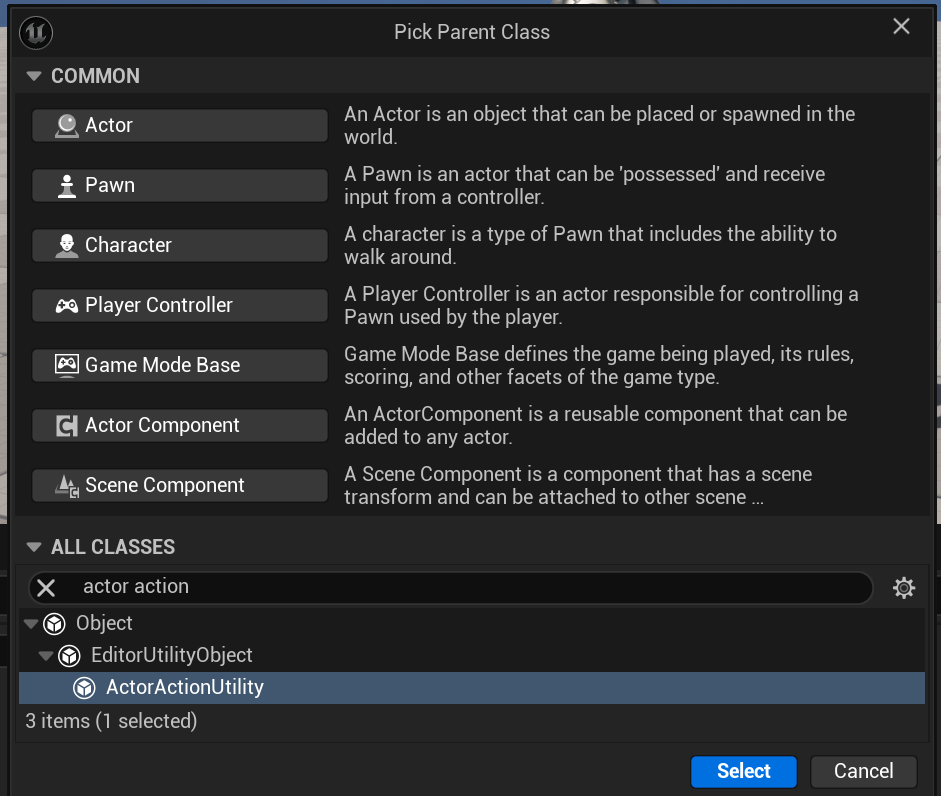
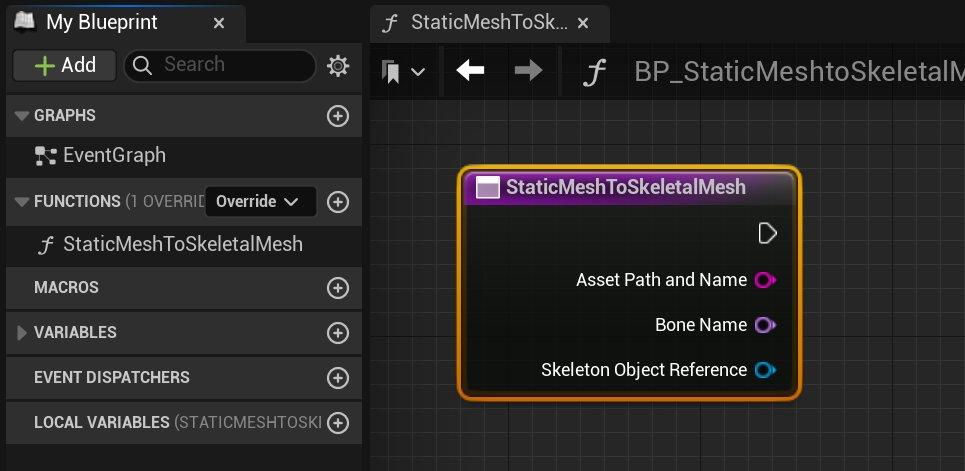
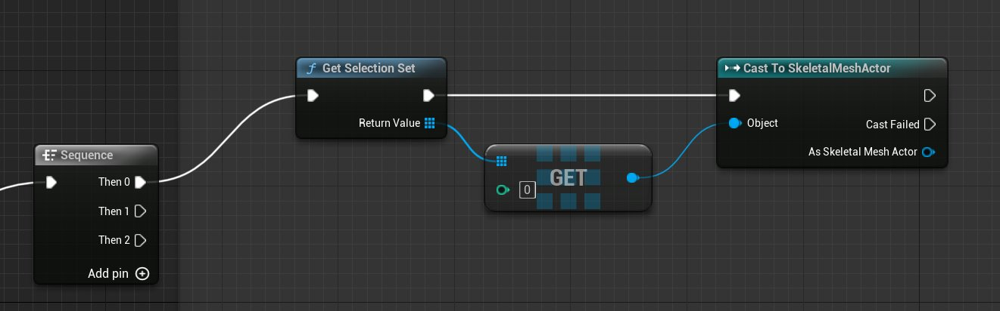
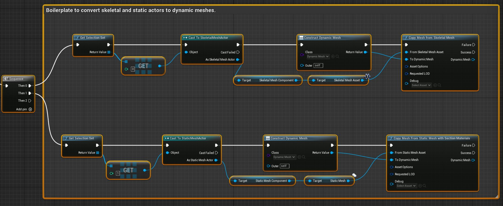
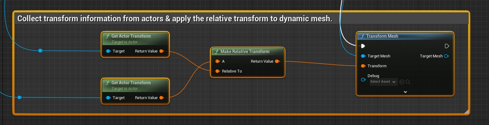
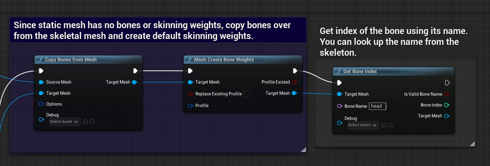
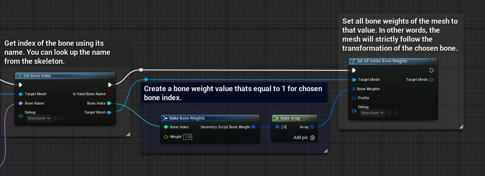
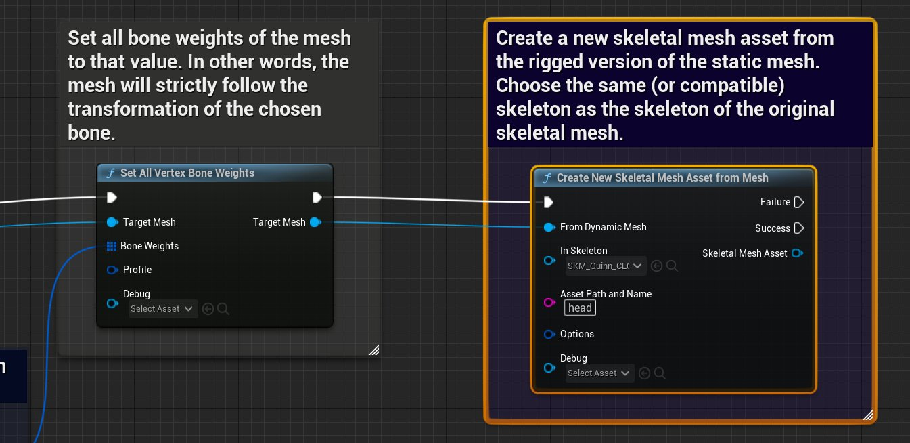

# Convert Mesh Actor to Skeletal Mesh Asset

> 路径：虚幻引擎5.7文档 / 管理内容 / 建模和几何体脚本编写 / 几何体脚本编写简介 / Convert Mesh Actor to Skeletal Mesh Asset

> 原始页面：https://dev.epicgames.com/documentation/unreal-engine/convert-mesh-actor-to-skeletal-mesh-asset-in-unreal-engine

常见动画工作流会将刚性几何体绑定到骨架角色或道具上。使用虚幻引擎中的 geometry scripting 和 action utility，可以创建一个面向美术优化此流程的工作流。

在此工作流中，你将从右键上下文菜单运行工具，基于给定的 static mesh actor 和 skeletal mesh actor 创建新的 skeletal mesh asset。新资产会包含所选 static mesh 的几何体，以及用于绑定的所选 skeletal mesh 的骨架数据。

本指南会展示如何：

- 使用 Geometry Scripting 复制网格体数据并创建新资产。
- 将 static mesh 和 skeletal mesh 转换为 dynamic mesh。
- 将一个网格体的骨骼复制到另一个网格体。
- 将 static mesh 绑定到 skeletal mesh。

### 前提条件

要理解并使用本页内容，必须：

- 启用 **Geometry Script** 插件。要了解更多信息，请参阅 [使用插件](../../../../understanding-the-basics/foundational-knowledge-in/working-with-plugins/index.md).
- 项目中已有 skeletal mesh，或下载 [教程资产](https://dev.epicgames.com/documentation/404) 文件并跟随操作。
- 对以下内容有基础理解： [Blueprints](../../../../blueprints-visual-scripting/introduction-to-blueprints-visual-scripting/index.md), [action utility](../../../../production-pipeline/scripting-and-automating-the-unreal-editor/scripting-the-unreal-editor-using-blueprints/scripted-actions/index.md)，以及 [Geometry Scripting](../geometry-scripting-users-guide/index.md).
- 理解 [skeletal mesh](../../../skeletal-mesh-assets/index.md)以及 [动画编辑器](../../../../animating-characters-and-objects/skeletal-mesh-animation-system/animation-editors/index.md).

> [!TIP]
> 关于将 Geometry Scripting 与 actor action 配合使用的基础指南，请参阅 [使用 Geometry Scripting 创建 Action Utility](../create-action-utilities-with-geometry-scripting/index.md).

## 蓝图与函数设置

首先必须使用正确的 Blueprint 类。由于目标是通过右键菜单选项，从给定 static mesh 和 skeletal mesh 创建新的 skeletal mesh asset，因此请使用 **ActorActionEditorUtility** 类。你将使用它创建一个会出现在上下文菜单中的函数。

要创建 utility 类和函数，请按以下步骤操作：

1. 在**Content Drawer** 中右键点击，然后从上下文菜单选择 **Blueprint Class** 。
2. 搜索并选择 **ActorActionEditorUtility**.

1. 将蓝图命名为 `BP_StaticMeshtoSkeletalMesh_ActorAction`，然后双击该资产将其打开。
2. 在 **My Blueprint** 面板中，点击 **Functions**.
3. 将函数命名为 **StaticMeshToSkeletalMesh**。此名称会显示在上下文菜单中。

1. 要限制该 action 只在选择 static mesh actor 或 skeletal mesh actor 时显示，请点击 **Class Defaults**.

   1. 在

      Details

      面板中，在

      Assets

      分类下点击加号图标，然后搜索并添加这两种 actor 类型。
2. **Compile** （Ctrl + Alt）并 **保存** （Ctrl + S）。

## Dynamic Mesh 转换

脚本第一部分的目的是获取所选 skeletal mesh 和 static mesh，并将它们转换为 dynamic mesh。dynamic mesh 作为临时网格体，可在应用到 static mesh 之前承载要执行的操作。

此过程由两个相似的节点网络组成。随后应用 actor 的变换，以捕获用户应用的任何变换。

> [!NOTE]
> 要查看可用的 Geometry Scripting 函数，请参阅 [Blueprint API Reference](https://dev.epicgames.com/documentation/en-us/unreal-engine/BlueprintAPI/GeometryScript).

### Skeletal Mesh

要将 skeletal mesh actor 转换为 dynamic mesh，请按以下步骤操作：

1. 在 **StaticMeshToSkeletalMesh** 函数中，从执行引脚拖出，然后搜索并选择 **Sequence**。Sequence 节点会依次执行 static mesh 和 skeletal mesh 的两个转换过程。
2. 从 Sequence 节点的 **Then 0** 执行引脚拖出，然后搜索并选择 **Get Selection Set**.
3. 从 **Return Value** 引脚拖出，然后搜索并选择 **Get (a copy)**。选择第一个索引，以获取选择集中的第一项。
4. 从输出引脚拖出，然后搜索并选择 **Cast to SkeletalMeshActor**。将输入执行引脚连接到 **Get Selection Set**.

   
5. 要创建 dynamic mesh，必须访问 actor 的资产。从 **As Skeletal Mesh Actor** 引脚拖出，然后搜索并选择 **Get Skeletal Mesh Component**.
6. 从 **Skeletal Mesh Component** 引脚拖出，然后搜索并选择 **Get Skeletal Mesh Asset**.
7. 从 **Cast to SkeletalMeshActor**拖出执行引脚，然后搜索并选择 **Construct Object from Class**.

   1. 从

      Class

      下拉菜单中搜索并选择

      Dynamic Mesh

      （UDynamicMesh）。
8. 从 **Return Value** 引脚拖出，然后搜索并选择 **Copy Mesh from Skeletal Mesh**。连接执行引脚。
9. 将 **Skeletal Mesh Asset** 输出引脚连接到 **From Skeletal Mesh Asset** 输入。

### Static Mesh

要将 static mesh actor 转换为 dynamic mesh，请按以下步骤操作：

1. 从前文的 **Then 1** 执行引脚开始，重复前述 skeletal mesh 转换步骤。
2. 替换以下节点，并确保将选择索引改为 1，以表示要获取选择集中的第二个元素。

   1. **Cast to SkeletalMeshActor** 替换为 **Cast to StaticMeshActor**.
   2. **Copy Mesh from Skeletal Mesh** 替换为 **Copy Mesh from Static Mesh（含 Section Materials）节点**.
   3. **Skeletal Mesh Component** 替换为 **Static Mesh Component** 和 **Get Skeletal Mesh Asset** 替换为 **Get Static Mesh**.

### 应用相对变换到网格体

接下来，将 actor 的变换应用到目标网格体。skeletal mesh 骨骼的变换是相对于骨架根节点的。这种相对性意味着 static mesh actor 的变换必须与骨架根节点对齐。由于无法预知用户会将 actor 放在哪里，或应用哪些其它变换，因此必须捕获相对变换并将其应用到 dynamic mesh。

> [!NOTE]
> 按当前构建方式， **Then 0** 序列会先运行，然后才运行 **Then 1** 序列。由于此时已经同时拥有 skeletal mesh 和 static mesh，因此要将变换逻辑添加到第二个分支。

要将相对变换应用到 dynamic mesh，请按以下步骤操作：

1. 从 **Copy Mesh from Static Mesh（含 Section Materials）节点**，拖出 **Success** 执行引脚拖出，然后搜索并选择 **Transform Mesh**。Transform Mesh 节点会将提供的变换值应用到 dynamic mesh 的顶点。
2. 将 **Dynamic Mesh** 输出连接到 **Target Mesh** 输入。
3. 从 **Cast to SkeletalMeshActor** 节点，拖出 **As Skeletal Mesh Actor** 引脚拖出，然后搜索并选择 **Get Actor Transform**.
4. 从 **Cast to StaticMeshActor** 节点，拖出 **As Static Mesh Actor** 引脚拖出，然后搜索并选择 **Get Actor Transform**.
5. 从 **Return Value** 引脚拖出，然后搜索并选择 **Make Relative Transform**。此节点会输出 static mesh 相对于 skeletal mesh 的相对变换值。
6. 将 **Return Value** 将 skeletal mesh actor 变换的输出连接到 **Relative To** 输入。
7. 将 **Return Value** 引脚连接到 **Transform** 输入。 **Transform Mesh** node.
8. **Compile** （Ctrl + Alt）并 **保存** （Ctrl + S）。

## 复制骨架数据并添加骨骼权重

Static mesh 没有骨架数据或骨骼权重（skin weight）。这意味着转换得到的 dynamic mesh 也不会包含这些数据。

要添加骨架数据，首先需要从 skeletal mesh 复制骨骼名称和层级信息。随后可以创建骨骼权重属性，并用蒙皮数据填充它。有了骨骼数据后，就可以将 static mesh 转换为 skeletal mesh asset，然后将其绑定到源 skeletal mesh。

下一流程会展示如何将目标 skeletal mesh 绑定到单个骨骼，也就是转移骨架信息并填充蒙皮数据，使所有顶点都只绑定到你选择的骨骼。也可以修改此过程，使用一组 bone weight geometry script 节点将顶点绑定到不同骨骼组合。

要复制骨架数据并填充骨骼权重，请按以下步骤操作：

1. 从 **Transform Mesh** 节点拖出执行引脚，然后搜索并选择 **Copy Bones from Mesh**。此节点会将骨架数据（骨骼名称和层级信息）复制到目标 dynamic mesh。
2. 将 **Target Mesh** 输出连接到 **Target Mesh** 输入。
3. 从 **Copy Mesh from Skeletal Mesh**，连接 **Dynamic Mesh** 输出连接到 **Source Mesh** 输入。
4. 从 **Copy Bones from Mesh** 节点拖出执行引脚，然后搜索并选择 **Mesh Create Bone Weights**。此节点会在目标网格体上创建骨骼权重属性。
5. 使用名称获取目标网格体要绑定到的骨骼索引。从 **Mesh Create Bone Weights** 节点拖出执行引脚，然后搜索并选择 **Get Bone Index**.
6. 在 **Bone Name** 字段中输入“head”，将帽子绑定到头部骨骼。可以使用 [Skeletal Mesh Editor](../../../../animating-characters-and-objects/skeletal-mesh-animation-system/animation-editors/skeleton-editor/index.md).

1. 从 **Bone Index** 输出引脚拖出，然后搜索并选择 **Make Bone Weights** 结构体。将 **Weight** 字段设为 1。
2. 从输出引脚拖出，然后搜索并选择 **Make Array**.
3. 将目标网格体的所有顶点设置为对应的骨骼权重值。从 **Array** 引脚搜索并选择 **Set All Vertex Bone Weights**。此节点会将网格体刚性绑定到所选骨骼；在本例中是头部关节。该绑定意味着新的 skeletal mesh 只会跟随头部关节的变换。
4. 在这些 **Bone Index** 和 **Set All Vertex Bone Weights** 节点之间，连接执行引脚和 Target Mesh 引脚。

## 将 Dynamic Mesh 保存为新的 Skeletal Mesh Asset

使用包含源 static mesh 几何体和源 skeletal mesh 骨架数据的目标网格体，可以将 dynamic mesh 转换为新的 skeletal mesh asset。

1. 从 **Set All Vertex Bone Weights** 节点拖出执行引脚，然后搜索并选择 **Create New Skeletal Mesh Asset（from Mesh）节点**。此节点会将包含骨架数据和骨骼权重的 dynamic mesh 保存为新的 skeletal mesh asset。
2. 在 **在 Skeleton** 字段中，选择你复制骨骼数据时使用的骨架。
3. 将 **From Dynamic Mesh** 输入连接到 **Target Mesh** 输出。
4. 在 **Asset Path and Name** 字段中，设置保存网格体的位置，并在末尾添加新名称。要复制路径，请右键点击目标位置并选择 **Copy Path**.
5. **Compile** （Ctrl + Alt）并 **保存** （Ctrl + S）。

> [!TIP]
> 为了获得更好的用户体验，请将 **Bone Name**, **在 Skeleton**，以及 **Asset Path and Name** 字段转换为 public variable，供美术调整。这样美术无需打开 Blueprint 即可更改变量。

将 **Asset Path and Name** 的默认值设为 `/Game/NewAsset`，以确保已设置文件夹，并帮助用户理解路径语法。

action utility 已完成，可以运行。下方是 utility 函数片段。

## 运行 Action Utility

要运行 action utility，请按以下步骤操作：

1. 将 skeletal mesh 和示例 SM_Hat 网格体（或任何其它 static mesh）放入视口。
2. 将帽子放置到 skeletal mesh 身体的头部位置。

   > [!TIP]
   > 示例帽子网格体是使用引擎内建模工具创建的；要了解更多信息，请参阅 [建模模式概述](../../getting-started-with-modeling-mode/modeling-mode/index.md).
3. 先点击 skeletal mesh，然后 **Shift + 点击** static mesh，以同时选择二者。
4. 右键点击这些 actor 并选择 **Scripted Actor Actions > StaticMeshToSkeletalMesh** （也就是你用于函数的名称）。
5. 填写弹出的提示。

> 图片已省略：UE Static Mesh to Skeletal Mesh Utility

该 utility 会将 static mesh 转换为 skeletal mesh asset，并带有与源 skeletal mesh 相关的骨骼。该资产应出现在你选择的文件夹中。

> 图片已省略：UE New Skeletal Mesh Asset

> [!TIP]
> 转换后，可以使用 [Editing Tools](../../../../animating-characters-and-objects/skeletal-mesh-animation-system/animation-assets-and-features/skeletons/skeleton-editing/index.md) 中的 **Skeletal Mesh Editor**调整新网格体的几何体和骨架数据。也可以使用 Skeleton Editor 测试绑定。

## 下一步

为 actor action utility 扩展一个函数，将 skin weight 转移到服装等动态资产。此外，学习如何将 static mesh 的材质应用到目标网格体。

- [创建用于转移 Skin Weight 的 Action Utility](../create-an-action-utility-for-transferring-skin-weights/index.md)
