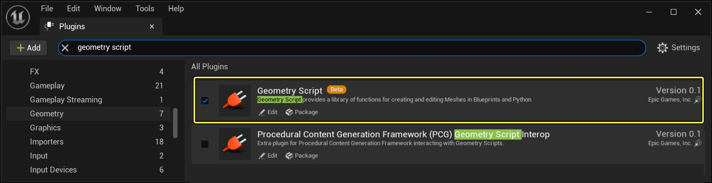
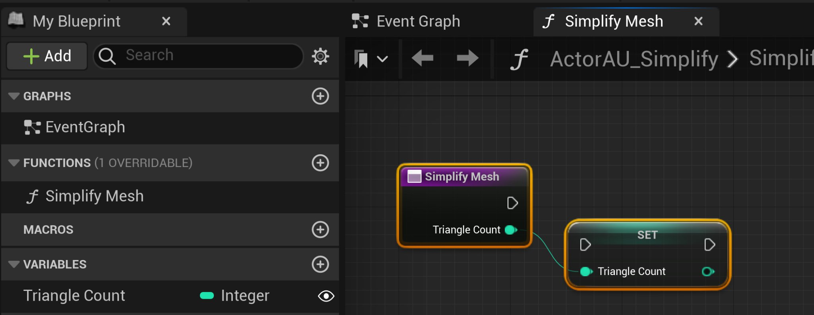
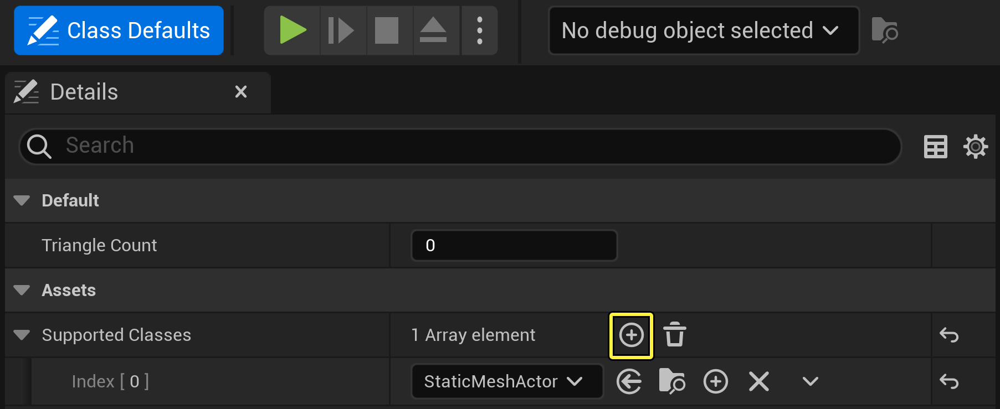
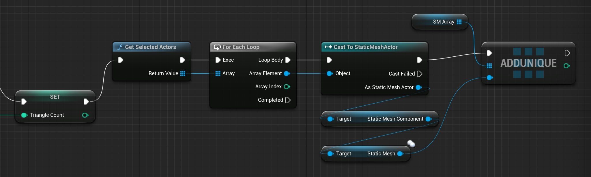
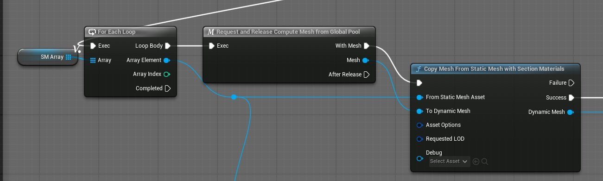
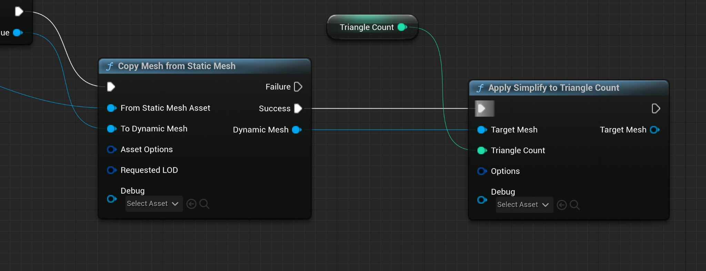
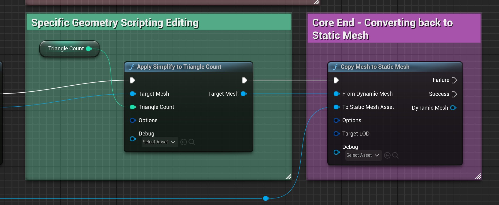

# 利用几何体脚本创建操作工具

> 路径：虚幻引擎5.7文档 / 管理内容 / 建模和几何体脚本编写 / 几何体脚本编写简介 / 利用几何体脚本创建操作工具

> 原始页面：https://dev.epicgames.com/documentation/unreal-engine/create-action-utilities-with-geometry-scripting--in-unreal-engine

当你在关卡中创建或编辑几何体时，你可能需要执行重复性任务。你可以使用操作工具来减少这种类型的重复性任务。你还可以将操作工具与 **几何体脚本（Geometry Scripting）** 结合，创建高效的网格体编辑工作流。你可以创建右键点击操作，进而帮助你快速更改网格体的类型、重新计算UV、调整枢轴点位置等。

本指南介绍了如何：

- 创建脚本化操作工具，帮助处理自动化任务。
- 设置核心几何体脚本节点。
- 利用几何体脚本创建工具，降低网格体中的三角形密度。

虽然本指南专注于简化网格体（减少三角形数量），你可以将脚本用作模板，创建更复杂的工作流。

### 必备知识

要理解并运用本页面上的内容，你必须：

- 基本了解

  蓝图

  。
- 熟悉

  几何体脚本的简介主题

  ，尤其是引入的新对象类型。
- 了解如何使用

  可编写脚本的操作工具

  ，以及如何在上下文中应用。

> [!NOTE]
> 你可以使用任意项目来按照说明操作。要创建用于测试的代理几何体，请使用 **建模模式（Modeling Mode）** 中的一个图元形状。要了解有关此编辑器模式的更多信息，请参阅[建模模式概述](../../getting-started-with-modeling-mode/modeling-mode/index.md)。

## 启用插件

使用几何体脚本需要启用关联的插件。

要启用插件或验证它是否已启用，请执行以下操作：

1. 在

   菜单栏

   中，点击

   编辑（Edit）

   >

   插件（Plugins）

   。
2. 在搜索栏中输入"geometry script"。

   
3. 启用

   几何体脚本（Geometry Script）

   插件，并在弹出对话框中点击

   是（Yes）

   。
4. 重启引擎。

## 创建工具类

首先，你必须创建蓝图类才能构建你的操作工具。在本指南中，使用 **Actor操作工具（Actor Action Utility）** 时，在 **关卡编辑器（Level Editor）** 中右键点击Actor，以执行脚本化操作。你还可以选择 **资产操作工具（Asset Action Utility）** ，在 **内容浏览器（Content Browser）** 中右键点击资产。

要创建工具类，请执行以下操作：

1. 在

   内容浏览器（Content Browser）

   中，点击

   添加（Add）

   或右键点击，然后点击

   编辑器工具（Editor Utilities）

   >

   编辑器工具蓝图（Editor Utility Blueprint）

   。
2. 搜索并点击

   Actor操作工具（Actor Action Utility）

   。
3. 在

   内容浏览器（Content Browser）

   中，为新类指定描述性名称，如

   ActorAU_Simplify

   。

### 创建函数

创建工具类后，下一步是创建函数。脚本的目标是将网格体简化至给定的三角形数量。

要创建函数，请执行以下操作：

1. 在

   蓝图编辑器（Blueprint Editor）

   中，双击打开你的新蓝图。
2. 在

   我的蓝图（My Blueprint）

   面板中，点击

   函数（Functions）

   类别中的加号图标，并将函数命名为

   Simplify Mesh

   。仔细检查

   细节（Details）

   面板，确保已启用

   在编辑器中调用（Call In Editor）

   。
3. 在

   细节（Details）

   细板中，点击

   输入（Inputs）

   类别中的加号

   (+)

   图标，添加参数。
4. 将参数设为整型，并将其命名为

   三角形数量（Triangle Count）

   。激活脚本时，输入参数会触发提示，要求美术师输入用于该简化方法的目标三角形数量。
5. 右键点击参数的输出引脚并点击

   提升为局部变量（Promote to Local Variable）

   ，将

   三角形数量（Triangle Count）

   提升为局部变量。
6. 将变量命名为

   Triangle Count

   。

### 限制到特定的Actor类

如果你编译并保存你的蓝图，然后在 **关卡** 中右键点击Actor，你会在上下文菜单中看到 **脚本化Actor操作（Scripted Actor Actions）** 选项。该脚本适用于所有Actor类，如果脚本不是为多个类设计，可能会引起混淆。要控制美术师可以影响什么Actor，你可以将脚本化操作限制到特定类。

要调整受支持的类，请执行以下操作：

1. 在顶部工具栏中，点击

   类默认值（Class Defaults）

   。
2. 在

   受支持的类（Supported Classes）

   栏中，点击加号

   (+)

   图标。
3. 搜索并点击 **静态网格体Actor（Static Mesh Actor）** 。

   
4. 编译（Compile）

   （Ctrl + Alt）并

   保存（Save）

   （Ctrl + S）。

## 核心几何体脚本设置

使用函数和受支持的类建立脚本后，你可以开始实现几何体脚本节点。

设置脚本的核心步骤是，创建用于编辑的动态网格体。动态网格体可充当临时网格体，你可以先在临时网格体上执行操作，然后将操作应用于静态网格体。此临时流程可避免编辑器中出现不必要的几何体，帮助减轻计算处理负担。

### 动态网格体池

要创建动态网格体，你必须向动态网格体池发起请求。对于资产操作你可以通过以下方法请求一个临时网格体：

- 从 *Create a Dynamic Mesh Pool

  节点创建一个变量，并在几步后用

  Request and Release Compute Mesh** 节点然后调用并返回网格体。
- 使用 *Request and Release from Global Pool** 从池中自动请求并释放一个临时网格体。

对于本示例中，本文的[创建动态网格体](#%E5%88%9B%E5%BB%BA%E5%8A%A8%E6%80%81%E7%BD%91%E6%A0%BC%E4%BD%93) 一节中使用的是Request and Release from Global Pool节点。

### 获取Actor的资产

由于几何体脚本在 `UDynamicMesh` 上运行，所以需要所选Actor的静态网格体资产。此外，每个所选Actor仅可运行一次共享静态网格体资产。虽然此函数基于目标数量执行（避免重复操作），如果所选Actor使用相同的静态网格体资产，则会运行不必要的计算。

要获取唯一的静态网格体资产，请执行以下操作：

1. 拖出

   Triangle Count Set's

   的执行引脚，并创建

   Get Selected Actors

   节点。
2. 拖出

   返回值（Return Value）

   引脚，创建

   For Each Loop

   节点，并连接执行引脚。这些连接节点会遍历所选的Actor。
3. 拖出

   数组元素（Array Element）

   引脚，创建

   Cast to StaticMeshActor

   ，并连接执行（

   循环主体（Loop Body）

   ）引脚。

   转换为静态网格体Actor（Cast to Static Mesh Actor）

   可确保你仅使用静态网格体Actor。
4. 拖出

   作为静态网格体Actor（As Static Mesh Actor）

   引脚并创建

   Get Static Mesh Component

   节点。
5. 拖出组件引脚并创建

   Get Static Mesh

   节点。
6. 拖出静态网格体（Static Mesh）引脚并创建

   Add Unique

   节点。此节点会将每个唯一的静态网格体附加到一个数组中。
7. 将

   Cast to StaticMeshActor's

   执行引脚连接到

   Add Unique

   。
8. 在

   我的蓝图（My Blueprint）

   面板中，在

   局部变量（Local Variables）

   类别点击加号

   (+)

   图标，创建新变量。
9. 将变量命名为

   SM_Array

   。
10. 在

    细节（Details）

    面板中，将变量类型设置为

    静态网格体（Static Mesh）

    ，将容器类型设置为

    数组（Array）

    。
11. 将变量拖到图表中，并点击

    Get SM_Array

    ，使其成为getter。将数组引脚连接到

    Add Unique

    。

有了新的唯一静态网格体资产列表，for循环即完成。

### 创建动态网格体

要转换动态网格体，请执行以下操作：

1. 在

   For Each Loop

   中，拖出

   已完成（Completed）

   执行引脚，然后创建另一

   For Each Loop

   节点。
2. 将

   SM_Array

   变量拖到图表中，并使其成为getter。
3. 将数组输出连接到

   For Each Loop

   节点。
4. 拖出

   Loop Body

   执行引脚并创建

   Request and Release from Global Pool

   节点。此节点从池中提取动态网格体。
5. 获取动态网格体后，你可以转换你的静态网格体。拖出

   Mesh

   引脚，创建

   Copy Mesh from Static Mesh

   节点，并连接执行引脚。
6. 将

   数组元素（Array Element）

   输出引脚连接到

   从静态网格体资产（From Static Mesh Asset）

   输入引脚。

## 几何体编辑

创建动态网格体后，你可以执行所有所需的过程和操作，然后再将其应用到静态网格体。在此脚本中，你仅使用一个节点执行网格体编辑。

1. 从

   从静态网格体复制网格体（Copy Mesh from Static Mesh）

   拖出

   成功（Success）

   执行引脚，并创建

   Apply Simplify to TriangleCount

   节点。

   该简化节点会尝试将三角形数量减少至给定的输入值

   。
2. 将

   动态网格体（Dynamic Mesh）

   输出引脚连接到

   目标网格体（Target Mesh）

   输入引脚。
3. 将

   三角形数量（Triangle Count）

   变量拖到图表中，并使其成为getter。
4. 将变量的输出引脚连接到

   三角形数量（Triangle Count）

   输入引脚。
5. 编译（Compile）

   （Ctrl + Alt）并

   保存（Save）

   （Ctrl + S）。

要了解用于选择和编辑网格体的各种函数的更多信息，请参阅[几何体脚本参考](https://dev.epicgames.com/documentation/404)。

## 转换为静态网格体

编辑完成后，你必须将动态网格体转换回静态网格体，以应用相应的修改。

要转换回静态网格体，请执行以下操作：

1. 拖出

   Apply Simplify to Triangle Count's

   执行引脚，并添加

   Copy Mesh to Static Mesh

   节点。
2. 将

   目标网格体（Target Mesh）

   输出引脚连接到

   自动态网格体（From Dynamic Mesh）

   输入引脚。
3. 将来自

   For Each Loop

   的

   数组元素（Array Element）

   输出引脚连接到

   至静态网格体资产（To Static Mesh Asset）

   输入引脚。你应用到动态网格体的更改转移到所选的静态网格体。
4. 编译（Compile）

   （Ctrl + Alt）并

   保存（Save）

   （Ctrl + S）。

## 最终结果

保存并编译蓝图后，当你在关卡中右键点击静态网格体时，上下文菜单中将显示 **脚本化资产操作（Scripted Asset Actions）** > **简化网格体（Simplify Mesh）** 选项。点击 **简化（Simplify）** ，脚本可减少网格体中的三角形数量，直到达到目标数量。该脚本创建了一个工作流，可将编辑应用到多个资产并快速更新关卡。

## 自行尝试

你可以继续基于此脚本构建或将其用作另一函数的基础。

> [!TIP]
> 你可以将设置和结束节点变成[宏](../../../../blueprints-visual-scripting/blueprint-workflows/making-macros/index.md)，而不用将所有节点复制到新函数中。确保正确重新创建局部变量。

使用所学知识，尝试做出以下调整：

- 使用

  Apply Bend Warp to Mesh

  节点将变形应用到网格体。
- 使用

  Flip Normals

  节点翻转网格体的法线。
- 将脚本转换为

  资产操作工具（Asset Action Utility）

  类。使用

  Get Selected Assets

  节点而非

  Get Selected Actor

  。

要继续学习操作工具相关内容，请参阅Epic开发人员社区门户中的[33个脚本化操作工具](https://dev.epicgames.com/community/learning/tutorials/1x0V/unreal-engine-automate-with-33-scripted-action-utilities)。
