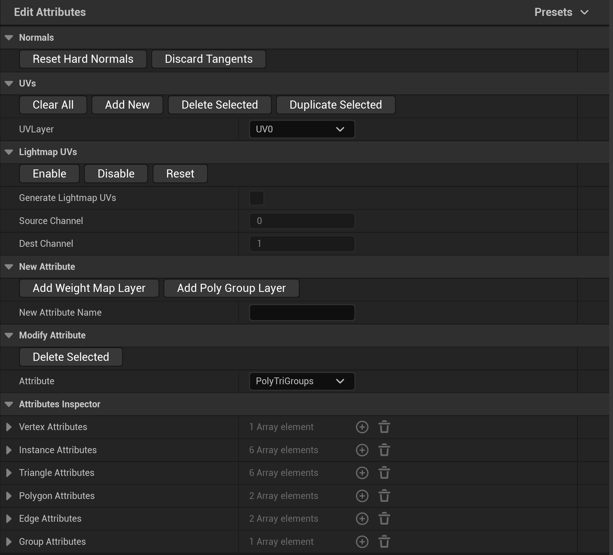

# 编辑属性

> 路径：虚幻引擎5.7文档 / 管理内容 / 建模和几何体脚本编写 / 建模工具 / 编辑属性

> 原始页面：https://dev.epicgames.com/documentation/unreal-engine/edit-attributes-tool-in-unreal-engine

**编辑属性（Edit Attributes）** 工具可创建、编辑并检查网格体的各种属性。属性是网格体表面上定义的信息，通常是在网格体元素级别定义（例如，逐顶点或逐三角形）。你可以编辑以下属性：

- 法线
- 切线
- UV通道
- 光照贴图UV
- 权重地图层
- 多边形组层

你可以使用编辑属性工具来优化、整理和添加细节到网格体。

## 访问工具

你可以通过以下方法访问编辑属性工具：

- 建模模式（Modeling Mode）

  中的

  属性（Attributes）

  类别。如需详细了解建模模式以及访问方法，请参阅

  建模模式概述

  。
- 骨架编辑器（Skeleton Editor）

  中的

  编辑工具（Editing Tools）

  选项卡。更多详情，请参阅

  骨架编辑

  。

## 使用编辑属性

根据你的工作流程，你可以在编辑网格体的拓扑之前和之后使用编辑属性工具。

例如：

- 使用

  动态塑造（Dynamic Sculpt）

  工具之后重置法线。
- 使用

  绘制贴图（Paint Maps）

  工具之前创建权重贴地层。

### 法线

法线分段包含用于删除法线和切线的操作按钮。

> [!NOTE]
> 随时间推移使用各种操作调整网格体可能产生意外的法线和切线。例如，如果你将盒体网格体塑造成圆形，原始面的方向会改变。这一更改可能导致光照不当或网格体局部不渲染。要纠正此效果，你可以重置法线以计算面的新方向。

| **按钮** | **说明** |
| --- | --- |
| **重置硬法线（Reset Hard Normals）** | 删除硬边缘并分拆法线，将所有法线设置为单条平均顶点法线。 |
| **废弃切线（Discard Tangents）** | 从网格体清除切线。 |

### UV

**UV** 分段内中包含创建和删除UV通道的选项。你可以使用UV通道为一个网格体创建不同的UV贴图。如需详细了解UV和相关术语，请参阅[UV类别](../uvs-category/index.md)。

要查看和选择UV通道，请使用 **UVLayer** 下拉菜单。此下拉菜单也称为UV通道。要创建和调整UV通道，请使用下表中的操作按钮。

| **按钮** | **说明** |
| --- | --- |
| **全部清除（Clear All）** | 删除所有UV通道。UV值在新的UV0通道中设置为(0,0)。 |
| **新增（Add New）** | 添加新的UV通道。 |
| **删除选定（Delete Selected）** | 删除选定的UV通道。如果你删除中心的通道，下一个通道将取代它。 |
| **复制选定（Duplicate Selected）** | 复制选定的UV通道。系统将创建新通道并添加到列表末尾。你可以在[UV编辑器](../../uv-editor/index.md)中确认并直观地显示你的通道。 |

### 光照贴图UV

光照贴图（在烘焙光照中用于渲染）将光照信息与网格体上的UV坐标关联。光照贴图UV对UV岛状区的要求比常规纹理更严格。生成光照贴图UV时，（源）UV岛状区会被重新打包以满足光照贴图要求。如需详细了解光照贴图UV，请参阅[了解光照贴图](../../../static-meshes/understanding-lightmapping/index.md)。

**光照贴图UV（Lightmap UVs）** 分段包含一些操作按钮，可用于为静态网格体启用或禁用光照贴图UV的生成。此外，你还可以查看哪个UV通道被设置为了源，哪个存储了重新打包的UV（目标）。

> [!NOTE]
> 只有静态网格体支持光照贴图。动态网格体不会显示该分段。

| **按钮** | **说明** |
| --- | --- |
| **启用（Enable）** | 将 **生成光照贴图UV（Generate Lightmap UVs）** 设置为true。UV基于 **源（Source）** 和 **目标通道（Dest Channel）** 重新打包以创建光照贴图。 |
| **禁用（Disable）** | 将 **生成光照贴图UV（Generate Lightmap UVs）** 设置为false。 |
| **重置（Reset）** | 将 **源通道（Source Channel）** 重置为0，并将 **目标通道（Dest Channel）** 重置为最大UV通道数加1。例如，如果 **UVLayer** 下拉菜单中的最后一个UV通道是UV2，则将 **目标通道（Dest Channel）** 设置为UV3。 |

| **光照贴图UV属性（Lightmap UV Properties）** | **说明** |
| --- | --- |
| **生成光照贴图UV（Generate Lightmap UVs）** | 显示是否在 **静态网格体编辑器（Static Mesh Editor）** 的 **构建设置（Build Settings）** 中启用了光照贴图UV。要更改该值，请使用上面的操作按钮或 **静态网格体编辑器（Static Mesh Editor）** 。 如果 **静态网格体编辑器（Static Mesh Editor）** 在你点击 **启用（Enable）** 并完成工具更改时是打开的，你不会看到编辑器更新。你必须关闭并重新打开编辑器。 |
| **源通道（Source Channel）** | 显示用于计算光照贴图UV的源UV通道。要更改该值，请使用 **静态网格体编辑器（Static Mesh Editor）** 。 |
| **目标通道（Dest (Destination) Channel）** | 显示光照贴图UV存储在哪个通道中。默认情况下，该值为当前通道数加1。你可以使用UV分段添加通道以增加此值，并使用 **静态网格体编辑器（Static Mesh Editor）** 设置特定通道。 |

### 新属性

**新属性（New Attribute）** 分段中的设置可以为选定的网格体创建新属性层。你可以使用属性层标记特定表面区域进行网格体编辑或存储任意数据。

创建新层之前，你必须在 **新属性名称（New Attribute Name）** 字段中设置名称，并点击下面的某个层选项。

| **属性层** | **说明** |
| --- | --- |
| **添加权重地图层（Add Weight Map Layer）** | 使用给定名称添加新的按顶点权重地图层。新层会被创建在在 **属性检查器（Attributes Inspector）** 分段的 **顶点属性（Vertex Attributes）** 字段中。 你可以在各种工具中使用该层，例如： [平滑](../smooth-tool/index.md) [置换](https://dev.epicgames.com/documentation/unreal-engine/displace-tool-in-unreal-engine) [偏移](../offset-tool/index.md) [绘制顶点颜色](https://dev.epicgames.com/documentation/404) [绘制地图](../paint-maps-tool/index.md) |
| **添加多边形组层（Add PolyGroup Layer）** | 使用给定名称添加新的多边形组层。新层会被创建在 **属性检查器（Attributes Inspector）** 分段的 **三角形属性（Triangle Attributes）** 字段中。 你可以在各种工具中使用该层，例如： [绘制多边形组](../index.md#%E5%B1%9E%E6%80%A7) [编辑材质](../index.md#%E5%B1%9E%E6%80%A7) [UV解包](../uvs-category/index.md#%E8%A7%A3%E5%8C%85) [编辑法线](../index.md#%E5%B1%9E%E6%80%A7) 如需详细了解多边形组，请参阅[了解多边形组](../../getting-started-with-modeling-mode/understanding-polygroups/index.md)。 |

### 修改属性

**修改属性（Modify Attribute）** 分段内的选项可以删除属性层。

要删除层，请在 **属性（Attribute）** 下拉菜单中选择相应名称，然后点击 **删除选定（Delete Selected）** 。

### 属性检查器

**属性检查器（Attributes Inspector）** 可充当查看器，用来查看当前附加到网格体的属性。你可以使用该检查器确认你创建或删除的属性层是否恰当地显示，也可以将其作为调试器使用。例如，如果你使用[几何体脚本](../../introduction-to-geometry-scripting/index.md)将临时数据存储在网格体中，但数据未按预期显示，你可以使用检查器确认该层是否已创建并确认其名称。你可以检查以下内容的属性：

- 顶点
- 实例
- 三角形
- 多边形
- 边缘
- 组

要退出工具，请在[工具确认](../../getting-started-with-modeling-mode/modeling-mode/index.md)面板中点击 **完成（Complete）** 。

> [!WARNING]
> 在编辑属性工具中做出的更改会自动应用于网格体。如果你使用 **ESC** 退出工具，在工具使用期间做出的所有更新仍会应用。要删除更改，请点击菜单栏中的 **编辑（Edit）> 撤销历史记录（Undo History）** 或按 **Ctrl + Z** 。

### 热键

| **热键** | **说明** |
| --- | --- |
| **F** | 放大网格体的位置。 |
| **Enter或ESC** | 退出工具。 |
