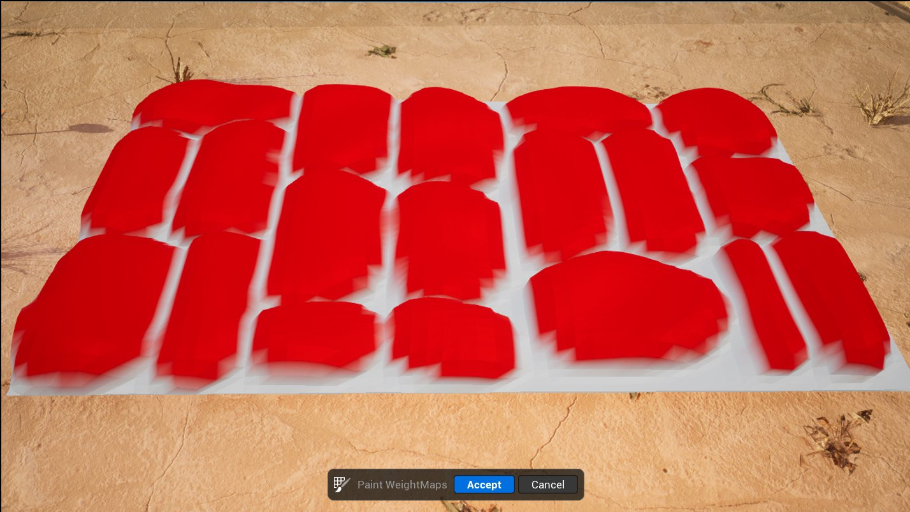

# 偏移

> 路径：虚幻引擎5.7文档 / 管理内容 / 建模和几何体脚本编写 / 建模工具 / 偏移

> 原始页面：https://dev.epicgames.com/documentation/unreal-engine/offset-tool-in-unreal-engine

**偏移（Offset）** 工具可以沿网格体的法线以指定量调整网格体顶点的位置，例如在高度曲面细分的几何体中制作额外的细节，比如鹅卵石图案。

|  |  |
| --- | --- |
| 扁平矩形 | 鹅卵石 |

该工具还能提供以下帮助：

- 增加网格体（例如墙壁）的厚度。
- 增大或缩小固体对象。
- 创建自定义

  体积Actor

  和

  切割Actor产生破裂

  。

## 访问工具

你可以通过以下方法访问偏移工具：

- 建模模式（Modeling Mode）

  中的

  变形（Deform）

  类别。如需详细了解建模模式以及访问方法，请参阅

  建模模式概述

  。
- 骨架编辑器（Skeleton Editor）

  中的

  编辑工具（Editing Tools）

  选项卡。更多详情，请参阅

  骨架编辑

  。

## 使用偏移

偏移具有以下几种操作类型：

- 迭代（Iterative）

  ：进行N次迭代的偏移。
- 隐式（Implicit）

  ：以产生更平滑输出的方式进行偏移，并能更好地保留UV，但在大型网格体上速度可能会很慢

当你偏移网格体时，你可以开关 **创建壳（Create Shell）** 功能来添加增厚的壳，而不仅仅是移动输入顶点。

要在你的网格体上直观地看到效果，你可以切换 **显示线框（Show Wireframe）** 和 **扁平着色（Flat Shading）** ，并在 **渲染（Rending）** 分段中更改材质模式。

工具使用完毕后，在[工具确认](../../getting-started-with-modeling-mode/modeling-mode/index.md#%E5%B7%A5%E5%85%B7-%E6%92%A4%E9%94%80%E5%8E%86%E5%8F%B2%E8%AE%B0%E5%BD%95%E5%92%8C%E6%8E%A5%E5%8F%97%E6%9B%B4%E6%94%B9)面板中接受或取消更改。

| **按键命令** | **操作** |
| --- | --- |
| **F** | 放大网格体的位置。 |
| **ESC** | 取消更改并退出工具。 |
| **Enter** | 接受工具更改。 |
