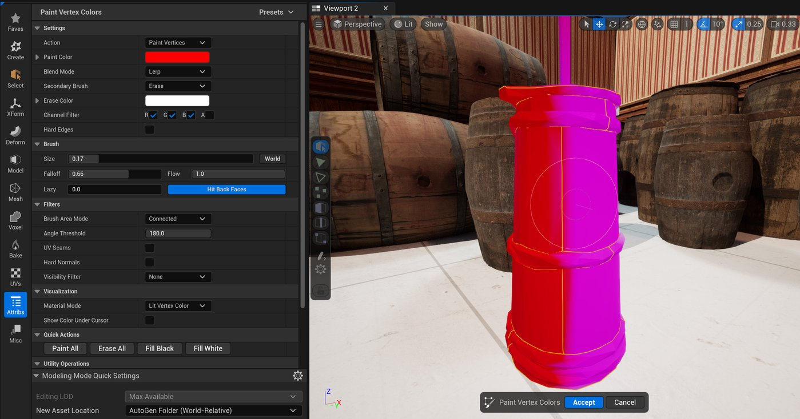

# 绘制顶点颜色

> 路径：绘制顶点颜色

> 原始页面：https://dev.epicgames.com/documentation/unreal-engine/paint-vertex-colors-tool-in-unreal-engine

**绘制顶点颜色（Paint Vertex Colors）**工具可为网格体（包括Nanite网格体）的顶点添加颜色值。 绘制的值存储在R、G、B、A通道中。 你可以将该工具用于许多工作流程，例如：

- 编辑导入的顶点颜色
- （使用**Vertex Color**节点）创建纹理
- 创建遮罩

> [!TIP]
> 要在工具外可视化顶点颜色，请转到**视口**工具栏，点击**显示（Show）> 高级（Advance）> 顶点颜色（Vertex Colors）**。 但是，可视性功能不适用于启用Nanite的网格体。

## 资产和实例顶点颜色

绘制顶点颜色工具类似于**网格体绘制模式（Mesh Paint Mode）**。 但是，该工具仅将顶点颜色添加到静态网格体资产，而不会为静态网格体实例创建唯一顶点颜色。 同一个静态网格体资产的实例共享相同的顶点数据，使绘制顶点颜色工具可用于Nanite几何体。 如需详细了解Nanite及其支持的功能，请参阅[Nanite虚拟几何体](../../../../designing-visuals-rendering-and-graphics/optimizing-and-debugging-projects-for-realtime-rendering/nanite/nanite-virtualized-geometry/index.md)。

要执行实例顶点绘制（顶点颜色存储在关卡中的组件上），请使用**网格体绘制模式（Mesh Paint Mode）**。 如需了解更多信息，请参阅[网格体绘制模式](../../../../building-virtual-worlds/level-editor/level-editor-modes/mesh-paint-mode/index.md)。

| 颜色类型 | 说明 |
| --- | --- |
| **资产顶点颜色（Asset Vertex Colors）** | 存储在资产上的顶点颜色。 同一个资产的所有实例共享相同数据集。 可在Nanite网格体上使用。 |
| **实例顶点颜色（Instance Vertex Colors）** | 为资产的每个实例创建唯一的顶点颜色。 仅可在网格体绘制模式中使用。 不能将其用于启用了Nanite的网格体，因为不支持按组件的顶点颜色。 |

> [!TIP]
> 尽管实例颜色顶点数据不可用，但你可以使用以下操作为资产建立唯一顶点颜色：
>
> - 将数据存储在单独的R、G、B或A通道中
> - 设置[多边形组层](https://dev.epicgames.com/documentation/assets/working-with-content/modeling-and-geometry-scripting/modeling-mode/understanding-polygroups)

## 访问工具

你可以通过以下路径访问**绘制顶点颜色**工具：

- **建模模式（Modeling Mode）******>**变形（Deform）**类别。 如需了解详情，请参阅 [建模模式概述](../../getting-started-with-modeling-mode/modeling-mode/index.md)。
- **骨架编辑器******>**编辑工具（Editing Tools）**> 蒙皮（Skin）****类别。 如需了解详情，请参阅[骨架编辑](../../../../animating-characters-and-objects/skeletal-mesh-animation-system/animation-assets-and-features/skeletons/skeleton-editing/index.md)。

## 使用绘制顶点颜色

你需要使用**操作（Action）**分段中的笔刷选项来绘制顶点颜色。

| 操作 | 说明 |
| --- | --- |
| **绘制顶点（Paint Vertices）** | 使用平滑衰减绘制命中三角形的顶点。 你可以在笔刷分段中调整其他设置，例如笔刷大小和流。 |
| **绘制三角形（Paint Triangles）** | 将所有三个顶点设置为相同颜色，填充绘制的三角形。 你可以在笔刷分段中调整其他设置，例如笔刷大小和流。 |
| **全面填充已连接项（Flood Fill Connected）** | 填充连接到已粉刷三角形的所有三角形。 你可以在笔刷分段中调整其他设置，例如笔刷大小和流。 |
| **全面填充组（Flood Fill Groups）** | 填充连接到已粉刷三角形的所有多边形组。 你可以在笔刷分段中调整其他设置，例如笔刷大小和流。 |
| **多边形套索（Poly Lasso）** | 在视口中绘制的多边形或手绘套索中绘制三角形。 |

**辅助笔刷（Secondary Brush）**为你的**操作（Action）**选择提供了其他操作。

| 辅助笔刷 | 说明 |
| --- | --- |
| **擦除（Erase）** | 绘制由**擦除颜色（Erase Color）**属性所设置的颜色。 默认值为(1, 1, 1, 1)。 |
| **柔化（Soften）** | 在绘制的顶点处混合被分拆的颜色值。 |
| **平滑（Smooth）** | 将顶点颜色与附近顶点颜色混合。 |

如需更好地控制绘制操作，例如以UV接缝为边界以及绘制面向前方的顶点，请使用**筛选器（Filters）**分段。

**绘制颜色（Paint Color）**和**混合模式（Blend Mode）**分段决定了颜色的显示方式。 你还可以用**通道筛选器（Channel Filters）**分段可视化你的颜色，并将值存储在单独的通道中。

该工具由**快速操作（Quick Actions）**和**工具（Utility）**分段构成，能帮你创建高效的顶点绘制工作流程。 这些分段包含以下属性。

| 属性 | 说明 |
| --- | --- |
| **全部绘制（Paint all）** | 使用绘制颜色中设置的值填充所有顶点颜色。 通道筛选器中当前设置的值适用。 |
| **全部擦除（Erase all）** | 使用擦除颜色中设置的值填充所有顶点颜色。 通道筛选器中当前设置的值适用。 |
| **填充黑色（Fill black）** | 使用值(0,0,0,1)填充所有顶点颜色。 通道筛选器中当前设置的值适用。 |
| **填充白色（Fill white）** | 使用值(1,1,1,1)填充所有顶点颜色。 通道筛选器中当前设置的值适用。 |
| **全部混合（BlendAll）** | 使用分拆颜色对每个顶点处的当前颜色值取平均值，从而让颜色值中没有分拆顶点或接缝。 |
| **填充通道（Fill Channels）** | 将所有选定通道设置为固定值。 |
| **反转通道（Invert Channels）** | 反转通道值。 |
| **将通道复制到通道（Copy Channel to Channel）** | 将颜色值从源通道复制到所有选定通道。 |
| **交换通道（Swap Channel）** | 在两个通道之间交换值。 |
| **复制权重贴图（Copy Weight Map）** | 将权重贴图中的值复制到顶点颜色通道中。 |
| **复制到其他LOD（Copy to other LODs）** | 将当前值复制到网格体上定义的LOD。 |
| **复制到高分辨率LOD（Copy to High Res LOD）** | 将当前值复制到网格体上定义的特定LOD。 |

用完该工具后，你还可以在[工具确认（Tool Confirmation）](../../getting-started-with-modeling-mode/modeling-mode/index.md)面板中接受或取消所做的更改。

> [!TIP]
> 你可以使用**烘焙顶点颜色（Bake Vertex Colors）**工具将你的顶点颜色数据复制到其他静态网格体。 但是，顶点位置的差异越大，顶点颜色的准确性就越低。

### 热键

| 热键 | 说明 |
| --- | --- |
| **Shift + G** | 拉取光标位置处的颜色值。 |
| **Shift + 点击** | 擦除颜色。 点击并按住以连续擦除。 请使用**擦除颜色（Erase Color）**属性设置在擦除时显示的颜色。 |
| **[ 或S** | 每按一次键，笔刷大小将减小0.025。 按住Shift键后，每次按键将使大小减小0.005。 |
| **] 或D** | 每按一次键，笔刷大小将增大0.025。 按住Shift键后，每次按键将使大小增加0.005。 |
| **F** | 放大显示笔刷所在的位置。 |
| **Enter** | 接受工具更改。 |
| **ESC** | 取消更改并退出工具。 |
