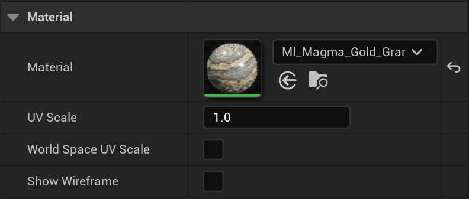

# 预设形状

> 路径：虚幻引擎5.7文档 / 管理内容 / 建模和几何体脚本编写 / 建模工具 / 预设形状

> 原始页面：https://dev.epicgames.com/documentation/unreal-engine/predefined-shapes-in-unreal-engine

你可以使用 **建模模式（Modeling Mode）** 中的 **创建（Create）** 类别创建新网格体。该类别提供了一系列精选的预定义图元，用作建模的基础。如需详细了解建模模式以及访问方法，请参阅[建模模式概述](../../getting-started-with-modeling-mode/modeling-mode/index.md)。

## 使用预定义的形状

你可以在下表中列出的九个形状中进行选择。

|  |  |  |  |  |
| --- | --- | --- | --- | --- |
| 盒体 | 球体 | 圆柱体 | 椎体 | 环面 |
|  |  |  |  |  |
| 箭头 | 长方形 | 圆盘 | 楼梯 |  |

你可以选择所需形状，并将其拖入场景中放置。放置你的网格体后，你仍可以在[工具属性](../../getting-started-with-modeling-mode/modeling-mode/index.md#%E8%AE%BF%E9%97%AE%E5%BB%BA%E6%A8%A1%E6%A8%A1%E5%BC%8F)面板中调整工具设置。所需设置就绪后，点击 **接受（Accept）** 。

## 工具设置

你使用 **工具属性（Tool Properties）** 面板来控制输出类型、维度和材质等设置。

> [!NOTE]
> 与其他建模模式工具一样，重新打开工具时会记住参数值。

### 输出类型

**输出类型（Output Type）** 用于设置你创建的网格体类型。你可以在以下类型之间选择：

- 静态网格体（Static mesh）
- 动态网格体（Dynamic mesh）
- 体积（Volume）

你可以使用各种工具在建模过程的任意阶段更新网格体类型，例如 **变换（Transform）** 类别中的 **转换（Convert）** 和 **传输（Transfer）** 。

如需详细了解这些输出类型和资产管理，请参阅[处理网格体](../../getting-started-with-modeling-mode/working-with-meshes/index.md)文档。

### 形状

你可以在 **形状（Shape）** 设置下调整网格体的尺寸和细分。每个形状都有特定的选项。

此外，你还可以使用 **多边形组模式（PolyGroup Mode）** 设置来配置新网格体的多边形组。多边形组模式（Polygroup Mode）具有以下分组选项：

| 按形状生成多边形组 | 按面生成多边形组 | 按四边形生成多边形组 |
| --- | --- | --- |
| **按形状（Per Shape）** | **按面（Per Face）** | **按四边形（Per Quad）** |
| 将整个网格体作为单一组输出。 | 自动将网格体划分为可识别的面组。 | 自动为每个四边形将网格体划分为一组。 |

如需详细了解多边形组，请参阅[理解多边形组](../../getting-started-with-modeling-mode/understanding-polygroups/index.md)文档。

### 定位

你可以基于场景或地平面将网格体定位到关卡中。

从 **目标表面（Target Surface）** 选择 **场景上（On Scene）** 会基于光标所在几何体的表面法线定位你的网格体。

> [!NOTE]
> 如果你针对关卡中的对象将[碰撞预设](../../../static-meshes/setting-up-collisions-with-static-meshes/index.md#%E6%A8%A1%E6%8B%9F%E7%89%A9%E7%90%86%E5%92%8C%E7%A2%B0%E6%92%9E%E9%A2%84%E8%AE%BE)设置为 **无碰撞（No Collision）** ， **在场景上（On Scene）** 不会检测到该对象。

选择 **地平面（Ground Plane）** 会将网格体定位到关卡中并将Z轴设置为0。

你可以将枢轴点位置调整为底部、顶部或中心。放置光标可直观地看到枢轴点的位置，如下表中所高亮显示。

|  |  |  |
| --- | --- | --- |
| 底部 | 居中 | 顶部 |

### 材质

你可以为网格体选择合适的 **材质（Material）** 。你还可以设置 **UV缩放（UV Scale）** 并启用 **显示线框（Show Wireframe）** 。

