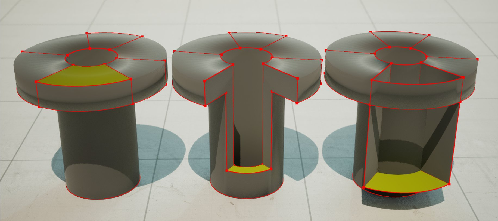

# 推拉

> 路径：虚幻引擎5.7文档 / 管理内容 / 建模和几何体脚本编写 / 建模工具 / 推拉

> 原始页面：https://dev.epicgames.com/documentation/unreal-engine/push-pull-tool-in-unreal-engine

**推拉（Push Pull）** 工具可挤压多边形组面，从而切割或合并网格体部分。你可以将其视为在原始网格体和挤压的选择内容之间执行布尔操作（类似[布尔工具](../boolean-tool/index.md)所执行的操作）。

左边是面选择；中间是推拉操作；右边是挤压操作。

> [!NOTE]
> 在你开始使用推拉工具之前，我们推荐查看[了解多边形组](../../getting-started-with-modeling-mode/understanding-polygroups/index.md)文档，详细了解多边形组及其创建方式。

## 访问工具

你可以从以下位置访问推拉工具：

- 作为选择多边形组面时

  选择（Select）

  类别中的独立工具。如需详细了解此类别，请参阅

  网格体元素选择

  。
- 作为

  多边形组编辑（PolyGroup Edit）

  工具中的操作。如需了解更多信息，请参阅

  多边形组编辑参考

## 使用推拉

| **当前操作** | **说明** |
| --- | --- |
| **应用（Apply）** | 将挤压更改烘焙到网格体中。 |
| **取消(Esc)（Cancel (Esc)）** | 否定更改。 |

| **挤压选项** | **说明** |
| --- | --- |
| **距离模式（Distance Mode）** | 确定挤压距离的设置方式。你可以使用以下方法： **视口中点击（Click in Viewport）**：鼠标移动可控制挤压高度和深度。在视口中点击以完成挤压并退出操作。使用光标，你可以将挤压距离对齐到关卡中的对象。从选择区域中心发出的额外线条指示挤压的测量方向。 **固定（Fixed）**：利用数字输入设置挤压高度或深度（ **距离（Distance）** ）。 |
| **方向模式（Direction Mode）** | 确定在布尔操作之前挤压期间顶点移动的方向。你可以使用以下方法： **顶点法线（Vertex Normals）**：遵循顶点法线，无论选择内容如何。 **单个方向（Single Direction）**：沿相同方向移动所有三角形，无论其法线如何。 **所选三角形法线（Selected Triangle Normals）**：接受每个挤压的顶点周围的所选三角形的角度加权平均值，确定顶点移动方向。 **所选三角形法线均匀（Selected Triangle Normals Even）**：类似于所选三角形法线，但还调整移动的距离，试图使三角形与原始朝向保持平行。 **最大距离比例因子（Max Distance Scale Factor）**：控制为了保持与源三角形平行，顶点可以从目标距离移动的最大距离。 [详见相关示例](#%E6%8E%A8%E5%8A%A8%E6%96%B9%E5%90%91%E6%A8%A1%E5%BC%8F%E7%A4%BA%E4%BE%8B) |
| **壳到实心（Shells to Solids）** | 控制挤压整个开放边界块是应该创建实心壳还是开放壳。 True（启用）：开放边界面作为实心壳被挤压（网格体中没有孔洞）。 False（禁用）：开放边界面作为开放壳被挤压。 |

#### 推动方向模式示例

|  |  |  |  |  |
| --- | --- | --- | --- | --- |
|  | Vertex Normals |  | Selected Triangle Normals | Triangle Normal Even |
| 无挤压 | 顶点法线 | 单个方向 | 所选三角形法线 | 所选三角形法线均匀 |

| **高级** | **说明** |
| --- | --- |
| **测量方向（Measure Direction）** | 在所选三角形法线、顶点法线或所选三角形法线均匀处于活动状态时，测量挤压距离的方向。挤压高度基于相应轴上的鼠标位置设置。单个方向处于活动状态时，挤压方向基于测量方向。该设置仅在距离模式设置为"视口中点击"时可用。 你可以从以下方向中选择： **选择法线（Selection Normal）** **世界X（World X）** **世界Y（World Y）** **世界Z（World Z）** **本地X（Local X）** **本地Y（Local Y）** **本地Z（Local Z）** |
| **将共线性用于设置边界组（Use Colinearity for Setting Border Groups）** | 考虑边缘共线性，以确定在挤压的面接触网格体边界时，连接挤压的面的侧三角形如何分组。 如果为true，触碰网格体边界的侧三角形按照边界的共线分段进行分组。 如果为false，触碰网格体边界的所有侧三角形组合为一个三角形。 例如，为true时，挤压扁平矩形会在一侧得出四个不同的多边形组，而不是一个相连的多边形组。 |

工具使用完毕后，在[工具确认](../../getting-started-with-modeling-mode/modeling-mode/index.md#%E5%B7%A5%E5%85%B7%E3%80%81%E6%92%A4%E9%94%80%E5%8E%86%E5%8F%B2%E8%AE%B0%E5%BD%95%E5%92%8C%E6%8E%A5%E5%8F%97%E6%9B%B4%E6%94%B9)面板中接受或取消更改。
