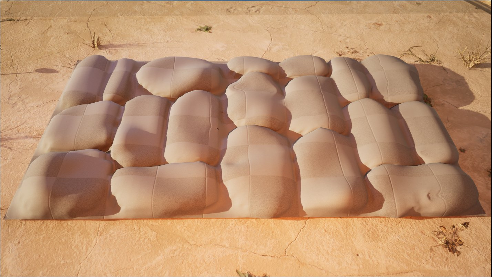
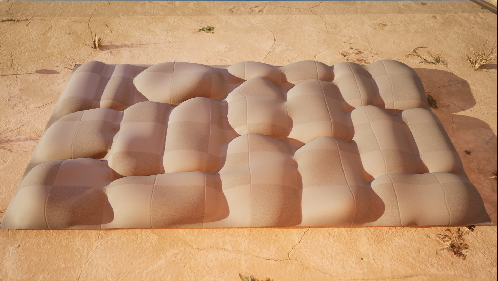

# 平滑

> 路径：虚幻引擎5.7文档 / 管理内容 / 建模和几何体脚本编写 / 建模工具 / 平滑

> 原始页面：https://dev.epicgames.com/documentation/unreal-engine/smooth-tool-in-unreal-engine

**平滑（Smooth）** 工具通过将顶点移向其相邻顶点的平均位置来柔化表面的边缘。当网格体有锯齿状边缘瑕疵时，此操作很有用。

有锯齿的鹅卵石

平滑鹅卵石

## 访问工具

你可以通过以下方法访问平滑工具：

- 建模模式（Modeling Mode）

  中的

  变形（Deform）

  类别。如需详细了解建模模式以及访问方法，请参阅

  建模模式概述

  。
- 骨架编辑器（Skeleton Editor）

  中的

  编辑工具（Editing Tools）

  选项卡。更多详情，请参阅

  骨架编辑

  。

## 使用平滑

网格体的平滑方式由 **平滑类型（Smoothing Type）** 属性设置。每个平滑类型都有调整平滑数量的选项。

**快速迭代（Fast Iterative）** 和 **快速隐式（Fast Implicit）** 平滑类型有调整网格体特定区域的顶点权重地图选项。你必须首先在[属性编辑](../edit-attributes-tool/index.md)工具中创建权重地图层。上面的对比图就使用了权重地图来创建鹅卵石效果。 如需详细了解如何创建权重地图，请参阅[绘制地图工具](../paint-maps-tool/index.md)。

> [!NOTE]
> 有时，在使用平滑工具时，你的网格体可能看起来消失了。其实你的网格体并没有消失，而是经过了大幅度的平滑处理，尺寸也缩小了。这种尺寸变化取决于网格体的分辨率（三角形数量）和 **迭代平滑选项（Iterative Smoothing Options）** 使用的数值。
>
> 要避免此问题，请执行以下任一操作：
>
> - 使用
>
>   重新网格化（Remesh）
>
>   工具增加网格体包含的三角形数量（你必须取消当前工具会话才能执行此操作）。
> - 降低
>
>   迭代平滑选项（Iterative Smoothing Options）
>
>   下的
>
>   逐步平滑（Smoothing Per Step）
>
>   设置。
> - 降低
>
>   迭代平滑选项（Iterative Smoothing Options）
>
>   下的
>
>   步（Steps）
>
>   设置。

工具使用完毕后，在[工具确认](../../getting-started-with-modeling-mode/modeling-mode/index.md#%E5%B7%A5%E5%85%B7%E6%92%A4%E9%94%80%E5%8E%86%E5%8F%B2%E8%AE%B0%E5%BD%95%E5%92%8C%E6%8E%A5%E5%8F%97%E6%9B%B4%E6%94%B9)面板中接受或取消更改。

### 热键

| **按键命令** | **操作** |
| --- | --- |
| **F** | 放大网格体的位置。 |
| **ESC** | 取消更改并退出工具。 |
| **Enter** | 接受工具更改。 |
