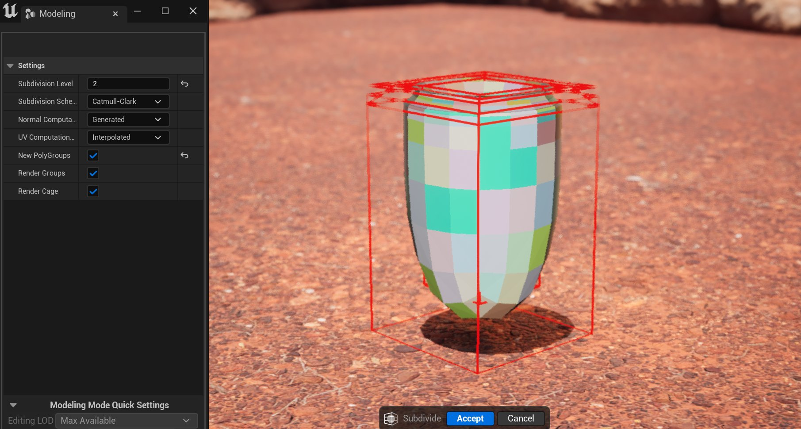

# 细分

> 路径：虚幻引擎5.7文档 / 管理内容 / 建模和几何体脚本编写 / 建模工具 / 细分

> 原始页面：https://dev.epicgames.com/documentation/unreal-engine/subdivide-tool-in-unreal-engine

**细分** 工具能将网格体的现有多边形组（PolyGroups）或三角形划分为更小的单位，从而提高网格体的分辨率。细分能快速生成平滑表面，去除尖锐边缘。由于细分支持迭代操作，因此该工具也适合为你的网格体创建细节级别（LOD）。

|  |  |  |
| --- | --- | --- |
| 无细分 | 细分级别2 | 细分级别5 |
| 细分级别0 | 细分级别2 | 细分级别5 |

> [!NOTE]
> 不像其他DCC软件那样将细分用作渲染工具，细分工具支持直接将细分效果应用于网格体——改变几何体自身。

## 打开工具

细分工具位于 **建模模式（Modeling Mode）** 的 **模型（Model）** 类别中。如需详细了解建模模式以及访问方法，请参阅[建模模式概述](../../getting-started-with-modeling-mode/modeling-mode/index.md)。

## 使用细分

你可以使用 **细分级别（Subdivision Level）** 属性设置细分的迭代次数。当达到三角形数量上限时，细分级别会进行限制。

网格体的细分方式由 **细分方案** 确定。

| **细分方案** | **说明** |
| --- | --- |
| **Catmull Clark** | 多边形组解译为多边形，每个多边形基于细分级别细分为若干数量的四边形。新生成的顶点放置在方案定义的平滑表面上，现有多边形内角也会移至此平滑表面。 如果你的输入多边形组主要是四边形，此方案会生成最佳结果，但也可以处理一些非四边形输入。 |
| **双线性（Bilinear）** | 与Catmull-Clark类似之处在于，它会细分每个多边形组。但是，多边形组的内角处的现有顶点会保留，新顶点位置从多边形组内角线性插入。 如果你的输入由平面多边形组构成，输出顶点也会位于这些多边形组定义的平面上。 |
| **循环（Loop）** | 细分每个三角形，忽略多边形组。每个三角形基于细分级别细分为更多三角形。新增和现有顶点移至方案定义的平滑表面。 |

> [!NOTE]
> 如果多边形组的边界边缘少于三个，细分方案会默认为循环。

要可视化细分工具将在何处细分你的网格体，你可以启用：

- 渲染组（Render Groups）

  ，对输出多边形组着色。
- 渲染框架（Render Cage）

  ，表示原始网格体的多边形轮廓。

启用这些设置有助于直观地显示该工具怎样理解用于细分的输入区域。如果网格体意外细分，你必须检查并调整其多边形组。

你还可以启用 **新多边形组（New PolyGroups）** ，直观地显示在何处生成新多边形。接受工具更改时将此设置保持启用，会将新多边形组分配给网格体。细分后，你可以调整法线和UV计算。

> [!TIP]
> 要控制应用于网格体区域的平滑度，或使网格体的一些部分保持尖锐，你需要添加彼此靠近的边缘。
>
> |  |  |
> | --- | --- |
> |  |  |
> | 无边缘循环 | 边缘循环 |

要继续了解各种建模模式工具，请参阅[建模工具](../index.md)。
