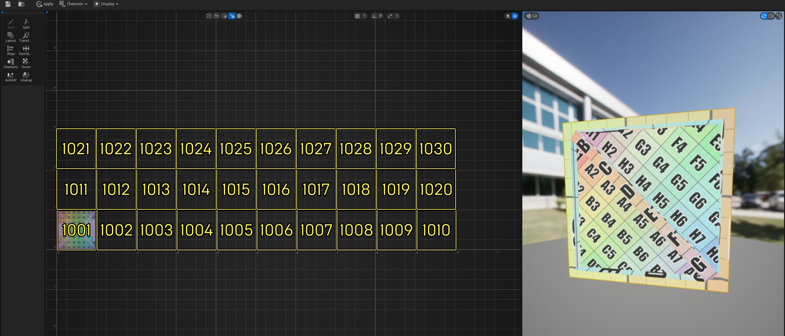

# UV编辑器

> 路径：虚幻引擎5.7文档 / 管理内容 / 建模和几何体脚本编写 / UV编辑器

> 原始页面：https://dev.epicgames.com/documentation/unreal-engine/uv-editor-in-unreal-engine

**UV编辑器（UV Editor）** 提供了用于创建和修改UV的 **视口（Viewports）** 的工具集。相较于 **关卡编辑器（Level Editor）** 的UV工具，UV编辑器可提供交互性更强的2D视图，可对UV进行精细编辑。此外，它还提供了诸如以下选项：

- 合并边缘
- UDIM管理
- 多资产工作流程

使用UV编辑器之前，理解[在引擎内建模](../getting-started-with-modeling-mode/modeling-mode/index.md)的独特方面以及与创建UV相关联的[常见术语](../modeling-tools/uvs-category/index.md)至关重要。

| 列 1 | 列 2 |
| --- | --- |
| UV Editor Default UVs | UV Editor Custom UVs |
| 带有失真纹理的UV | 带有均匀纹理的UV |

> [!NOTE]
> 打开UV编辑器时，显示的初始UV贴图从你导入的网格体拉取，并且引擎中创建的网格体创建了默认UV。

## 默认界面

UV编辑器界面包含四个核心组件：

> 图片已省略：undefined

点击查看大图。

1. 工具栏
2. 工具
3. 2D视口
4. 3D视口

## 访问UV编辑器

你可以通过以下方式访问UV编辑器：

- 在

  建模模式（Modeling Mode）

  下使用

  UV

  类别。
- 在

  关卡（Level）

  中

  右键点击

  你的网格体。
- 在

  内容浏览器（Content Browser.）

  中

  右键点击

  你的网格体。

## 工具栏

| 操作 | 说明 |
| --- | --- |
| **保存（Save）** | 保存你的UV贴图。 |
| **浏览（Browse）** | 在 **内容浏览器（Content Browser）** 中打开当前网格体的位置。 |
| **应用（Apply）** | 将你的UV更改应用于原始网格体。 |
| **通道（Channels）** | 在网格体的UV贴图之间切换。使用[通道工具](#%E9%80%9A%E9%81%93)创建和编辑UV贴图。 |
| **显示（Display）** | 控制2D视口的外观。 |

#### 显示

使用 **显示（Display）** 选项卡，你可以在2D视口中切换网格和标尺的可视性。你还可以设置背景，直观显示映射到UV的纹理。

> 图片已省略：undefined

点击查看大图。

此外，你还可以基于UV岛状区的位置或从纹理标注UDIM。你可以使用 **活动UDIM（Active UDIM）** 加号图标手动应用UDIM。

> [!NOTE]
> 启用背景之后，它将为0-1单位正方形自动显示。UDIM必须设置，背景才会在其他单位正方形中正确显示。

## 工具

使用UV编辑器工具可为你的网格体创建和管理所需UV贴图。创建新UV时，你可以使用[AutoUV](#autouv)工具，然后使用剩余工具完善细节。对于手动开始，请使用[**接缝（Seam）**](#%E6%8E%A5%E7%BC%9D)工具。

你可以使用 **布局（Layout）** 、 **AutoUV** 和 **解包（Unwrap）** 工具调整纹理分辨率。

### 缝制

**缝制（Sew）** 工具连接两个对应的边缘。使用该工具时，所选边缘将以红色高亮显示，其对应边缘以绿色高亮显示。点击缝制工具之后，这些高亮显示的边缘将合并，创建一个新的UV岛。

> [!NOTE]
> 如果你收到警告，称没有选择可行的缝制候选边缘，则所选边缘已经在UV岛状区中连接，或者是边界边缘。

### 拆分

使用 **拆分（Split）** 工具手动分离网格体的UV坐标。你可以沿以下内容的给定选择内容进行拆分：

- **领结顶点（Bowtie vertices）**

  - 这会将UV拓扑从选择内容中的领结顶点断开连接。

  > [!NOTE]
  > 这些是通过一个点而不是边缘加入三角形的顶点。无需选择单独的领结顶点，该工具就能正常运行。选择UV岛状区，然后使用拆分工具，将断开所有现有领结顶点。
- **边缘（Edges）**

  - 这会在边缘处断开UV拓扑。
- **三角形（Triangles）**

  - 这会切割整个区域。

> [!TIP]
> UV更厚的饱和轮廓表示[接缝](#%E6%8E%A5%E7%BC%9D)。这用于确定你是否恰当拆分了选择内容。

### 布局

启用 **保留UDIM（Preserve UDIMs）** 时，布局工具有助于将UV岛状区整理为0-1空间，或在其源自的UDIM中整理。

将UV布局到UV空间的过程称为UV打包。有三种布局类型可帮助打包你的UV：

| 布局类型 | 说明 |
| --- | --- |
| **变换（Transform）** | 变换将缩放和平移应用于你的所有UV，无论是否选择了特定岛状区。保留UV的当前布局。这些缩放和平移功能按钮在堆叠和重新打包中可用。 |
| **堆叠（Stack）** | 单独均匀缩放和平移每个UV岛状区，以在单位正方形中重叠打包。两个UV岛状区有相同的纹理设计时，堆叠很有用，这样就无需复制。 |
| **重新打包（Repack）** | 一起均匀缩放和平移各个UV岛状区，以在单位正方形中不重叠地打包。重新打包所特有的是允许反转（Allow Flips）设置。启用此功能后，打包UV时可以节省空间，但可能为下游操作带来问题。 |

> [!NOTE]
> 该工具在当前选择的岛状区上运行，如果没有选择岛状区，则在所有岛状区上运行。

### 变换

相较于2D视口中的小工具， **变换（Transform）** 工具为缩放和平移提供了显式的数字输入。

你可以使用 **快速平移（Quick Translate）** 和 **快速旋转（Quick Rotate）** 选项执行快速变换。要获得更高精度，请使用 **高级变换（Advance Transform）** 分段，其中你可选择调整枢轴点。

**平移模式（Translation Mode）** 将决定如何使用以下任一选项放置UV：

- 相对（Relative）

  会相对于当前位置移动元素。
- 绝对（Absolute）

  会基于

  变换原点（Transform Origin）

  中的

  手动（Manual）

  输入移动元素。

**变换原点（Transform Origin）** 将决定UV的枢轴点位置，这用于控制进行变换的UV的相对运动。

| 变换原点模式 | 说明 |
| --- | --- |
| **边界框中心（Bounding Box Center）** | 围绕所有岛状区边界框的中心旋转。 |
| **原点（Origin）** | 使用全局原点0,0旋转。 |
| **单独的边界框中心（Individual Bounding Box Center）** | 围绕每个岛状区的边界框中心旋转。 |
| **手动（Manual）** | 基于用户指定的点旋转。 |

> [!NOTE]
> 变换操作自上而下按顺序执行。

### 对齐

基于现有UV的边缘、顶点或岛状区进行排列。

为了进一步辅助你充分放置UV，以下选项可用：

- 对齐锚点（Alignment Anchor）

  将控制相对于哪个几何体执行对齐操作。
- 分组模式（Grouping Mode）

  将控制对齐操作如何将选项分组视为对齐行为。

### 分布

你可以调整UV顶点和岛状区的间隔。

> [!TIP]
> 类似于对齐工具，分布工具用于帮助删除UV中的拉伸和失真。

### 通道

你可以通过添加、复制、删除通道来管理UV贴图。**UV通道（UV Channels）** 包含一个网格体的差异化UV贴图。

利用多个UV通道，可以在网格体上分层叠放纹理以及[烘焙光源](../../static-meshes/understanding-lightmapping/index.md)。例如木箱，你可以将一个通道用于木质纹理，另一个通道用于带有 *"易碎品"* 字样的贴花。

如需详细了解UV通道，请参阅[将UV通道用于静态网格体](../../static-meshes/using-uv-channels-with-static-meshes/index.md)文档。

### 接缝

使用 **2D** 或 **3D视口** ，你可以交互式分离边缘，以创建接缝。选择至少两个顶点时会自动形成接缝。

除了切割新的接缝外，你还可以将接缝缝制在一起。使用 **模式（Mode）** 选项在 **分割（Split）** 和 **缝制（Sew）** 之间切换。双击第二个顶点可分离和合并多个边缘，然后在视口中点击 **完成（Complete）** 。

> [!TIP]
> 请留意接缝显示的位置。你通常希望接缝对受众不可见，除非显示接缝更美观。知道资产的哪些部分在体验中可见，对于理解在何处创建接缝至关重要
>
> > 图片已省略：中心光束中接缝可见
>
> > 图片已省略：离散接缝
>
> 中心光束中接缝可见
>
> 离散接缝

### AutoUV

你可以使用 **AutoUV** 自动解包和打包UV。对于自定义UV贴图或需要快速UV贴图的背景资产，这种自动执行作为起始点很有用。

有三种控制方法：**UVAtlas** 、 **Xatlas** 、 **PatchBuilder** 。

| 方法 | 说明 |
| --- | --- |
| **补丁构建器（Patch Builder）** | 支持大的模型，例如Nanite。这是引擎中内置的默认选项。 |
| **UV图集（UV Atlas）** | 用于有机对象，可最大限度减少拉伸。 不适用于Linux。 |
| **XAtlas** | 旨在用于光照贴图和机械网格体。 |

在 **补丁构建器（Patch Builder）** 和 **UV图集（UV Atlas）** 模式下，你可以基于预定义的多边形组给UV布局。此外，你可以自动将指定的多边形组整理为UDIM。

> [!NOTE]
> 要直观显示每个UDIM的编号，请使用显示（Display）下拉菜单。

### 解包

**解包（Unwrap）** 工具会重新计算现有UV或多边形组的UV，从而帮助最大限度减少拉伸和压扁的区域（失真）。

> [!NOTE]
> 该工具在当前选择的岛状区上运行，如果没有选择岛状区，则在所有岛状区上运行。

UV自动解包的方式由 **解包类型（Unwrap Type）** 确定。

| 解包类型 | 说明 |
| --- | --- |
| **ExpMap** | 执行快速解包，但在减少失真方面作用有限。 |
| **Conformal** | 相较于ExpMap可减少失真，但在大的岛状区上成本越来越高昂。 |
| **SpectralConformal** | 相较于Conformal方法，可进一步减少失真，但计算成本更加昂贵。此外，还有"保留不规则（Preserve Irregularity）"选项，可去除网格体不规则造成的不自然失真。 |
| **岛状区合并（Island Merging）** | UV岛状区会合并到更大的岛状区，但不会将失真增加到超出定义的限制。 |

> [!NOTE]
> 如果你要对平面等简单几何体制作纹理，所有解包类型都会产生大致相同的效果。如果你要处理非均匀进行曲面细分并有复杂形状的网格体，Spectral Conformal是最佳选项。它产生的失真最少；但是计算速度更慢。

## 2D视口

2D视口表示用于显示UV贴图的2D空间（也称为UV或纹理空间）。它是解包和打包UV的主视口。下表中的UV选择类型为此视口特有。

|  |  |  |  |  |
| --- | --- | --- | --- | --- |
| UV Editor Vertices | UV Editor Edges | UV Editor Triangles | UV Editor Islands | UV Editor Mesh |
| **选择顶点（Select Vertices）** | **选择边缘（Select Edges）** | **选择三角形（Select Triangles）** | **选择岛状区（Select Islands）** | **选择网格体（Select Mesh）** |

视口网格包含称为单位正方形的内容。UV的默认单位正方形是0-1。纹理贴图放置在一个单位正方形中，UDIM按使用的每个单位正方形编号，从1001开始。

点击查看大图。

> [!NOTE]
> UDIM沿水平方向创建，最多10个单位，然后继续到下一行，根据需要重复该过程。

### 功能按钮

你在2D视口中有以下寻路选项：

- 使用鼠标中键滚动可放大和缩小。
- **右键点击** 可平移网格。

> [!WARNING]
> 避免使用与关卡视口关联的热键。

> [!NOTE]
> 平移小工具可模仿用于建模模式的工具，并在执行旋转后重新点击UV时调整方向。

## 3D视口

3D网格体上UV的实时视图。**焦点摄像机（Focus Camera）** 为3D视口特有，它会对齐到你当前选择的UV。3D视口处于活动状态时，你可以使用热键 **Alt + F** 。

### 功能按钮

启用 **环绕摄像机（Orbit Camera）** 后，你拥有标准寻路功能按钮，以及平移、环绕和缩放。**飞行摄像机（Fly Camera）** 有相同的寻路以及游戏样式的功能按钮。

如需详细了解这些功能按钮，请参阅[视口功能按钮](../../../get-started/unreal-engine-for-new-users/viewport-controls/index.md)文档。

还有一个选项可调整默认 **光照（Lit）** 选项中的 **视图模式（View Mode）** 。如需详细了解，请参阅[视口模式](../../../building-virtual-worlds/level-editor/editor-viewports/viewport-modes/index.md)。

## 后续步骤

现在你已熟悉UV编辑器的基本信息，你可以：

- 开始对几何体进行UV贴图。
- 了解如何使用

  纹理

  和创建

  材质

  。
