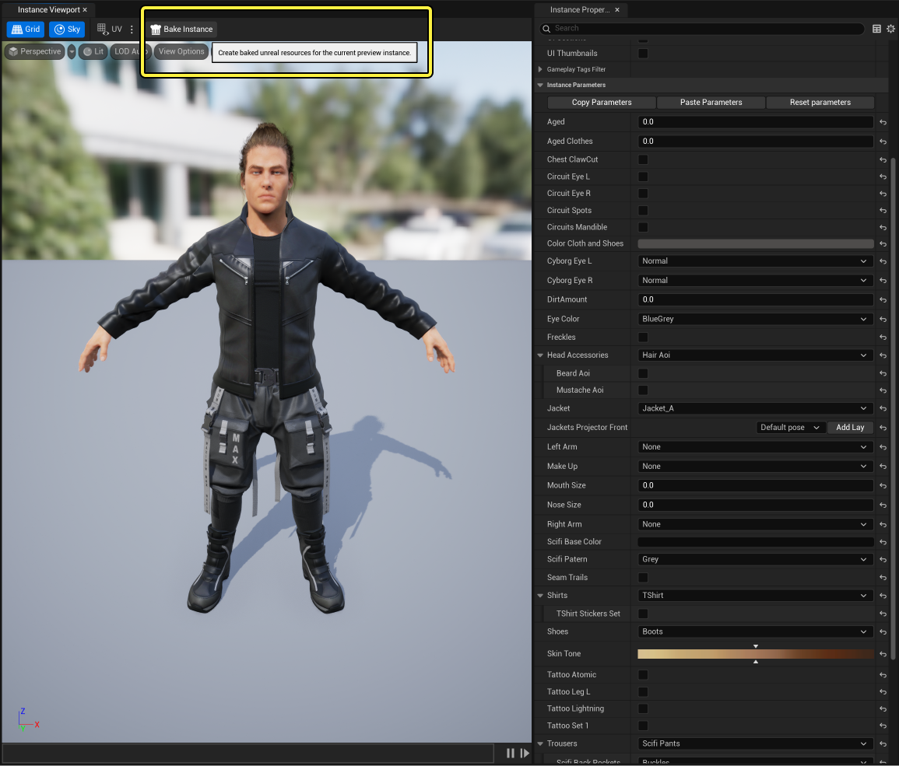
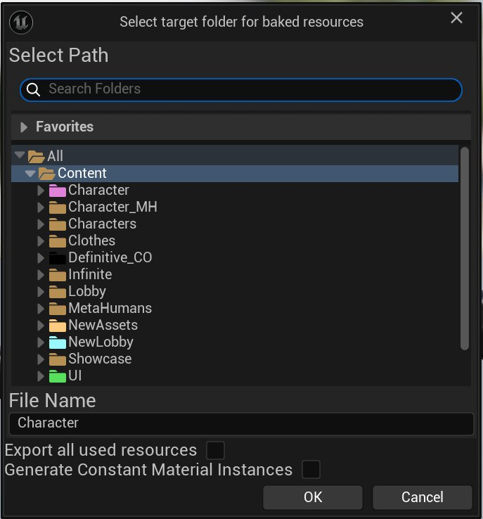
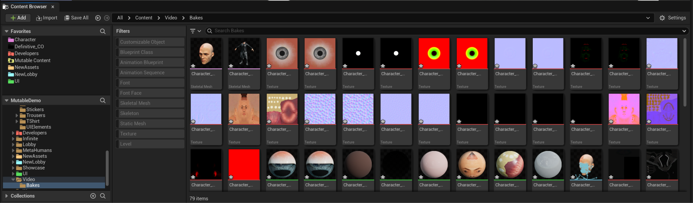

# 烘焙实例

> 路径：虚幻引擎5.7文档 / 管理内容 / Mutable骨骼网格体生成 / Mutable开发指南 / 烘焙实例

> 原始页面：https://dev.epicgames.com/documentation/unreal-engine/baking-instances-using-mutable-in-unreal-engine

Mutable的主要目标是在运行时编译动态对象。此外能够在编辑器中编译这些对象，并将其转换为标准的虚幻引擎资产（骨骼网格体、材质和纹理），这同样很有用。一些用例如下：

- 在其他工具中制作营销材料。从虚幻引擎中，你可以导出这些资产，并将其导入到其他内容创作工具中，用于创建电影级视频和离线渲染。
- 调试对象。你可以在标准的虚幻编辑器工具检查烘焙后的实例，以更好地理解Mutable的效果，并尝试找出对象中存在的低效之处。
- 将Mutable用作制片工具。一些项目在游戏内容创建时纯粹离线使用Mutable，生成游戏的最终角色。

## 烘焙实例

可以使用任何Mutable预览面板中的 **烘焙实例（Bake Instance）** 按钮烘焙实例。目前，这些面板包括可自定义对象编辑器（Customizable Object Editor）和可自定义实例编辑器（Customizable Instance Editor）。

在任何Mutable预览面板中都可以使用烘焙实例（Bake Instance）按钮。

将弹出一个窗口，用于选择生成资源的目标内容文件夹，以及资产名称的前缀：

选择目标内容文件夹以保存烘焙后的资产。

此窗口中有两个额外的复选框：

- 导出所有使用的资源（Export all used resources）

  ：勾选后，将在目标文件夹中烘焙对象使用的所有材质和纹理。否则，将仅烘焙Mutable修改过的资产，并改用对非Mutable资产的原始引用（即对象材质使用的、但没有连接任何节点的纹理）。换句话说，勾选此框会生成一个完全自包含的对象，该对象不会使用项目中的任何共享资源。
- 生成常量材质实例（Generate Constant Material Instances）

  ：勾选后，烘焙后的骨骼网格体中的所有材质实例都为常量，而不是动态的。它们在运行时无法更改，但它们更轻量并且是UEFN所必需的。

结果是在目标文件夹中生成一组虚幻引擎资产，其中包含所有细节级别。

对角色骨骼网格体进行烘焙的结果。
