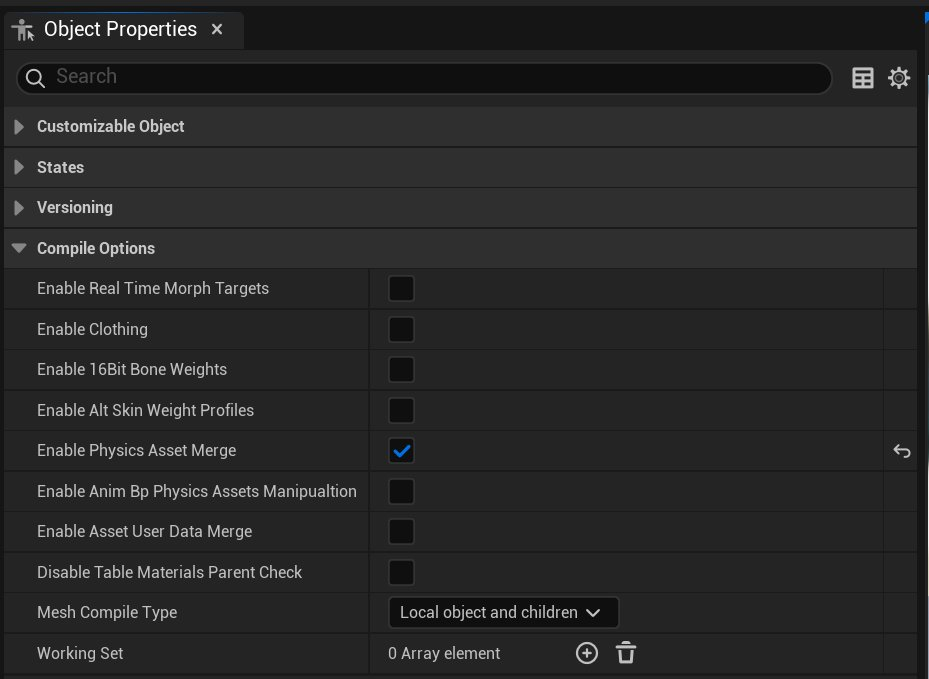
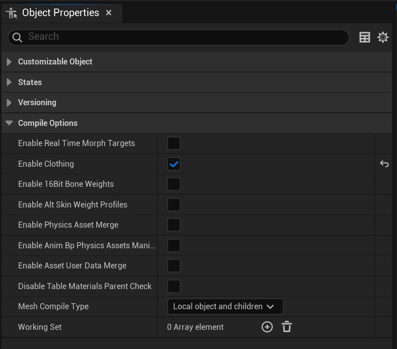
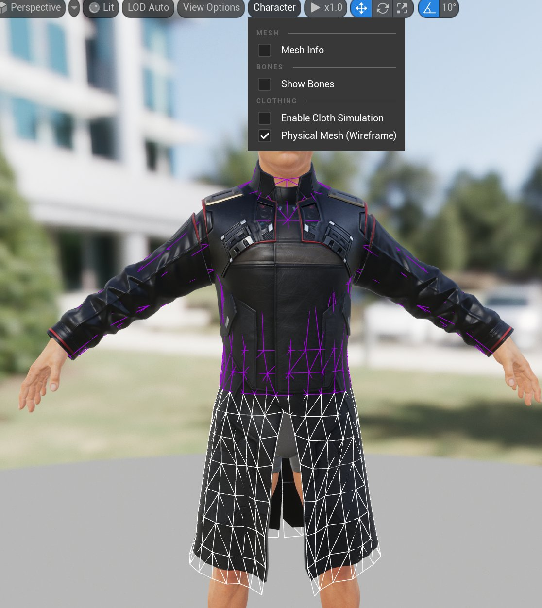

# 物理和布料

> 路径：虚幻引擎5.7文档 / 管理内容 / Mutable骨骼网格体生成 / Mutable开发指南 / 物理和布料

> 原始页面：https://dev.epicgames.com/documentation/unreal-engine/mutable-physics-and-clothing-in-unreal-engine

本指南将介绍如何通过Mutable插件使用物理资产和布料资产。

## 物理资产

当组装Mutable网格体时，默认情况下，网格体组件的参考网格体PhysicsAsset会被分配给它。在简单的设置中，这已足够，除非可自定义对象的各个部分比例差异非常大。

为了解决这些情况，可以通过Mutable对PhysicsAsset合并的支持，实现一种更模块化的方法。可以在可自定义对象的编译选项中启用此选项。转到 **对象属性（Object Properties）** 选项卡并点击 **编译选项（Compile Options）** > **启用物理资产合并（Enable Physics Asset Merging）** 。

启用后，用于生成实例骨骼网格体组件的网格体中的所有PhysicsAsset将合并为一个PhysicsAsset。如果只找到一个PhysicsAsset，并未检测到对形体形状的修改，则不会进行合并，原始资产将被分配给生成的网格体。

当发生合并时，生成的PhysicsAsset将使用可自定义对象组件的参考骨骼网格体中的PhysicsAsset作为解算器设置（Solver Settings）和解算器类型（Solver Type）的模板。形体设置（BodySetup）和约束（Constrains）将从各个组成的PhysicsAsset中合并。

如果要合并的PhysicsAsset是互补的，并且一个PhysicsAsset中用于一个BodySetup的骨骼不会用于另一个PhysicsAsset，则不会发生冲突，并且将生成预期的物理资产。

但这有时不可行，例如，来自不同网格体的一些可自定义部分可能会发生碰撞。在这种情况下，需要在两个PhysicsAsset之间进行一些连接。这可以通过在不同物理资产的形体设置中添加使用相同骨骼的设置来实现。合并设置时，两个设置的形状会聚合，并且对于给定的骨骼，属性会从第一个遇到的形体中复制。无法保证属性将从哪个形体设置中复制，通常，对于可能会合并的设置，应设置相同的属性。

## 骨骼网格体布料资产

Mutable支持将布料模拟数据传输到生成的骨骼网格体。

需要在每个可自定义对象的编译选项中启用此功能。转到 **对象属性（Object Properties）** 选项卡并点击 **编译选项（Compile Options）** > **启用布料（Enable Clothing）** 。

启用后，如果某个骨骼网格体部分附有布料资产，并且参与了最终生成的Mutable网格体，则模拟数据将被传输到该网格体。

如果附有布料模拟的网格体部分被删除，与这些部分相关联的模拟网格体三角形也会被删除。删除网格体三角形时，Mutable会使用模拟网格体和渲染网格体之间的关联关系。在Mutable处理渲染网格体后，模拟网格体中没有这种关联关系的部分也会被删除。

布料资产可能有一些配置，用于控制某些模拟属性，例如骨骼网格体中所有附有布料的网格体部分共享的迭代或细分。假定参与可定制对象的所有骨骼网格体的这些配置都是相同的。如果找到多个共享配置，则将使用第一个配置。

生成的布料模拟网格体可以通过 **可自定义对象** 预览进行可视化。在 **角色（Character）** 菜单中，点击 **物理网格体（线框）（Physical Mesh (Wireframe)）** 。

如果需要更详细的可视化，请使用常规的骨骼网格体查看器。

### 当前局限

#### 不支持的操作

此功能的主要局限性之一是不支持网格体部分扩展。每个附有布料的网格体部分都需要有自己的网格体部分，并且不支持布料资产合并。

#### 模拟网格体面删除的边缘状况

模拟网格体部分的删除是通过渲染网格体和模拟网格体之间的关联来完成的。如果原始模拟的某些部分与渲染网格体的任何部分都没有关联，则即使没有执行删除操作，这些部分也会被删除。

#### 多重影响

不支持具有多重影响的布料。如果资产使用了多重影响，则生成的资产将仅使用权重较高的影响。
