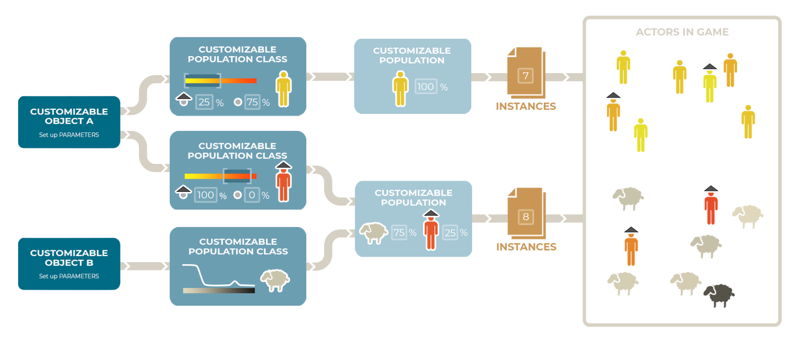
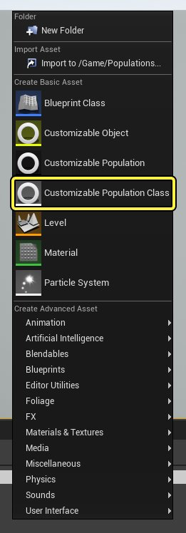
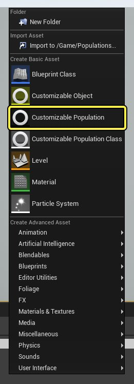
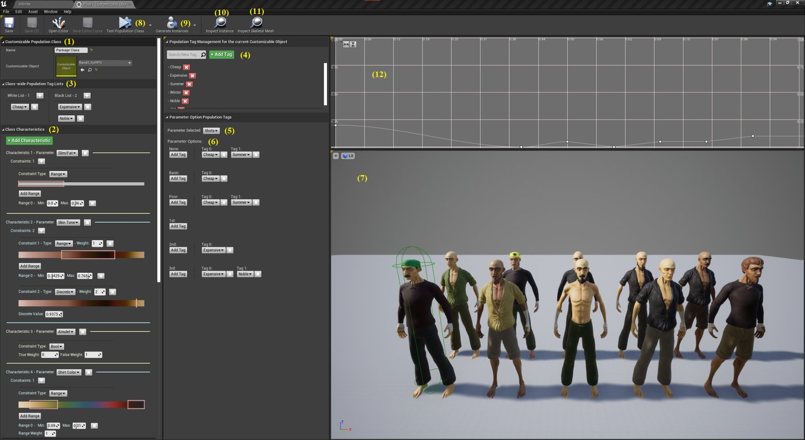
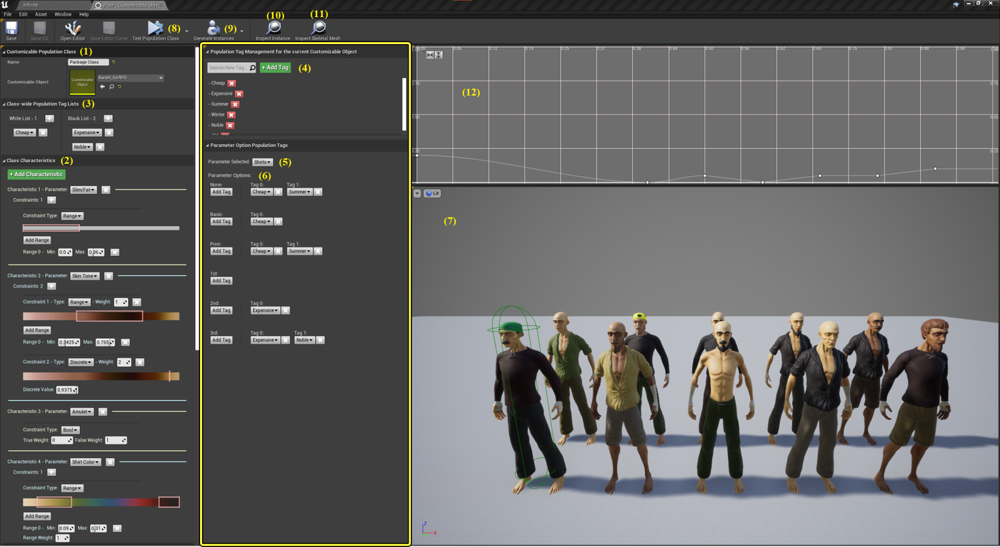

# 群体和人群

> 路径：虚幻引擎5.7文档 / 管理内容 / Mutable骨骼网格体生成 / Mutable开发指南 / 群体和人群

> 原始页面：https://dev.epicgames.com/documentation/unreal-engine/populations-and-crowds

Mutable **Populations**是一个附加插件，用于从现有Mutable对象自动生成自定义人群或群体。

在**群体编辑器** 中，你可以控制随机性，以在实时状态下或在制作流程中创建变体和内容。 你还可以使用此编辑器为不同群体定义生成规则，从而创建具有凝聚力的群体，这些群体具有共同的起源、文化或行会。 发布后，新资产可以添加标签，以自动提升现有群体的可变性。

此插件作为一个示例提供，用于说明如何使用Mutable生成群体。 这对于每个项目来说都是非常独特的，可以作为模板来创建你自己的系统。

## 可自定义Object、类和群体

群体生成方法的示例。

Mutable Populations根据其内部配置随机生成[可自定义对象实例](../../mutable-overview/index.md#customizable-object-instance)，其中配置包括群体类和相对出现概率。

每个群体类基于一个[可自定义对象](../../mutable-overview/index.md#customizable-objects)，，该对象可定义其典型特征。 方法是选择应在随机可自定义对象实例上生成哪些[参数](../../mutable-overview/index.md#parameters)值以及生成频率。

## 可自定义群体类

**可自定义群体类**是虚幻引擎中新增的一种资产。 群体类可定义其所基于的可自定义对象，及其**特征**。

每个特征是一个参数的可接受选项的范围，它还界定了该参数出现在随机可自定义对象实例上的相对概率，而此实例是在"群体类"定义的规则下通过"群体"生成的。 根据参数类型，它用于设置查找某些选项的常见程度，选择单个值作为有效值，或者使用曲线来定义连续数值出现的概率。 该类还可以通过标签在全局范围和针对各个参数，对整型和布尔参数进行拒绝列表和允许列表设置。

你可以从内容浏览器的**新增（Add New）**菜单中创建一个可自定义群体类：

使用新增菜单新增一个可自定义群体类。

## 可自定义群体

这是一种新型资产，它会根据所选择的群体类及其使用频率，生成随机可自定义对象实例。

单个群体可以从多个不同的可自定义Object创建可自定义Object实例，也可以从相同的可自定义Object但不同的群体类创建可自定义Object实例。

你可以从内容浏览器的**新增（Add New）**菜单中创建可自定义群体：

使用新增菜单新增一个可自定义群体。

每当保存群体或群体类时，可自定义群体会使用当时每个群体类的可自定义Object的参数，更新可自定义Object实例的生成算法。 在项目被打包时，它还会进行更新，以确保其保持最新状态。

## 群体类编辑器

群体类编辑器。

左侧面板包含群体类选项：

1. 选择它所基于的可自定义对象。
2. 定义该类的特征。
3. 设置全局类标签允许列表和拒绝列表。

可自定义对象的每个参数都有一个特征。

每个特征都通过约束进行定义。 针对每个参数，约束将定义在群体类的随机可自定义对象实例中出现哪些值，以及这些值出现的概率。

根据参数类型的不同，不同类型的约束条件会被用来定义特征。

单个特征可以使用多个约束条件，其中每个约束条件相对于其他约束条件所应用的概率由其权重所决定。

凡是未通过有效特征指定的参数，将由群体类进行随机处理，其中每个选项在从群体类生成的可自定义对象实例上出现的概率相等。

中央面板将定义可自定义对象的群体标签。 这些标签可以从共享该可自定义对象的所有群体类中使用和修改。 标签可通过全局允许列表和拒绝列表或设置使用"标签"类型约束条件的特征，来控制最终出现在随机可自定义对象实例中的内容。

该面板包含以下功能：

4. 添加和删除标签，以便加以使用。 文本框可用于添加新标签。 在文本框下方，有一个显示现有标签的列表，在其中可以删除标签。

5. 选择我们将为其设置标签的参数。

6. 定义适用于枚举中每个选项的标签。

**曲线编辑器**位于右上方面板（12）中。 它显示最后一个按下**在编辑器中打开（Open in Editor）**按钮的曲线约束，并可用于调整曲线。

右下方面板（7）显示使用当前设置所生成的预览。 每次按下**测试群体类（Test Population Class）**按钮（8）时都会生成预览。 生成的可自定义对象实例数量可以使用该按钮旁边的向下箭头进行设置，默认值为`10`。

你可以在此选择实例进行检查；在此图中，选择了最左边的实例。 使用检查示例（Inspect Instance）（10）按钮，你能够在编辑器中检查和修改所选的可自定义对象实例。 使用检查骨骼网格体（Inspect Skeletal Mesh）（11）按钮，你可以检查生成的骨骼网格体。

**生成实例（Generate Instances）**按钮（9）可用于生成随机可自定义对象实例资产。 这些是普通的可自定义对象实例，在编辑器中用作游戏资产，并且在创建后不会随机生成其他内容。

要在运行时生成随机可自定义对象实例，你可以使用群体资产中的**生成群体（Generate Population）**和**重新生成群体（Regenerate Population）**函数。

## 群体标签

标签是通过标签管理器（Tag Manager）文本框创建的。 标签设计为单独分配给枚举参数的每个选项。 然后，它们用于指示某些参数选项是否应在群体类中找到。 方法是将这些标签列入允许列表或拒绝列表。 本节后面会用一个真值表来对此进行定义，这是一种筛选群体类所使用参数的方式。

群体标签面板。

要使用标签，先创建标签（4），然后分配一些参数选项（6）（5），最后基于全局范围（3）或影响单个参数的约束（2），在允许列表和拒绝列表上使用。

标签存储在可自定义Object中，因此相同可自定义Object的不同群体类可以在相同参数和参数选项上访问相同的标签。

为枚举的每个选项分配标签是群体标签的主要用途，并且结合拒绝列表和允许列表，可以管理不断增加的选项数量，而无需在每次添加或删除选项时手动修改依赖于它的每个群体类约束。

每个群体类都有一个通用允许列表和拒绝列表，用于大致定义从该群体类生成的可自定义对象实例中会出现和不会出现的内容。

整型和布尔参数也可以设置标签约束。 这些约束会重载全局允许列表和拒绝列表，但仅适用于定义标签约束的特定特征。 这使得能够为通用允许列表和拒绝列表指定例外情况，从而对群体类的特定参数进行微调。

标签列表遵循以下逻辑，直到满足某些条件：

1. 如果枚举的任何选项上的任何标签都不在此参数的任何标签列表中，则其所有选项出现的概率相同。
2. 如果枚举的至少一个选项上的一个标签在此参数的约束列表中：只有那些在约束拒绝列表中没有任何标签的枚举选项才会出现。 如果任何枚举选项的标签在允许列表中，则只有那些在允许列表中有标签且在拒绝列表中没有标签的选项才会出现（表格结尾处描述了结果）
3. 与第2点相同，但针对的是全局列表。 如果枚举中至少有一个选项的一个标签在此参数的全局列表中：只有那些在全局拒绝列表中没有任何标签的枚举选项才会出现。 如果任何枚举选项的标签在允许列表中，则只有那些在允许列表中有标签且在拒绝列表中没有标签的选项才会出现。 表格结尾处描述了结果：

允许列表和拒绝列表的真值表：

| 枚举选项在允许列表中有标签 | 枚举选项在拒绝列表中有标签 | 同一枚举的另一个选项在允许列表中有标签 | 此枚举选项可以在随机可自定义对象实例中出现吗？ |
| --- | --- | --- | --- |
| 否（No） | 否（No） | 否（No） | **是（Yes）** |
| **是（Yes）** | 否（No） | 否（No） | **是（Yes）** |
| 否（No） | **是（Yes）** | 否（No） | 否（No） |
| 否（No） | 否（No） | **是（Yes）** | 否（No） |
| **是（Yes）** | **是（Yes）** | 否（No） | 否（No） |
| **是（Yes）** | 否（No） | **是（Yes）** | **是（Yes）** |
| 否（No） | **是（Yes）** | **是（Yes）** | 否（No） |
| **是（Yes）** | **是（Yes）** | **是（Yes）** | 否（No） |
