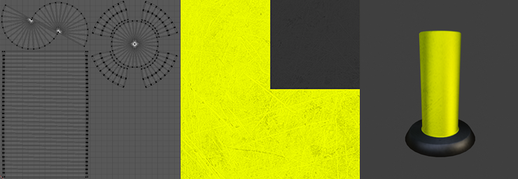
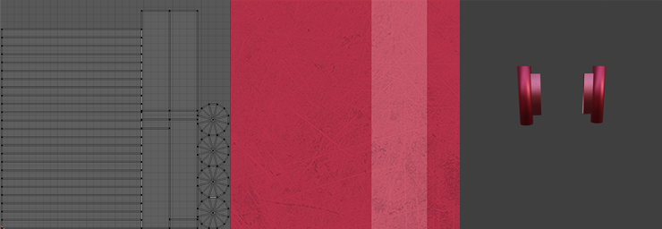
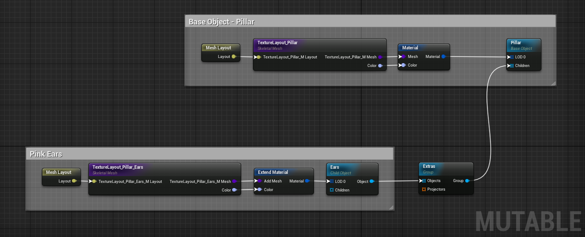
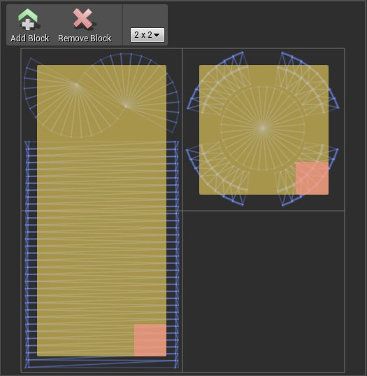
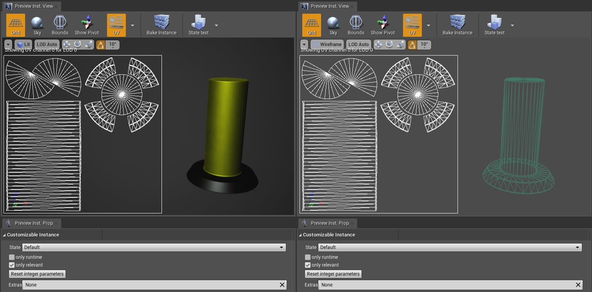
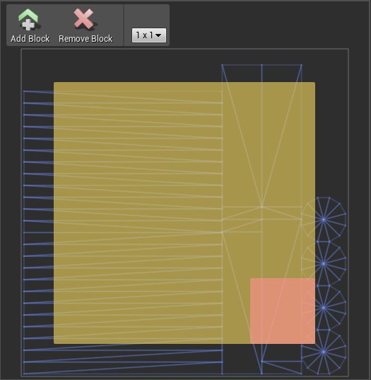
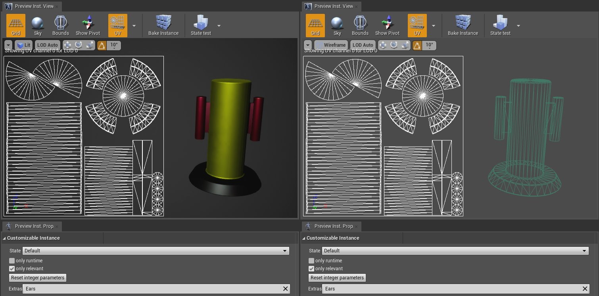
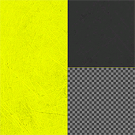

# 纹理布局

> 路径：虚幻引擎5.7文档 / 管理内容 / Mutable骨骼网格体生成 / Mutable开发指南 / 纹理布局

> 原始页面：https://dev.epicgames.com/documentation/unreal-engine/texture-layouts

正如[概述页面](../../mutable-overview/index.md#%E7%BA%B9%E7%90%86%E5%B8%83%E5%B1%80)所介绍的，你可以使用Mutable管理每个网格体的UV布局，以优化其使用效果。它们可以被分离并归入不同的块，从而在渲染、优化和整理上获得一些好处。本页面将介绍三个关于其应用的示例。

## 纹理和网格体部分合并

如果不同网格体共享材质，Mutable可以合并这些网格体的纹理。此示例显示了一个简单的可自定义对象，其中包含一个子对象，该子对象向基础对象添加了一个网格体及其纹理。此示例包含一个黄黑相间的柱子，其侧面可以用粉色小柱子进行扩展。

### 资产

基础对象的UV已准备好整理成两个块

此配件的UV将仅形成一个块

所有这些骨骼网格体共享相同的材质，只有一个纹理参数，即颜色纹理贴图（如之前图片中间所示）。

### 对象结构

此示例的节点图表由一个基础对象和一个子对象组成。子对象使用扩展网格体部分修饰符，将一个带有纹理的网格体片段添加到基础网格体中。

### UV布局设置

在[骨骼网格体节点](https://github.com/anticto/Mutable-Documentation/wiki/Node-Skeletal-Mesh)的属性选项卡中，你可以设置用于创建块的网格分辨率。基础网格体的网格体布局的分辨率决定了同一可自定义对象层级中所有子网格体的分辨率。

在此示例中，基础网格体的分辨率为2x2，并整理成两个块。这两个块经过策略性设置，因为其中一个块中的网格体在未来的自定义操作中会被完全删除。

在此示例中，此网格体中设置的原始纹理为256x256，块分辨率为2x2。这意味着子网格体的任何块单元将为128x128。

下图显示了在没有激活子对象情况下的最终UV布局。

点击Mutable编辑器中预览实例视口（Preview Instance Viewport）选项卡中的"UV"按钮，可以显示每个网格体部分的最终UV布局。

### 纹理合并

扩展网格体修饰符根据其标签（请参阅[标签和修饰符](https://github.com/anticto/Mutable-Documentation/wiki/Node-Modifier-Properties)）扩展其应用的网格体部分。这意味着，其网格体将被添加到已修改的网格体部分，其纹理将被添加到已修改部分的纹理中。此子网格体的网格体布局的块分辨率设置为1x1。此1x1块将被添加到基础块中。

在此示例中，此子网格体的原始纹理为256x256，但由于它被设置在1x1块中，当与已修改对象的纹理合并时，它将被调整为128x128。如果纹理已经是128x128，则不会应用大小调整。

> [!NOTE]
> 在创建资产的UV布局时，必须规划纹理大小和块分辨率，以获得最优化且符合预期的质量和外观效果。

下图显示了在激活此子对象情况下的最终UV布局。

1x1块已被添加到空白位置。

### 最终纹理

下图显示了最终纹理。

当只有基础网格体时

> 图片已省略：图像

当子网格体激活时

## 使用块删除网格体

Mutable允许通过在UV布局中选择块来删除网格体。这可以通过[Remove Mesh Blocks](https://github.com/anticto/Mutable-Documentation/wiki/Node-Remove-Mesh-Blocks)修饰符节点来实现。

在上述示例的扩展内容中，在黄色柱子上添加了一个更大的蓝色底座。黄色柱子网格体的一部分将与新的蓝色底座重叠，因此这一部分将被删除。

### 资产

> 图片已省略：图像

此其他配件的UV将仅由一个2x1块组成，此块将替换其父对象的一个块。

## 对象结构

第二个子对象已被添加到示例中。此子对象与前一个具有相同的结构，但有一个附加项。

> 图片已省略：图像

### 运行方式

在此示例中，子网格体的UV布局网格分辨率为2x2，仅有一个1x2块。

> 图片已省略：图像

在此子对象的两个块中，一个块将放置在基础布局的空白空间中，另一个将替换基础网格体的已删除网格体。

除了网格体布局节点外，此子对象还有一个Remove Mesh Blocks修饰符节点，此节点影响基础对象网格体部分。通过在节点属性（Node Properties）选项卡中设置正确的标签，你可以显示已修改的网格体的UV布局并添加UV布局块。Remove Mesh Blocks节点将删除这些块中的任何网格体。

> 图片已省略：图像

在此示例中，选择了右上角的1x1块。此块包含黄色柱子的黑色底座部分。此部分将被删除。

当可自定义对象经过编译且蓝色底座子对象激活时，黑色底座被删除，新的蓝色底座的块被合并到最终的UV布局中。

> 图片已省略：图像

### 最终纹理

下图显示了应用第二个子对象时的最终纹理。

> 图片已省略：图像

## 复杂块结构示例

下图显示了可自定义对象示例角色"Bandit_forRPG"的块结构。

> 图片已省略：图像

网格体布局节点属性，显示角色块结构。

> 图片已省略：图像

实例参数设置为默认值。

> 图片已省略：图像

实例示例及其最终颜色纹理。

> 图片已省略：图像

另一个实例示例及其最终纹理。
