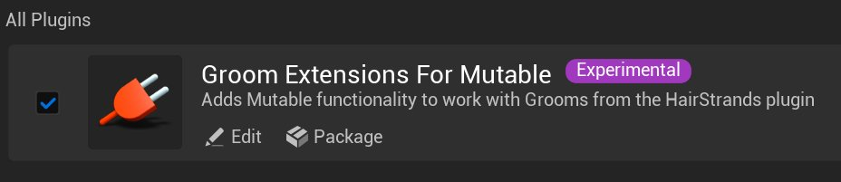
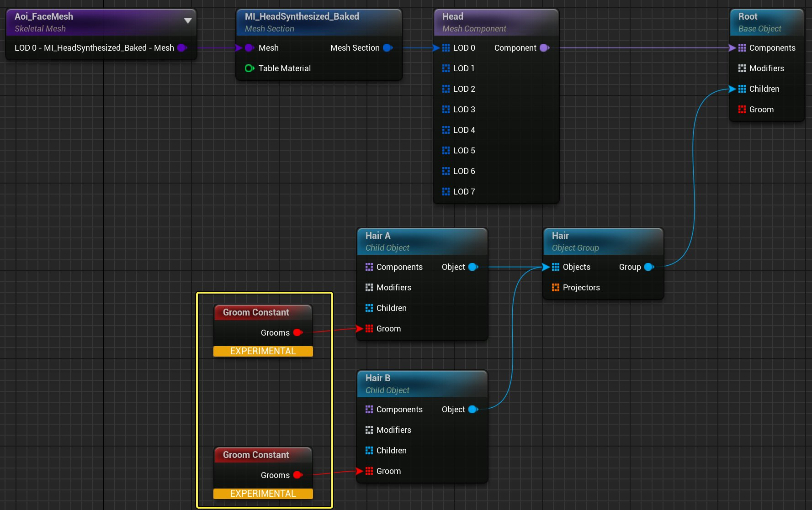
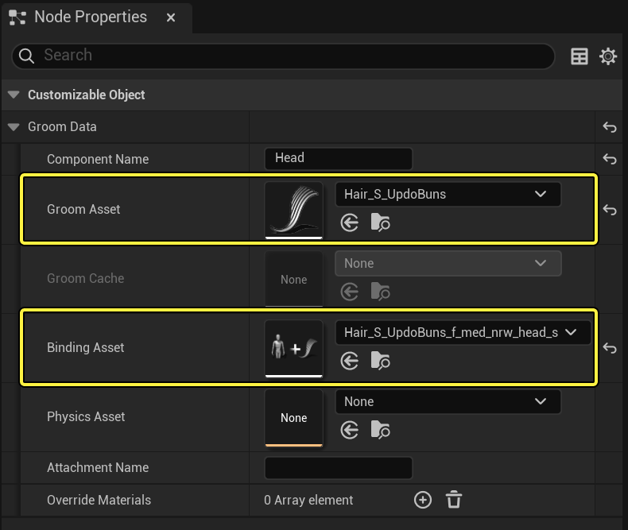

# 使用Groom和Mutable

> 路径：虚幻引擎5.7文档 / 管理内容 / Mutable骨骼网格体生成 / Mutable开发指南 / 使用Groom和Mutable

> 原始页面：https://dev.epicgames.com/documentation/unreal-engine/using-grooms-with-mutable-in-unreal-engine

## 要求

要搭配使用[Groom](../../../hair-rendering-and-simulation/index.md)和Mutable，需要在 **项目设置（Project Settings）** 中开启 **Grooms Extensions For Mutable** 插件。

启用后，你将在现有 **Object** 节点上看到一个新的引脚。

![Groom Pin]](../../../../../assets/images/d2/d2decf33d209ebeb749705f043cb286bbc32b225582590a1d492e3bf199365f6.jpg)

## 用法

Groom可以被添加到由Mutable标记的所有骨骼网格体组件上（请参阅[节点网格体组件](https://github.com/anticto/Mutable-Documentation/wiki/Node-Mesh-Component)）。Groom组件作为被标记骨骼网格体组件的子级被动态创建。

要使用Groom，请执行以下操作：

1. 创建一个新的Groom Constant节点，并使用组件名称指定要绑定到的组件。

   
2. 在 **节点属性（Node Properties）** 面板中，指定 **Groom资产（Groom Asset）** 和 **绑定资产（Binding Asset）** 。绑定资产必须具有与绑定的骨骼网格体组件中的 **目标骨骼网格体（Target Skeletal Mesh）** 相同的骨骼网格体。其他属性将被自动复制到动态创建的Groom组件中。

   
3. 将新节点连接到 **Object** 节点。请注意，Groom Constant节点可以使用Group节点有条件地被激活。

## 当前局限

- 修饰符节点无法应用于由groom绑定的网格体组件。
- Mutable生成的骨骼网格体的LOD数量必须与绑定资产中的源骨骼网格体的LOD数量相同。
