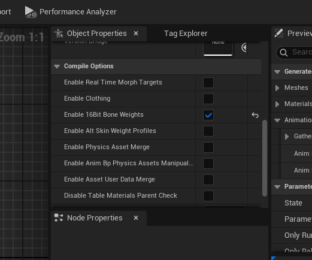
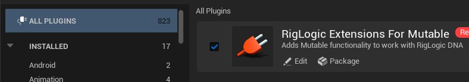
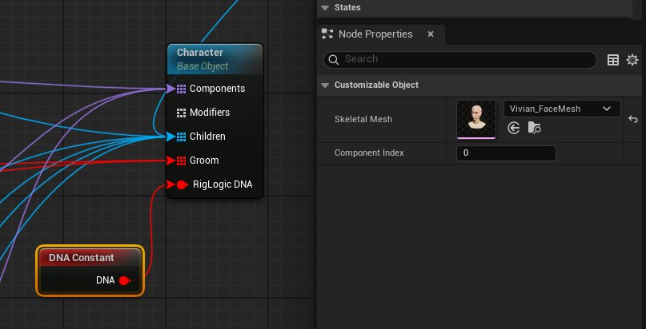
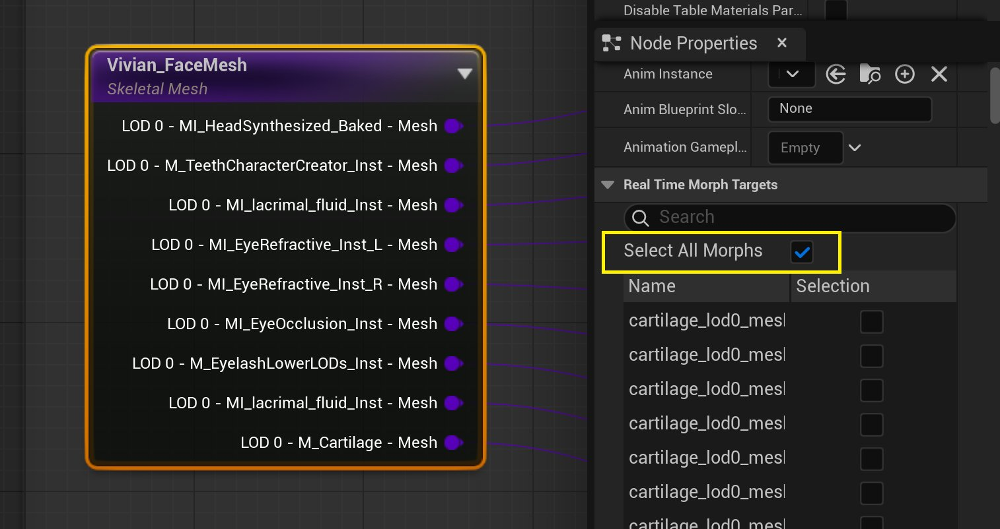
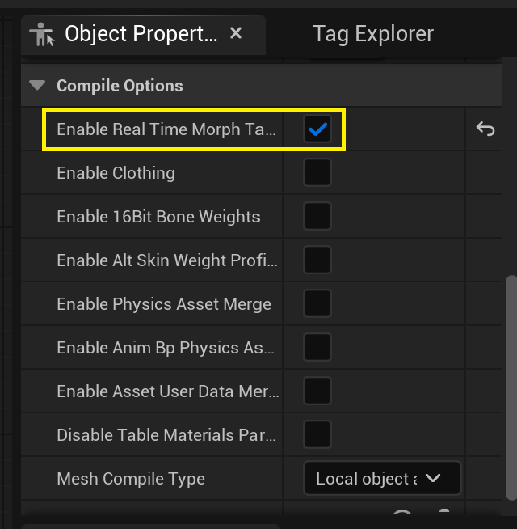

# 使用Mutable和MetaHuman

> 路径：虚幻引擎5.7文档 / 管理内容 / Mutable骨骼网格体生成 / Mutable开发指南 / 使用Mutable和MetaHuman

> 原始页面：https://dev.epicgames.com/documentation/unreal-engine/using-mutable-and-metahumans-in-unreal-engine

你可以使用以下文档了解如何搭配使用MetaHuman资产和Mutable角色。

## 搭配使用Mutable和MetaHuman资产

Metahuman框架为开发者提供了高度逼真的人类角色创建和动画制作的能力。MetaHuman Creator和Editor只能在云服务上使用，这使得无法在游戏项目中对角色进行实时自定义和编辑。无论是在编辑器中还是在游戏中，你都可以使用Mutable插件强大的自定义功能，增强Metahuman框架的功能。

## 如何搭配使用Mutable和MetaHuman资产

你可以直接使用来自 **Quixel Bridge** 的MetaHuman骨骼网格体、材质和纹理资产来设置Mutable可自定义对象，无需任何形式的引擎修改或额外导入过程。你还可以使用此工作流程，将可自定义毛发groom应用到你的MetaHuman角色。

你可以配置图表，在来自Metahuman Creator或其他来源的不同头部、形体和服饰之间进行切换。你可以利用Mutable的所有功能，因此你可以执行以下各种操作：合并网格体部分和纹理以减少绘制调用，对基础形体和布料进行分层处理，裁剪或隐藏网格体的不可见元素；以程序化方式使网格体变形（例如将松散的裤脚塞入高筒靴中），将贴花投射到纹理上，烘焙变形效果等。

## Mutable与MetaHuman资产的可用性

将Mutable插件与MetaHuman资产配合使用的主要好处是可以在游戏中进行自定义，例如，为玩家创建一个允许玩家自创角色的角色自定义器，或者在编辑器中创建无数个NPC角色变体，这些变体可以被烘焙成常规的骨骼网格体，并且可以在项目开发过程中进行多次迭代。

有一个关键点经常被人忽视，即你可以使用Mutable仅通过图表从Metahuman角色中删除LOD（细节级别）、部分和骨骼。然后，你可以将这些生成的模型烘焙为经过优化的骨骼网格体资产，或者让Mutable在游戏中生成它们。Metahuman角色对性能要求很高，许多项目不需要或无法承受使用完整角色。使用Mutable生成模型组合的主要优势是，如果需要在Metahuman Creator中修改角色，只需要重新导入资产并覆盖现有资产即可。由于这些资产仍将连接到Mutable图表，Mutable将自动重新应用优化。传统工作流程每次都需要手动编辑MetaHuman资产才能更改角色外观，相比之下此工作流程的效率更高。

## 搭配使用Mutable和MetaHuman角色的局限性

Mutable无法执行Metahuman所擅长的复杂面部创建和混合操作，因为所有内容都已烘焙到网格体中，Mutable无法访问这些信息。要编辑MetaHuman角色的面部，必须在Metahuman Creator中手动编辑，之后才能被导入到UE中并输入到Mutable可自定义对象图表中，而此时面部的实际物理外观将保持固定。从这一步开始，你对面部或头部所能做的物理修改仅限于Mutable工具所提供的功能。你只能执行以下操作：切换不同的固定头部，更改材质参数，修改纹理或在纹理上进行投影，程序化重塑或裁剪网格体。

## 配置Mutable以获得最佳Metahuman效果

尽管你可以使用Quixel Bridge将MetaHuman资产导入到虚幻引擎编辑器中，而且此类资产可立即用于Mutable，但你需要调整一些Mutable配置，使资产更好地工作，特别是在蒙皮和动画方面。默认情况下，Mutable可能未设置为最佳Metahuman操作所需的骨骼影响数量及其精度。

要启用 **12骨骼影响（12 bone influences）** ，请修改项目的 **配置文件夹** 中 `Engine\Plugins\Mutable\Config\DefaultMutable.ini` 或等效文件中的 **CustomizableObjectNumBoneInfluences** 属性，并将其修改为 `twelve` 。

`CustomizableObjectNumBoneInfluences=Twelve`

要启用 **16位骨骼权重（16 bit bone weights）** ，请打开基础 **可自定义对象** ，转到 **对象属性（Object Properties）** 选项卡，并在 **编译选项（Compile Options）** 分段中启用 **启用16位骨骼权重（Enable 16bit Bone Weights）** 属性。

## 启用和使用Mutable RigLogic Extensions DNA插件

为了使MetaHuman角色的面部动画正常工作，你必须设置 **Metahuman DNA** 。如果未正确设置，面部骨骼将出现错误姿势，最终角色可能会在面部出现奇怪的皱纹瑕疵。要设置MetaHuman DNA与Mutable一起使用，请执行以下操作：

1. 确保安装并启用 **RigLogic Extensions for Mutable** 插件。要访问项目中已安装的插件，你可以在 **菜单栏** 中找到 **编辑（Edit）** > **插件（Plugins）** ，并使用 **搜索栏** 搜索 **RigLogic Extensions For Mutable** 。

   
2. 然后，在MetaHuman的角色蓝图中使用 **DNA Constant** 节点，将 **DNA** 输出引脚连接到角色的 **Object** 节点上的 **RigLogic DNA** 输入引脚。连接引脚后，选择 **DNA Constraint** 节点，并使用 **骨骼网格体（Skeletal Mesh）** 属性的资产选择菜单，选择包含你希望在该对象节点上使用的DNA的Metahuman面部UAsset。

## 使用正确的动画蓝图

为了获得正确的面部动画，所生成的面部骨骼网格体应设置为使用Metahuman提供的后期处理动画蓝图，但如果你将 `Face_Archetype` 骨骼网格体设置为面部组件节点中的参考网格体，Mutable应自动复制相应的动画蓝图。

## 将面部变形传递给GPU

为了使 `LOD0` 面部动画在放大时显示完全正确，你应将面部所有变形设置为 **实时（realtime）** 。为此你可以在节点的 **细节（Details）** 面板中启用 **选择所有变形（Select All Morphs）** 属性。

> [!NOTE]
> 默认情况下，出于性能考虑，这些面部变形会被烘焙或删除。
>
> 如需详细了解使用MetaHuman面部变形和Mutable，请参阅文档的[实时变形](../mutable-real-time-morphs/index.md)小节。

此外，请确保在 **自定义对象的** **对象属性（Object Properties）** 选项卡中启用 **启用实时变形目标（Enable Real Time Morph Targets）** 属性，以启用实时变形。

## 毛发Groom

要使用groom，请参阅[Groom](../using-grooms-with-mutable/index.md)页面中的要求。

所有适用于原始MetaHuman的groom都可以使用，但可能需要重新绑定。如果Mutable生成的面部网格体在结构上与groom绑定中的原始网格体不同（例如LOD数量、部分数量或顺序不同），则可能需要重新绑定groom。要重新绑定groom，你必须从 **可自定义对象编辑器** 预览视口中烘焙生成的面部网格体，然后使用烘焙的网格体和原始groom创建新的绑定。

> [!NOTE]
> 在虚幻引擎的将来构建中，如果支持在游戏中重新绑定毛发groom，此步骤可能不再必要。
