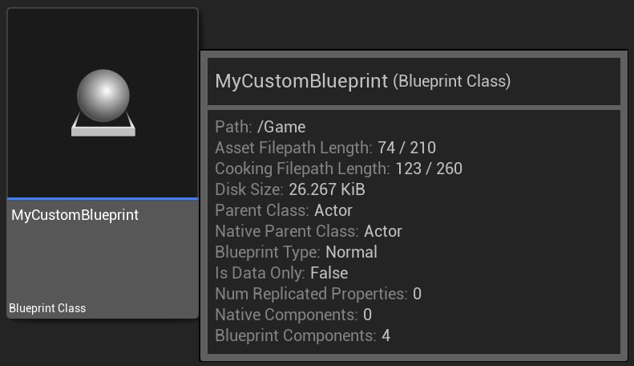
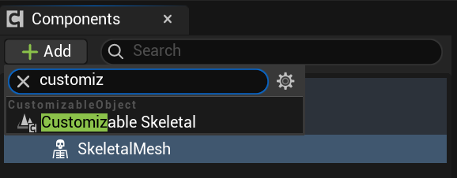
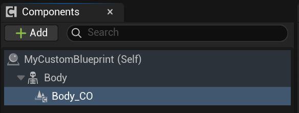
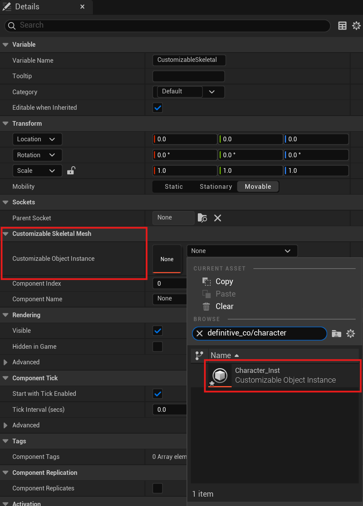
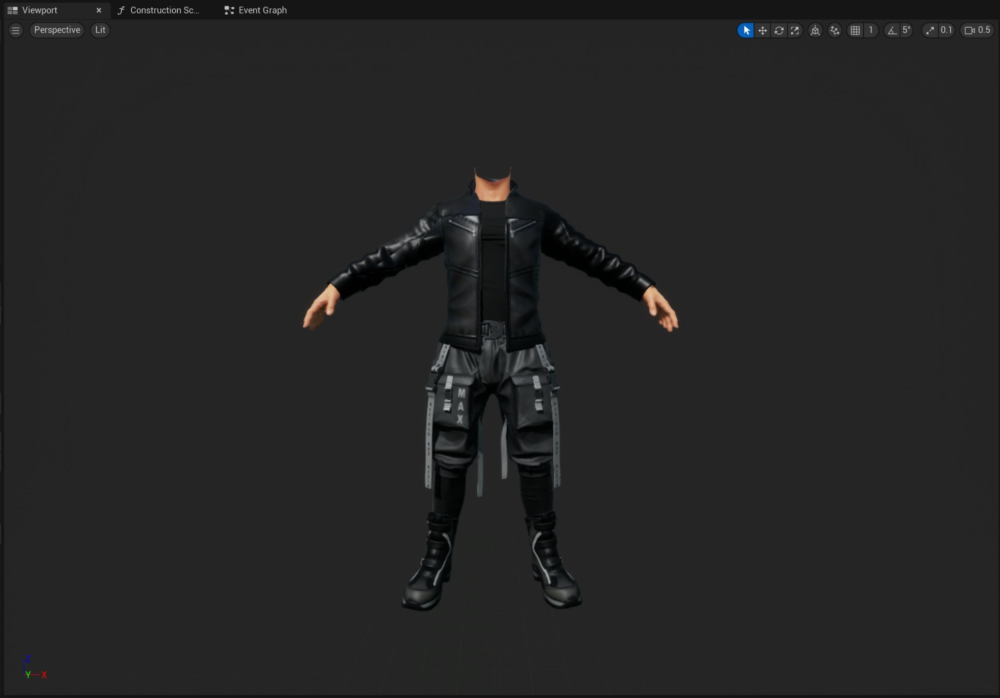
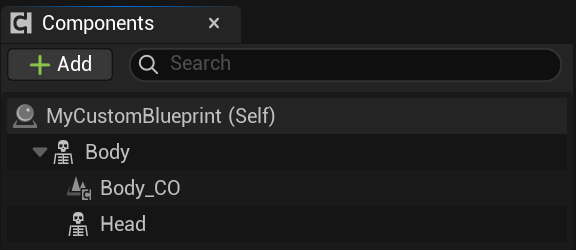
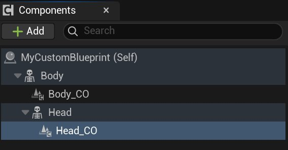
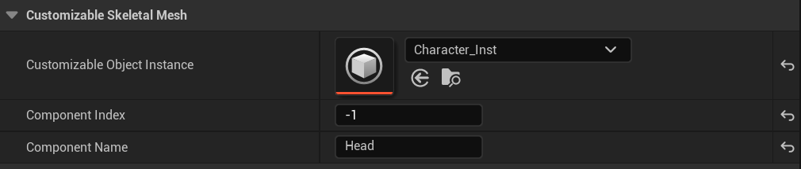

# 从蓝图使用Mutable

> 路径：虚幻引擎5.7文档 / 管理内容 / Mutable骨骼网格体生成 / Mutable开发指南 / 从蓝图使用Mutable

> 原始页面：https://dev.epicgames.com/documentation/unreal-engine/using-mutable-from-blueprint-in-unreal-engine

你可以使用以下文档了解如何在蓝图中设置和使用Mutable角色。

## 创建可自定义角色

你可以使用以下步骤在蓝图中创建一个新的Mutable角色。

1. 创建一个新的 **Actor** 蓝图。创建蓝图后，为该资产命名并打开它。

   

   > [!NOTE]
   > 或者，你也可以使用具有骨骼网格体组件的类/蓝图。
2. 在蓝图编辑器的 **组件（Components）** 面板中，选择 **骨骼网格体（Skeletal Mesh）** 组件，然后添加新的 **可自定义骨骼（Customizable Skeletal）** 组件作为子组件。

   
3. 将 **骨骼网格体（Skeletal Mesh）** 组件和 **可自定义骨架（Customizable Skeletal）** 组件分别命名为 `Body` 和 `Body_CO` 。

   
4. 选择 **骨骼网格体（Skeletal Mesh）** 组件，然后在 **细节（Details）** 面板中找到 **可自定义骨骼网格体（Customizable Skeletal Mesh）** 分段，并使用资产选择下拉菜单在 **可自定义对象实例（Customizable Object Instance）** 属性中设置要使用的实例。

   
5. 然后，将骨骼网格体组件的 **组件名称（Component Name）** 属性设置为 `Body` 。经过此操作，你将在蓝图的视口中看到角色的形体。

   
6. 接下来，为角色的头部添加一个新的 **骨骼网格体（Skeletal Mesh）** 组件。它应该是 `Body` 骨骼网格体组件的子组件。然后将新的骨骼网格体组件命名为 `Head` 。

   
7. 创建一个新的 **可自定义骨架（Customizable Skeletal）** 组件，作为 `Head` 骨骼网格体组件的子组件，并将其命名为 `Head_CO` 。

   
8. 选择 `Head` **骨骼网格体（Skeletal Mesh）** 组件，添加我们已添加到形体组件的相同实例，然后将 **组件名称（Component Name）** 属性设置为 `Head` 。

   

现在，你的Mutable角色已在Actor蓝图中设置完成，并且在蓝图视口中可见。

> 图片已省略：完成的角色设置

## 更改参数

参数由实例存储，可以使用API节点进行访问或修改。你可以参考以下示例，了解如何根据参数类型设置参数值。

### 布尔参数

> 图片已省略：布尔参数设置

### 整型参数

> [!NOTE]
> 务必确保所需选项实际存在于实例中。使用 **FindParameter** 节点搜索现有参数，然后使用 **GetIntParameterAvailableOption** 节点获取可用选项。这两个节点都必须使用 `CustomizableObject` 参考变量作为目标，可以通过 `CustomizableObjectInstance` 参考变量访问。

> 图片已省略：整形参数设置

### 浮点参数

> 图片已省略：浮点参数设置

### 颜色参数

> 图片已省略：颜色参数设置

### 投射器参数

> 图片已省略：投射器参数设置

## 更新实例

要应用参数的最新更改，需要更新实例。在一次或多次更改之后，添加一个 **UpdateSkeletalMeshAsync** 节点，即可实现此操作。

> 图片已省略：更新实例示例蓝图

## 更新的委托

可以将事件注册到此委托。广播将在骨骼网格体更新完成后进行。

| 将事件绑定到更新的委托 | 从更新的委托取消绑定事件 |
| --- | --- |
| bind event to updated delegate节点 | unbind event to updated delegate节点 |

## 参数信息

有时，实例中的参数数量、参数类型或整型参数选项名称等其他信息可能会很有用。这些信息保存在源 `CustomizableObject` 参考变量中，可通过实例访问，并且可以使用以下节点进行检索：

| 节点 | 图像 |
| --- | --- |
| **Get Parameter Count** | get parameter count节点 |
| **Get Parameter Name** | get parameter name节点 |
| **Get Parameter Type by Name** | get parameter type by name节点 |
| **Find Parameter** | find parameter节点 |
| **Get Int Parameter Num Options** | get int parameter num options节点 |
| **Get Int Parameter Available Option** | get int parameter available option节点 |

## 更改状态

你也可以使用节点API查询和更改状态：

> 图片已省略：get current state节点

与更改参数时一样，在更改状态后需要使用UpdateSkeletalMeshAsync节点更新实例。

> 图片已省略：使用当前状态变量设置

## 状态信息

了解 **可自定义对象** 所拥有的状态数量和名称，以及某个状态中参数的数量和名称等信息，可能会很有用。这些信息按 **可自定义对象** 存储，可通过 **CustomizableObjectInstance** 访问，并且可以使用以下节点进行检索：

| 节点 | 图像 |
| --- | --- |
| **Get State Count** | get state count节点 |
| **Get State Name** | get state name节点 |
| **Get State Parameter Count** | get state parameter count节点 |
| **Get State Parameter Name** | get state parameter name节点 |
