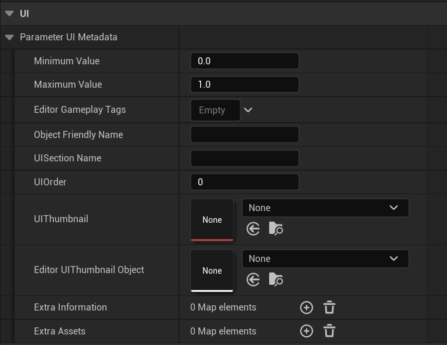
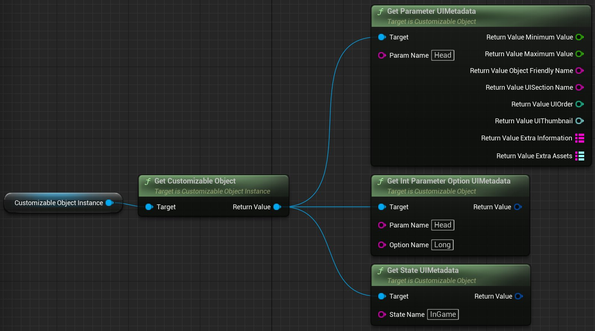
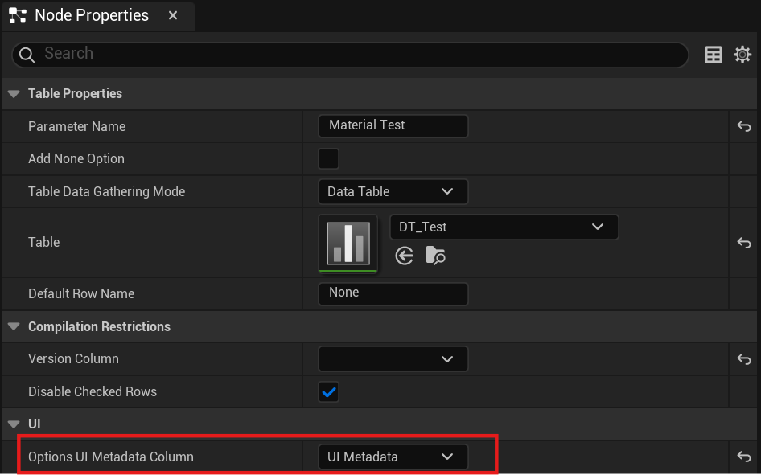
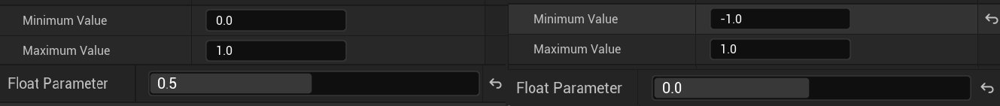
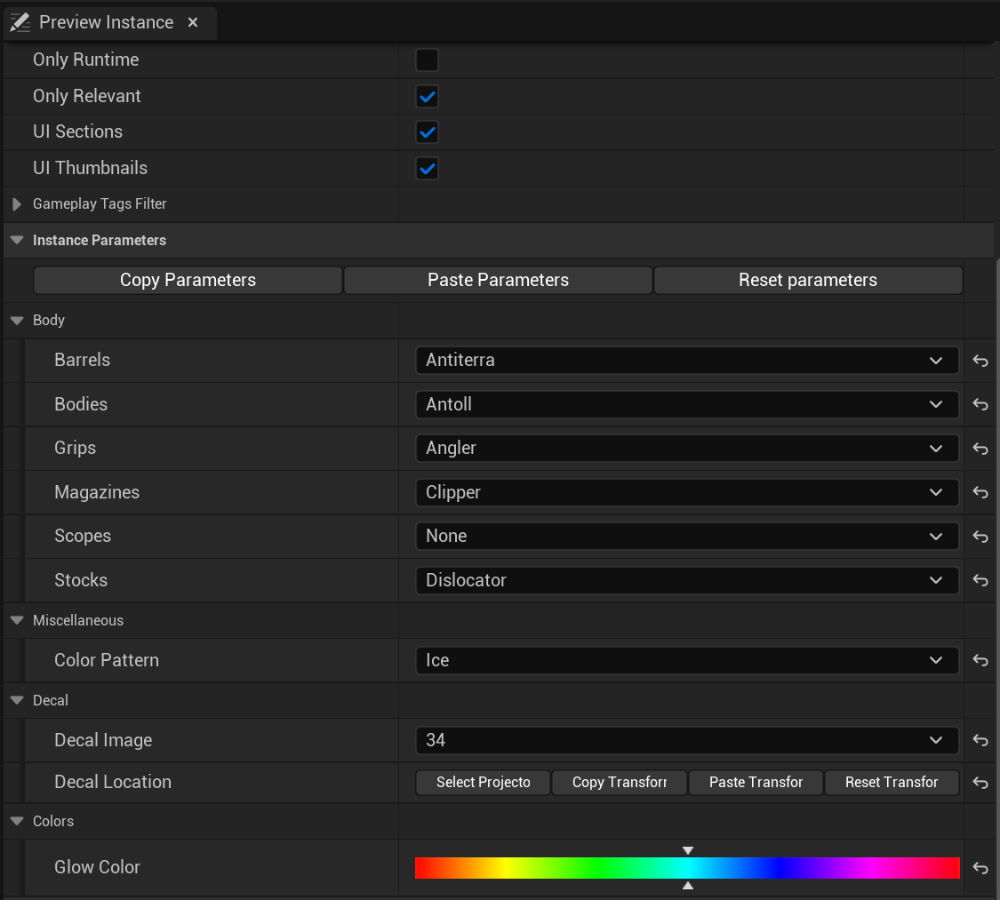
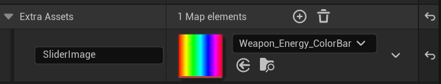

# 使用UI元数据

> 路径：虚幻引擎5.7文档 / 管理内容 / Mutable骨骼网格体生成 / Mutable开发指南 / 使用UI元数据

> 原始页面：https://dev.epicgames.com/documentation/unreal-engine/using-ui-metadata-in-unreal-engine

你可以使用以下文档了解如何搭配使用UI元数据和Mutable角色。

## UI元数据

所有参数和状态节点在 **细节（Details）** 面板中都有一个 **UI** 分段。在此分段，你可以为每个参数和参数选项指定额外信息。这些信息在游戏中可用。UI元数据通常用于帮助生成游戏内UI。

你可以在此参考此分段中的属性列表，列表中附有功能说明：

| 属性 | 说明 |
| --- | --- |
| **最小值和最大值（Minimum & Maximum Values）** | 在这些属性中，你可以设置两个数值标量值，用作节点的最小值和最大值。 |
| **编辑器Gameplay标签（Editor Gameplay Tags）** | 这是一个 **仅限编辑器** 的变量，这意味着它在游戏中不可用。 你可以使用此属性为参数和参数选项添加标签。然后，从 **预览实例（Preview Instance）** 选项卡中，你可以筛选包含任何或所有指定标签的参数选项。 gameplay标签筛选器属性 |
| **对象友好名称和UI分段名称（Object Friendly & UI Section Names）** | 你可以在此设置对象友好名称和UI分段名称。 |
| **UI顺序（UI Order）** | 你可以在此使用整型值为UI元素设置顺序。 |
| **UI缩略图（UI Thumbnail）** | 你可以在此设置UI缩略图。 |
| **编辑器UI缩略图对象（Editor UIThumbnail Object）** | 这是一个 **仅限编辑器** 的变量，这意味着它在游戏中不可用。 当 `UI缩略图（UI Thumbnails）` 属性也启用时，你可以使用此属性在 **实例属性（Instance Properties）** 选项卡中为参数选项设置缩略图。你可以设置任何具有UE缩略图的资产类型。 ui缩略图属性 |
| **额外信息（Extra Information）** | 此选项是一个映射表，你可以使用它来添加带有说明符的额外字符串信息。 额外信息属性 |
| **额外资产（Extra Assets）** | 此选项类似 **额外信息（Extra Information）** 属性，你可以使用它来添加带有说明符的额外资产信息。 额外信息属性 |

## UI元数据API

UI元数据存储在CO中，你可以使用以下方法访问：

- **GetParameterUIMetadata** ：此方法会返回指定参数的UI元数据。
- **GetIntParameterOptionUIMetadata** ：此方法会返回指定参数选项的UI元数据。
- **GetStateUIMetadata** ：此方法会返回指定状态的UI元数据。

## Table节点的UI元数据

通过 **Table** 节点生成的参数也可以包含元数据。你可以使用 **Mutable参数UI元数据（Mutable Param UI Metadata）** 数据类型向 **数据表格结构（Data Table Structure）** 添加新变量，从而为这些资产添加元数据。然后，在 **Table** 节点的 **属性（Properties）** 选项卡中，你可以指定数据表格的哪一列将用作每个参数选项的UI元数据。

## 使用示例

要了解UI元数据如何工作，可自定义对象编辑器和可自定义对象实例编辑器的 **预览实例（Preview Instance）** 选项卡是绝佳示例。

在编辑器中，你可以设置 **最大值（Maximum Value）** 和 **最小值（Minimum Value）** 选项，以确定浮点参数的边界。在以下示例中，中间点的值会根据最大值和最小值而变化。

你可以为每个参数指定 **UI分段（UI Section）** ，从而整理 **预览实例（Preview Instance）** 选项卡的参数。重新编译可自定义对象并启用 **预览实例（Preview Instance）** 的 **UI分段（UI Section）** 属性后，所有参数将被归入相应的分段中。未指定分段的参数将被分配到名为 **杂项（Miscellaneous）** 的分段。

**预览实例（Preview Instance）** 参数的另一种整理方法是，为 **UI顺序（UI Order）** 选项设值。此设置会根据此值按照从低到高的顺序排列参数。

如果你为 **UI缩略图（UI Thumbnail）** 选项指定纹理，或为 **UI缩略图编辑器（UI Thumbnail Editor）** 选项指定UAsset，则每个参数选项将在选项名称旁边显示缩略图。

> [!NOTE]
> 如果两个选项中都有值，则显示的缩略图是为 **UI缩略图（UI Thumbnail）** 选项设置的Texture2D。

最后，编辑器UI还有一个如何使用 `Extra Assets` 映射图的示例。如果你为浮点参数添加新的映射项，将 **键（Key）** 设为 `SliderImage` 并指定UTexture2D资产，则浮点参数的滑块会将此纹理设置为控件的背景。

