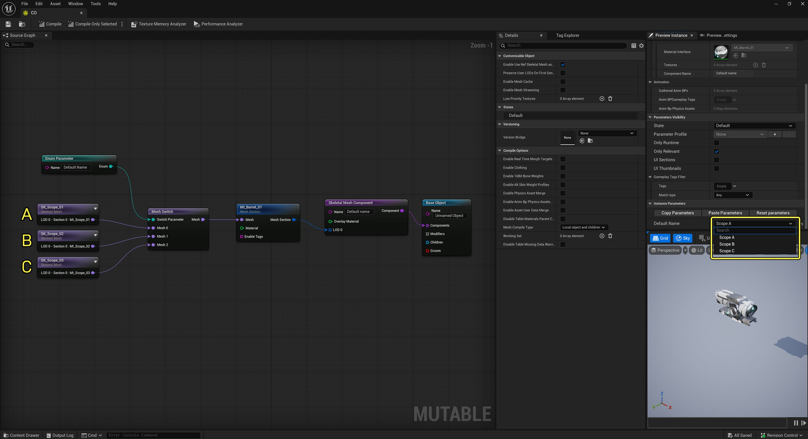
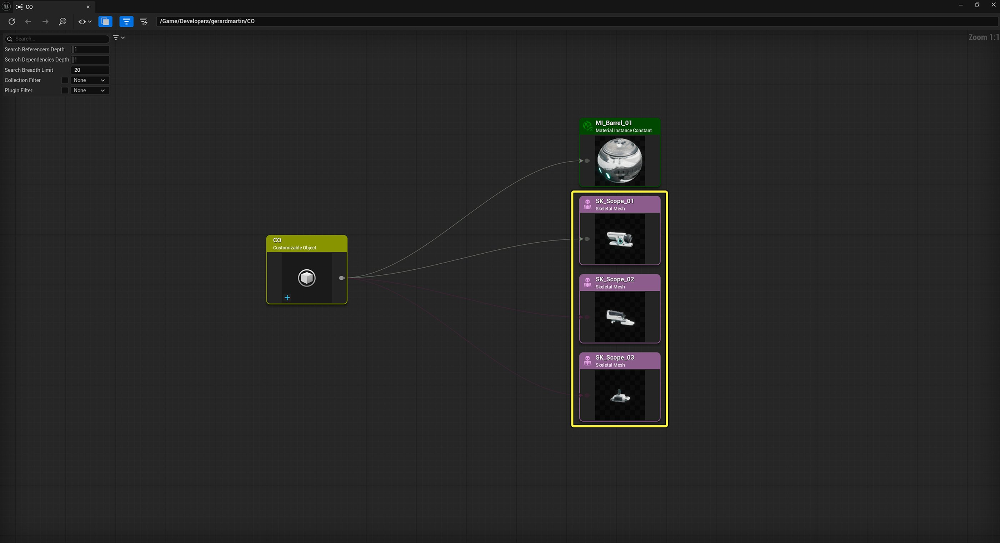
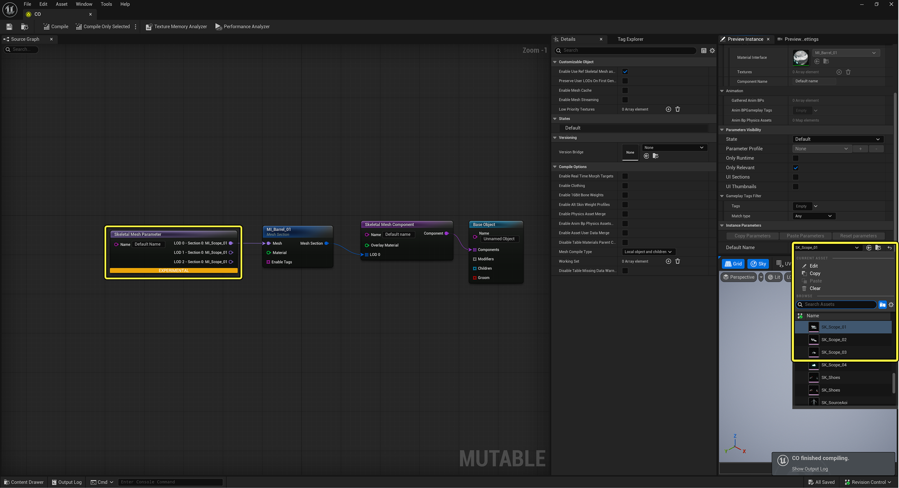
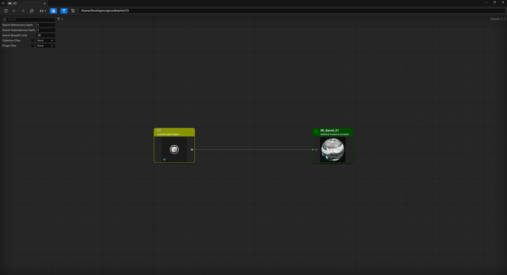

# Mutable中的无数据可自定义Object

> 路径：虚幻引擎5.7文档 / 管理内容 / Mutable骨骼网格体生成 / Mutable优化和调试 / Mutable中的无数据可自定义Object

> 原始页面：https://dev.epicgames.com/documentation/unreal-engine/dataless-customizable-objects-in-mutable

**无数据可自定义对象**是一个标准的**可自定义对象（Customizable Object）**，其输入节点为游戏内可更改的**参数节点**。

你可以通过替换以下节点类型，将任何可自定义对象转换为无数据形式：

| 常量节点（Constant Nodes） | 参数节点（Parameter Nodes） |
| --- | --- |
| 纹理节点（Texture Node） | 纹理参数节点（Texture Parameter Node） |
| 骨骼网格体节点（Skeletal Mesh Node） | 骨骼网格体参数节点（Skeletal Mesh Parameter Node） |
| 材质节点（Material Node） | 材质参数节点（Material Parameter Node） |
| Table节点 | T/ SK/ M 节点（T / SK / M Node） |

替换所有节点并非必要条件。 你可以混合使用常量节点和参数节点。 简而言之，你只会在参数节点的输入上利用无数据特性。

### 相对于可自定义Object的改进

- **更快的编译时间**：参数节点的输入不会被编译，而是在运行时进行转换。
- **加密功能**：现在加密功能开箱即用。 由于输入不再被编译（它们是普通的**UObjects**），现在可以像往常一样对它们进行加密。
- **常规UE工作流程**：使用旧的常量节点时，你必须记住网格体和参数会在特殊的烘焙过程中嵌入到可自定义对象中，而原始资产仅限编辑器使用。 使用新的无数据系统，其工作方式就像任何其他UE系统一样——比如材质（Materials）。
- **可能更小的包**：以前如果在Mutable之外引用了输入，它会在包中包含两次：一次作为编译的**Mutable资源**，一次作为UObject，这就是不建议这样做的原因。 由于参数输入不再被编译，这种情况不再存在。

### 局限性

- **性能稍低**：运行时转换和一些优化（如生成常量）无法在编译时应用。
- **没有可用选项**：输入参数没有可用选项列表。 这意味着游戏程序员现在需要负责限制哪些输入可以传递给参数。

## 新建参数

作为常规参数，新的**纹理（Texture）**、**骨骼网格体（Skeletal Mesh）**和**材质参数（Material Parameters）**可以通过创建**可自定义对象实例（Customizable Object Instance）**并调用以下函数（蓝图或C++）来设置：

C++

```
UFUNCTION(BlueprintCallable, Category = CustomizableObjectInstance)void SetTextureParameterSelectedOption(    const FString& TextureParamName,    UTexture* TextureValue);
```

C++

```
UFUNCTION(BlueprintCallable, Category = CustomizableObjectInstance)void SetSkeletalMeshParameterSelectedOption(    const FString& SkeletalMeshParamName,    USkeletalMesh* SkeletalMeshValue);
```

C++

```
UFUNCTION(BlueprintCallable, Category = CustomizableObjectInstance)void SetMaterialParameterSelectedOption(    const FString& MaterialParamName,    UMaterialInterface* MaterialValue);
```

此外，在每个参数节点中你可以指定**默认值（Default Value）**。 此默认值是可选的，如果未指定，它将是nullptr。 你可以在可自定义对象中获取这些默认值：

C++

```
UFUNCTION(BlueprintCallable, Category = CustomizableObject)UTexture* GetTextureParameterDefaultValue(    const FString& InParameterName) const;
```

C++

```
UFUNCTION(BlueprintCallable, Category = CustomizableObject)USkeletalMesh* GetSkeletalMeshParameterDefaultValue(    const FString& ParameterName) const;
```

C++

```
UFUNCTION(BlueprintCallable, Category = CustomizableObject)UMaterialInterface* GetMaterialParameterDefaultValue(    const FString& ParameterName) const;
```

请记住，如果设置了默认值，引用的对象将被烘焙。 同时，这些对象的生命周期与可自定义对象相同，因为它们是强引用。

设置完所有参数后。 如要查看结果，你需要调用：

C++

```
UFUNCTION(BlueprintCallable, Category = CustomizableObjectInstance)void UpdateSkeletalMeshAsync(    bool bIgnoreCloseDist = false,    bool bForceHighPriority = false);
```

## 示例

**常规节点**： 由于具有仅限编辑器的引用，骨骼网格体引用会显示在**引用查看器（Reference Viewer）**中。



在打包的游戏中，它们不是作为UObject包含，而是作为Mutable资源：



**无数据节点**： 注意，只有骨骼网格体节点已转换为无数据。



材质仍然是常量（而不是参数）：


