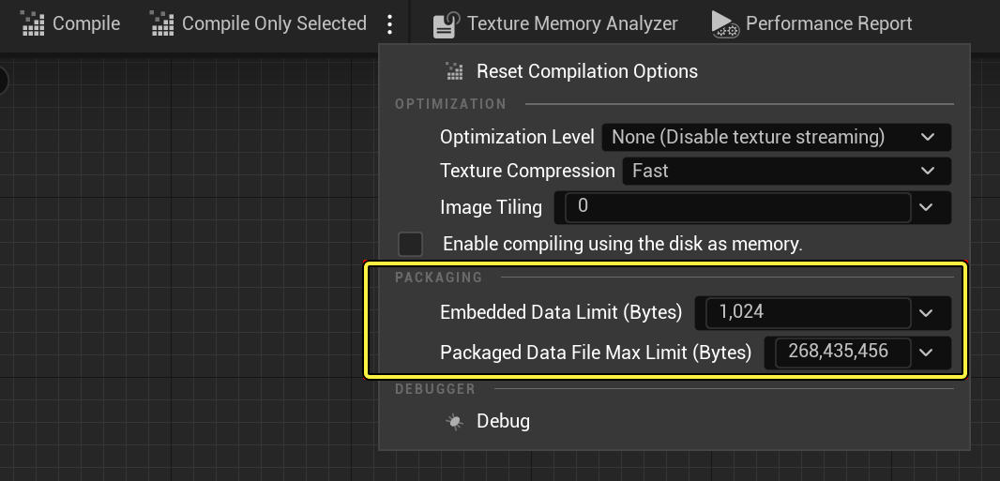

# 打包Mutable项目

> 路径：虚幻引擎5.7文档 / 管理内容 / Mutable骨骼网格体生成 / Mutable优化和调试 / 打包Mutable项目

> 原始页面：https://dev.epicgames.com/documentation/unreal-engine/packaging-mutable-projects-in-unreal-engine

在打包项目时，Mutable会像处理其他资产一样打包数据。

在运行时，Mutable不会使用可自定义对象的源图表。相反，它会将此图表转换为更高效的表示形式，并将其从资产中删除，就像蓝图或材质一样。

源图表中的大多数网格体和纹理都经过处理，并以Mutable的内部格式存储。这些经过处理的资源会被打包到.pak/.ucas容器中。除非被外部引用，否则转换为Mutable格式的源资产不会包含在构建中。

未经过处理的资产作为标准虚幻资产包含在包中。以下是可能包含在构建中的资产列表：

直通网格体和纹理（Mutable不会对其进行处理）

- 材质
- 骨架
- 参考的骨骼网格体
- 烘焙后的实例（不再是Mutable资产）

## 打包选项

- 基础可自定义对象在烘焙阶段进行编译。为了提升运行时性能和纹理质量，Mutable会重载基础对象中指定的一些编译选项。优化级别设置为

  最大（Maximum）

  ，纹理压缩设置为

  高质量（High Quality）

  。

### 批量数据文件

经过处理的资源存储在批量数据文件中，并在生成实例时按需进行流送。这些文件有两种不同的存储格式：

- 批量数据

  格式（

  .ubulk

  和

  .uptnl

  ）
- Mutable格式（

  .mut

  和

  .mut.high

  ）

#### 批量数据格式

批量数据（ `.ubulk` ）是二进制blob的标准文件格式。它是默认格式，也是推荐格式。批量数据具有诸多优势，例如兼容按需内容、允许使用可选数据、加载时间稍快一些（在大型项目中尤为明显），以及与其他标准UE功能的集成度更高。

另一方面，它可能会生成有限数量的 `.ubulk` 文件，在某些情况下可能会导致较差的补丁结果。

#### Mutable格式

Mutable格式（ `.mut` 和 `.mut.high` ）的主要优势在于对输出有更多的控制。它对生成文件的数量没有限制，因此如果配置得当，可以产生较好的补丁效果。降低生成文件的大小上限会增加文件数量，提高精细度。

可以修改 **打包数据文件最大限制（Packaged Data File Max Limit）** 值，在编译选项中为每个对象设置Mutable文件的大小上限。此设置仅在打包项目时相关。

缺点是与部分UE功能的集成度较差。不支持按需内容和可选批量数据文件。

Mutable打包选项。

### 嵌入式批量数据

批量数据的一些blob非常小，流送效率可能不高。可以配置一个大小限制，决定哪些批量数据文件将被流送传输，哪些将被嵌入到对象中。嵌入的资源会占用额外内存，但可以提升性能。

编译选项中的"嵌入数据限制（Embedded Data Limit）"设置可以设置嵌入数据的阈值。通常，将字节值设为 `256` 比较合理。

## 可自定义对象实例资产

实例也会被打包到构建中，但大小可以忽略不计，因为实例只包含参数值。这些值以可移植方式存储，以支持在可自定义对象的源图中添加、删除和更改参数。在运行时，参数和值会进行验证和更新。

如需详细了解，请参阅[存储和复制](../mutable-storage-and-replication/index.md)小节。
