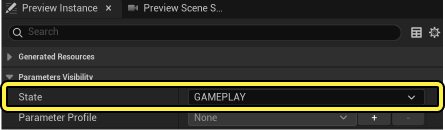
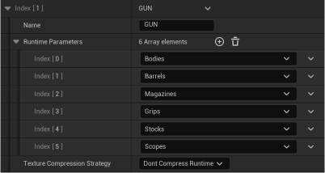
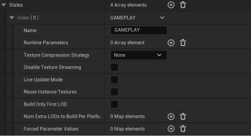

# 使用可自定义状态

> 路径：虚幻引擎5.7文档 / 管理内容 / Mutable骨骼网格体生成 / Mutable优化和调试 / 使用可自定义状态

> 原始页面：https://dev.epicgames.com/documentation/unreal-engine/using-customizable-states-in-mutable-with-unreal-engine

当应用程序使用具有许多参数的复杂可自定义对象时，更新实例可能是一个开销高昂的过程，需要花费很多毫秒。在游戏中，有一些使用场景要求这些更新必须是交互式（不接受重度延迟）。Mutable通过 **状态（States）** 这一概念来解决这些问题。

状态代表游戏中可自定义对象的特定用例。例如，在角色创建过程中的某个时间点，你可能希望让玩家自定义角色的脸部和毛发。在此阶段，你会展示角色头部的特写镜头，并显示以下相关参数的用户界面：毛发颜色、鼻子大小、发型等。在此阶段，你不会修改其他参数，例如T恤颜色或躯干纹身。为了让Mutable提供最佳性能，你可以在可自定义对象中创建一个状态，其中包含你在此阶段将修改的部分参数。系统将生成一个优化版的数据，当在此状态下时将加快更新速度。

在 **编辑器预览实例（Editor Preview Instance）** 窗口中，你可以使用 **状态（State）** 下拉菜单选择要使用的状态：

Mutable状态下拉菜单。

你必须在发起更新之前调用 `void SetCurrentState(const FString& StateName)` ，从而设置可自定义对象实例的状态。

## 运行时参数

**运行时参数（Runtime Parameters）** 数组定义Mutable用于优化给定状态的一组参数。其中每个参数都可以是以下类型之一：

- 对象组
- 浮点参数
- 枚举参数
- 颜色参数
- 纹理参数
- 投射器参数
- 群组投射器参数

运行时参数数组可以在**基础对象（Base Object）** 和 **子对象（Child Object）** 属性的底部找到：

运行时参数数组

## 优化选项

状态还提供更多选项，以便优化可自定义对象实例的构建时间。例如，游戏可能有更多的图形资源可用，因为你处于较小的大厅场景中，而不是在关卡内部。这意味着你可以暂时为角色使用更多内存。对于每个单独的状态，除了运行时参数外，Mutable还提供以下三个优化选项：

- 不压缩运行时纹理（Do not Compress Runtime Textures）

  ：避免对此状态下可能会改变的纹理进行纹理压缩。
- 仅构建第一个LOD（Build Only First LOD）

  ：仅生成对象的LOD 0。
- 强制参数值（Forced Parameter Values）

  ：列出在选定状态时会被修改的枚举参数。例如，在编辑穿在里面的衬衫时，可以隐藏夹克。第一个字段表示枚举参数的名称，第二个字段是强制设置的值。

Mutable优化选项

状态可以在任何基础对象节点处创建。如果没有创建任何状态，则系统会自动创建一个默认状态，默认状态没有优化参数，也没有优化选项。此外，子对象也可以包含其自己的状态。在子对象上定义的状态与在基础对象上定义的状态功能相同。

理想情况下，一个游戏应该有一个没有优化参数的游戏内状态，以及几个自定义状态，用于在不同的游戏内自定义场景中创建和更新对象。
