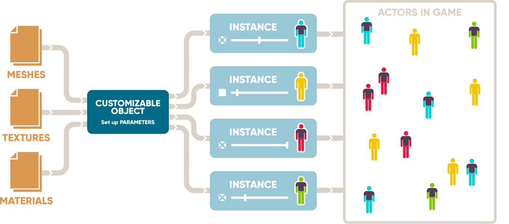

# Mutable概述

> 路径：虚幻引擎5.7文档 / 管理内容 / Mutable骨骼网格体生成 / Mutable概述

> 原始页面：https://dev.epicgames.com/documentation/unreal-engine/mutable-overview-in-unreal-engine

## 什么是Mutable

**Mutable**是一款面向虚幻引擎的工具集，用于在编辑器中或在运行时生成动态骨架网格体、材质和纹理。 它旨在帮助美术师和设计人员创建角色自定义系统，但也可以生成各种动态内容，例如动物、道具以及其他骨骼网格体资产。

Mutable设计为在游戏中高效运行，但它也可以用作为内容管线工具，适用于需要在虚幻编辑器中灵活创建许多骨骼网格体变体的项目。

Mutable设计用于以下方面：

- 支持涉及众多参数和纹理层的深度自定义。
- 支持复杂的网格体交互。
- 支持对GPU性能要求较高的纹理效果，例如包裹投影和多种平面投影。
- 优化内存占用
- 降低着色器开销。
- 减少绘制调用次数。

使用Mutable会在角色生成时导致一些CPU和内存开销。 角色在后台使用一些CPU资源和工作内存生成，生成后就只会使用预先生成的骨骼网格体的资源。

## Mutable功能

Mutable包含以下功能：

### 通用项

- 灵活的参数系统将可自定义Object与多种效果相连接。
- 将可自定义角色拆分为多个资产，以便美术师并行工作。

### 网格体

- 删除隐藏部分，以实现性能最大化并避免z轴冲突。
- 在角色生成时烘焙变形。
- 合并网格体以减少绘制调用次数。
- 根据角色各部分之间的交互使网格体变形。

### 纹理

- 在运行时烘焙纹理图像，结合多种效果。
- 支持多种类型的投射器：平面、圆柱和包裹式。
- 支持多种纹理混合模式：正片叠底、柔光、强光、加深、减淡等。
- 管理UV布局，以动态删除不必要的纹理部分。

### 动画和物理效果

- 整合多个部分的动画图表。
- 将碰撞物理资产与网格体一起合并和变形。
- 在角色生成时管理布料模拟数据。

### 性能

- 灵活实例化自定义角色。
- 支持运行时LOD管理。
- 支持多种状态以根据不同用例调整角色生成。
- 支持按需生成的纹理流送。

## 可自定义Object和Actor

下图显示了如何使用网格体、纹理和材质进行角色自定义。 该系统的主要概念包括**CustomizableObject**资产、**CustomizableObjectInstance**资产，以及使用这些资产的作为特殊组件的Actor。

可自定义对象的构造

*Mutable使用可自定义对象（CustomizableObject）资产、可自定义对象实例（CustomizableObjectInstance）资产以及具有特殊组件的Actor来创建最终资产。*

### 可自定义Object

可自定义Object是添加到虚幻引擎的一种新型资产，代表一个可以使用Mutable进行自定义的对象。 它包括可以应用于它的所有可能变体。 它定义在运行时由玩家或游戏代码控制的参数，以及这些参数如何影响最终对象。

你可以在**内容侧滑菜单Content Drawer**或**内容浏览器（Content Browser）**中通过**新增（Add New）**菜单创建**可自定义Object**：

*创建可自定义对象。*

### 参数

可自定义对象包含多个可以在运行时修改的参数。 参数有以下几种类型：

- **滑块参数**：带有小数的数值参数，范围在0.0到1.0之间。 这些参数通常由[节点-浮点-参数](https://github.com/anticto/Mutable-Documentation/wiki/Node-Float-Parameter)显式创建，用于纹理效果、网格体变形等连续效果。
- **枚举参数**：表示预定义选项集中的一个选项。 这些参数可以由[节点-对象-组](https://github.com/anticto/Mutable-Documentation/wiki/Node-Object-Group)创建以选择子对象，或由[节点-枚举-参数](https://github.com/anticto/Mutable-Documentation/wiki/Node-Enum-Parameter)创建以选择一个选项或多个[节点-切换](https://github.com/anticto/Mutable-Documentation/wiki/Node-Switch)。
- **复选框参数**：表示两种可能性，即启用或禁用。 这些参数由[节点-对象-组](https://github.com/anticto/Mutable-Documentation/wiki/Node-Object-Group)创建（当组的类型为"Toggle Each"时）。
- **颜色参数**：表示带有Alpha通道的颜色，使用四个数值浮点值的向量，范围在0.0到1.0之间。 这些参数由[节点-颜色-参数](https://github.com/anticto/Mutable-Documentation/wiki/Node-Color-Parameter)创建。
- **投射器参数**：表示可以在运行时修改位置的投射器。 这些参数由[节点-投射器-参数](https://github.com/anticto/Mutable-Documentation/wiki/Node-Projector-Parameter)创建。

### 可自定义对象实例

**可自定义对象实例**是与Mutable一起使用的一种新型资产。 它表示可自定义对象的一个实例，即一组用于应用于可自定义对象以创建自定义资产的参数值。 例如，如果你有一个用于强盗的可自定义对象，则你从中创建的每个独特强盗都是一个可自定义对象实例。

要从可自定义对象创建实例资产，请右键点击你的可自定义对象并选择**创建新实例（Create New Instance）**：

*创建新的可自定义对象实例。*

## Mutable编辑器

### 可自定义对象编辑器

双击可自定义对象即可打开**可自定义对象编辑器**：

*可自定义对象编辑器。*

界面包含以下面板：

- **源图表（Source Graph）**：包含定义可自定义对象结构的蓝图节点，包括其LOD设置、网格体部分、网格体、纹理、参数以及连接它们的效果。
- **对象属性（Object Properties）**：包含对象的常规属性。
- **节点属性（Node Properties）**：包含所选节点的属性。
- **预览实例视口（Preview Instance Viewport）**：显示对象打开并编译时的3D预览。
- **预览实例参数（Preview Instance Parameters）**：显示预览对象的当前参数。 可以在此处直接修改。 它还可以将当前实例"烘焙"为一组标准的虚幻引擎资产。 详情请参阅[烘焙实例](../mutable-development-guides/baking-instances-using-mutable/index.md)。

编辑器工具栏包含以下元素：

- **保存**：保存当前对象。
- **编译（Compile）**：编译当前对象及其所有子对象并更新预览。 这对于反映图表中的更改是必要的。 如需详细了解编译及其选项，请参阅[性能优化](../mutable-optimizing-and-debugging/index.md)。
- **仅编译选定项（Compile Only Selected）**：仅编译当前对象及其已预览的子对象。 这在可自定义对象非常大时非常有用，可以加快迭代速度。
- **纹理内存分析器（Texture Memory Analyzer）**：打开一个工具面板，显示预览对象的最终纹理及其详细信息，例如最终大小、格式和内存使用情况。
- **性能分析器（Performance Analyzer）**：打开一个工具面板，通过生成许多随机实例并显示许多相关指标（例如三角形计数或生成时间）来对当前对象进行基准测试。

### 可自定义对象实例编辑器

可自定义对象实例编辑器用于查看和修改可自定义对象实例。 它只有两个面板，与可自定义对象编辑器中的预览（Preview）面板和节点属性（Node Properties）面板类似。

## 对象层级

### 对象

Mutable将每个可自定义对象划为一个层级。 每个对象都有一个根节点，该根节点与所有其他节点相连。 这些节点表示组件、网格体、材质、纹理和参数。 任何对象都可以有任意数量的子对象。 子对象可以：

- 向最终对象添加新的网格体和网格体部分
- 扩展另一个对象中已存在的网格体
- 删除另一个对象中的部分网格体
- 修补另一个对象中材质的纹理
- 激活用户定义的标签，这些标签可用于兄弟对象以应用不同的效果。

同时，子对象可以在无限层级中拥有自己的子对象。

### 组

子对象可以按**组**来组织。 组定义对象与其父对象之间有关如何激活子对象的逻辑。 例如，所有T恤子对象可以通过一个对象参数分组，该参数只允许用户一次选择其中一个子对象，或者一个都不选。

以下是通过一个组连接的两个子对象：

每个组都有一个组类型，可以是以下之一：

- **切换（Toggle）**：子对象显示为可切换的选项。
- **至少一个选项（At least one Option）**：必须选择一个子对象。
- **无或一个（None or One）**：可以选择一个子对象。
- **所有选项（All options）**：对象的所有子对象始终处于激活状态。 其表现就好像子对象直接连接到父对象一样。

### Actor组件

单个可自定义对象可以生成多个**Actor组件**。 参数可以同时影响多个组件，也可以有条件地切换它们。 要创建多个组件，请参阅[组件节点参考](https://github.com/anticto/Mutable-Documentation/wiki/Node-Reference#objects-components-and-mesh-sections)。

### 参考骨骼网格体

网格体组件节点有一个名为**参考骨架网格体（Reference Skeletal Mesh）**的属性。 这是一个标准的虚幻引擎骨骼网格体，用于以下原因：

在可自定义对象实例中为此组件生成的所有骨骼网格体，对于Mutable未创建或未修改的所有内容，都会使用参考骨骼网格体的属性进行处理。 这包括诸如LOD距离、物理属性、包围体、骨架等数据。 当第一次创建可自定义对象实例时，参考骨骼网格体会用于每个Actor组件。 可以使用CustomizableObjectSystem类中的函数"SetReplaceDiscardedWithReferenceMeshEnabled"禁用此功能。 如需详细了解，请参阅[从C++使用Mutable](../mutable-development-guides/using-mutable-from-cplusplus/index.md)和[从蓝图使用Mutable](../mutable-development-guides/using-mutable-from-blueprint/index.md)。

因此，项目通常使用简单或通用的骨骼网格体作为参考骨骼网格体。 一种选择是将参考骨骼网格体替换为在编辑器中生成的具有 //通用// 外观的烘焙骨骼网格体。 如需了解详情，请参阅[烘焙实例](../mutable-development-guides/baking-instances-using-mutable/index.md)。

## 多个资产

一个较大的可自定义对象可以拆分为多个资产。 当多个用户处理同一数据以及进行版本控制时，这一点非常重要。 有2个功能可以帮助实现这一点：

- 子对象可以被选为另一资产中对象组的父对象，而不是直接在图表中连接它们。 如需详细了解，请参阅[对象组](https://github.com/anticto/Mutable-Documentation/wiki/Node-Object-Group)和[子对象](https://github.com/anticto/Mutable-Documentation/wiki/Node-Child-Object)节点参考。
- 某些图表节点较为特殊，可从其他资产的图表中[导出](https://github.com/anticto/Mutable-Documentation/wiki/Node-Export-Pin)和[导入](https://github.com/anticto/Mutable-Documentation/wiki/Node-Import-Pin)连接。

这对于编辑器数据很有用，但它与打包游戏中的数据流送无关。 无论可自定义对象是否拆分为多个资产，打包游戏的数据流送都会发生。

## 对象交互

Mutable有多个用于处理对象交互的功能。 其中一个图表即**对象组**，它会创建实例参数，从一组子对象中仅选择一个子对象，因此不可能添加多个子对象。 一个示例是角色帽子的组，它允许你选择一顶帽子或不选择，但绝不能选择两顶帽子。

此外，Mutable有一个系统，用于根据实例中添加的其他对象来创建对象的不同变体。 例如，你有一个角色以及多种发型和帽子。 你可能希望为某些发型创建变体，以便在角色同时佩戴某种类型的帽子时使用。 你可以使用网格体部分变体节点和其他变体节点来实现这一点。

对象交互的另一个示例是使用另一个对象中存在的修饰符，从一个对象中有选择地删除网格体片段。

这两种类型的对象交互都使用标签系统。 你可以定义自己的标签，并在实例中激活对象时启用。 可以在网格体部分节点中添加标签。 然后，有几个节点会根据特定实例中的标签执行不同的操作，例如网格体部分变体节点或使用网格体修饰符裁剪网格体节点。

## 纹理布局

Mutable可以将多个对象中的网格体和网格体部分合并为单个网格体。 它还可以从现有网格体中删除网格体片段。 在执行此操作时，Mutable将修改纹理UV布局以优化内存使用，并尽量减少渲染命令。 默认情况下，Mutable会自动执行此操作，但你也可以通过[Skeletal Mesh节点](https://github.com/anticto/Mutable-Documentation/wiki/Node-Skeletal-Mesh)和[Table节点](https://github.com/anticto/Mutable-Documentation/wiki/Node-Table)中的多个属性进行手动控制。

如需了解详情，请参阅[纹理布局](../mutable-development-guides/texture-layouts/index.md)。

## 状态

状态表示游戏中的一种特定用例（例如游戏中、布料自定义、面部自定义等），可以通过一组参数进行配置，Mutable将准备好这些参数以供修改。 状态用于优化实例更新。 例如，一种状态可以针对面部变化进行优化，另一种状态针对形体变化进行优化，另一种状态针对纹身进行优化，还有一种状态仅针对在Gameplay中可以更改的内容进行优化。 使用状态意味着，当仅更改在为角色所选状态中经过优化的参数时，角色更新时间可以快得多。

如需了解详情，请参阅[状态](../mutable-optimizing-and-debugging/using-customizable-states-in-mutable/index.md)页面。

## 流送

Mutable的数据流送对于减少内存使用非常重要。 一个可自定义的角色可能有数百个选项和自定义部分。 如果没有数据流送，它们就必须同时从磁盘加载到内存中，这会占用许多GB的RAM，而且加载时间也会很长。 Mutable仅流送正在使用的部分，大大减少了内存消耗和加载时间。 此外，当某个部分不再使用时，会相应地进行卸载。
