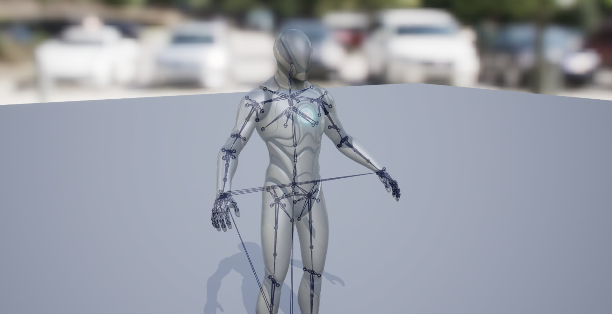
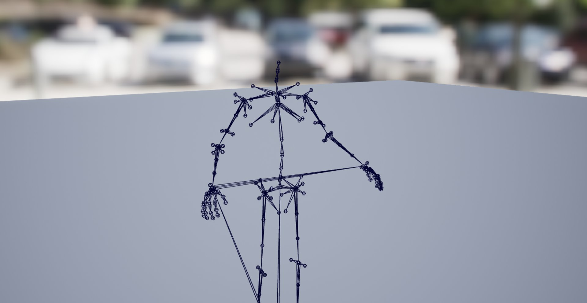
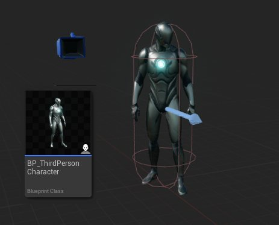
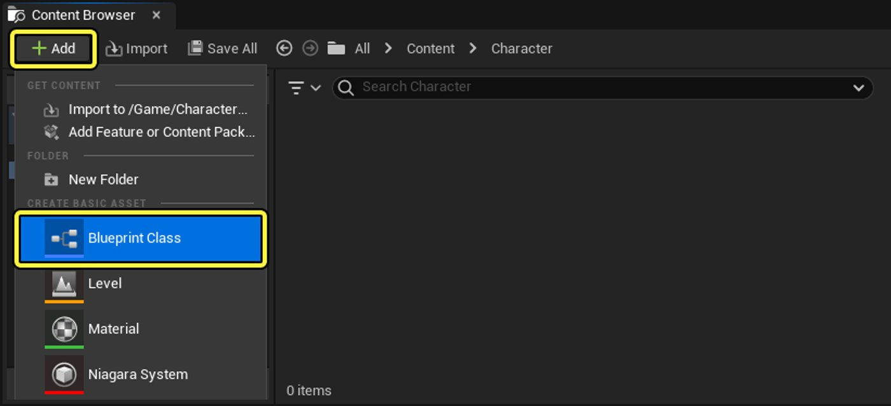
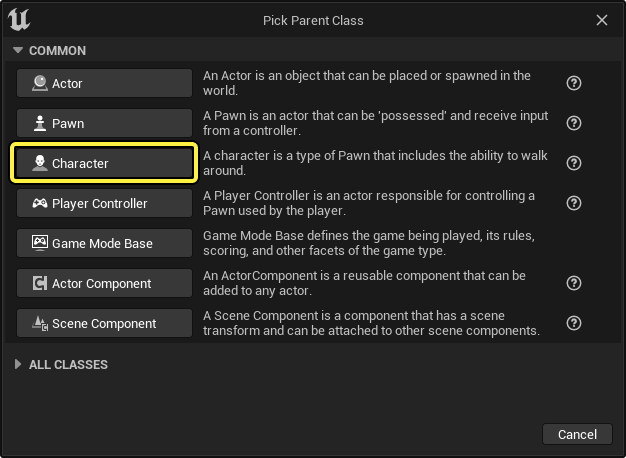
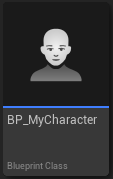
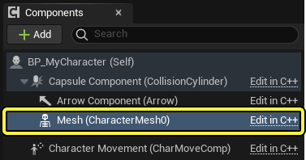
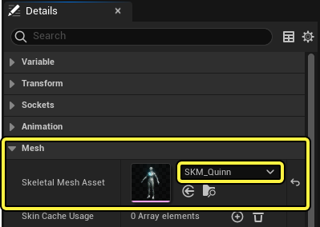

# 骨骼网格体

> 路径：虚幻引擎5.7文档 / 管理内容 / 骨骼网格体

> 原始页面：https://dev.epicgames.com/documentation/unreal-engine/skeletal-mesh-assets-in-unreal-engine

我们在**虚幻引擎**中创建角色时会用到很多独特的资产，这些资产用于渲染视觉几何体、播放动画以及构造实时控制角色行为的逻辑。 虚幻引擎中角色的基础资产是**骨架网格体**资产，其中包含角色的视觉效果网格体，即角色的几何模型渲染，还包含带骨骼数据的角色[骨架](../../animating-characters-and-objects/skeletal-mesh-animation-system/animation-assets-and-features/skeletons/index.md)，而骨骼数据用于制作角色的动画。

骨架网格体资产在外部**数字内容创作**（**DCC**）软件中创建，然后被导出为`FBX`文件。 之后，FBX文件会[被导入到虚幻引擎](../fbx-content-pipeline/fbx-skeletal-mesh-pipeline/importing-skeletal-meshes-using-fbx/index.md)项目中。 将角色导入到虚幻引擎中后，你可以在[骨架网格体编辑器](../../animating-characters-and-objects/skeletal-mesh-animation-system/animation-editors/index.md)中查看和编辑骨架网格体资产的组件，例如角色的[网格体](../../animating-characters-and-objects/skeletal-mesh-animation-system/animation-editors/skeletal-mesh-editor/index.md)、[骨架](../../animating-characters-and-objects/skeletal-mesh-animation-system/animation-editors/skeleton-editor/index.md)、[物理资产](../../gameplay-systems/physics/physics-asset-editor/index.md)和[动画序列](../../animating-characters-and-objects/skeletal-mesh-animation-system/animation-editors/animation-sequence-editor/index.md)属性等。

如需详细了解如何将角色FBX文件导入虚幻引擎中，请参阅以下文档：

- [使用FBX方法导入骨骼网格体](../fbx-content-pipeline/fbx-skeletal-mesh-pipeline/importing-skeletal-meshes-using-fbx/index.md) - 学习导入骨骼网格体。

作为骨骼网格体资产导入到虚幻引擎中的FBX文件将包含角色的模型和骨架。 角色的骨架将作为额外资产导入，即[骨架资产](../../animating-characters-and-objects/skeletal-mesh-animation-system/animation-assets-and-features/skeletons/index.md)，而你可以在[骨架编辑器](../../animating-characters-and-objects/skeletal-mesh-animation-system/animation-editors/skeleton-editor/index.md)中查看和编辑该资产。

ImageAltText

ImageAltText

FBX文件还可以包含角色的动画，并与角色模型一起作为[动画序列资产](../../animating-characters-and-objects/skeletal-mesh-animation-system/animation-assets-and-features/animation-sequences/index.md)导入。 你可以使用[动画序列编辑器](../../animating-characters-and-objects/skeletal-mesh-animation-system/animation-editors/animation-sequence-editor/index.md)查看和编辑动画序列。 在运行时，你可以使用[角色](../../gameplay-systems/gameplay-framework/pawn/characters/index.md)和[动画蓝图](../../animating-characters-and-objects/skeletal-mesh-animation-system/animation-blueprints/index.md)在角色上动态播放动画序列资产，也可以使用[Sequencer](../../animating-characters-and-objects/cinematics-and-movie-making/index.md)在创作的过场动画中使用这些资产。

> 动图已省略：ImageAltText

导入角色的骨骼网格体资产及其随附的骨架资产和动画序列后，可以将骨骼网格体资产直接添加到关卡中。 为了控制骨架网格体资产（作为角色或其他不可操作角色和对象），你必须创建角色蓝图并将骨架网格体作为[网格体组件](../../blueprints-visual-scripting/anatomy-of-a-blueprint/index.md)添加，从而编译游戏和动画的逻辑，以此管理其行为并组装其部件。

## 创建角色蓝图

根据角色和项目需求，可以通过多种方式构建角色蓝图，在这里可以按照构建简单角色蓝图的示例工作流程，将动画应用于关卡中的角色。

要创建角色蓝图，请在**内容浏览器**中导航，并使用**+****添加（(+) Add）**按钮选择**蓝图类（Blueprint Class）**。

然后选择"角色（Character）"类选项并选择"创建（Create）"。

转到**内容浏览器**，**命名**并**打开**角色蓝图资产。

转到蓝图的**组件（Components）**面板，选择**网格体（Mesh）**组件，然后在**细节（Details）**面板中找到**骨架网格体（Skeletal Mesh）**属性。

使用下拉菜单选择**骨架网格体（Skeletal Mesh）**资产。

在**视口（Viewport）**面板中放置骨架网格体，使其与**箭头（Arrow）**和**胶囊体（Capsule）**组件对齐。

保存并编译蓝图后，可以将角色蓝图添加到关卡中。

> 动图已省略：ImageAltText

你可以使用角色蓝图的**事件图表（Event Graph）**和函数创建Gameplay功能按钮和行为。

如需详细了解如何在虚幻引擎中设置角色，请参阅以下文档：

- [设置角色](../../animating-characters-and-objects/skeletal-mesh-animation-system/animation-workflow-guides-and-examples/setting-up-a-character/index.md) - 关于如何在虚幻引擎中设置基本角色或骨架网格体的高级概述。

### 模块化角色

某些角色是使用多个骨骼网格体构建的，这些网格体表示角色的各个部件，并在关卡中组装形成网格体。 在创建可能改变服装或外观的角色时，或者创建的角色具有依赖于Gameplay场景或玩家成就的动态元素时，这种情况很常见。

> 图片已省略：ImageAltText

如需详细了解如何在虚幻引擎中创建模块化角色，请参阅以下文档：

- [使用模块化角色](../../animating-characters-and-objects/skeletal-mesh-animation-system/animation-workflow-guides-and-examples/working-with-modular-characters/index.md) - 通过组合多个骨骼网格体组件来创建角色。

## 为骨骼网格体制作动画

动画序列可以在骨骼网格体的骨架资产上播放。 要播放动画，请将角色蓝图的"网格体（Mesh）"组件的**动画模式（Animation Mode）**属性指定为**使用动画资产（Use Animation Asset）**，然后在**要播放的动画（Anim to Play）**属性的下拉菜单中选择一个动画序列资产。

保存并编译蓝图后，此动画将在关卡中的角色蓝图上播放。

### 动画蓝图

你就可以使用[动画蓝图](../../animating-characters-and-objects/skeletal-mesh-animation-system/animation-blueprints/index.md)创建动画逻辑（例如[混合空间](../../animating-characters-and-objects/skeletal-mesh-animation-system/animation-assets-and-features/blend-spaces/index.md)），以便在关卡中的角色模型上播放动画序列。

要为骨架网格体创建动画蓝图，请打开内容浏览器，选择**添加**（**+**）（Add (+)） > **动画（Animation）** > **动画蓝图（Animation Blueprint）**，然后选择随骨架网格体导入的骨架资产。

> 图片已省略：ImageAltText

你现在可以访问[动画图表](../../animating-characters-and-objects/skeletal-mesh-animation-system/animation-workflow-guides-and-examples/index.md)，该图表可以根据蓝图逻辑来动态地选择动画序列以在角色上播放。

> 动图已省略：ImageAltText

### 为兼容的骨骼网格体制作动画

当多个骨骼网格体资产共享相同或非常相似的骨架结构时，可以将这些资产链接起来。 当骨架使用相同的命名规范共享类似结构时，可以手动设置骨架兼容性。

> 动图已省略：ImageAltText

如需详细了解骨架兼容性和如何跨多个网格体共享动画，请参阅[骨架资产文档的共享骨架小节](../../animating-characters-and-objects/skeletal-mesh-animation-system/animation-assets-and-features/skeletons/index.md#sharing-skeletons)。

### 非骨架动画

除了动画序列之外，还可以使用变形器动画技术为骨骼网格体资产的网格体制作动画。 变形器会对网格体的几何体而不是骨骼进行变换，从而创建更复杂的动画，例如面部表情、皮肤、布料或肌肉运动。

如需详细了解如何使用变形器为骨骼网格体制作动画，请参阅以下文档：

- [变形目标预览器](../../animating-characters-and-objects/skeletal-mesh-animation-system/animation-assets-and-features/morph-target-previewer/index.md) - 动画编辑器中可用编辑模式的用户指南。
