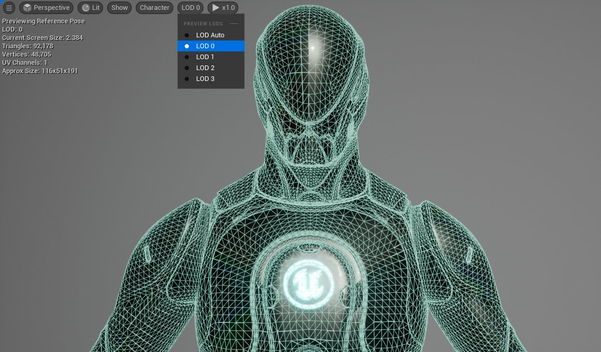
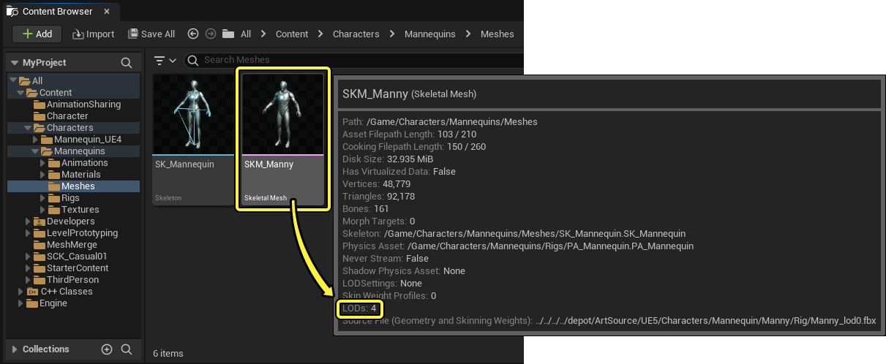
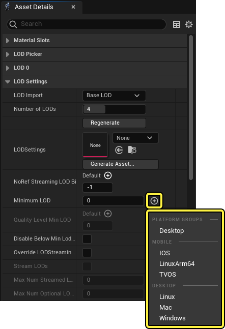
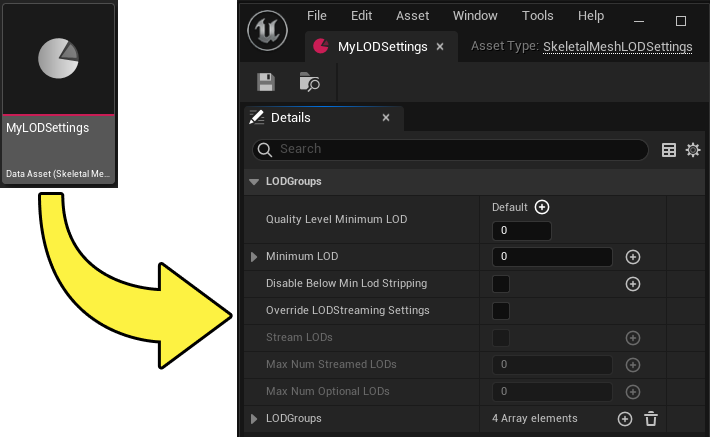
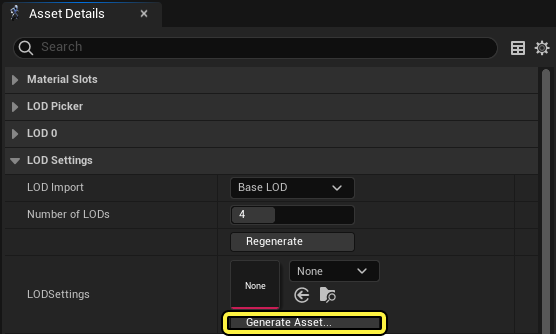

# 每个平台的LOD

> 路径：虚幻引擎5.7文档 / 管理内容 / 骨骼网格体 / 每个平台的LOD

> 原始页面：https://dev.epicgames.com/documentation/unreal-engine/per-platform-lods

在 **虚幻引擎** 中，[骨骼网格体资产](../index.md)可以实时替换为相同角色的具有不同细节级别的不同网格体，这类资产称为[细节级别（LOD）资产](../../../animating-characters-and-objects/skeletal-mesh-animation-system/animation-assets-and-features/skeletons/skeletal-mesh-lods/index.md)。 这些较低分辨率版本的骨骼网格体用于降低角色在远离摄像机时所需的性能成本，因为此时玩家很难感知更高级别的细节。

**移动滑块以观察人体模型骨骼网格体在LOD 0至3时的显示效果**

**LOD** 通常以有序集的形式出现，从全分辨率骨骼网格体作为LOD 0开始，每次增加LOD编号，网格体几何体数量都会减少。 一些较高的LOD编号甚至可以减少角色骨架包含的骨骼数量。 角色包含的LOD数量以及分辨率步长取决于项目的需求。

LOD可以在外部 **数字内容创作** **（DCC）** 软件中手动创作，也可以使用[骨骼网格体缩减工具](../../../animating-characters-and-objects/skeletal-mesh-animation-system/animation-assets-and-features/skeletons/skeletal-mesh-lods/index.md#%E9%AA%A8%E9%AA%BC%E7%BD%91%E6%A0%BC%E4%BD%93%E7%BC%A9%E5%87%8F%E5%B7%A5%E5%85%B7)在引擎中生成。

如需详细了解虚幻引擎中的骨骼网格体LOD，请参阅以下文档：

- [骨骼网格体LOD](../../../animating-characters-and-objects/skeletal-mesh-animation-system/animation-assets-and-features/skeletons/skeletal-mesh-lods/index.md)

## 每个平台的LOD

虽然拥有角色的多个骨骼网格体LOD有助于降低渲染成本，但在内存等资源有限的平台上，存储此信息所需的额外内存可能是一个问题。 设置要基于每个平台使用的默认LOD可能对跨多个平台的项目性能很有益。

以下文档将提供一个示例工作流程，说明如何设置这些默认LOD以跨多个平台调整项目规模。

#### 先决条件

- 你的项目包含一个带有若干LOD的骨骼网格体资产。 如果骨骼网格体资产没有任何关联的LOD，则可以使用

  骨骼网格体缩减工具

  生成一个LOD集。

### 设置每个平台的LOD

在 **内容浏览器（Content Browser）** 中导航到包含LOD集的骨骼网格体资产，然后在[骨骼网格体编辑器（Skeletal Mesh Editor）](../../../animating-characters-and-objects/skeletal-mesh-animation-system/animation-editors/skeletal-mesh-editor/index.md)中打开该资产。

> [!NOTE]
> 通过将鼠标悬停在 **内容浏览器（Content Browser）** 中的骨骼网格体资产上，可以查看一些上下文信息，包括骨骼网格体包含的LOD数量。
>
> 

要为指定的发布平台创建新的最小LOD默认值，请在骨骼网格体编辑器的 **资产细节（Asset Details）** 面板中导航到 **LOD设置（LOD Settings）** 分段下，使用 **（+）添加**（**(+) Add**）按钮为 **最小LOD（Minimum LOD）** 属性添加一个数组，并选择平台或平台组以指定新的最小LOD默认值。

> [!NOTE]
> 可用于指定最小LOD默认值的发布平台列表取决于已安装的平台发布插件。 请参阅[分享和发布项目](../../../sharing-and-releasing-projects/index.md)，详细了解如何设置项目以便在不同平台上发布。

选择平台后，可以指定哪个LOD编号将作为平台将使用的最低或最高质量的LOD。 输入值0将使该平台使用角色的最高分辨率LOD。

(convert:false)

### LOD设置资产

还可以创建和指定LOD设置资产来设置骨骼网格体的LOD设置。 LOD设置资产可以为多个角色和对象应用LOD设置（包括每个平台的LOD最小值）。 使用LOD设置资产可以简化角色LOD设置，从而更有效地跨多个角色和对象创建和编辑每个平台的最小值。

要创建LOD设置资产，请在骨骼网格体编辑器中打开骨骼网格体资产。 在 **资产细节（Asset Details）** 面板中的 **LOD设置（LOD Settings）** 分段下，选择 **LODSetting** 属性中的 **生成资产（Generate Asset）** 选项。

指定资产的 **名称（Name）**，并在项目文件中选择一个位置来保存该资产，然后选择 **创建（Create）**。 现在可以打开LOD设置资产并定义其属性。

LOD设置资产将自动填充并驱动初始骨骼网格体的LOD设置。 若要指定相同的资产来驱动其他角色，可以在骨骼网格体编辑器中打开每个额外的骨骼网格体资产，然后从 **LODSettings** 属性的下拉菜单中选择LOD设置资产。
