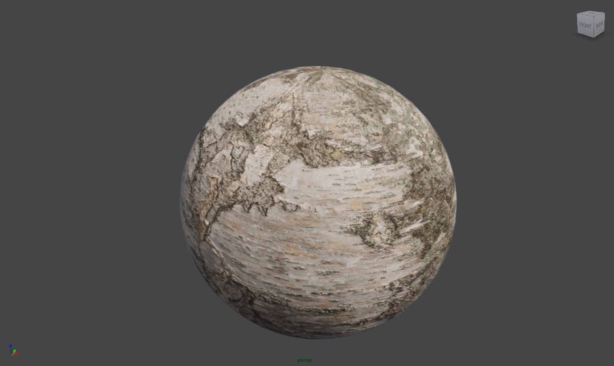
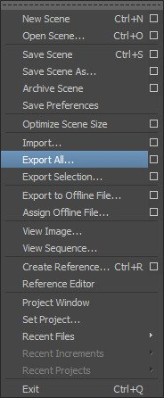
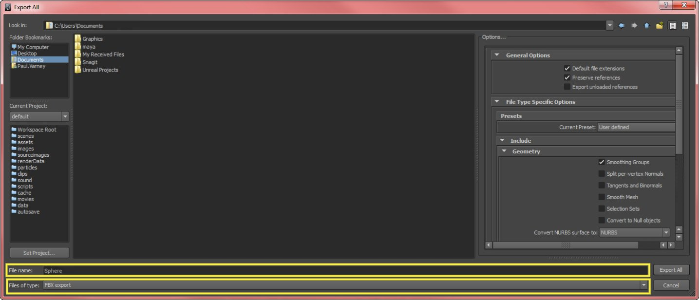
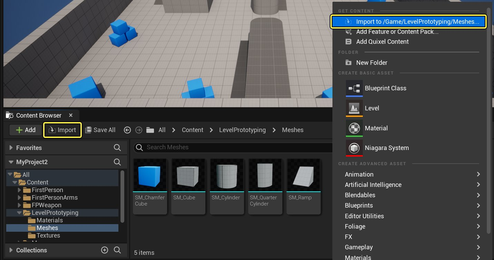
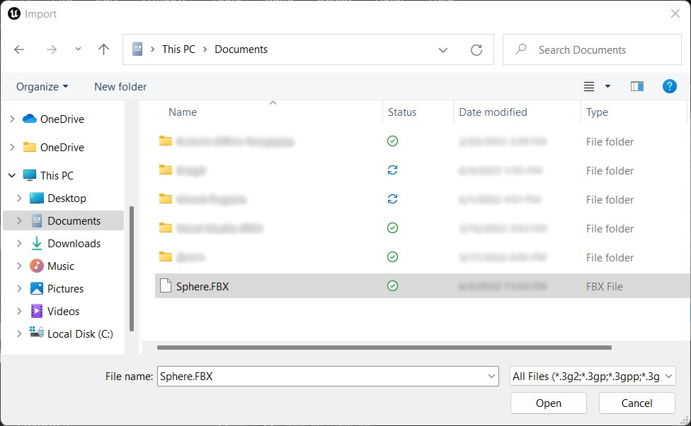
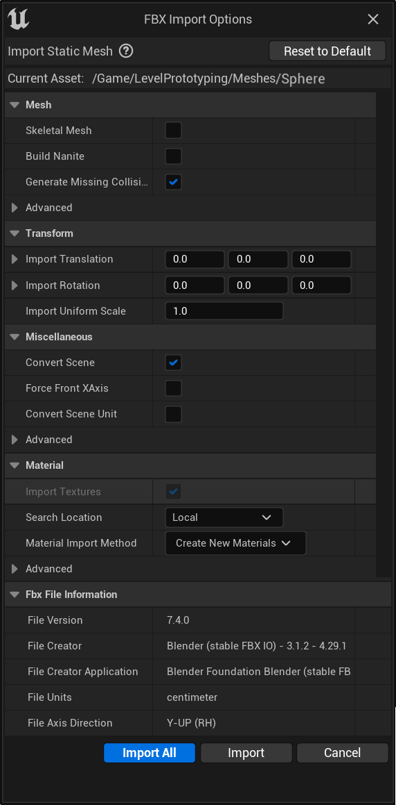
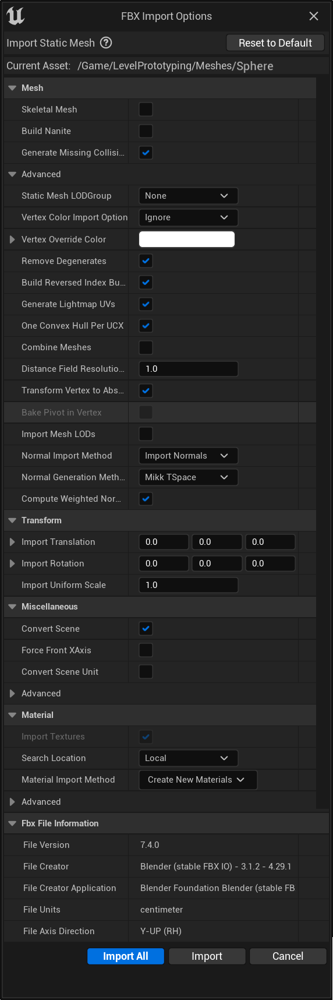
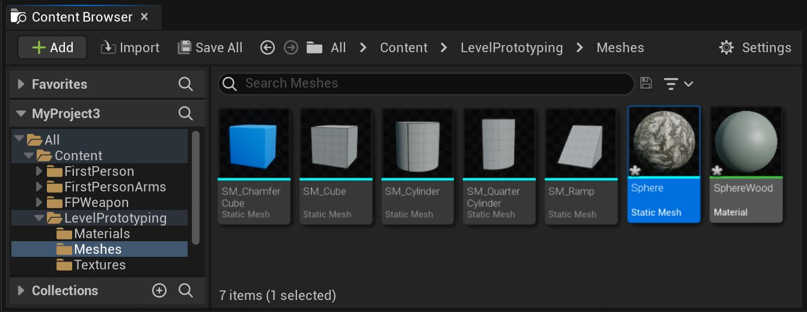

# 导入静态网格体模型

> 路径：虚幻引擎5.7文档 / 管理内容 / 静态网格体 / 导入静态网格体模型

> 原始页面：https://dev.epicgames.com/documentation/unreal-engine/importing-static-meshes-in-unreal-engine

UE5中有很多工具可以帮助您创建场景所需的资源。但有时候，你可能需要在外部应用程序中创建一个资源并将它导入到UE5。在这份基本操作说明中，我们将介绍如何将其他 3D 应用程序制作的静态网格模型导入UE5以便在场景中使用。

## 设置

在UE5中创建场景时，您可能已经用其他应用程序制作了一些 3D 模型，如今希望将它们放入到 UE5 中。为了确保从 3D 建模软件（无论是 Maya、3ds Max 还是其他建模程序）进行顺利迁移，需要先明确一些事项。首先，在建模过程中以及执行导出前，一定要记住 UE5 所用的度量单位是 Unreal 单位：1 个 Unreal 单位等于 1 厘米。另外，只有特定的文件类型才能被导入 UE5，例如 FBX 就是推荐的 3D 对象文件格式。同样，还要确保应用到静态网格模型的贴图和材质均采用了受支持的文件类型。

## 导出

在下面这个示例中，我们希望将这个球体模型从 Maya 导出并放入到我们在UE5中的场景。

在完成建模后，要将它导入到 UE4 首先要做的就是将它从创建网格模型的 3D 应用程序中导出。在这个示例中，我们使用的是 Maya，但您也可以使用其他任何能导出 FBX 文件的应用程序。前往所用应用程序的文件菜单，然后选择 **Export**。

然后选择您要保存网格模型的路径。一定要填写文件名并选择导出网格模型所用的文件类型。（同样推荐 FBX。）

点击查看大图。

## 导入

我们已经从 3D 应用程序导出了网格模型，现在需要建立一个项目用于导入网格模型。如果您已经拥有一个项目，可以忽略此步骤。如果您需要用到一个项目，可以打开启动器并选择一个新项目。关于选用的项目分类和模板以及是否包含 **Starter Content**，均与本次操作说明无关。务必选择一个保存路径并为您的项目命名，然后单击 **Create Project**。

项目加载后，找到您的 **Content Browser**。在您的 **Content Browser** 中浏览各文件夹，为导入的网格模型指定保存位置。在该示例中，我们将球体的网格模型导入名为 **Meshes** 的文件夹。在进入这个要保存网格模型的文件夹之后，您可以选择两种简单方法来导入您的网格模型。第一种方法是 **right-click** **Content Browser** 文件夹中的空白区域，然后在弹出窗口中选择 **Import to...**。您也可以单击 **Content Browser** 顶部的 **Import** 按钮（在下图中以黄色高亮框标出）。

点击查看大图。

选择 **Import to...** 选项或单击 **Import** 按钮之后，浏览至您从 3D 应用程序导出网格模型时为其指定的保存位置。在您找到网格模型后，可以 **double-clicking** 或单击 **Open** 以将其导入。

点击查看大图。

在选择要导入的网格模型并 **double-clicked** 文件或单击 **Open** 之后，会出现 **FBX Import Options** 菜单。默认情况下，它会与左边的图示非常类似。

点击查看大图。

此外，这里还有许多其他导入设置。

点击查看大图。

在本篇教程中，我们在导入时使用默认值就可以了。

这里有一些事项需要注意。如果您希望将您的网格模型导入为一个骨骼网格模型，相应的过程不会有什么变化，只需要选中"网格模型"(Mesh) 部分中的第一个复选框，也就是"导入为骨骼"(Import as Skeletal)复选框。由于我们要将这个网格模型导入为静态网格模型，我们可以保持原样，无需选中该复选框。同样，在按照上一个步骤选择要导入的网格模型时，您可以选择多个网格模型进行导入，而无需为多个不同的网格模型重复这一过程。这时，如果单击 **Import** 可以为每个网格模型选择导入选项，单击 **Import All** 则使用同一组选项来导入所有网格模型。

一旦单击 **Import**，您的网格模型将出现在 **Content Browser** 内，具体来讲就是您选择"导入"(Import) 时所在的文件夹中。请注意，如果您导入一个以上的网格模型，那么在单击 **Import** 后，将会出现另一个 **FBX Import Options** 菜单。我们在本次示例中只导入了一个网格模型，因此无论单击 **Import** 还是 **Import All**，都会产生同样的效果，之后便返回到 **Content Browser** 中。还要注意的是，在您导入网格模型时，**FBX Import Options** 中的 **Import Materials** 和 **Import Textures** 将默认选中 *true*。所以，您在 3D 应用程序中应用到网格模型的任何材质或贴图也会被一起导入。缩略图底部不同颜色的彩条用于表示其所属的资源类型。底部边框为淡蓝色的资源即为您的静态网格模型。

点击查看大图。

至此，您已将网格模型导入到 UE4 并完成保存，现在可以在场景中使用它了——这非常简单，只要像拖动其他任何资源那样，将它从 **Content Browser** 拖动到视区即可。
