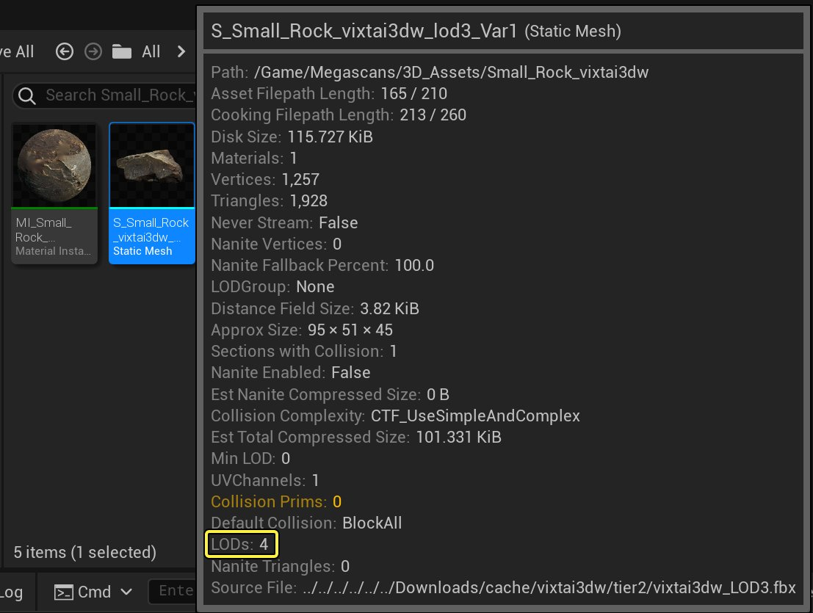
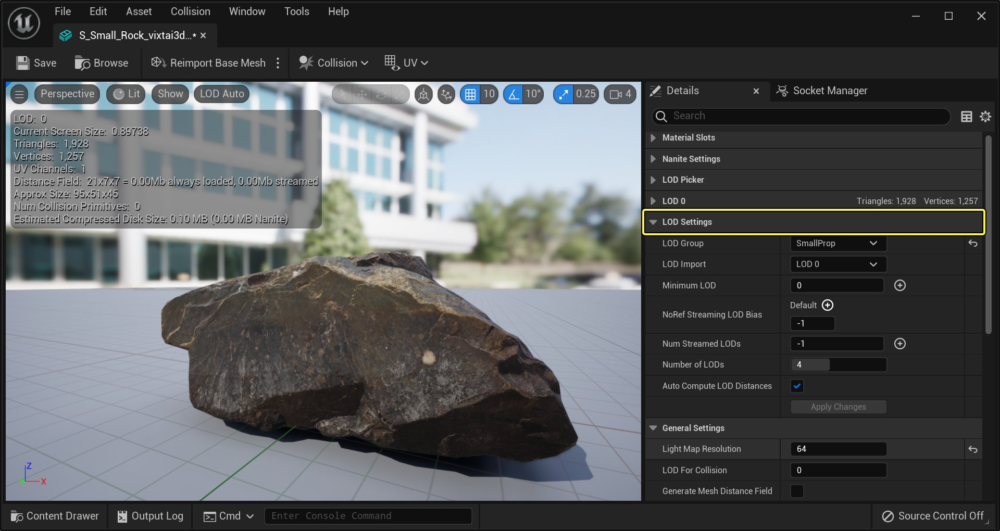
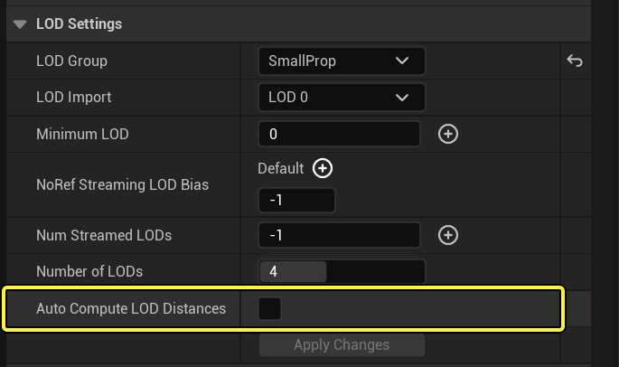
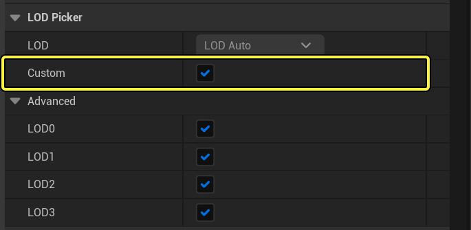
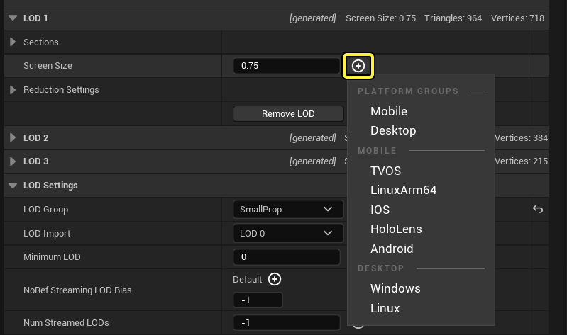
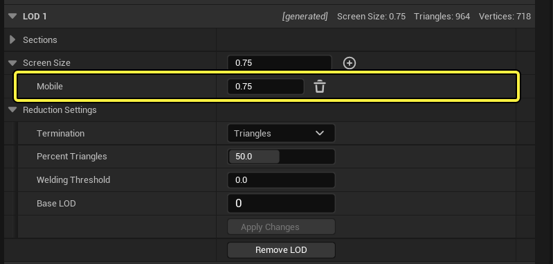
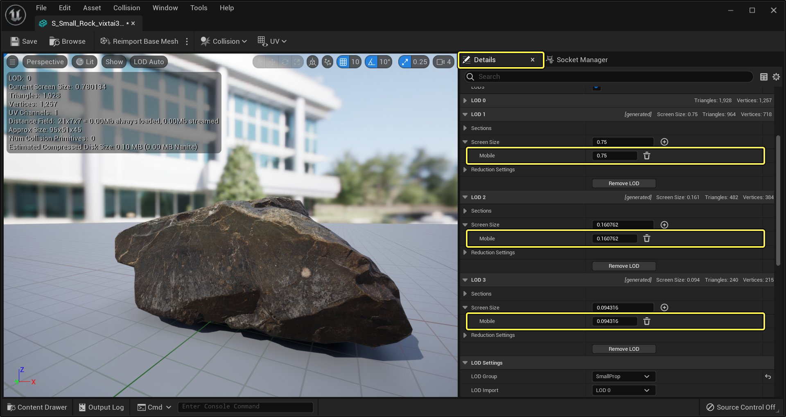
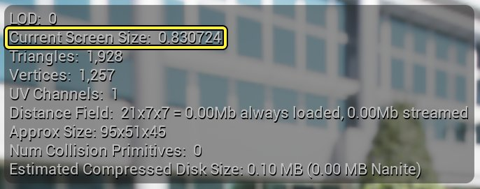

# 为不同平台优化LOD屏幕大小

> 路径：虚幻引擎5.7文档 / 管理内容 / 静态网格体 / 为不同平台优化LOD屏幕大小

> 原始页面：https://dev.epicgames.com/documentation/unreal-engine/optimizing-lod-screen-size-per-platform-in-unreal-engine

虚幻引擎5（UE5）通过判定静态网格体在屏幕中的大小，来判断静态网格体何时从一个LOD切换到另一个LOD。虽然这种方法很好用，但缺点是，在不同平台上的判断标准会不一样。以下教程介绍了如何设置LOD切换时的屏幕尺寸阈值，以便你的UE5项目能够移植到不同平台上。

## 步骤

以下小节讲解了如何在平台上定义LOD切换标准。

1. 首先，在 **内容浏览器（Content Browser）** 中，找到有几个LOD要处理的 **静态网格体（Static Mesh）** 并在 **静态网格体编辑器（Static Mesh Editor）** 中将其打开。本示例中，静态网格体有四种LOD。不过，你可以根据需要拥有更多LOD级别的网格体。

   

   点击查看大图。
2. 在静态网格体编辑器中打开静态网格体之后，转至 **细节（Details）面板** ，并展开 **LOD设置（LOD Settings）** 类别。

   

   点击查看大图。
3. 禁用 **自动计算LOD距离（Auto Compute LOD Distances）** 旁边的复选框，以便我们可以手动设置应该发生LOD过渡的距离。

   

   点击查看大图。
4. 接下来，转至 **LOD选取器（LOD Picker）** 分段，点击 **自定义（Custom）** 选项旁边的复选框将其启用。这样一来，你可以在静态网格体编辑器中同时查看所有LOD。

   

   点击查看大图。
5. 展开 **LOD1** 分段，点击 **屏幕大小（Screen Size）** 选项旁边的 **白色小三角形** ，显示出该选项，以添加每个平台的LOD覆盖。

   

   点击查看大图。
6. 从显示的逐个平台覆盖列表中，选择 **为移动平台添加覆盖（Add Override for Mobile）** 选项。

   

   点击查看大图。
7. 为 **LOD 2** 和 **LOD 3** 重复上述步骤，完成后，你的"细节（Details）"面板应该类似于下图。

   

   点击查看大图。
8. 现在你可以在 **移动（Mobile）** 选项下的框中输入新数字来调整移动屏幕大小。要了解应该将什么样的屏幕大小用于哪个LOD，静态网格体编辑器中的 **视口（Viewport）** 会显示 **当前屏幕大小（Current Screen Size）** 。

   

   点击查看大图。

## 最终结果

现在，你已经为移动设备设置了LOD过渡时的距离，你可以设用相同的步骤，为主机和PC设置过渡距离。最后的界面如下图所示。

> 图片已省略：End Result

点击查看大图。
