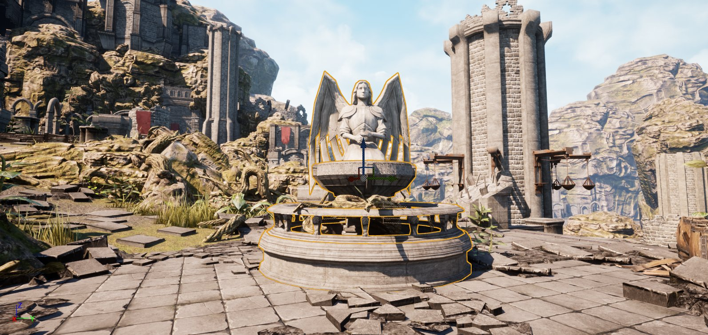
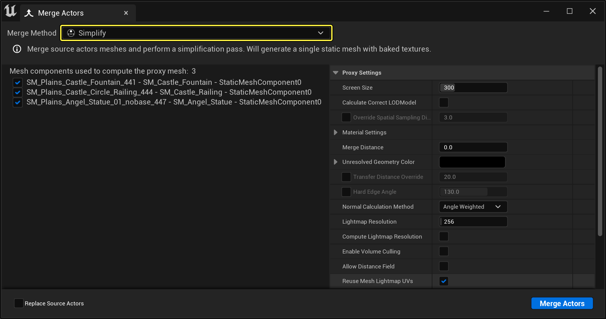
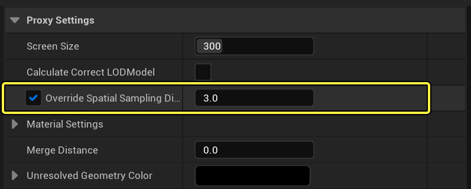
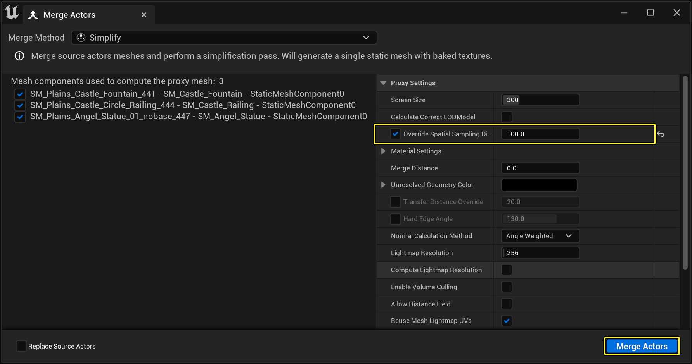
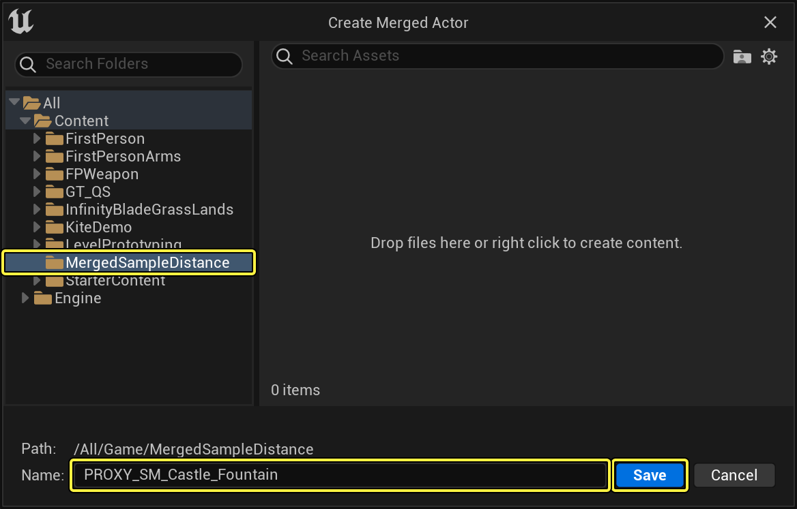
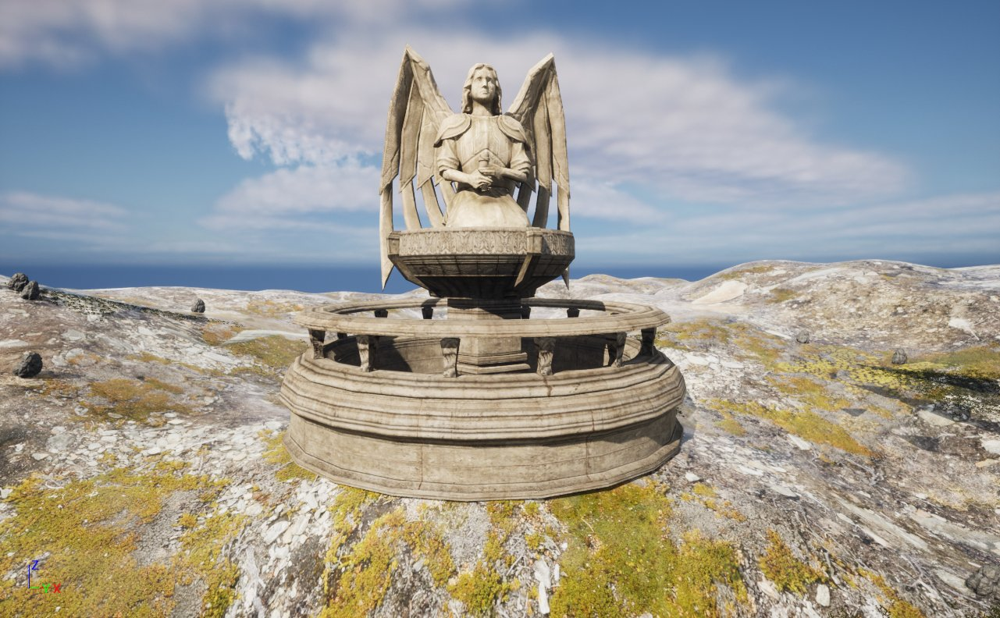

# 调整代理几何体的屏幕大小

> 路径：虚幻引擎5.7文档 / 管理内容 / 静态网格体 / 代理几何工具 / 调整代理几何体的屏幕大小

> 原始页面：https://dev.epicgames.com/documentation/unreal-engine/adjusting-proxy-geometry-screen-size-in-unreal-engine

在下面的教程中，我们将了解如何修改 **空间采样距离（Spatial Sampling Distance）** 参数，来手动调整系统对所有对象重新进行网格划分时（在执行简化之前），所采集的最小特征大小。

## 步骤

1. 首先，在虚幻引擎5（UE5）关卡中，选择一些要使用的静态网格体。

   

   点击查看大图。
2. 在静态网格体仍处于选中状态的情况下，转至 **工具（Tools）**， 打开 **合并Actor（Merge Actors）** 工具。 然后，从显示的列表中，选择 **合并Actor（Merge Actors）** 工具。

   

   点击查看大图。
3. "合并Actor"工具打开时，点击 **第二个** 图标以访问 **代理几何体（Proxy Geometry）** 工具。然后，在 **代理设置（Proxy Settings）** 下，展开 **材质设置（Material Settings）** 分段。

   

   点击查看大图。
4. 找到 **覆盖空间采样距离（Override Spatial Sampling Distance）** 参数，点击名称旁边的复选框，将其启用。

   

   点击查看大图。
5. 将覆盖空间采样距离的值设置为100，然后按 **合并Actor（Merge Actors）** 按钮。

   

   点击查看大图。

   > [!NOTE]
   > 默认情况下，系统会根据几何体的边框和请求的 **屏幕大小（Screen Size）** 估算此大小。如果你在 **窗口（Window）> 开发人员工具（Developer Tool）> 输出日志（Output Log）** 中查看，就会发现其中写出了系统使用的实际数字。此数字越大，简化效果就越简单。此数字越小，简化就越厉害。
6. 为新创建的静态网格体指定名称和位置，然后按 **保存（Save）** 按钮，开始创建代理几何体。

   

   点击查看大图。

## 最终结果

完成后，系统将为你在第一步中选中的所有静态网格体生成新的静态网格体、材质和纹理。下面各图演示了将"覆盖空间采样距离（Override Spatial Sampling Distance）"设置为不同值时，对静态网格体产生的影响。

空间采样距离 = 0.5 | 空间取样距离 = 1 | 空间取样距离 = 10 | 空间取样距离 = 100
