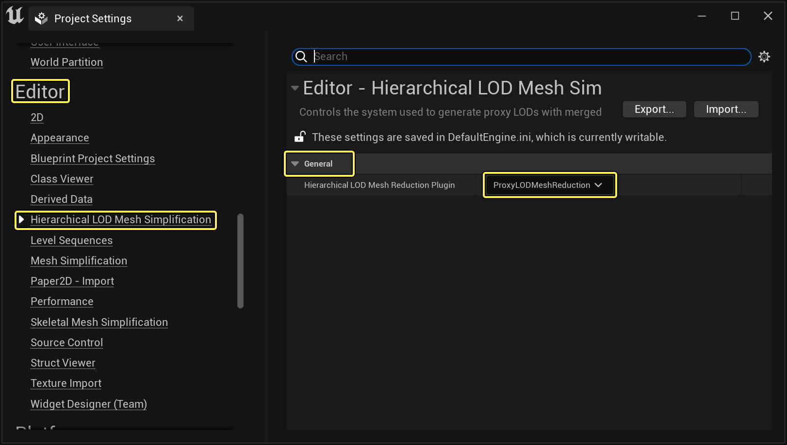

# 启用代理几何体工具

> 路径：虚幻引擎5.7文档 / 管理内容 / 静态网格体 / 代理几何工具 / 启用代理几何体工具

> 原始页面：https://dev.epicgames.com/documentation/unreal-engine/enabling-the-proxy-geometry-tool-in-unreal-engine

你需要先启用代理几何体工具。在本教程中，我们将介绍如何在UE5项目中启用代理几何体工具。

## 步骤

1. 首先启动UE5项目，项目打开后，转至主工具栏选择 **编辑（Edit）> 项目设置（Project Settings）** 来打开项目设置。

   点击查看大图。
2. 项目设置打开后，转至 **编辑器（Editor）> 分层LOD网格体简化（Hierarchical LOD Mesh Simplification）** ，在 **通用（General）** 分段下点击 **分层LOD网格体缩减插件（Hierarchical LOD Mesh Reduction Plugin）** ，然后选择 **ProxyLODMeshReduction** 插件。

   

   点击查看大图。
3. 接着转至 **工具（Tools）** ，然后点击 **合并Actor（Merge Actors）** 选项。

   

   点击查看大图。

## 最终结果

"合并Actor（Merge Actors）"工具打开后，你应该会在顶部看到两个图标。点击第二个图标，访问代理几何体工具的选项。

点击查看大图。

> [!TIP]
> 请注意，在选择放入关卡中的静态网格体之前，所有选项都将显示为灰色。
