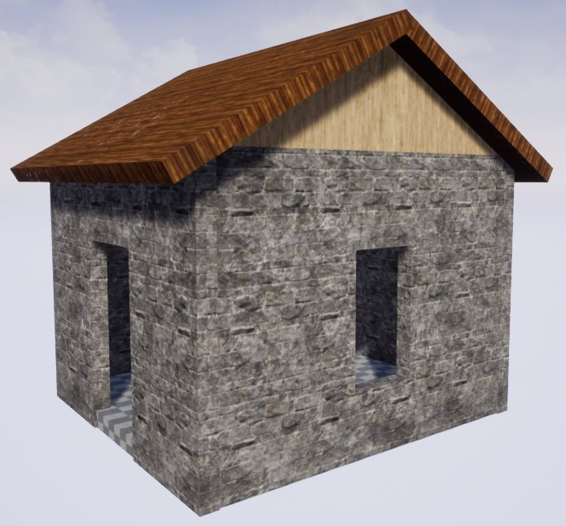
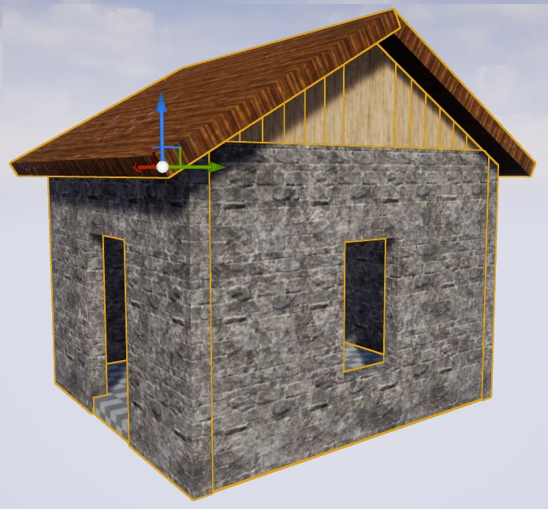
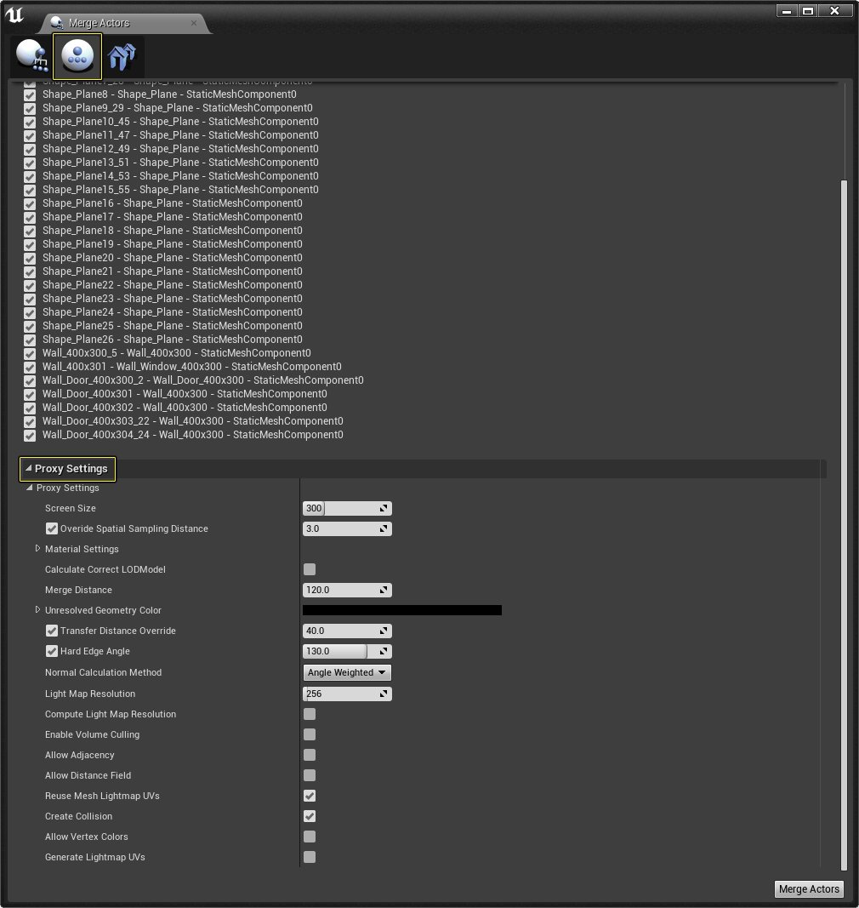
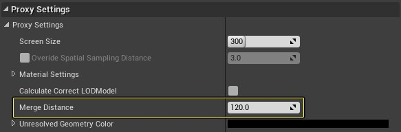
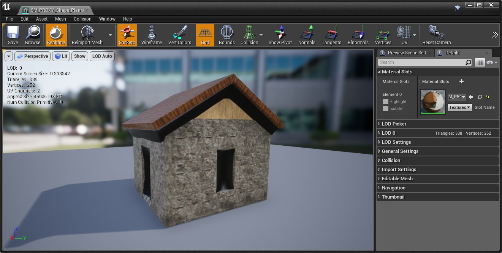
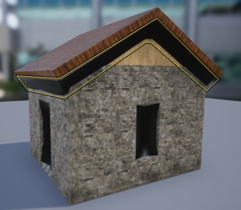

# 使用代理几何体工具填充间隙

> 路径：虚幻引擎5.7文档 / 管理内容 / 静态网格体 / 代理几何工具 / 使用代理几何体工具填充间隙

> 原始页面：https://dev.epicgames.com/documentation/unreal-engine/filling-gaps-using-the-proxy-geometry-tool-in-unreal-engine

对于防水的几何体，代理几何体工具将自动废弃不可访问的结构，例如内部墙壁、家具以及封闭结构中的内容。为实现理想的结果，构造源几何体时应该注意这一点，但由于游戏制作约束，这并非总是可行。为了方便根据几乎防水的源几何体生成高效的代理LOD，ProxyLOD工具现在可以选择使用基于关卡集的膨胀和侵蚀技术来闭合间隙。预期用例主要是远处建筑物的门窗，在以下操作指南中，我们会考察如何设置代理几何体工具来自动闭合生成的几何体可能存在的间隙。

## 步骤

在以下分段中，我们会考察如何确保在代理几何体工具生成的静态网格体上闭合开放的几何体。

1. 首先找到你想闭合的开口所在的结构或对象。本示例使用了下面的小房子，它仅使用初学者内容包中提供的静态网格体构造。

   
2. 接下来，转至 **窗口（Window）> 开发人员工具（Developer Tools）> 合并Actor（Merge Actors）** ，打开 **合并Actor（Merge Actors）** 工具。

   
3. 在关卡内部，选择所有必要的静态网格体Actor，以便构成对象，进而为其生成新几何体。

   
4. 在合并Actor工具中，点击 **第二个图标** 访问代理几何体工具，然后展开 **代理设置（Proxy Settings）** 。

   
5. 在代理设置中，将 **合并距离（Merge Distance）** 值设为 **120** 。

   

   > [!NOTE]
   > 合并距离参数将指明代理几何体工具应该闭合的间隙距离。数字越小，闭合的间隙就越小，数字越大，填充的间隙就越大。
6. 接下来，点击 **合并Actor（Merge Actors）** 按钮，并在 **内容浏览器（Content Browser）** 中为新创建的静态网格体输入名称和位置。然后点击 **保存（Save）** 按钮，开始合并过程。

   
7. 合并完成后，找到内容浏览器中新创建的静态网格体，双击它以在 **静态网格体编辑器（Static Mesh Editor）** 中打开。

   
8. 根据你选择的对象，代理几何体工具创建的新几何体的延伸距离超出预期时（如下图所示），可能造成一些问题：

   
9. 要修复这类问题，请首先重新选择构成你的对象的所有静态网格体。然后在合并Actor工具中，将 **合并距离（Merge Distance）** 增加到值 **175** 。然后启用 **传输距离覆盖（Transfer Distance Override）** 并将其设为值 **100** 。

   > 图片已省略：undefined

   > [!NOTE]
   > 要更好地了解你应该使用什么值，请查看输出日志。输出日志将表明什么值用于 **空间取样近距离（Spatial Sampling Distance）** （用于重新网格化的体素大小）和 **传输距离覆盖（Transfer Distance Override）** （材质距离）。了解使用什么值之后，你可以根据自己所需的结果，增加或减小这些值。
   >
   > > 图片已省略：SamplingScaleMatDistance.png
10. 完成该操作后，点击"合并Actor（Merge Actors）"按钮，再次开始该过程。代理几何体生成完成后，现在对象如下所示。

    > 图片已省略：GapFilling_10.png

    > [!NOTE]
    > 根据你的几何体的设置方式，你可能需要为合并距离和传输距离覆盖使用不同的值重复上述过程几次，直到你对结果感到满意为止。

## 最终结果

获得最佳结果需要一些时间和迭代，因为你为其生成代理几何体的每个对象都需要稍微不同的合并距离和传输距离覆盖。在下图的比较中，你可以看到将合并距离和传输距离覆盖设为值 **0、100、200** 和 **300** 时可以实现的结果。

> 图片已省略：合并距离和传输距离覆盖都设为值0、100、200和300时的情况示例

合并距离和传输距离覆盖都设为值0、100、200和300时的情况示例
