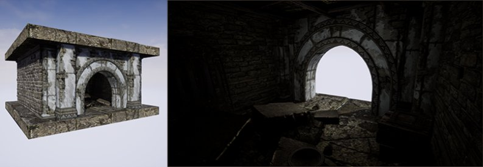
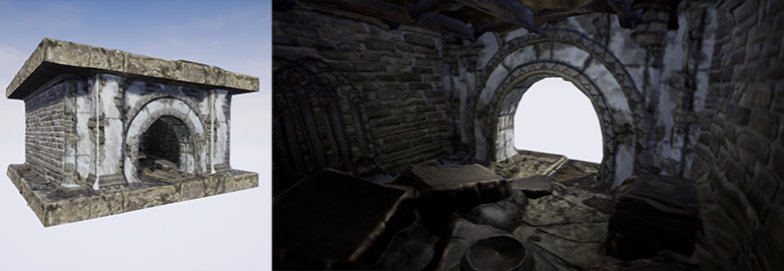
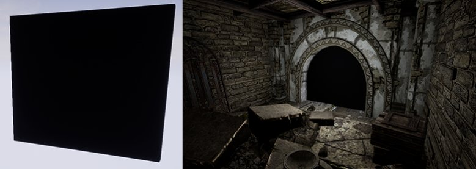

# 生成更高效的结果

> 路径：虚幻引擎5.7文档 / 管理内容 / 静态网格体 / 代理几何工具 / 生成更高效的结果

> 原始页面：https://dev.epicgames.com/documentation/unreal-engine/generating-more-efficient-results-with-the-proxy-geometry-tool-in-unreal-engine

有时添加一点几何体实际上反而会让代理结果更高效。 这是因为，在代理LOD管线中，底层空间取样和重新网格化步骤旨在删除不可访问的几何体。 在以下操作指南中，我们将考察如何在你的虚幻引擎4（UE4）项目中解决这种问题。

## 步骤

1. 首先，找到一组静态网格体，它们以特定方式排列，构成某种类型的房间，其中有如下图所示的开口。

   
2. 选择构成该房间的所有静态网格体以及该房间可能包含的所有项目，然后运行代理几何体工具，以创建新的代理静态网格体。

   
3. 虽然代理几何体工具能够出色地创建新静态网格体，但房间内部有大量细节可以删除。为了帮助代理几何体工具更好地理解这一点，它应该删除建筑物内部的整个几何体，将一个小的静态网格体添加到关卡中，调整其位置，使其覆盖房间可能存在的所有开口。

   
4. 所有开口都由几何体的各个片段覆盖之后，再次运行代理几何体工具。

## 最终结果

代理几何体工具完成后，看一下房间内部。注意，内部几乎每一个三角形都已删除，如下图所示。 Proxy_Geo_HT_GettingMore_04.png

其原因是，将新的静态网格体添加到此模型以充当阻挡物，代理几何体工具就能够在代理生成早期自动删除房间的所有内部结构。这样一来，制作时间短得多，最终三角形数量更少，纹理空间也得到了更好地利用。 在许多情况下，在添加几何体来封闭复杂立面的背面时，选择关着的门、地板或者只是几个平面，将极大地简化结果。
