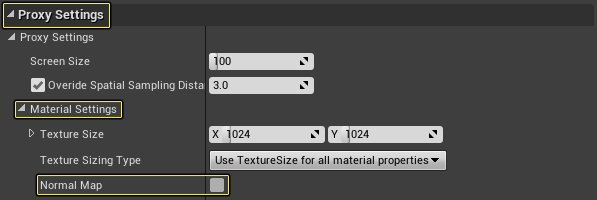
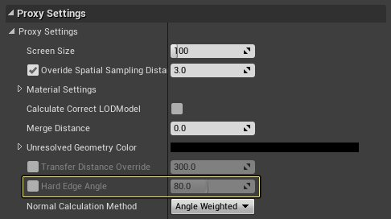
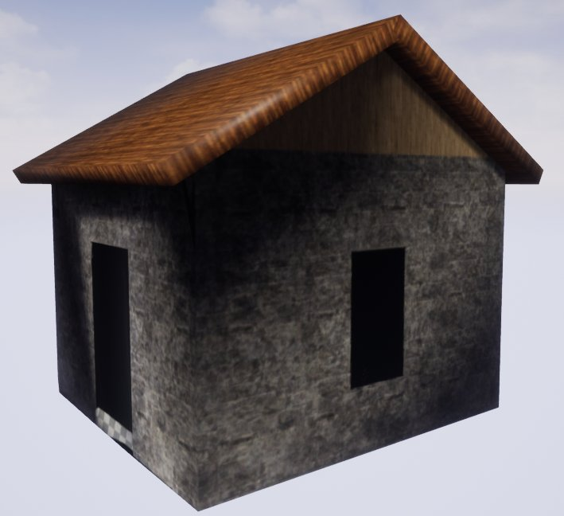

# 改善法线

> 路径：虚幻引擎5.7文档 / 管理内容 / 静态网格体 / 代理几何工具 / 改善法线

> 原始页面：https://dev.epicgames.com/documentation/unreal-engine/improving-normals-with-the-proxy-geometry-tool-in-unreal-engine

由于《堡垒之夜》内存使用量存在极端约束，这就需要非常高效地使用细节级别（LOD）网格体。大部分代理会生成非常小的基础颜色纹理，并且不会使用法线贴图。因此，该方法需要代理网格体本身采用最高质量的法线。在以下操作指南中，我们将考察在使用代理几何体工具时如何指定静态网格体法线的计算方式。

## 步骤

在以下操作小节中，我们将考察如何调整在使用代理几何体工具时计算生成的静态网格体法线的方式。

1. 首先，找到需要为其创建代理静态网格体的对象。本示例使用了下面的小房子，它仅使用初学者内容包中提供的静态网格体构造。

   
2. 接下来，转至 **窗口（Window）> 开发人员工具（Developer Tools）> 合并Actor（Merge Actors）** ，打开 **合并Actor（Merge Actor）** 工具。

   
3. 在关卡内部，选择所有必要的静态网格体Actor，以便构成对象，进而为其生成新几何体。

   
4. 在合并Actor工具中，点击 **第二个图标** 访问代理几何体工具，然后展开 **代理设置（Proxy Settings）** 。

   
5. 在"代理设置（Proxy Settings）"下，展开 **材质设置（Material Settings）** 分段，并禁用 **法线贴图（Normal Map）** 选项。

   

   > [!NOTE]
   > 如果不在此处禁用法线，你不会看到正确的结果，因为你将看到法线贴图的法线，而不是生成的静态网格体的法线。
6. 接下来，点击 **硬边角度（Hard Edge Angle** 选项旁边的复选框将其禁用。这会禁用生成的静态网格体上的所有法线计算。

   
7. 接下来，点击 **合并Actor（Merge Actors）** 按钮，并在 **内容浏览器（Content Browser）** 中为新创建的静态网格体输入名称和位置。然后点击 **保存（Save）** 按钮，开始合并过程。

   
8. 完成所有操作后，打开新创建的静态网格体，它应该类似于下图。

   
9. 上图并不是我们的预期结果；我们想要生成的对象的法线看起来与生成它的对象的法线几乎完全相同。要修复该问题，请转至合并Actor工具，并重新启用硬边角度选项。

   > 图片已省略：HardEdegeSplit_04.png
10. 重新启用硬边角度后，重新运行合并Actor工具。完成后，你现在应该拥有如下图所示的建筑物：

> 图片已省略：HardEdegeSplit_05.png

## 最终结果

为获得最佳结果，将需要一些时间和迭代，因为每个对象可能需要稍微不同的设置来获得最佳结果。还请注意，当你指定硬边角度的值时，你可以增加或减小生成的静态网格体中使用的顶点数量。下图的对比显示了将硬边角度（Hard Edge Angle）设为 **0** 、 **5** 、 **10** 、 **50** 、 **80** 、 **130** 、 **180** 时，静态网格体及其顶点的情况。

> 图片已省略：下图的对比显示了将硬边角度（Hard Edge Angle）设为值0、5、10、50、80、130和180时的不同着色和顶点数量。

下图的对比显示了将硬边角度（Hard Edge Angle）设为值0、5、10、50、80、130和180时的不同着色和顶点数量。
