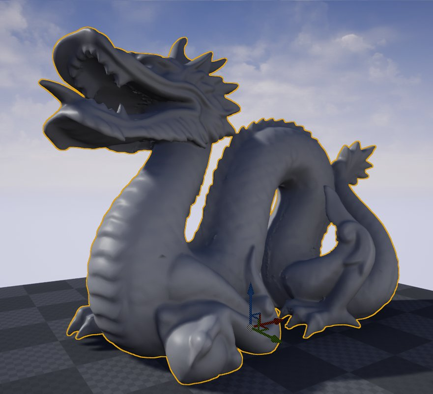
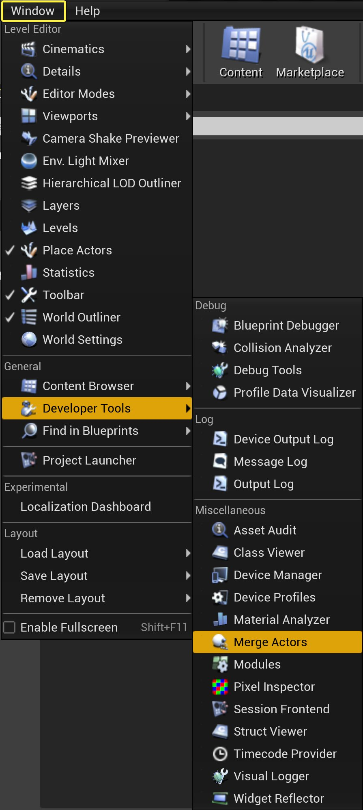
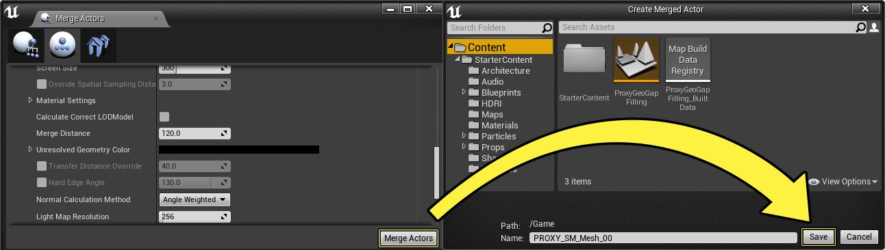
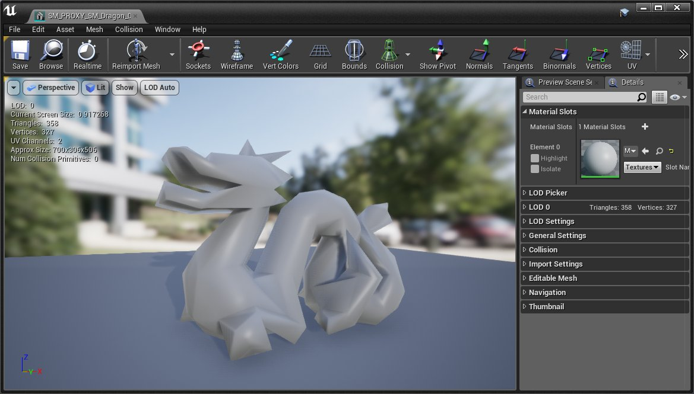
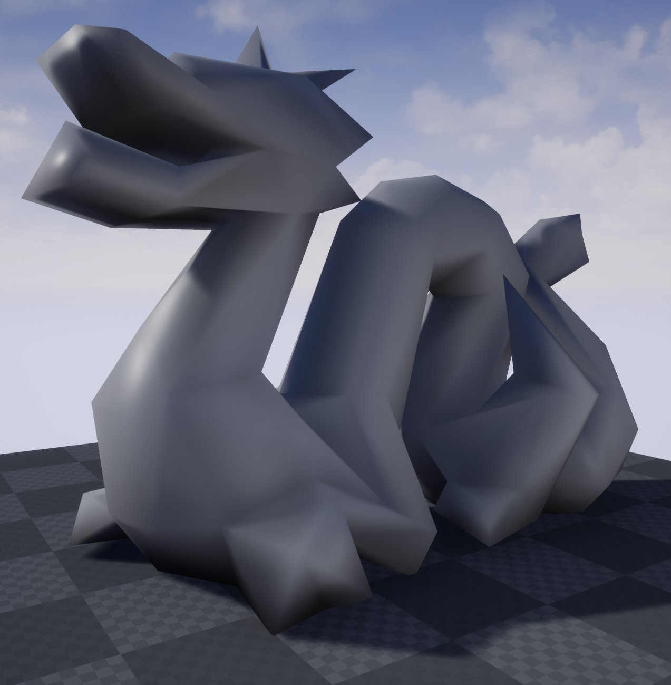

# 常规计算方法

> 路径：虚幻引擎5.7文档 / 管理内容 / 静态网格体 / 代理几何工具 / 常规计算方法

> 原始页面：https://dev.epicgames.com/documentation/unreal-engine/normal-calculation-methods-with-the-proxy-geometry-tool-in-unreal-engine

代理几何工具可以让你指定在计算给定的静态网格体的顶点法线时应该使用哪种方法。在下面的教程中，我们将了解如何改变顶点法线的计算方法，以及对生成的静态网格体的影响。

## 步骤

在下面的部分，我们将了解如何调整用于计算静态网格体的法线的方法。

1. 首先，找到你想生成新几何体的静态网格体或静态网格组，并在视口中选择该网格体或网格组。

   
2. 接下来，进入

   窗口>开发工具>Merge Actor

   ，打开

   Merge Actor

   工具。

   
3. 在Merge Actor工具中，点击 **第二个图标** ，进入 **代理几何** 工具，然后展开 **代理设置** 。 NormalCalculationMethod_03.png
4. 将 **屏幕尺寸** 值设为 **50** ，并确保将 **法线计算方法** 设为 **角度加权** 。 NormalCalculationMethod_04.png

   > [!NOTE]
   > 通过设置屏幕尺寸为50，我们告诉代理几何工具减少所选静态网格体中的三角形数量。
5. 接下来，点击 **Merge Actor** 按钮，在 **内容浏览器** 中为新创建的静态网格体输入一个名称和位置。然后点击 **保存** 按钮开始合并。

   
6. 完成后，你可以双击静态网格体，在

   静态网格体编辑器

   中打开它，查看结果。

## 最终结果

想得到最好的结果需要一些时间和迭代，因为每个物体可能需要不同的法线计算方法来达到理想的效果。根据你所使用的对象的类型，其结果也可能非常微妙。 下面的图片比对显示了本例中使用的静态网格体在法线计算方法被设置为角度加权、面积加权和等值加权时的情况。

下面的图片显示了三种法线计算方法各自可以达到的结果。首先你会看到角度加权法，然后是面积加权法，最后是等量加权法。
