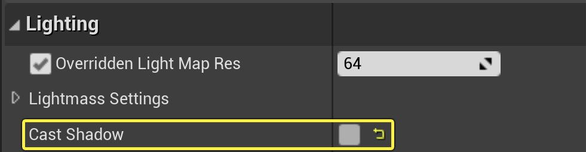
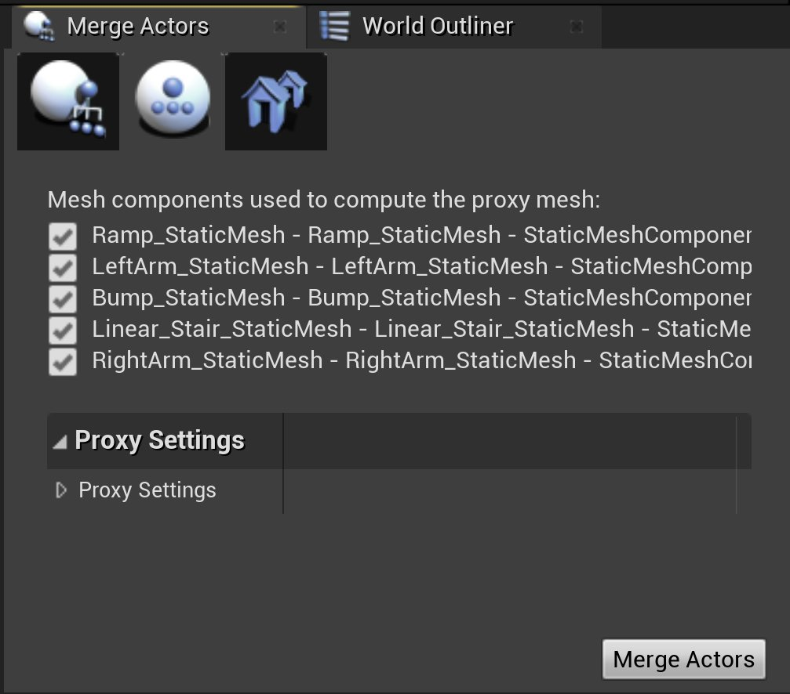

# 代理几何体阴影

> 路径：虚幻引擎5.7文档 / 管理内容 / 静态网格体 / 代理几何工具 / 代理几何体阴影

> 原始页面：https://dev.epicgames.com/documentation/unreal-engine/proxy-geometry-shadows-in-unreal-engine

在为某些几何体计算动态光照时，比如密集型几何体或由大量小型网格体组成的几何体，性能开销会很高。要降低开销，你可以为这类复杂几何体创建一个代理几何体（Proxy Geometry），专门用来计算投射的阴影，而不必为每个网格体单独计算阴影。

一种适合用代理网格体的情况是，为一幢包含大量窗户、墙壁、阳台和其他细节的公寓楼计算阴影。

使用代理网格体计算阴影的方法如下：

1. 在 **细节（Details）** 面板中的 **光照（Lighting）** 下，将所有需要使用代理几何体的网格体禁用 **投射阴影（Cast Shadows）**。

   
2. 创建一个简化的网格体作为代理网格体。如果外形比较复杂，你可以使用 **合并Actor（Merge Actor）** 工具（位于 **代理网格体（Proxy Mesh）** 选项卡中），创建代理阴影投射器网格体，但如果是方形建筑，通常用一个等比方法的盒体就行了。详见[代理几何体概述](../proxy-geometry-tool-overview/index.md)。

   
3. 在代理网格体投射器上启用 **投射阴影（Cast Shadows）**。
4. 在 **细节（Details）** 面板中的 **渲染（Rendering）** 分段中，禁用代理阴影投射器上的 **在主通道中渲染（Render in Main Pass）**。

   
5. 确保代理阴影投射器（proxy shadow caster）与原来的网格体正确贴合。

此技巧也适用于那些启用了 **Far Cascade** 阴影贴图的远距离对象。

完成后，建筑依然能够投射阴影，但比之前渲染得更快，开销更低。
