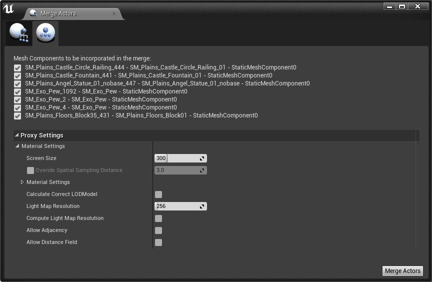
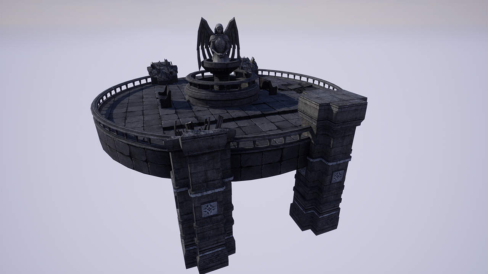
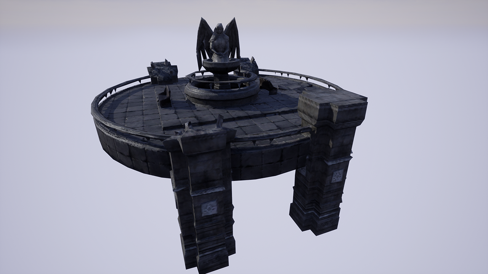
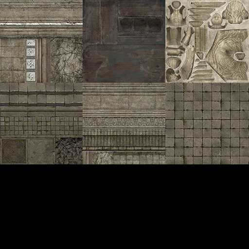
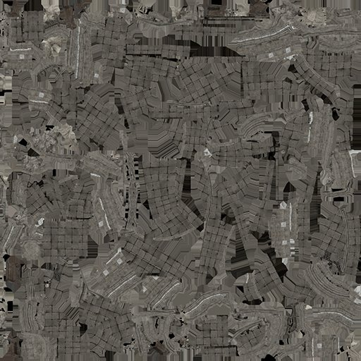

# 代理几何体工具概述

> 路径：虚幻引擎5.7文档 / 管理内容 / 静态网格体 / 代理几何工具 / 代理几何体工具概述

> 原始页面：https://dev.epicgames.com/documentation/unreal-engine/proxy-geometry-tool-overview-in-unreal-engine

## 代理几何体工具

代理几何体工具的目标是帮助减少静态网格体及其对应材质和纹理的运行时渲染开销。为实现这一点，代理几何体工具会将多个静态网格体及其对应材质合并为单个静态网格体，其中包含单组纹理和材质，它们仍匹配原始静态网格体的形状和外观，但三角形数量更少。在质量差异可接受或不明显时，例如，结构远离摄像机，这一缩减结果可以用作原始几何体的代理。

### 代理几何体工具静态网格体生成

你在使用代理几何体工具时获得的结果可能根据工具中使用的设置而有所不同。下面的图像使用代理几何体工具的默认设置创建而成。

使用代理几何体之前

使用代理几何体之后

| **使用代理之前** |  | **使用代理之后** |  |
| --- | --- | --- | --- |
| **对象数量** | 22 | **对象数量** | 1 |
| **三角形数量** | 27,308 | **三角形数量** | 4,032 |
| **材质数量** | 6 | **材质数量** | 1 |

虽然静态网格体可能看起来与原始对象并不完全相同，但你使用代理几何体工具可以带来相当显著的节省。在此测试场景中，我们采用了22个静态网格体，其中带有六个材质和超过27000个三角形，将其变换为单个静态网格体后，其中带有一个材质和4000个三角形。

### 代理几何体工具纹理生成

代理几何体工具还将生成一组新的纹理，对应于创建的新静态网格体几何体。下图显示了此生成的纹理相较于使用的原始纹理的外观。

使用代理几何体之前

使用代理几何体之后

### 关于工具性能的简要说明

代理系统首次处理几何体的项目时，将填充游戏线程上的着色器缓存，产生一次性的开销。 这意味着，后续迭代（例如，更改某个参数并重新构建该代理）可能快得多。 针对现有第三方选项进行比较，此新系统在适中空间大小的几何体群集上可将速度提升至2到3倍，但在非常大的几何体上，完成时间类似。

> [!NOTE]
> 请注意，以上关于速度提升的信息仅与在UE4编辑器中生成代理相关，而不是与其在游戏中的使用相关。使用代理所带来的游戏内性能提升将取决于最终多边形数量和纹理大小等数量。
