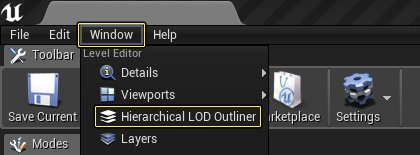
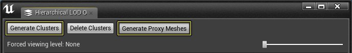
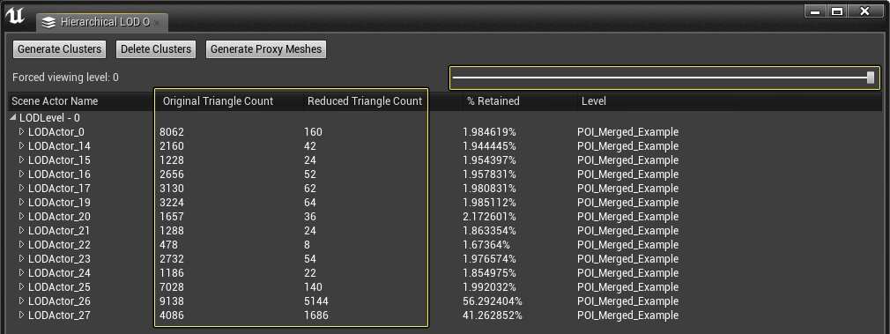
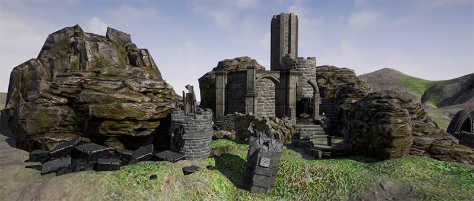
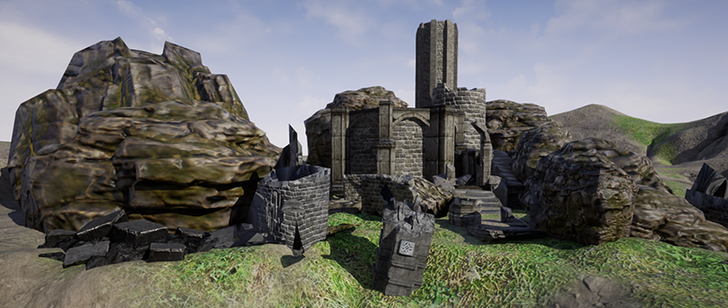

# 使用HLOD与代理几何体工具

> 路径：虚幻引擎5.7文档 / 管理内容 / 静态网格体 / 代理几何工具 / 使用HLOD与代理几何体工具

> 原始页面：https://dev.epicgames.com/documentation/unreal-engine/using-the-proxy-geometry-tool-with-hlods-in-unreal-engine

在下面的教程中，我们将了解如何结合[层级关卡细节](../../../../building-virtual-worlds/hierarchical-level-of-detail/index.md)(HLOD)系统使用代理几何体工具。将这两个工具结合在一起使用，将通过减少绘制调用次数和每帧绘制到屏幕的三角形数量，帮助提高虚幻引擎4 (UE4)项目的渲染性能。

## 步骤

1. 转到项目的[世界设置](../../../../understanding-the-basics/levels/world-settings/index.md)，并显示 **LOD系统（LODSystem）** 菜单选项。
2. 在LOD系统（LODSystem）菜单中，启用以下两个选项：

   | **属性名称** | **说明** |
   | --- | --- |
   | **启用层级LOD系统（Enable Hierarchical LOD System）** | 启用与该层级一起使用的HLOD。 |
   | **简化网格体（Simplify Mesh）** | 启用代理几何体静态网格体（Proxy Geometry Static Mesh）简化。 |
3. 通过转到 **窗口（Window）> 层级LOD大纲视图（Hierarchical LOD Outliner）**，打开 **层级LOD大纲视图（Hierarchical LOD Outliner）** 工具。

   
4. 按 **层级LOD大纲视图（Hierarchical LOD Outliner）** 上的 **生成群集（Generate Clusters）** 按钮，完成后，按 **生成代理网格体（Generate Proxy Meshes）** 按钮，以启动HLOD和代理几何体创建过程。

   

## 最终结果

当层级LOD工具完成处理后，您可以看到删除的三角形数量，并通过前后移动滑块将结果与原始情况进行比较。

下面的图像比较滑块显示了一个示例，该示例说明当您启用了 **简化网格体（Simplify Mesh）** 且仅使用默认设置时可获得的结果类型。

Before Running HLOD & Proxy Geo

After Running HLOD & Proxy Geo
