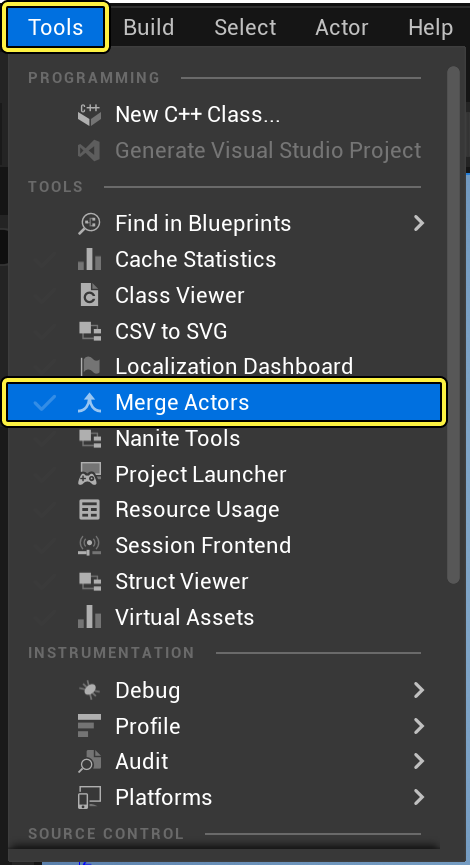
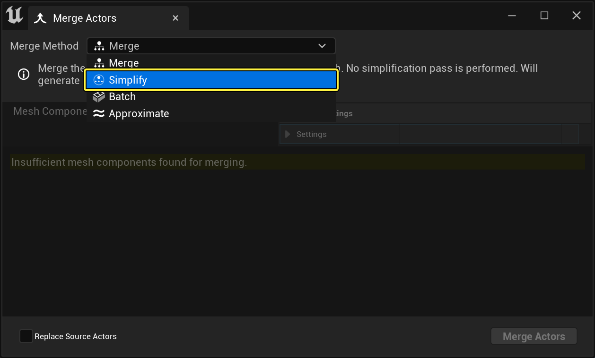
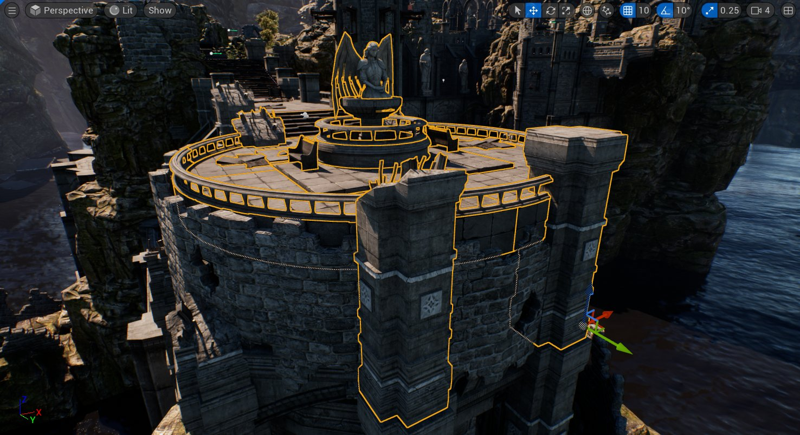
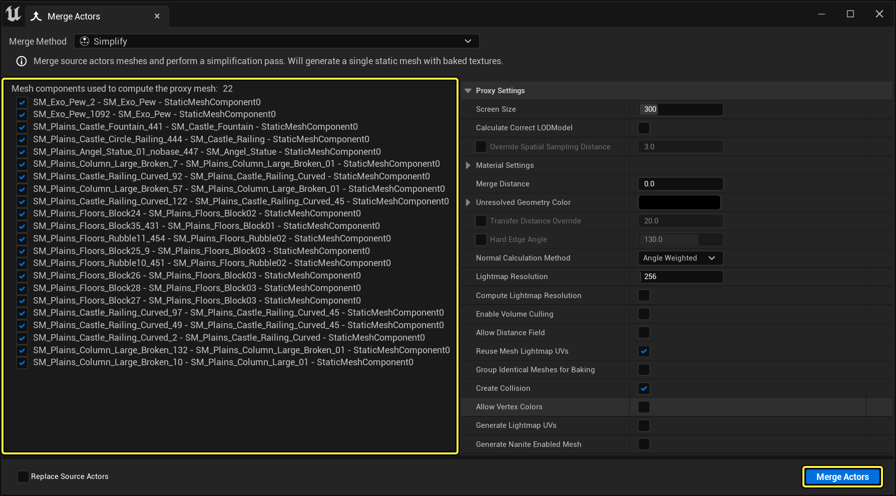
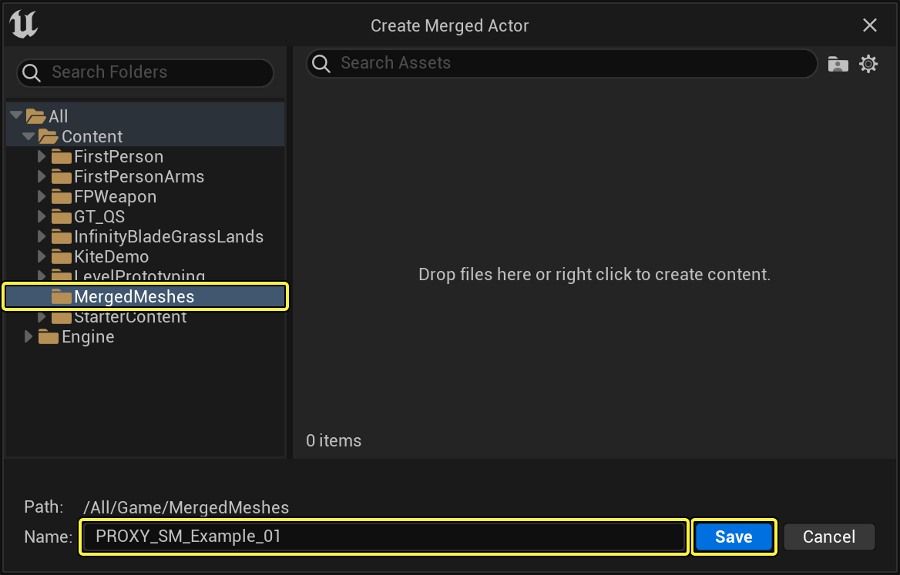
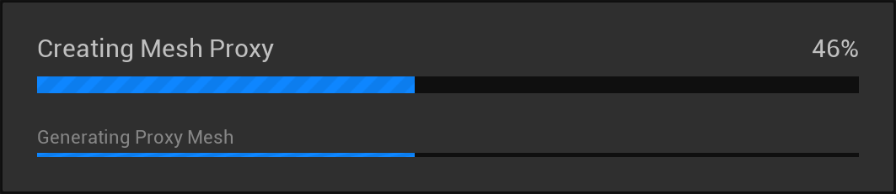
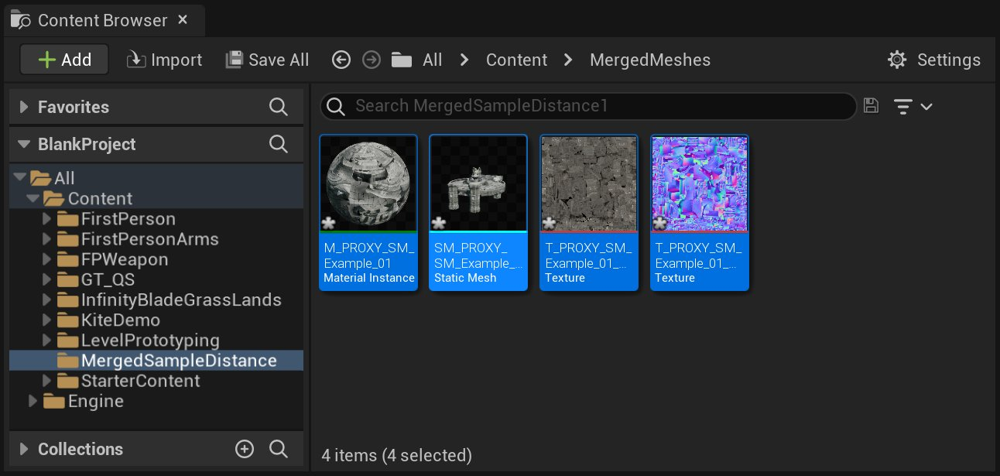
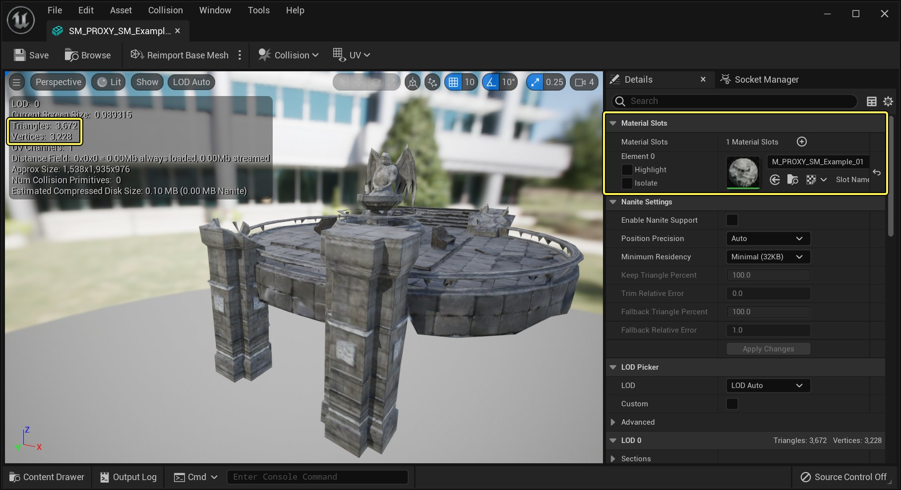

# 使用代理几何体工具

> 路径：虚幻引擎5.7文档 / 管理内容 / 静态网格体 / 代理几何工具 / 使用代理几何体工具

> 原始页面：https://dev.epicgames.com/documentation/unreal-engine/using-the-proxy-geometry-tool-in-unreal-engine

在下面的教程中，我们将了解如何使用代理几何体工具来为你的UE5项目创建新的静态几何体和纹理。

## 步骤

1. **代理几何工具（Proxy Geometry Tools）** 是合并Actor工具的一部分，因此，要打开它们，需要前往 **工具（Tools）** 并点击 **合并Actor（Merge Actors）** 选项。

   

   点击查看大图。
2. 当合并Actor工具打开时，你应该会在顶部看到两个图标。单击第二个图标以显示代理几何体工具的选项。

   

   点击查看大图。

   > [!NOTE]
   > 代理几何体工具中的选项只有在关卡中选择静态网格体时才会激活。
3. 前往关卡中的一个位置，然后开始选择静态网格体。在本例中，选择了21个静态网格体，但请随意选择所需数量的静态网格体。

   

   点击查看大图。
4. 在静态网格体仍被选中的情况下，找到合并Actor（Merge Actors）窗口，然后按 **合并Actor（Merge Actors）** 按钮启动代理几何体工具的创建过程。

   

   点击查看大图。
5. 在出现的弹窗中，为代理几何体工具将要创建的新资源指定 **名称（Name）** 和 **位置（Location）**。完成后，点击 **保存（Save）** 按钮继续代理几何体工具的创建过程。

   

   点击查看大图。

   > [!NOTE]
   > 代理几何体工具完成所需的时间从几分钟到几个小时不等。当前的进度将在下面的窗口中显示。
   >
   > 
   >
   > 点击查看大图。
6. 当代理几何体工具完成后，转到内容浏览器，按照步骤5中提供的名称搜索新创建的资产。

   

   点击查看大图。

## 最终结果

要查看创建的静态网格体，转到内容浏览器，双击生成的静态网格体。在静态网格体编辑器中查看静态网格体时，请注意三角形和材质数量有所减少。

点击查看大图。
