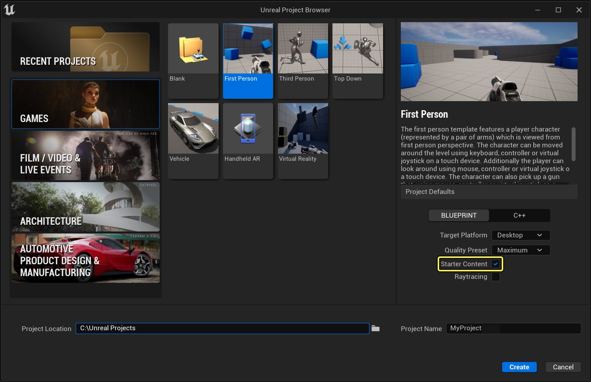
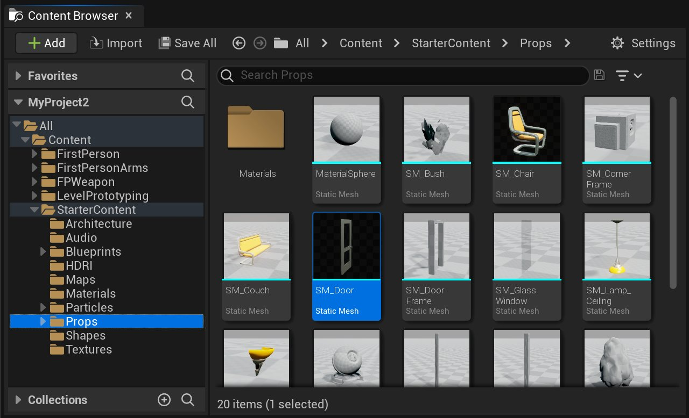
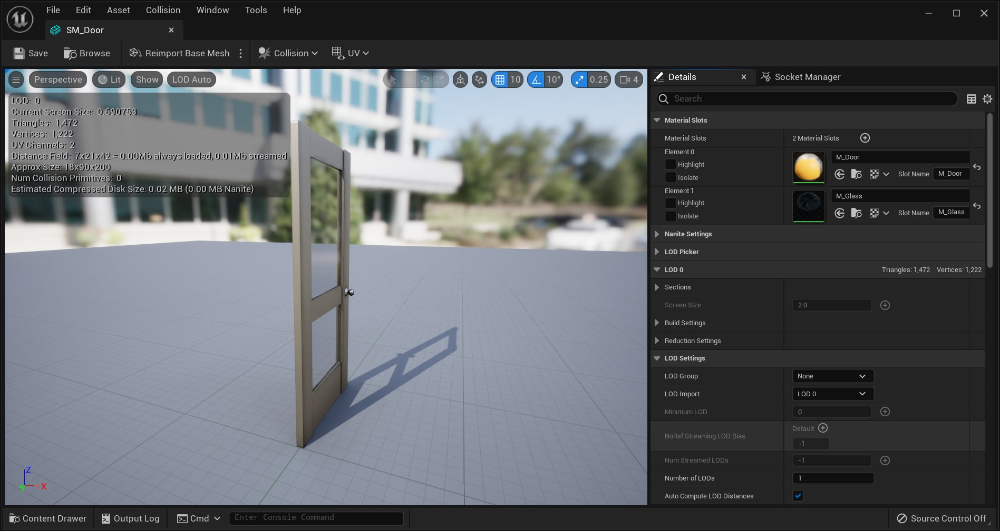
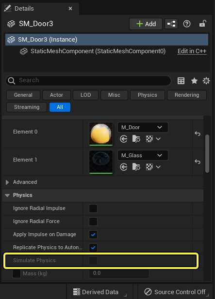
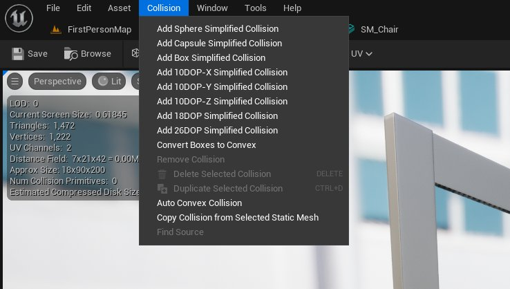
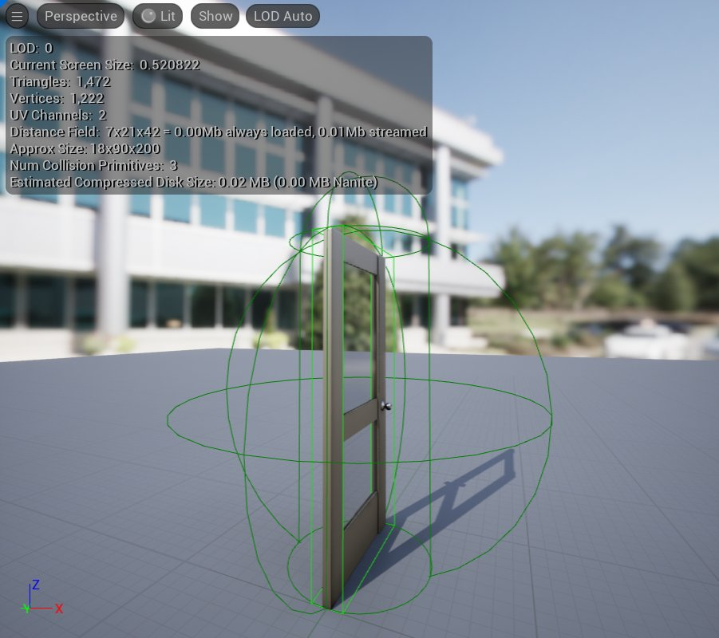
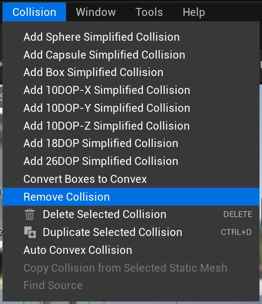

# 为静态网格体设置碰撞体积

> 路径：虚幻引擎5.7文档 / 管理内容 / 静态网格体 / 为静态网格体设置碰撞体积

> 原始页面：https://dev.epicgames.com/documentation/unreal-engine/setting-up-collisions-with-static-meshes-in-unreal-engine

在 **虚幻引擎** 中，你可以对 **静态网格体** 做很多事情，比如在游戏中动态地改变其 **纹理** 或 **材质**，或者使用 **Sequencer**，让其在 **关卡** 中移动。无论静态网格体在关卡中的行为方式为何，你可能都不希望玩家可以穿过网格体或射穿网格体。这种情况下就需要在静态网格体上设置碰撞。

## 设置

开始之前，使用 **第一人称游戏** 模板创建一个新的项目并启用 **初始内容（Starter Content）**。要了解如果在虚幻引擎中创建新项目，请参考[新建项目](../../../understanding-the-basics/working-with-projects-and-templates/creating-a-new-project/index.md)。

> [!NOTE]
> 你自己可能已具有关卡和静态网格体，可配合本指南使用。这样的话，你可以跳过此步骤。然而，使用此模板，你可以射出发射物来说明下文中的一个要点，因此使用该模板将有助于你跟随所述步骤进行操作。

点击查看大图。

打开项目之后，在 **内容浏览器** 中，你可以搜索或直接定位到 **内容（Content） > 初学者内容（Starter Content） > 道具（Props）**，找到名为 **SM_Door** 的静态网格体。

点击查看大图。

点击查看大图。

> [!TIP]
> **SM_Door** 中的 **SM** 代表静态网格体（Static Mesh）并且遵循虚幻引擎推荐的命名规则。使用统一的命名规则可以让项目保持整洁。要了解更多命名文件相关的信息，请参考[推荐命名规则](../../../production-pipeline/recommended-asset-naming-conventions-in-unreal-89ae65f2/index.md).

找到 **SM_Door** 之后，通过以下方式打开 **静态网格体编辑器（Static Mesh Editor）**：

- 双击

  该资产。
- 右键单击

  该资产并从菜单中选择

  编辑（Edit）

  。

编辑器打开之后，你将看到与下图所示相似的界面：

点击查看大图。

## 简易形状网格体上的碰撞

默认情况下，此网格体上尚未设置任何碰撞。如果没有碰撞，玩家将能够穿越网格体。

在设置碰撞之前，你可以将这个门放进关卡中来对此进行测试。

另外，如果你想要门在遭到射击时弹开或者先飞到空中然后掉到地上，你需要在 **细节（Details）** 面板中将 **模拟物理（Simulate Physics）** 设置为 *true* 。然而，如果静态网格体没有碰撞，你无法在默认情况下进行此设置。

点击查看大图。

在大多数情况下，我们并不需要这些效果，因此我们要为此静态网格体设置碰撞。

在静态网格体编辑器顶部的菜单栏，有一个 **碰撞（Collision）** 下拉菜单。点击它，你将看到为网格体添加碰撞所需的选项。也可以点击工具栏中的 **碰撞（Collision）** 按钮来访问这些选项。(Collision Button)要更好地了解静态网格体编辑器的布局，请参考[静态网格体编辑器 UI](../static-mesh-editor-ui/index.md)。

点击查看大图。

我们使用的门网格体形状非常简单。我们可以很轻松地为这个网格体设置好碰撞。

**碰撞（Collision）** 菜单中的前三个选项将以简单的碰撞体包围静态网格体，可将其用作划分可阻挡及不可阻挡哪些对象以及哪些对象可与该网格体重叠的边界。以下是添加了这些简单形状碰撞网格体的门状网格体的示例。

| Sphere 1 | Capsule 1 | Box 1 |
| --- | --- | --- |
| Sphere 2 | Capsule 2 | Box 2 |
| 球体简单碰撞 | 胶囊体简单碰撞 | 盒体简单碰撞 |

> [!NOTE]
> 如果已为网格体设置了简单碰撞，然后又为该网格体添加了另一个简单碰撞，新碰撞不会替换前面已设置的碰撞，而是叠加在第一个碰撞上面。

添加上面的三个简单碰撞体后，会得到如下图所示的效果。

点击查看大图。

要解决此问题，你可以：

- 选中其中一个碰撞并按

  delete

  键。
- 从

  碰撞（Collision）

  下拉菜单中选择

  删除所选碰撞（Delete Selected Collision）

  来逐个删除这些碰撞。
- 在

  碰撞（Collision）

  菜单中选择

  删除碰撞（Remove Collision）

  来一次性删除静态网格体上的所有碰撞。

点击查看大图。

在为网格体应用碰撞之后，点击碰撞网格体，会看到一个平移小控件。可以平移、旋转和缩放碰撞网格体，与对UE5中的其它任意对象执行这些操作一样。

## 较复杂的网格体上的碰撞

使用我们在前一部分中设置的简单碰撞体，对于以下情况足够：

- 静态网格体可轻松容纳在胶囊体或盒体里面。
- 静态网格体是否拥有精确的碰撞并不重要。

但是，你可能具有形状更加复杂而且需要具有精确碰撞的静态网格体。在此部分中，我们将详细介绍如何进行此设置。

返回到 **Starter Content** 中的 **Props** 文件夹，找到静态网格体 **SM_Chair**。**双击** 缩略图，在静态网格体编辑器中将其打开。

正如你所见，此网格体上已具有碰撞，其外观类似于下图中所示：

> 图片已省略：Chair Default Collision

点击查看大图。

我们假设在此示例中，我们希望玩家能够直接坐到椅垫上。受到在默认情况下按原样设置的碰撞网格体的影响，存在阻碍玩家这样做的无形障碍。

> [!NOTE]
> 在游戏过程中，玩家仅会看到静态网格体本身，他们看不到碰撞网格体，因此玩家将尝试坐到椅子上，但是不明白为何会存在东西阻碍他们这样做。

可以通过从编辑器顶部的 **碰撞（Collision）** 下拉菜单中选择 **删除碰撞（Remove Collision）** 来删除此网格体上的碰撞。我们可以尝试使用我们在本指南的前一部分中使用的基本形状碰撞网格体，但是如你在下列各图中所见，它们之中没有一个可以满足我们的需求。

| Chair Sphere | Chair Capsule | Chair Box |
| --- | --- | --- |
| 球体简单碰撞 | 胶囊体简单碰撞 | 盒体简单碰撞 |

似乎没有基本形状可以实现我们需要的精确碰撞。但是，借助 **碰撞（Collision）** 下拉菜单中的其他选项，我们距离实现预期效果更近一步。这些选项被称为 **K-DOP** 简单碰撞生成器。

K-DOP是一种包围体积，K-DOP指的是 *K离散定向多面体*（其中，K是轴对齐平面的数量）。从根本上说，它将K个轴对齐平面尽量推向网格体。产生的形状被用作碰撞外壳。

在静态网格体编辑器中，K可以为：

- 10

  - 有4个边经过倒角处理的盒体 - 你可以选择与X、Y或Z轴对齐的边。
- 18

  - 所有边都经过倒角处理的盒体。
- 26

  - 所有边和角都经过倒角处理的盒体。

> 图片已省略：K-DOP 选项

点击查看大图。

以下是分别具有10-DOP、18-DOP和26-DOP碰撞设置时的椅子网格体的效果。

| 10-DOP | 18-DOP | 26-DOP |
| --- | --- | --- |
| 10DOP | 18DOP | 26DOP |

这些碰撞网格体已经越来越接近我们想要的效果，但是这些碰撞网格体距离椅垫仍有一段距离，该距离仍可能会阻止玩家坐到椅子上。

再一次选择 **删除碰撞（Remove Collision）**，完成后，从 **碰撞（Collision）** 下拉菜单中选择 **自动凸包碰撞（Auto Convex Collision）**。

> 图片已省略：Auto Convex Collision

点击查看大图。

**细节** 面板中将显示 **凸包分解（Convex Decomposition）** 面板，其外观类似于下图中所示。

> 图片已省略：Convex Decomposition

点击查看大图。

下表是 **凸包分解（Convex Decomposition）** 面板中的各个选项。

| 选项 | 描述 |
| --- | --- |
| **外壳数量（Hull Count）** | 指定用来表示碰撞体的图元的数量。 |
| **最大外壳顶点数（Max Hull Verts）** | 增加或者减少你的碰撞体所包含的顶点数。 |
| **外壳精度（Hull Precision）** | 生成碰撞体时体素的数量。 |

这些数值越高，你的碰撞体便会越精准，但是也越复杂。点击 **应用（Apply）** 会将这些设置应用到你的静态网格体上，并且使碰撞体积可见。

| 自动凸包碰撞 | 自动凸包碰撞 |
| --- | --- |
| 默认设置 | 最高精确性和最大外壳顶点数 |

设置复杂碰撞的另一个简单方法是使用多个简单形状碰撞网格体。正如我们在本指南前面提到过的，创建另一个简单碰撞网格体并不会将原始的简单碰撞网格体替换掉，而是叠加在原始简单碰撞网格体上。此外，每个碰撞网格体都有其专属的变形小控件，因此你可以单独对每个碰撞网格体进行平移、旋转和缩放。我们可以利用此机制来为静态网格体创建碰撞。

要进行该操作，首先从 **碰撞（Collision）** 下拉菜单中选择 **添加盒体简单碰撞（Add Box Simplified Collision）**。**点击** 该碰撞体以调出其变换控件。

接着，对该碰撞网格体进行平移、旋转和缩放，以使它沿着椅子扶手贴合椅子，直至地面。

在仍然选中该碰撞网格体的情况下，通过从 **碰撞（Collision）** 下拉菜单中选择 **复制所选碰撞（Duplicate Selected Collision）** 或通过按下 **Ctrl + D** 组合键来复制该碰撞网格体。

移动此碰撞网格体，使它贴合椅子另一边的扶手。

> 图片已省略：Custom Box Collision

Click image for full size.

再次复制网格体。在选中新网格体的情况下，移动，缩放并旋转此网格体，以便它贴合椅子底部。

> 图片已省略：Custom Box Collision

Click image for full size.

复制该碰撞网格体并将它向上移动以让它贴合椅子的坐部。

> 图片已省略：Custom Box Collision

Click image for full size.

再次复制该碰撞体并旋转它，以让它贴合椅子的靠背。

完成后，你应该看到类似下图的效果。

> 图片已省略：合成盒型碰撞

点击查看大图。

你可以回过头来再对这些碰撞体进行调整，但是就现在而言，玩家已经可以坐到椅垫上。

## 模拟物理和碰撞预设值

静态网格体添加完碰撞体后，现在就可以模拟物理了。单击静态网格体编辑器工具栏最左侧的 **保存（Save）** 按钮保存椅子网格体。

然后在 **内容浏览器** 中找到 **SM_Chair**。将该网格体拖到关卡中。选中它，然后转到 **细节（Details）** 面板。

在 **细节（Details）** 面板的 **物理（Physics）** 部分中，**模拟物理（Simulate Physics）** 现在已经可用，在默认情况下，它应为 *false*。如果在模拟物理（Simulate Physics）设置为 *false* 的情况下运行关卡，向椅子走动或者射出发射物也不会影响网格体。然而，你的角色无法之间穿过椅子网格体，因为它现在有了碰撞。

> [!NOTE]
> 要在第一人称射击模板中向椅子射击发射物，你需要先让角色行走至武器来拾起它，然后 **点击** 进行射击。

> 图片已省略：物理细节面板

点击查看大图。

停止运行关卡并将 **模拟物理（Simulate Physics）** 设置为 *true*。现在运行关卡时，你会看到当角色碰到椅子时，椅子网格体会移动。对着椅子射击时，该静态网格体也可以被射中，而且会在关卡中飞到空中。

> 动图已省略：Simulate Physics Active for Static Mesh Collision

这不仅是因为静态网格体在模拟物理，还因为网格体被默认 **碰撞预设值（Collision Preset）** 设置为 **物理Actor（Physics Actor）**。

返回到椅子的 **细节（Details）** 面板，在 **碰撞（Collision）** 部分中，具有名称为 **碰撞预设值（Collision Preset）** 的下拉菜单。该静态网格体实例响应场景其他对象的方式取决于其 **碰撞预设值（Collision Preset）** 设置。该下拉菜单中包括的选项如下图中所示。

> 图片已省略：碰撞预设值

点击查看大图。

如果将它设置为 **重叠全部（Overlap All）**，只要一开始运行关卡，你就会看到该静态网格体掉落到关卡之外。其中还包括自定义预设值，借助它你可以手动设置网格体对关卡中的其他对象做出反应的方式。

你可以将它设置为阻挡Pawn，但是可以与发射物重叠，并且忽略除这些以外的其他所有对象。在自定义预设值中，你可以指示静态网格体要执行哪些行为。

> [!TIP]
> 在关卡编辑器中选中 **静态网格体Actor** 或任意 **静态网格体组件**（例如，蓝图编辑器中的静态网格体组件）时，**细节（Details）面板 -> 碰撞（Collision）类别 -> 碰撞预设值（Collision Preset）** 将显示为 **默认（Default）**。这是为了表明，在初始设置之后，未对"碰撞预设值（Collision Preset）"进行过任何更改。如果此处列出了 **BlockAll** 等其他选项，则说明所选静态网格体Actor/组件的 "碰撞预设值（Collision Preset）" 已被覆盖。
>
> > 图片已省略：Default Collision
>
> 点击查看大图。

现在你已经在网格体上设置了碰撞，现在可以将网格体放到关卡中并使用碰撞来设置它如何影响关卡中其它物体并且受关卡中其它物体影响。

要继续了解虚幻引擎中的碰撞，参考[碰撞](../../../gameplay-systems/physics/collision/index.md)。
